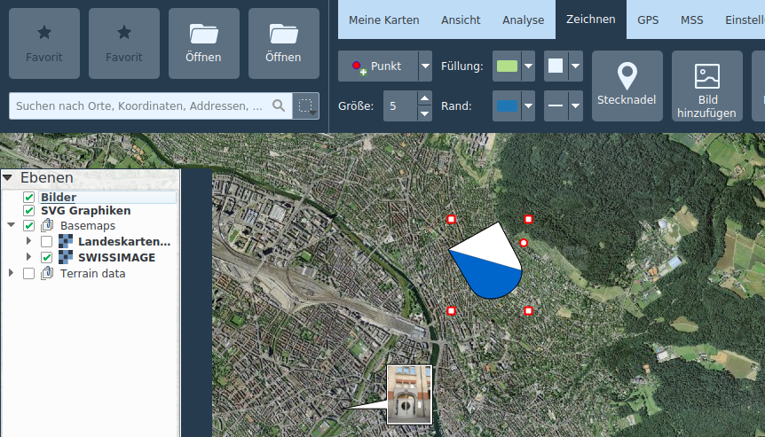

<!-- WARNING: This file is autogenerated by csv2md.py -->
# Drawing

The drawing tools are located in the **_Drawing_** tab. Different geometries, texts, pins and pictures of the map can be added.

## Geometries and texts

**_Drawable geometries_** include:

+ points, 
+ lines, 
+ polygons, 
+ rectangles, 
+ circles. 

Depending on the geometry type, the color and the pattern can be adjusted for the border and fill, as well as the line width and the size of points.

For **_texts_**, the font and size as well as filling color can be adjusted.

Drawn geometries and texts are stored in the **_Redlining_** layer in the map table of contents.

Already drawn geometries or texts can be subsequently edited by selecting them on the map. Selected objects can be moved and, depending on the geometry type, nodes can be moved individually or created or removed via the context menu.

Existing line and polygon geometries can be continued via context menu on the node.

Editing operations on a redlining drawing can be reversed or repeated via CTRL+Z and CTRL+Y or with the corresponding buttons at the bottom of the map frame.

When creating and editing geometries, relevant measurement values ​​are displayed at the same time.

Redlining drawings can be copied, cut and pasted using the context menu or the usual keyboard shortcuts CTRL+C, CTRL+X and CTRL+V. Multiple redlining drawings can be selected together with the CTRL key and moved, copied, cut and pasted as a group.

## Pins

Pings are georeferenced **_position markers_**, which can also carry a name and other remarks.

Position and height can be read in the tooltip of a placed pin. A double-click on the pin opens its attribute dialog. Web links can be copied to the text box from a web browser. By right-clicking on the pin, its position can be copied to the clipboard.

Pins are searchable by name and remarks via the global search function.

## Add Image

### Raster images

Raster images in the usual formats (JPG, PNG, BMP) can be added as **_annotations_** to the map. These are displayed in a speech bubble. If the image is georeferenced (EXIF tags), the balloon is placed in the appropriate location and the location is blocked. The position lock can be toggled via the context menu. Double-clicking on the balloon opens the image with the default image viewer of the operating system. The size of the speech bubble can be changed at its vertices.

Raster images are stored in the Images layer.

### Vector graphics

The **_Add Image_** function can also be used to add SVG graphics to the map. These can be scaled and rotated with the mouse by dragging at the corresponding control points.

Vector graphics are stored in the **_SVG graphics_** layer.

## SymTaZ symbols

SymTaZ is an external program that can be used to create symbols, tactical signs and civilian signatures in accordance with the Swiss Army's regulation 52.002.03. These symbols can be imported into KADAS, either via **_Copy to Clipboard (Text Form)_** in SymTaZ followed by **_Paste_** in KADAS, or by saving as SVG in SymTaZ and then opening via **_Add Image_** in KADAS.

## Delete objects

Individual objects can be deleted via context menu or DEL key. The **_Delete Objects_** tool allows you to delete several objects at once from a selected rectangular region. This function can also be called invoken via CTRL + dragging a rectangle in pan mode.

