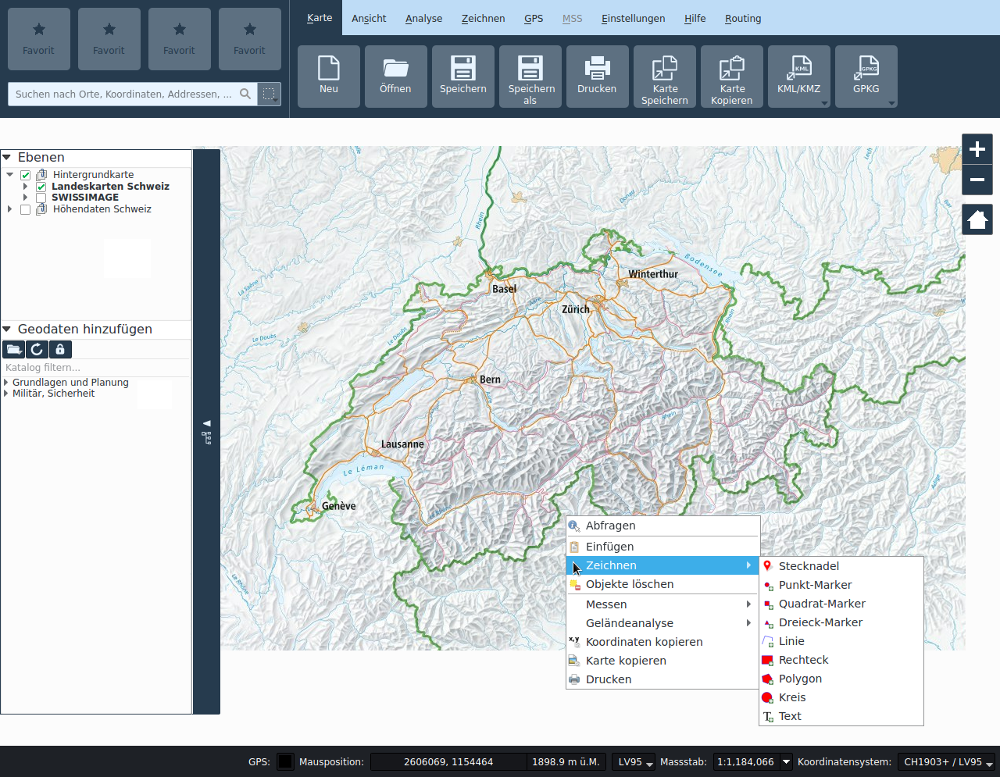

<!-- WARNING: This file is autogenerated by csv2md.py -->
# KADAS Interface

The KADAS GUI is divided into five areas:

+ Functionality menu
+ Favorites and search
+ Map View
+ Layers and geodata catalog
+ Status bar

## Functionality menu

Functionalities are grouped by topic in tabs, which can be activated from the menu bar. The tabs contain buttons for the various functionalities. The functionalities of each tab are documented in the respective chapters:

+ My maps
+ View
+ Analysis
+ Draw
+ GPS
+ MSS
+ Settings / Help

## Favorites and search

### Favorites

Favorite functionalities can be dragged from the respective tab to one of the four placeholders. They can be removed again via context menu on the favorite button. The favorites are stored in the personal user settings.

### Search

The search field provides a unified interface for various search services:

+ Coordinates (LV03, LV95, DD, DM, DMS, UTM, MGRS)
+ Locations and addresses throughout Switzerland
+ Towns worldwide
+ Attributes in local layers
+ Attributes in remote layers (web services)
+ Attributes in pins

After entering at least three letters, the search starts and results are displayed.

The results are listed in correspondingly designated categories. The result list can be searched with mouse or keyboard arrows. When selecting a result with the arrows, a blue pin is placed in the appropriate location. When activating a result with the mouse, the map section is centered on the corresponding location.

To the right of the search field, it is possible to define a filter geometry for local and remote data set search. This filter is not used for coordinates, location or pin searches.

## Map View

This is the “business end” of KADAS — maps are displayed in this area. The map displayed in this window will depend on the vector and raster layers you have chosen to load.

The map view can be panned, shifting the focus of the map display to another region, and it can be zoomed in and out. Various other operations can be performed on the map as described in the toolbar description above. 

The map view and the legend are tightly bound to each other — the maps in view reflect changes you make in the legend area.

In the View tab, new map sub-windows can be opened.

## Layers and geodata catalog

The functions to manage the map layers are contained in the collapsible area anchored at the left border of the application window. The upper part contains the table of contents of the map, the lower part contains the geodata catalog.

### Layers

The map legend area lists all the **_layers_** in the project. The checkbox in each legend entry can be used to show or hide the layer.

A layer can be selected and dragged up or down in the legend to change the Z-ordering. Z-ordering means that layers listed nearer the top of the legend are drawn over layers listed lower down in the legend.

Layers in the legend window can be organised into groups.

To bring a layer out of a group, you can drag it out, or right click on it and choose **_Make to toplevel item_**. Groups can also be nested inside other groups.

The checkbox for a group will show or hide all the layers in the group with one click.

The content of the right mouse button context menu depends on whether the selected legend item is a raster or a vector layer.

+ **Right mouse button menu for raster layers**
  + Zoom to Layer
  + Remove
  + Duplicate
  + Properties...
+ **Right mouse button menu for vector layers**
  + Zoom to Layer
  + Remove
  + Duplicate
  + Properties...
+ **Right mouse button menu for layer groups**
  + Remove
  + Rename

It is possible to select more than one layer or group at the same time by holding down the Ctrl key while selecting the layers with the left mouse button. You can then move all selected layers to a new group at the same time.

### Geodata catalog

The geodata catalog allows the user to add additional layers to the map. The catalog is empty if no network connection to the catalog service could be established. The contents of the catalog can by filtered by entering an appropriate text in the input field above the catalog. A layer in the catalog can be added to the map by drag and drop or double click.

The toolbar above the catalog contains the following functionalities:

+ **_Add local dataset_**: Local vector or raster can be added to the map.
+ **_Reload catalog_**: Reloads the catalog from the catalog service.
+ **_SAML authentication_**: A window for performing a web-based login will be shown. Upon successful authentication, the geodata catalog will be refreshed and additional layers will be listed, according to the privileges of the authenticated user.

## Status bar

The status bar contains following labels and control widgets:

+ **_GPS_**: Usage of the GPS button is described in "Enabling GPS".
+ **_Mouse position_**: The current **_mouse position_** on the map can be displayed with respect to multiple reference systems. The desired format can be selected from the menu left of the display label.
+ **_Scale_**: Next to the coordinate display you will find the **_scale display_**. It shows the scale of the map view. If you zoom in or out, KADAS shows you the current scale. There is a scale selector, which allows you to choose between predefined scales from 1:500 to 1:1000000.
+ **_Coordinate reference system_**: The **_Coordinate reference system_** selection button allows the user to choose which projection to use for the map. This selection may differ from the native projection of the datasets, in which case the data is reprojected.

