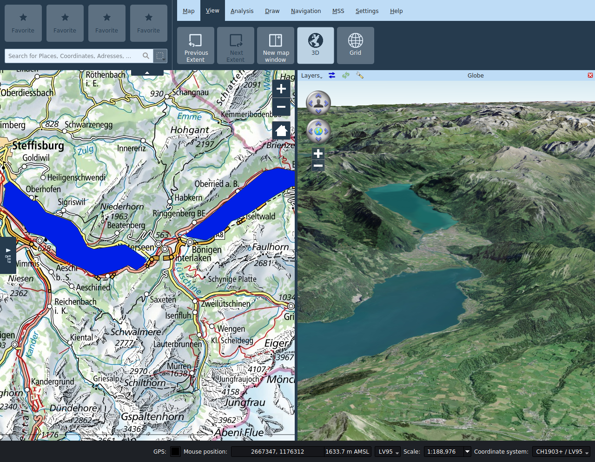

<!-- WARNING: This file is autogenerated by csv2md.py -->
# Vue

## Étendue précédente/suivant

En se déplaçant dans la carte, on peut retourner à l’étendue de carte affiché auparavant par la fonction **_Étendue précédent_**. On peut ensuite aller sur l’extrait de carte choisi postérieurement par la fonction **_Étendue suivant_**.

## Nouvelle vue

Des vues secondaires de la carte peuvent être ouvertes par la fonction **_Nouvelle vue_**. On peut les placer à volonté à l’intérieur de la fenêtre principale en les tirant depuis la barre de titre, ou les découpler.

Dans les vues de sous-fenêtres, on peut activer et désactiver les niveaux indépendamment de la vue principale. On peut gérer l’extrait indépendamment de la vue principale ou l’y coupler en activant l’icône serrure dans la barre de titre de la sous-fenêtre.

Seul l’outil de navigation est disponible dans les vues secondaires de carte, tous les autres outils peuvent uniquement être utilisés dans la vue principale.

Le titre de la sous-fenêtre peut être modifié si nécessaire.

## 3D

La fonction **_3D_** ouvre une autre fenêtre avec une vue du globe. Cette fenêtre est disposée automatiquement, mais peut aussi être déplacée à un autre endroit à l’intérieur ou à l’extérieur de la fenêtre de programme au moyen de la souris.

### Réglages

Les niveaux affichés peuvent être choisis indépendamment de la fenêtre principale dans le menu **_Fenêtre_**.

+ **Synchroniser l’extrait** : Le symbole **_Synchroniser l’extrait_** permet de naviguer sur le globe vers l’extrait de carte de la fenêtre principale.
+ **Recharger la scène** : Le symbole **_Recharger la scène_** recharge le niveau sur le globe.
+ **Réglages du globe** : Le symbole **_Réglages globe_** ouvre un dialogue avec d’autres possibilités de réglages. On y configure entre autres le modèle de terrain pour la vue 3D, et on peut aussi ajouter des niveaux de photos. Les éléments de la vue 2D à représenter peuvent être sélectionnés dans le menu à gauche de la barre de titre. Par souci de performance, seuls les niveaux locaux de la vue 2D sont activés par défaut; en fonction des possibilités, les niveaux de photos de fond doivent être ajoutés directement comme niveaux d’image dans la boîte de dialogue de réglage du globe.

Les couches 2D sont dessinées par défaut en tant que texture sur le globe. Les couches vectorielles (y compris redlining) peuvent également être représentées soit comme modèles extrudés ou 2.5D, soit comme des modèles 3D. Le style de la vue 2D est dans la mesure du possible transféré dans la vue 3D. Les géométries planaires doivent être pourvues d'une information de hauteur (coordonnée Z) pour l'affichage en modèle 3D, et elle doit être exprimée soit par rapport au niveau du sol ou de la mer. Les options d'affichage pour les niveaux vectoriels peuvent être définies dans les propriétés de couche correspondantes.

> Les info-bulles des champs de saisie dans les paramètres de la couche du globe décrivent les différentes options en détail.

> L'ombrage des modèles 3D dépend de la position du soleil. La position du soleil peut être contrôlée par une heure / date définie par l'utilisateur dans les paramètres du globe.

Les punaises, photos et symboles MSS ponctuels sont indiqués comme billboards.

### Navigation dans la vue 3D

+ **Angle de vue* : La commande de navigation supérieure permet à l'utilisateur de modifier les angles de vue horizontal et vertical de la caméra.
+ **Position de la caméra**: La commande de navigation inférieure permet de changer la position de la caméra autour du globe. La même chose peut être accomplie avec les touches fléchées du clavier.
+ **+**: Réduit la hauteur de la caméra.
+ **-**: Augmente la hauteur de la caméra.

## Grille

On peut activer la **_grille_** de la carte dans l’onglet Vue. La grille se base sur le système de coordonnées cartographiques choisi.

Dans le dialogue Propriétés de la grille, on peut régler l'intervalle de grille et l'affichage.

