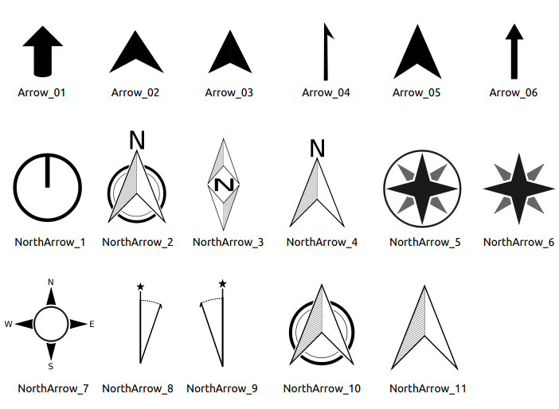
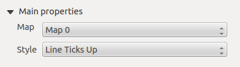

# Druckzusammenstellung {#print-composer}

Mit der Druckzusammenstellung können Sie ansprechende Karten und Atlanten erstellen die als PDF-Datei, als Bild oder als SVG-Datei geduckt oder gespeichert werden können. Dies ist eine leistungsstarke Methode geografische Informationen, die von QGIS erstellt werden in Berichten zu teilen oder zu veröffentlichen.

The Print Composer provides growing layout and printing capabilities. It allows you to add elements such as the KADAS map canvas, text labels, images, legends, scale bars, basic shapes, arrows, attribute tables and HTML frames. You can size, group, align, position and rotate each element and adjust the properties to create your layout. The layout can be printed or exported to image formats, PostScript, PDF or to SVG (export to SVG is not working properly with some recent Qt4 versions; you should try and check individually on your system). You can save the layout as a template and load it again in another session. Finally, generating several maps based on a template can be done through the atlas generator. See a list of tools in <a href="#table-composer-1" class="reference internal">table_composer_1</a>:

Icon
Zweck

Icon
Zweck

 
 
 
 

Projekt speichern

Neue Zusammenstellung

Zusammenstellungsduplizierung

Druckzusammenstellung verwalten

Aus Vorlage laden

Als Vorlage speichern

Drucken oder Exportieren als PostScript

Speichern als Rasterbild

Speichern als SVG

Als PDF exportieren

Letzte Änderung zurücknehmen

Letzte Änderung wiederherstellen

Volle Ausdehnung

Zoom auf 100%

Hineinzoomen

Hinauszoomen

Aktualisiere Ansicht

 
 

Druckzusammenstellung verschieben

Auf bestimmte Region zoomen

Eintrag wählen/verschieben

Den Elementinhalt verschieben

Neue Karte aus KADAS Kartenansicht hinzufügen

Bild hinzufügen

Neue Beschriftung hinzufügen

Neue Legende hinzufügen

Einen Maßstab zu Druckzusammenstellung hinzufügen

Einfaches Objekt hinzufügen

Pfeil hinzufügen

Fügt Attributtabelle hinzu

Einen HTML-Rahmen hinzufügen

 
 

Elemente gruppieren

Gruppe auflösen

Gewählte Element fixieren

Alle Elemente entsichern

Hervorholen

Versenken

In den Vordergrund holen

In den Hintergrund schicken

Linksbündig

Rechtsbündig

Zentrieren

Vertikal zentrieren

Oben bündig

Unten bündig

Atlasvorschau

Erstes Objekt

Vorheriges Objekt

Nächstes Objekt

Letztes Objekt

Atlas drucken

Atlas als Bilder exportieren

Atlas-Einstellungen

Tabelle Composer 1: Funktionen der Druckzusammenstellung

Alle Werkzeuge der Druckzusammenstellung stehen in Menüs und als Icons in der Werkzeugleiste zur Verfügung. Die Werkzeugleiste kann aus und angeschaltet werden, indem Sie rechte Maustaste in der Werkzeugleiste verwenden.

## Überblick über die Druckzusammenstellung {#overview-of-the-print-composer}

Das Öffnen der Druckzusammenstellung bietet Ihnen eine leere Seite, die die Blattoberfläche beim Benutzen der Druckoption darstellt. Zunächst finden Sie Knöpfe auf der linken Seite der Seite um Druckzusammenstellungselemente hinzuzufügen; die aktuelle KADAS Kartenansicht, Beschriftungen, Bilder, Legenden, Maßstäbe, einfache Formen, Pfeile, Attributtabellen und HTML-Rahmen. In dieser Werkzeugleiste finden Sie auch Werkzeugleistenknöpfe zum Navigieren, Zoomen in einen Bereich und zum Verschieben der Ansicht in der Zusammenstellung und Werkzeugleistenknöpfe um ein Druckzusammenstellunselement auszuwählen und den Inhalt des Kartenelements zu verschieben.

<a href="#figure-composer-overview" class="reference internal">Figure_composer_overview</a> zeigt die anfängliche Ansicht der Druckzusammenstellung bevor Elemente hinzugefügt sind.

**Figure Composer Overview:**

Druckzusammenstellung 

Rechts von der Seite finden Sie zwei Bedienfelder. Das obere Bedienfeld enthält die Reiter *Elemente* und *Befehlsprotokoll* und das untere Bedienfeld enthält die Reiter *Zusammenstellung*, *Elementeigenschaften* und *Atlas-Erzeugung*.

-   Der *Elementeigenschaften* Reiter stellt eine Liste aller Kartenzusammenstellungselemente die der Seite hinzugefügt wurden.

-   Der *Befehlprotokoll* Reiter stellt einen Verlauf aller Änderungen, die am Druckzusammenstellungslayout durchgeführt wurden dar. Mit einem Mausklick ist es möglich Layoutschritte vorwärts oder rückwärts zu einem bestimmten Status rückgängig zu machen oder wiederherzustellen.

-   Der Reiter *Zusammenstellung* ermöglicht Ihnen die Papiergröße, Orientierung, den Seitenhintergrund, Anzahl der Seiten und die Druckqualität der Ausgabedatei in dpi einzustellen. Darüberhinaus können Sie auch das  *Als Raster drucken* Kontrollkästchen aktivieren. Das heisst, dass alle Elemente vor dem Drucken oder Speichern als PostScript oder PDF gerastert werden. In diesem Reiter können Sie auch benutzerdefinierte Einstellungen für Gitter und Ausrichtungen vornehmen.

-   The *Item Properties* tab displays the properties for the selected item. Click the  Select/Move\\ item icon to select an item (e.g., legend, scale bar or label) on the canvas. Then click the *Item Properties* tab and customize the settings for the selected item.
-   Der *Atlas-Erzeugung* Reiter ermöglicht es Ihnen die Erstellung eines Atlas für die aktuelle Zusammenstellung zu bewirken und bietet Zugang zu seinen Parametern.

-   Schließlich können Sie Ihre Druckzusammenstellung mit dem  Projekt\\ speichern Knopf speichern.

Im unteren Teil des Druckzusammenstellungsfensters können Sie eine Statusleiste mit der Mausposition, aktuellen Seitenanzahl und einer Kombobox zum Einstellen der Zoomstufe finden.

Sie können der Zusammenstellung mehrere Element hinzufügen. Es ist auch möglich, dass die Druckzusammenstellungsansicht mehr als eine Karte, Legende oder Maßstab enthält, dies auf einer oder mehreren Seiten. Jedes Element hat seine eigenen Eigenschaften und, im Fall der Karte, seine eigenen Ausmaße. Wenn Sie ein Element aus der Zusammenstellungsansicht entfernen wollen können Sie das mit `Entf` oder `Rücktaste` tun.

### In der Druckzusammenstellung navigieren {#navigation-tools}

Um im Layout navigieren zu können bietet die Druckzusammenstellung einige grundlegende Tools:

-    Hineinzoomen

-    Hinauszoomen

-    Zoom\\ full
-    Zoom\\ auf\\ 100%

-    Refresh\\ view (if you find the view in an inconsistent state)
-    Druckzusammenstellung\\ verschieben

-    Zoom (zoom to a specific region of the Composer)

You can change the zoom level also using the mouse wheel or the combo box in the status bar. If you need to switch to pan mode while working in the Composer area, you can hold the `Spacebar` or the the mouse wheel. With `Ctrl+Spacebar`, you can temporarily switch to zoom mode, and with `Ctrl+Shift+Spacebar`, to zoom out mode.

## Beispielsitzung {#sample-session}

Um zu zeigen wie man eine Karte erstellt folgen Sie den nächsten Anweisungen.

1.  Wählen Sie den  Neue\\ Karte\\ hinzufügen Werkzugleistenknopf aus und zeichnen Sie ein Rechteck auf die Seite indem Sie die linke Maustaste gedrückt halten. Innerhalb des gezeichneten Rechteckes erscheint die KADAS Kartenansicht auf der Seite.

2.  Wählen Sie den  Neuen\\ Maßstab\\ hinzufügen Werkzeugleistenknopf und plazieren Sie das Kartenelement mit der linken Maustaste auf der Druckzusammenstellungsseite. Es wird ein Maßstab der Seite hinzugefügt.

3.  Wähllen Sie den  Neue\\ Legende\\ hinzufügen Werkzeugleistenknopf und zeichnen Sie ein Rechteck auf die Seite indem sie die linke Maustaste gedrückt halten. Innerhalb des Rechtecks wird die Legende gezeichnet.

4.  Wählen Sie das  Den\\ Elementinhalt\\ verschieben Icon um die Karte auszuwählen und verschieben Sie es ein bisschen.

5.  While the map item is still selected you can also change the size of the map item. Click while holding down the left mouse button, in a white little rectangle in one of the corners of the map item and drag it to a new location to change it’s size.
6.  Click the *Item Properties* tab on the left lower panel and find the setting for the orientation. Change the value of the setting *Map orientation* to ‘15.00° ‘. You should see the orientation of the map item change.
7.  Schließlich können Sie Ihre Druckzusammenstellung mit dem  Projekt\\ speichern Knopf speichern.

## Druckzusammenstellungsoptionen {#print-composer-options}

Unter *Einstellungen ‣ Zusammenstellungseinstellungen ...* können Sie einige Optionen, die als voreingestellt während Ihrer Arbeit benutzt werden, einstellen.

-   Mit *Zusammenstellungsvoreinstellungen* können Sie die Standardschriftart, die verwendet werden soll, benutzen.

-   With *Grid appearance*, you can set the grid style and its color. There are three types of grid: **Dots**, **Solid** lines and **Crosses**.
-   *Grid and guide defaults* defines spacing, offset and tolerance of the grid.

## Reiter Zusammenstellung - Allgemeines Zusammenstellung Setup {#composition-tab-general-composition-setup}

Im Reiter *Zusammenstellung* können Sie die globalen Einstellungen Ihrer Zusammenstellung definieren.

-   Sie können eine der *Voreinstellungen* für Ihre Seite auswählen oder Ihre benutzerdefinierte *Breite* und *Höhe* eingeben.

-   Die Zusammenstellung kann nun in mehrere Seiten aufgeteilt werden. Beispielsweise kann die erste Seite eine Kartenansicht zeigen und eine zweite Seite kann die zum Layer gehörende Attributtabelle zeigen während die dritte einen HTML-Rahmen, der zu der Webseite Ihrer Organisation zeigt, zeigt. Stellen Sie die *Seitenzahl* auf den gewünschten Wert ein. Sie können die Seiten *Orientierung* und Ihre exportierte Auflösung wählen. Wenn es aktiviert ist mit  *Als Raster drucken* gemeint, dass alle Elemente vor dem Drucken oder Speichern als PostScript oder PDF gerastert werden.

-   *Grid and guides* lets you customize grid settings like *spacings*, *offsets* and *tolerance* to your need. The tolerance is the maximum distance below which an item is snapped to smart guides.

Das Snappen auf das Gitter und/oder auf die Ausrichtungen kann im *Ansicht* Menü aktiviert werden. In diesem Menü können Sie auch das Gitter und die Führungen verstecken oder anzeigen.

## Gemeinsame Eigenschaften von Zusammenstellunselementen {#composer-items-common-options}

Zusammenstellungselemente besitzen eine Reihe von allgemeinen Eigenschaften die Sie am unteren Ende des *Elementeigenschaften* Reiters finden: Position und Größe, Rahmen, Hintergrund, Elementkennung und Darstellung (siehe <a href="#figure-composer-common-1" class="reference internal">figure_composer_common_1</a>).

**Figure Composer Common 1:**

Allgemeiner Elementeigenschaften Dialog 

-   Der *Position und Größe* Dialog erlaubt es Ihnen die Größe und Position des Rahmens, der das Element beinhaltet, zu definieren. Sie können auch auswählen welcher Referenzpunkt an den vorher definierten **X** und **Y** Koordinaten gesetzt wird.

-   Die *Drehung* stellt die Drehung des Elements (in Grad) ein.

-   The  *Frame* shows or hides the frame around the label. Use the *Frame color* and *Thickness* menus to adjust those properties.
-   Use the *Background color* menu for setting a background color. With the dialog you can pick a color (see <a href="../working_with_vector/vector_properties.html#color-picker" class="reference internal"><em>Farbwahl</em></a> ).
-   Verwenden Sie die *Elementkennung* um eine Beziehung zu anderen Elementen der Druckzusammenstellung herzustellen. Dies wird beim KADAS Server und anderen potentiellen Webclients benutzt. Sie können eine ID an ein Element vergeben (z.B. eine Karte und eine Beschriftung) und dann kann der Webclient Daten zum Einstellen einer Eigenschaft (z.B. Beschriftung) für das bestimmte Element senden. Der GetProjectSettings Befehl führt auf welche Elemente und welche IDs in einem Layout zur Verfügung stehen.

-   *Darstellung* kann im Optionen Feld ausgewählt werden. Siehe <a href="#rendering-mode" class="reference internal">Rendering_Mode</a>.

Bemerkung

-   Das  Datendefinierte\\ Übersteuerung Icon neben einem Feld bedeutet dass Sie einem Feld Daten im Kartenelement zuweisen können oder dass Sie Ausdrücke verwenden können. Diese sind besonders hilfreich bei der Atlaserstellung (siehe <a href="#atlas-data-defined-overrides" class="reference internal">atlas_data_defined_overrides</a>).

KADAS ermöglicht jetzt eine erweiterte Darstellung für Zusammenstellungselement wie Vektor- und Rasterlayer.

**Figure Composer common 2:**

Darstellung 

-   *Transparency* : You can make the underlying item in the Composer visible with this tool. Use the slider to adapt the visibility of your item to your needs. You can also make a precise definition of the percentage of visibility in the menu beside the slider.

-    *Element aus Export ausnehmen*: Sie können sich entschließen ein Element in allen Exporten nicht sichtbar zu machen. Nach dem Aktivieren dieses Kontrollkästchens wird das Element nicht in PDF’s, Drucken etc. enthalten sein

-   *Mischmodus*: Sie können spezielle Darstellungseffekte mit diesen Tools, die Sie vorher vielleicht nur von Grafikprogrammen kannten, erzielen. Die Pixel Ihrer oben liegenden und darunterliegenden Elemente werden durch die unten beschriebenen Einstellungen gemischt.

    > -   Normal: Dies ist der Standardmischmodus, der den Alphakanal des oben liegenden Pixels mit dem darunter liegenden Pixel vermischt. Die Farben werden nicht vermischt.
    >
    > -   Heller: Dies wählt das Maximum jeder Komponente der Vordergrund- und Hintergrundpixel. Seien Sie sich bewusst dass die Ergebnisse zackig und hart aussehen können.
    >
    > -   Bildschirm: Helle Pixel der Quelle werden über die des Ziels gezeichnet, wohingegen dunkle Pixel nicht verwendet werden. Dieser Modus ist am nützlichsten für das Mischen der Textur eines Layers mit einem anderen Layer (z.B. kann man eine Schummerung dazu verwenden einen anderen Layer mit einer Textur zu versehen).
    >
    > -   Abwedeln: das Abwedeln erhellt und sättigt unten liegende Pixel auf Basis der Helligkeit des oben liegenden Pixels. Demzufolge erhöhen hellere oben liegende Pixel die Sättigung und Helligkeit des unten liegenden Pixels. Dies funktioniert am Besten wenn die oben liegenden Pixel nicht zu hell sind; andernfalls ist der Effekt zu extrem.
    >
    > -   Addition: Dieser Mischmodus fügt einfach die Pixelwerte eines Layers denen eines anderen Layers hinzu. Im Falle von Werten größer 1 (im Fall von RGB) wird weiß dargestellt. Dieser Modus ist dafür geeignet Objekte hervorzuheben.
    >
    > -   Dunkler: Dies erstellt ein Ergebnispixel das die kleinste Komponente der Vordergrund und Hintergrundpixel erhält. Wie das Aufhellen neigen die Ergebnisse dazu zackig und hart zu sein.
    >
    > -   Multiplizieren: Hier werden die Nummern für jedes Pixel des oben liegenden Layers mit den entsprechenden Pixeln des unteren Layers multipliziert. Das Ergebnis sind dunklere Bilder.
    >
    > -   Einbrennen: Dunklere Farben im oben liegenden Layer bewirken ein Verdunkeln des unten liegenden Layers. Einbrennen kann dazu benutzt werden um unten liegende Layer zu optimieren und zu colorieren.
    >
    > -   Überlagern: Dieser Modus kombiniert die Multiplizieren und Bildschirm Mischmodi. Im Ergebnispixel werden helle Bereiche heller und dunkle Bereiche dunkler.
    >
    > -   Weiches Licht: Dieses ist dem Überlagern sehr ähnlich nur dass anstelle Multiplizieren/Bildschirm Einbrennen/Abwedeln verwendet wird. Hier soll das Leuchten eines weichen Lichtes auf ein Bild nachgeahmt werden.
    >
    > -   Hartes Licht: Hartes Licht ist dem Überlagern Modus sehr ähnlich. Es soll die Projektion eines sehr intensiven Lichts auf das Bild nachahmen.
    >
    > -   Unterschied: Unterschied subtrahiert das oben liegende Pixel von dem unten liegenden Pixel oder andersherum um immer einen positiven Wert zu bekommen. Das Mischen mit Schwarz produziert keinen Unterschied, da die Differenz mit allen Farben Null ist.
    >
    > -   Abziehen: Dieser Mischmodus zieht einfach die Pixelwerte eines Layers von dem anderen ab. Im Fall von negativen Werten wird Schwarz dargestellt.
    >
## Das Kartenelement {#the-map-item}

Klicken Sie auf den  Neue\\ Karte\\ hinzufügen Werkzeugleistenknopf in der Druckzusammenstellung um die KADAS Kartenansicht hinzuzufügen. Ziehen Sie jetzt ein Rechteck mit der linken Maustaste über die Zusammenstellungsansicht um die Karte hinzuzufügen. Um die aktuelle Karte anzuzeigen können Sie zwischen drei verschiedenen Modi im *Elementeigenschaften* Reiter wählen:

-   **Rechteck** ist die Standardeinstellung. Es wird eine leeres Kästchen mit der Meldung ‘Karte wird hier gedruckt’ angezeigt.

-   **Cache** zeichnet die Karte in der aktuellen Bildschirmauflösung. Wenn Sie in das Zusammenstellungsfenster hinein- oder hinauszoomen, wird die Karte nicht wieder gerendert aber das Bild wird skaliert.

-   **Zeichnen** meint dass wenn Sie in das Zusammenstellungsfenster hineinzoomen oder nicht, die Karte wieder gerendert wird, aber aus Platzgründen nur bis zu einer maximalen Auflösung.

**Cache** ist der voreingestellte Vorschaumodus für neu hinzugefügte Druckzusammenstellungskarten.

Sie können die Größe des Kartenelements durch Klicken auf den  Eintrag\\ wählen/verschieben Knopf verändern indem Sie das Element auswählen und eins der blauen Kästchen an der Ecke der Karte verschieben. Mit der ausgewählten Karte können Sie jetzt mehr Eigenschaften im *Elementeigenschaften* Reiter anpassen.

Um Layer innerhalb des Kartenelements zu verschieben wählen sie das Kartenelement aus, klicken Sie das  Den\\ Elementinhalt\\ verschieben Icon und verschieben Sie die Layer innerhalb des Karteninhaltsrahmen mit der linken Maustaste. Nachdem Sie den richtigen Platz für das Element gefunden haben, können Sie die Elementposition innerhalb der Druckzusammenstellungsseite sichern. Wählen Sie das Kartenelement und verwenden Sie aus der Werkzeugleiste  Lock\\ Selected\\ Items oder das *Elemente* Bedienfeld. Einmal ausgewählt können Sie das *Elemente* Bedienfeld verwenden um individuelle Elemente zu entsichern.

### Haupteigenschaften {#main-properties}

Der *Haupteigenschaften* Dialog des Karten *Elementeigenschaften* Reiters stellt die folgenden Funktionalitäten bereit (siehe <a href="#figure-composer-map-1" class="reference internal">figure_composer_map_1</a>):

**Figure Composer Map 1:**

Elementeigenschaften Reiter 

-   Der **Vorschau** Bereich ermöglicht es Ihnen die Vorschaumodi ‘Rechteck’, ‘Cache’ und ‘Zeichnen’ wie oben beschrieben zu definieren. Wenn Sie die Ansicht im KADAS Kartenfenster verändern indem Sie Vektor- oder Rastereigenschaften verändern, können Sie die Druckzusammenstellung aktualisieren, indem Sie das Kartenelement in der Druckzusammenstellung auswählen und den **\[Vorschau aktualisieren\]** Knopf klicken.

-   Das Feld *Maßstab*  stellt einen Maßstab manuell ein.

-   The field *Map rotation*  allows you to rotate the map element content clockwise in degrees. The rotation of the map view can be imitated here. Note that a correct coordinate frame can only be added with the default value 0 and that once you defined a *Map rotation* it currently cannot be changed.
-   Mit  *Kartenelemente zeichnen* können Sie Beschriftungen zeigen, die in der Kartenanzeige im KADAS Hauptfenster platziert worden sind.

-   You can choose to lock the layers shown on a map item. Check  *Lock layers for map item*. After this is checked, any layer that would be displayed or hidden in the main KADAS window will not appear or be hidden in the map item of the Composer. But style and labels of a locked layer are still refreshed according to the main KADAS interface. You can prevent this by using *Lock layer styles for map item*.
-   Der  Knopf ermöglicht es Ihnen schnell alle Voreinstellungen, die Sie in QGIS vorbereitet haben, hinzuzufügen. Wenn Sie auf den  Knopf drücken werden Sie die Liste aller Voreinstellungen sehen: wählen Sie einfach die Voreinstellung aus, die sie darstellen wollen. Die Kartenansicht wird automatisch die voreingestellten Layer sichern indem  *Layer des Kartenelements festhalten* aktiviert wird: wenn sie die Voreinstellung abwählen wollen, deaktivieren Sie die  und drücken Sie auf den  Knopf. Siehe <a href="../introduction/qgis_gui.html#label-legend" class="reference internal"><em>Legende</em></a> um herauszufinden wie man Voreinstellungen erstellt.

### Ausdehnung {#extents}

Der *Ausdehung* Dialog der Karten Elementeigenschaften stellt die folgenden Funktionalitäten bereit (siehe <a href="#figure-composer-map-2" class="reference internal">figure_composer_map_2</a>):

**Figure Composer Map 2:**

Kartenausdehnung Dialog 

-   Der **Kartenausdehnung** Bereich ermöglicht es Ihnen die Kartenausdehnung anhand von X und Y min/max Werten anzugeben indem Sie den **\[Anzeigegrenzen übernehmen\]** Knopf klicken. Dieser Knopf setzt die Kartenausdehnung der Zusammenstellunskarte auf die Ausmaße der aktuellen Kartenansicht in der KADAS Hauptansicht. Der Knopf **\[Ausmaße in der Karte anzeigen\]** macht genau das Gegenteil, es aktualisiert die Ausmaße der Kartenansicht in der KADAS Anwendung auf die Ausdehnung der Zusammenstellungskarte.

Wenn Sie die Ansicht in der KADAS Kartenanzeige ändern indem Sie Vektorlayer- oder Rasterlayereigenschaften ändern können Sie die Druckzusammenstellungsansicht aktualisieren indem Sie das Kartenelement in der Druckzusammenstellung auswählen und den **\[Vorschau aktualisieren\]** Knopf im *Elementeigenschaften* Reiter der Karte klicken (siehe <a href="#figure-composer-map-1" class="reference internal">figure_composer_map_1</a>).

### Gitter {#grids}

The *Grids* dialog of the map *Item Properties* tab provides the possibility to add several grids to a map item.

-   Mit dem Plus- und Minusknopf könne Sie ein ausgewähltes Gitter hinzufügen oder auswählen.

-   Mit den Hoch und Runterknöpfen können Sie ein Gitter aus der Liste verschieben und die Zeichenpriorität festlegen.

Wenn Sie auf das hinzugefügte Gitter doppelklicken können Sie ihm einen anderen Namen geben.

**Figure Composer Map 3:**

Kartengitterdialog 

After you have added a grid, you can activate the checkbox  *Show grid* to overlay a grid onto the map element. Expand this option to provide a lot of configuration options, see <a href="#figure-composer-map-4" class="reference internal">Figure_composer_map_4</a>.

**Figure Composer Map 4:**

Gitter zeichnen Dialog 

As grid type, you can specify to use a ‘Solid’, ‘Cross’, ‘Markers’ or ‘Frame and annotations only’. ‘Frame and annotations only’ is especially useful when working with rotated maps or reprojected grids. In the devisions section of the Grid Frame Dialog mentioned below you then have a corresponding setting. Symbology of the grid can be chosen. See section <a href="#rendering-mode" class="reference internal">Rendering_Mode</a>. Furthermore, you can define an interval in the X and Y directions, an X and Y offset, and the width used for the cross or line grid type.

**Figure Composer Map 5:**

Gitterrahmendialog 

-   Es gibt verschiedene Optionen um den Rahmen der die Karte hält zu gestalten. Folgende Optionen sind erhältlich: Kein Rahmen, Zebra, Markierungen innen, Markierungen außen, Innere und äußere Markierungen und Liniengrenze.

-   With ‘LatitudeY/ only’ and ‘Longitude/X only’ setting in the devisions section you have the possibility to prevent a mix of latitude/y and longitude/x coordinates showing on a side when working with rotated maps or reprojected grids.
-   Der erweiterte Darstellungsmodus steht auch für Gitter zur Verfügung (siehe Abschnitt <a href="#rendering-mode" class="reference internal">Rendering_mode</a>).

-   The  *Draw coordinates* checkbox allows you to add coordinates to the map frame. You can choose the annotation numeric format, the options range from decimal to degrees, minute and seconds, with or without suffix, and aligned or not. You can choose which annotation to show. The options are: show all, latitude only, longitude only, or disable(none). This is useful when the map is rotated. The annotation can be drawn inside or outside the map frame. The annotation direction can be defined as horizontal, vertical ascending or vertical descending. In case of map rotation you can Finally, you can define the annotation font, the annotation font color, the annotation distance from the map frame and the precision of the drawn coordinates.

**Figure Composer map 6:**

Gitter-Koordinaten-Zeichnen-Dialog 

### Übersichten {#overviews}

Der *Übersichten* Dialog des *Elementeigenschaften* Reiters stellt die folgenden Funktionalitäten zur Verfügung:

**Figure Composer Map 7:**

Kartenübersichtendialog 

Sie können sich entschließen eine Übersichtskarte zu erstellen welche die Ausmaße anderer Karten, die in der Zusammenstellung zut Verfügung stehen, zeigen. Als erstes müssen Sie die Karte(n), die sie in die Übersichtskarte einfügen wollen, erstellen. Als nächstes erstellen Sie die Karte die Sie wollen, um sie als Übersichtskarte zu benutzen, genau iwe eine normale Karte.

-   Mit dem Plus- und Minusknopf können Sie Übersichten hinzufügen oder entfernen.

-   Mit dem Rauf- und Runterknopf können Sie eine Übersicht in der Liste verschieben und die Zeichenpriorität setzen.

Öffnen Sie *Übersichten* und drücken Sie den grünen Plusknopf um eine Übersicht hinzuzufügen. Zunächst wird diese Übersicht ‘Übersicht 1’ genannt (siehe <a href="#figure-composer-map-7" class="reference internal">Figure_composer_map_7</a>). Sie können den Namen verändern wenn Sie auf das Übersichtelement in der Liste genannt ‘Überblick 1’ doppelklicken und ihm einen anderen Namen geben.

Wenn Sie da Übersichtselement in der Liste auswählen können Sie es anpassen.

-    :guilabel:[\`](#id1)Übersicht ‘’&lt;name\_übersicht&gt;” muss aktiviert sein um die Ausmaße des gewählten Kartenrahmens zu zeichnen.

-   Die *Übersichtsrahmen* Auswahlliste verweist auf das Kartenelement, dessen Ausmaße auf das aktuelle Kartenelement gezeichnet werden.

-   Der *Rahmenstil* ermöglicht es Ihnen die Übersichtsrahmenfarbe zu ändern.

-   Der *Mischmodus* ermöglicht verschiedene Transparenzmischmodi einzustellen. Siehe <a href="#rendering-mode" class="reference internal">Rendering_Mode</a>.

-    *Übersicht invertieren* erstellt eine Maske um die Ausmaße wenn es aktiviert ist: die referenzierte Kartenausmaße werden deutlich angezeigt, währenddessen alles andere mit einer Rahmenkarte ausgeblendet wird.

-    *Auf Übersicht zentrieren* setzt die Ausmaße des Übersichtsrahmens in die Mitte der Übersichtskarte. Sie können nur eine Übersicht zum Zentrieren aktivieren wenn Sie mehrere Übersichten hinzugefügt haben.

## Das Beschriftungselement {#the-label-item}

Um eine Beschriftung hinzuzufügen klicken Sie das  Neue\\ Beschriftung\\ hinzufügen Icon, platzieren Sie das Element mit der linken Maustaste auf der Druckzusammenstellungsansicht und positionieren und passen Sie sein Aussehen im Beschriftung *Elementeigenschaften* Reiter an.

Der *Elementeigenschaften* Reiter eines Beschriftungselements stellt die folgenden Funktionalitäten für das Beschriftungselement zur Verfügung (siehe <a href="#figure-composer-label" class="reference internal">Figure_composer_label</a>):

**Figure Composer 8:**

Beschriftungselementeigenschaften Dialog 

### Haupteigenschaften {#id1}

-   Im Haupteigenschaften Dialog wird der Text (HTML oder nicht) oder der Ausdruck, der benötigt wird um die Beschriftung auszufüllen, zur Zusammenstellungsansicht hinzugefügt.

-   Beschriftungen können als HTML-Code interpretiert werden: aktivieren Sie  *Als HTML darstellen*. Sie können jetzt eine URL, ein klickbares Bild, das zu einer Webseite führt oder etwas komplexeres eingeben.

-   Sie können auch einen Ausdruck eingeben. Klicken Sie auf **\[Einen Ausdruck einfügen\]** um einen neuen Dialog zu öffnen. Erstellen Sie einen Ausdruck, indem Sie auf die auf der linken Seite zur Verfügung stehenden Funktionen klicken. Zwei spezielle Kategorien können nützlich sein, insbesondere im Zusammenhang mit der Atlasfunktionalität: Geometriefunktionen und Datensatzfunktionen. Unten wird eine Vorschau des Ausdrucks gezeigt.

### Darstellung {#appearance}

-   Definieren Sie *Schrift* indem Sie auf den [\*\*](#id1)\[Schriftart ...\] Knopf klicken oder eine *Schriftfarbe* indem Sie eine Farbe mit Hilfe des Farbauswahlwerkzeuges auswählen.

-   You can specify different horizontal and vertical margins in mm. This is the margin from the edge of the composer item. The label can be positioned outside the bounds of the label e.g. to align label items with other items. In this case you have to use negative values for the margin.
-   Using the *Alignment* is another way to position your label. Note that when e.g. using the *Horizontal alignment* in *Center* Position the *Horizontal margin* feature is disabled.

## Das Bildelement {#the-image-item}

Um ein Bild hinzuzufügen klicken Sie das  Bild\\ hinzufügen Icon, platzieren Sie das Element mit der linken Maustaste in der Druckzusammenstellungsanzeige und positionieren und passen Sie sein Aussehen im Bild *Elementeigenschaften* Reiter an.

The picture *Item Properties* tab provides the following functionalities (see <a href="#figure-composer-image-1" class="reference internal">figure_composer_image_1</a>):

**Figure Composer image 1:**

Bildelementeigenschaften Reiter 

Sie müssen zuerst das Bild, das Sie anzeigen wollen auswählen. Es gibt mehere Wege die *Bildquelle* in den **Haupteigenschaften** festzulegen.

1.  Verwenden Sie den Suchknopf  von *Bildquelle* um eine Datei auf Ihrem Computer anhand des Suchen-Dialogs auszuwählen. Der Browser starten in den SVG-Bibliotheken die mit KADAS zur Verfügung gestellt werden. Neben `SVG` können Sie auch noch andere Bildformate auswählen Sie `.png` oder `.jpg`.

2.  Sie können die Quelle direkt in das *Bildquelle* Textfeld eingeben. Sie können für ein Bild sogar eine Remote URL-Adresse vergeben.

3.  From the **Search directories** area you can also select an image from *loading previews ...* to set the image source.
4.  Verwenden Sie den datendefinierten Knopf  um die Bildquelle aus einer Aufnahme festzulegen oder anhand eines regulären Ausdrucks festzulegen.

Mit der *Größenanpassungsmodus* Option können Sie festlegen wie das Bild dargestellt wird wenn der Rahmen verändert wird oder sich entschließen den Rahmen des Bildelementes in der Größe zu verändern so dass er auf die Originalgröße des Bildes passt.

Sie können einen der folgenden Modi auswählen:

-   Zoom: Vergrößert das Bild im Rahmen wobei das Seitenverhältnis des Bildes beibehalten wird.

-   Strecken: Streckt das Bild damit es in den Rahmen passt, ignoriert das Seitenverhältnis.

-   Zuschneiden: Verwenden Sie diesen Modus nur für Rasterbilder, es setzt die Größe des Bildes auf die Original-Bildgröße ohne zu skalieren und der Rahmen wird verwendet das Bild ausschneiden, so dass nur der Teil des Bildes, der sich innerhalb des Rahmens befindet sichtbar ist.

-   Rahmen zoomen und Größe anpassen: Vergrößert das Bild damit es in den Rahmen passt und verändert dann die Größe des Rahmens damit er zum Ergebnisbild passt.

-   Rahmen auf Bildgröße setzen: Setzt die Größe des Rahmens damit der zur Originalgröße des Bildes passt ohen dass skaliert wird.

Der ausgewählte Größenanpassungsmodus kann die Elementoptionen ‘Platzierung’ und ‘Bilddrehung’ deaktivieren. *Bilddrehung* ist aktiv für die Größenanpassungsmodi ‘Zoom’ und ‘Zuschneiden’.

Mit *Platzierung* können Sie die Position des Bildes innerhalb seines Rahmens auswählen. Der **Verzeichnisse durchsuchen** Bereich ermöglicht es ihnen Verzeichnisse mit Bildern im SVG-Format der Bilddatenbank hinzuzufügen und sie zu entfernen. Eine Vorschau der Bilder, die in den ausgewählten Verzeichnissen gefunden werden wird in einem Fenster gezeigt und kann dazu verwendet werden um die Bildquelle auszuwählen und zu setzen.

Bilder können mit dem *Bilddrehung* Feld gedreht werden. Das Aktivieren des  *Mit Karte abgleichen* Kontrollkästchens synchronisiert die Drehung eines Bildes in der KADAS Kartenansicht (z.B. ein gedrehter Nordpfeil) mit dem entsprechenden Druckzusammenstellungsbild.

It is also possible to select a north arrow directly. If you first select a north arrow image from **Search directories** and then use the browse button  of the field *Image source*, you can now select one of the north arrow from the list as displayed in <a href="#figure-composer-image-2" class="reference internal">figure_composer_image_2</a>.

Bemerkung

Vielen Nordpfeilen ist keine ‘N’ zugefügt, dieses ist mit Absicht so gehalten für Sprachen die kein ‘N’ für Norden verwenden, so dass sie einen anderen Buchstaben verwenden können.

**Figure Composer Image 2:**

Für die Auswahl zur Verfügung stehende Nordpfeile, die von der SVG-Bibliothek zur Verfügung gestellt werden.

## Das Legendenelement {#the-legend-item}

Um ein Kartenelement hinzuzufügen, klicken Sie das  Neue\\ Legende\\ hinzufügen Icon, platzieren Sie das Element mit der linken Maustaste auf der Druckzusammenstellungsansicht und positionieren und passen Sie das Aussehen der Legende im *Elementeigenschaften* Reiter.

Die *Elementeigenschaften* eines Legendenelement-Reiters stellen die folgenden Funktionalitäten zur Verfügung (siehe <a href="#figure-composer-legend-1" class="reference internal">figure_composer_legend_1</a>):

**Figure Composer Legend 1:**

Legendenelementeigenschaften Reiter 

### Haupteigenschaften {#id3}

Der *Haupteigenschaften* Dialog des Legenden *Elementeigenschaften* Reiters stellt die folgenden Funktionalitäten zur Verfügung (siehe <a href="#figure-composer-legend-2" class="reference internal">figure_composer_legend_2</a>):

**Figure Composer Legend 2:**

Legenden Haupteigenschaften Dialog 

In den Haupteigenschaften können Sie:

-   Den Titel der Legende.

-   Die Titelausrichtung auf Links, Zentriert oder Rechts setzen.

-   Sie können in der Liste auswählen auf welches *Karte* Element sich die aktuelle Legende bezieht.

-   Sie können den Text des Legendentitels an einem vorgegebenen Zeichen umbrechen.

### Legendenelemente {#legend-items}

Der [:guilable:\`Legendenelemente\`](#id1) Dialog des Legenden *Elementeigenschaften* Reiters stellt die folgenden Funktionalitäten zur Verfügung (siehe <a href="#figure-composer-legend-3" class="reference internal">figure_composer_legend_3</a>):

**Figure Composer Legend 3:**

Legendenelemente Dialog 

-   Die Legende wird automatisch geupdatet wenn  *Automatisch aktualisieren* aktiviert ist. Wenn *Automatisch aktualisieren* deaktiviert ist gibt dieses mehr Kontrolle über die Legendenelemente. Die Icons unter den Legendenelementenliste werden aktiviert.

-   Das Legendenelementfenster führt alle Legendenelement auf und Sie können die Elementreihenfolge ändern, Layer gruppieren und Elemente in der Liste wiederherstellen, Namen bearbeiten und einen Filter hinzufügen.

    -   Die Elementreihenfolge kann verändert werden mit **\[Hoch\]** und **\[Runter\]** Knöpfen oder mit der ‘Drag-und-Drop’ Funktionalität. Bei WMS Legendengrafiken kann die Reihenfolge nicht verändert werden.

    -   Verwenden Sie den **\[Gruppe hinzufügen\]** Knopf um einen Legendengruppe hinzuzufügen.

    -   Verwenden Sie den **\[plus\]** und **\[minus\]** Knopf um Layer hinzuzufügen oder zu entfernen.

    -   Der **\[Bearbeiten\]** Knopf wird verwendet um den Layer, Gruppen- oder Titelnamen zu bearbeiten, zuerst müssen Sie das Legendenelement auswählen.

    -   Der **\[Sigma\]** Knopf fügt eine Objektanzahl für jeden Vektorlayer hinzu.

    -   Use the **\[filter\]** button to filter the legend by map content, only the legend items visible in the map will be listed in the legend.

    After changing the symbology in the KADAS main window, you can click on **\[Update All\]** to adapt the changes in the legend element of the Print Composer.

### Schriftarten, Spalten, Symbol {#fonts-columns-symbol}

Die *Schriftarten*, *Spalten* und *Symbol* Dialoge des Legenden *Elementeigenschaften* Reiters stellen die folgenden Funktionalitäten zur Verfügung (siehe <a href="#figure-composer-legend-4" class="reference internal">figure_composer_legend_4</a>):

**Figure Composer Legend 4:**

Legenden Schriftart, Spalten, Symbol und Zwischenräume Dialoge 

-   Sie können die Schriftart des Legendentitels, der Gruppe, der Untergruppe und des Elements (Layers) ändern. Klicken Sie auf einen Kategorieknopf um einen **Schriftart auswählen** Dialog zu öffnen.

-   You provide the labels with a **Color** using the advanced color picker, however the selected color will be given to all font items in the legend..
-   Legendenelemente können in mehrere Spalten angeordnet werden. Setzen Sie die Anzahl von Spalten im *Anzahl*  Feld.

    -    *Gleiche Spaltenbreite* stellt ein, wie Legendenspalten angepasst werden sollen.

    -   Die  *Layer aufteilen* Option ermöglicht es eine kategorisierte oder abgestufte Layerlegende in Spalten aufzuteilen.

-   Sie können die Breite und Höhe des Legendensymbols in diesem Dialog ändern.

### WMS LegendGraphic and Spacing {#wms-legendgraphic-and-spacing}

The *WMS LegendGraphic* and *Spacing* dialogs of the legend *Item Properties* tab provide the following functionalities (see <a href="#figure-composer-legend-5" class="reference internal">figure_composer_legend_5</a>):

**Figure Composer Legend 5:**

WMS LegendGraphic Dialogs 

When you have added a WMS layer and you insert a legend composer item, a request will be send to the WMS server to provide a WMS legend. This Legend will only be shown if the WMS server provides the GetLegendGraphic capability. The WMS legend content will be provided as a raster image.

*WMS LegendGraphic* is used to be able to adjust the *Legend width* and the *Legend height* of the WMS legend raster image.

Die Zwischenräume um Titel, Gruppe, Untergruppe, Symbol, Iconbeschriftung, Rahmenabstand oder Spaltenabstand können über diesen Dialog angepasst werden.

## Das Maßstabselement {#the-scale-bar-item}

Um einen Maßstab hinzuzufügen klicken Sie das  Neuen\\ Maßstab\\ hinzufügen Icon, platzieren Sie das Element mit der linken Maustaste auf der Druckzusammenstellungsansicht und positionieren und passen Sie das Aussehen im Maßstab *Elementeigenschaften* Reiter an.

Die *Elementeigenschaften* eines Maßstabselementes bieten die folgenden Funktionalitäten (siehe <a href="#figure-composer-scalebar-1" class="reference internal">figure_composer_scalebar_1</a>):

**Figure Composer Scalebar 1:**

Maßstab Elementeigenschaften Reiter 

### Haupteigenschaften {#id4}

Der *Haupteigenschaften* Dialog des Maßstab *Elementeigenschaften* Reiters stellte die folgenden Funktionalitäten zur Verfügung (siehe <a href="#figure-composer-scalebar-2" class="reference internal">figure_composer_scalebar_2</a>):

**Figure Composer Scalebar 2:**

Maßstab Haupteigenschaften Dialog 

-   Wählen Sie zuerst die Karte aus, an der der Maßstab befestigt werden soll.

-   Wählen Sie dann den Stil des Maßstabs. Sechs Stile stehen zur Verfügung:

    -   **Einfacher Rahmen** und **Doppelter Rahmen** Stile, die eine oder zwei Linien von Rahmen mit abwechselnden Farben enthalten.

    -   **Mittige**, **Oben** oder **Unten** Linieneinteilung.

    -   **Numerisch**, wobei das Maßstabsverhältnis gedruckt wird (z.B. 1:50000).

### Einheiten und Segmente {#units-and-segments}

Der *Einheiten* und *Segmente* Dialog des Maßstab *Elementeigenschaften* Reiters stellen die folgenden Funktionalitäten zur Verfügung (siehe <a href="#figure-composer-scalebar-3" class="reference internal">figure_composer_scalebar_3</a>):

**Figure Composer scalebar 3:**

Maßstab Einheiten und Segmente Dialoge 

In diesen beiden Dialogen können Sie einstellen, wie der Maßstab dargestellt wird.

-   Wählen Sie die verwendeten Karteneinheiten aus. Es gibt vier Möglichkeiten: **Karteneinheiten** ist die automatische Einheitenauswahl; **Meter**, **Fuß** oder **Seemeilen** erzwingen Einheitumwandlungen.

-   Das *Beschriftung* Feld definiert den Text, der verwendet wird, um die Einheiten des Maßstabs zu beschreiben.

-   *Karteneinheit pro Maßstabseinheit* ermöglicht Ihnen das Verhältnis zwischen einer Karteneinheit und seiner Darstellung im Maßstab festzulegen.

-   Sie können definieren wie viele *Segmente* links und rechts vom Maßstab gezeichnet werden und wie lang jedes Segment sein wird (*Größe* Feld). *Höhe* kann ebenfalls definiert werden.

### Anzeigen {#display}

Der *Anzeigen* Dialog des Maßstab *Elementeigenschaften* Reiters bietet die folgenden Funktionalitäten (siehe <a href="#figure-composer-scalebar-4" class="reference internal">figure_composer_scalebar_4</a>):

**Figure Composer Scalebar 4:**

Maßstab Anzeigen 

Sie können festlegen wie der Maßstab in seinem Rahmen darsgestell wird.

-   *Rahmenrand*: Zwischenraum zwischen Text- und Rahmengrenzen

-   *Beschriftungsrand*: Zwischenraum zwischen Text und Maßstabdarstellung

-   *Linienbreite*: Linienbreite der Maßstabsdarstellung

-   *Verbindungsstil*: Ecken am Ende des Maßstabs im Stil Rund, Abgerundet oder Eckig (nur für die Maßstabsstile Einfacher Rahmen & Doppelter Rahmen)

-   *Endenstil*: Das Ende aller Linien im Stil Quadratisch, Rund Flach (nur erhältlich für die Maßstabsstile Linieneinteilung Oben, Unten und Mittig)

-   *Ausrichtung*: Setzt Text auf auf die linke, mittlere oder rechte Seite des Rahmens (funktioniert nur für den Maßsstabsstil Numerisch)

### Schriftarten und Farben {#fonts-and-colors}

Der *Schriftarten und Farben* Dialog des Maßstab *Elementeigenschaften* Reiters bieten die folgenden Funktionalitäten (siehe <a href="#figure-composer-scalebar-5" class="reference internal">figure_composer_scalebar_5</a>):

**Figure Composer Scalebar 5:**

Maßstab Schriftarten und Farben Dialog 

Sie können die Schriftarten und Farben, die für den Maßstab verwendet werden definieren.

-   Verwenden Sie den **\[Schriftart ...\]** Knopf um die Schriftart festzulegen.

-   *Schriftfarbe*: setzen Sie die Schriftfarbe

-   *Füllfarbe*: setzen Sie die erste Füllfarbe

-   *Zweite Füllfarbe*: setzen Sie die zweite Füllfarbe

-   *Stroke color*: set the color of the lines of the Scale Bar

Füllfarben werden nur für Maßstabsstile Einfacher Rahmen und Doppelter Rahmen verwendet. Um eine Farbe auszuwählen können Sie die Listenoption mit Hilfe des Dop-down-Pfeiles zum Öffnen einer einfachen Farbauswahloption oder der erweiterten Farbauswahloption verwenden, die gestartet wird wenn Sie in die farbige Box im Dialog klicken.

## Die Grundformelemente {#the-basic-shape-items}

Um eine Grundform (Ellipse, Rechteck, Dreieck) hinzuzufügen, klicken Sie das  Ellipse\\ hinzufügen Icon oder das  Pfeil\\ hinzufügen Icon, platzieren Sie das Element mit dem Halten der linken Maustaste. Passen Sie das Aussehen im *Elementeigenschaften* Reiter an.

Wenn Sie auch die `Umschalt` Taste während des Platzierens der Grundform gerückt halten können Sie auch ein(en) perfektes Rechteck, Kreis oder Rechteck erstellen.

**Figure Composer Basic Shape:**

Formelementeigenschaften Reiter 

Der *Form* Elementeigenschaften Reiter ermöglicht es Ihnen auszuwählen wenn Sie eine Ellipse, Rechteck oder Dreieck innerhalb des vorgegebenen Rahmen zeichnen wollen.

Sie können den Stil der Form setzen indem Sie den erweiterten Symbolauswahldialog verwenden mit dem Sie seinen Randstil, Füllstil, Füllmuster und die Verwendung von Markierungen etc. definieren können.

Für die Rechteckform können Sie den Wert des Eckradius setzen um die Ecken abzurunden.

Bemerkung

Im Gegensatz zu anderen Elemente können Sie die Rahmen- oder die Hintergrundfarbe des Rahmens nicht setzen.

## Das Pfeilelement {#the-arrow-item}

Um einen Pfeil hinzuzufügen klicken Sie das  Pfeil\\ hinzufügen Icon, platzieren Sie das Element indem Sie die linke Maustaste drücken und zeichnen Sie einen Pfeil auf die Druckzusammenstellungsseite positionieren Sie ihn und passen Sie das Aussehen in den Pfeil *Elementeigenschaften* Reiter an.

When you also hold down the `Shift` key while placing the arrow, it is placed in an angle of exactly 45° .

Das Pfeilelement kann dazu verwendet werden eine Linie oder einen einfache Pfeil hinzuzufügen, der z.B. dafür verwendet werden kann um eine Beziehung zu anderen Druckzusammenstellungselementen herzustellen. Um einen Nordpfeil zu erstellen sollte man zuerst ein Bildelement in Betracht ziehen. KADAS besitzt einen Satz von Nordpfeilen im SVG Format. Des weiteren können Sie ein Bildelement mit einer Karte verbinden so dass es sich automatisch mit der Karte drehen kann (siehe <a href="#the-image-item" class="reference internal">the_image_item</a>).

**Figure Composer Arrow:**

Pfeilelementeigenschaften Reiter 

### Elementeigenschaften {#item-properties}

Der *Pfeil* Elementeigenscahften Reiter ermöglicht es Ihnen ein Pfeilelement zu konfigurieren.

Der **\[Linienstil ...\]** Knopf kann dazu verwendet werden den Linienstil anhand einer Symbolauswahl festzulegen.

In *Pfeile* können Sie einen von drei Radiobuttons auswählen.

-   *Voreinstellung*: zeichnet einen einfach Pfeil, vergibt eine Option um den Anfangsstil zu definieren

-   *Keine*: Um eine Linie ohne Pfeilspitze zu zeichnen

-   *SVG* : Um eine Linie mit einem SVG *Anfang* und/oder *Ende* zu zeichnen

Beim *Voreinstellung* Pfeilmarker können Sie die folgenden Optionen zum Gestalten der Pfeilspitze verwenden.

-   *Pfeilumrissfarbe*: Setzt die Umrissfarbe des Pfeilkopfes

-   *Pfeilfüllfarbe*: Setzt die Füllfarbe des Pfeilkopfes

-   *Pfeilumrissbreite*: Setzt die Umrissbreite des Pfeilkopfes

-   *Pfeilspitzenbreite*: Setzt die Größe der Pfeilspitze fest

Bei *SVG* können Sie die folgenden Optionen verwenden.

-   *Anfang*: Suchen Sie ein SVG Bild aus das am Anfang der Linie gezeichnet wird

-   *Ende*: Suchen Sie ein SVG Bild aus das am Ende der Linie gezeichnet wird

-   *Arrow head width*: Sets the size of Start and/or End marker

SVG Bilder werden automatisch mit der Linie gedreht. Die Farbe des SVG Bildes kann nicht geändert werden.

## Das Attributtabellenelement {#the-attribute-table-item}

Es ist möglich Teile einer Vektorattributtabelle der Druckzusammenstellungsansicht hinzuzufügen: Klicken Sie das  Fügt\\ Attributtabelle\\ hinzu Icon, platzieren Sie das Element mit der linken Maustaste auf der Druckzusammenstellungsansicht und positionieren und passen Sie das Aussehen im *Elementeigenschaften* Reiter an.

Die *Elementeigenschaften* eines Attributtabellenelement Reiters bieten die folgenden Funktionalitäten (siehe <a href="#figure-composer-table-1" class="reference internal">figure_composer_table_1</a>):

**Figure Composer Attribute Table 1:**

Attributtabellenelementeigenschaften Reiter 

### Haupteigenschaften {#id5}

The *Main properties* dialogs of the attribute table *Item Properties* tab provide the following functionalities (see <a href="#figure-composer-table-2" class="reference internal">figure_composer_table_2</a>):

**Figure Composer Attribute Table 2:**

Attributtabellen Haupteigenschaften Dialog 

-   Unter *Quelle* können Sie normalerweise nur ‘Layerobjekte’ auswählen

-   Mit *Layer* können Sie aus Vektorlayern, die ins Projekt geladen sind, auswählen.

-   Der Knopf **\[Tabellendaten aktualisieren\]** kann dazu verwendet werden die Tabelle zu aktualisieren wenn der tatsächliche Inhalt der Tabelle sich geändert hat.

-   In case you activated the *Generate an atlas* option in the *Atlas generation* tab, there are two additional *Source* possible: ‘Current atlas feature’ (see <a href="#figure-composer-table-2b" class="reference internal">figure_composer_table_2b</a>) and ‘Relation children’ (see <a href="#figure-composer-table-2c" class="reference internal">figure_composer_table_2c</a>). Choosing the ‘Current atlas feature’ you won’t see any option to choose the layer, and the table item will only show a row with the attributes from the current feature of the atlas coverage layer. Choosing ‘Relation children’, an option with the relation name will show up. The ‘Relation children’ option can only be used if you have defined a relation using your atlas coverage layer as parent, and it will show the children rows of the atlas coverage layer’s current feature (for further information about the atlas generation see <a href="#atlasgeneration" class="reference internal">atlasgeneration</a>).

**Figure Composer Attribute Table 2b:**

Attribute table Main properties for ‘Current atlas feature’ 

**Figure Composer Attribute Table 2c:**

Attribute table Main properties for ‘Relation children’ 

-   Der Knopf **\[Attribute ...\]** startet das *Attribute wählen* Menü, siehe <a href="#figure-composer-table-3" class="reference internal">figure_composer_table_3</a>, das dazu verwendet werden kann den sichtbaren Inhalt der Tabelle zu ändern. Nachdem die Änderungen vorgenommen wurden benutzen Sie den **\[OK\]** Knopf um die Änderungen auf die Tabelle anzuwenden.

    Im *Spalten* Abschnitt können Sie:

    -   Ein Attribut entfernen, wählen Sie einfach eine Attributreihe indem Sie irgendwo in der Reihe klicken aus und drücken Sie den Minusknopf um das ausgewählte Atribut zu entfernen.

    -   Add a new attribute use the plus button. At the end a new empty row appears and you can select empty cell of the column *Attribute*. You can select a field attribute from the list or you can select to build a new attribute using a regular expression ( button). Of course you can modify every already existing attribute by means of a regular expression.
    -   Benutzen Sie die Auf- und Ab-Pfeile um die Reihenfolge der Attribute in der Tabelle zu ändern.

    -   Select a cel in the Headings column to change the Heading, just type in a new name.
    -   Wählen Sie eine Zelle in der Ausrichtungspalte und Sie können zwischen Links, Zentriert oder Rechts wählen.

    -   Wählen Sie eine Zelle in der Breitespalte und Sie können von Automatisch zu einer Breite in mm wecheln, geben Sie einfach eine Nummer ein. Wenn Sie zurück zu automatisch wechseln wolllen, verwenden Sie das Kreuz.

    -   Die **\[Reset\]** Schaltfläche kann immer verwendet werden um die originalen Einstellungen wiederherzustellen.

    Im *Sortierung* Abschnitt können Sie:

    -   Ein Attribut, mit dem die Tabelle sortiert werden soll, hinzufügen. Wählen Sie ein Attribut aus und legen Sie die Sortierreihenfolge auf ‘Aufsteigend’ oder Absteigend’ fest und drücken Sie den Plusknopf. Es wird eine neue Linie der Sortierungsreihenfolgenliste hinzugefügt.

    -   wählen Sie eine Reihe in der Liste und verwenden Sie die Auf- und Abknöpfe um den Sortierungsprioritätslevel auf Attributniveau zu ändern.

    -   verwenden Sie den Minusknopf um ein Attribut von der Sortierungsreihenfolgeliste zu entfernen

**Figure Composer Attribute Table 3:**

Attributtabelle Attribute wählen Dialog 

### Objektfiltrierung {#feature-filtering}

Der *Objektfiltrierung* Dialog des Attributtabelle *Elementeigenschaften* Reiters bietet die folgenden Funktionalitäten (siehe <a href="#figure-composer-table-4" class="reference internal">figure_composer_table_4</a>):

**Figure Composer Attribute Table 4:**

Attributtabelle Objektfiltrierung Dialog 

Sie können:

-   Die *Maximalen Zeilen* , die dargestellt werden sollen, definieren.

-    *Doppelte Zeilen aus der Tabelle entfernen* aktivieren um nur eindeutige Datensätze zu zeigen.

-   Aktivieren Sie  *Nur auf der Karte sichtbare Objekte zeigen* und wählen Sie die entprechende *Druckkarte* aus um die nur die Attribute von in der ausgewählten Karte sichtbaren Objekten anzuzeigen.

-   Das Aktivieren des  *Nur Objekte zeigen, die das Atlasobjekt schneiden* ist nur möglich wenn  *Einen Atlas erzeugen* aktiviert ist. Wenn es aktiviert ist zeigt es eine Tabelle nur mit den Objekten, die auf der Karte der bestimmten Seite des Atlas gezeigt werden.

-   Activate  *Filter with* and provide a filter by typing in the input line or insert a regular expression using the given  expression button. A few examples of filtering statements you can use when you have loaded the airports layer from the Sample dataset:

    -   `ELEV > 500`
    -   `NAME = 'ANIAK'`
    -   `NAME NOT LIKE 'AN%`
    -   `regexp_match( attribute( $currentfeature, 'USE' ) , '[i]')`

    Der letzte reguläre Ausdruck wird nur die Flughäfen einfügen die einen Buchstaben ‘i’ in der Attributspalte ‘USE’ haben.

### Darstellung {#id6}

Die *Darstellung* Dialoge des Attributtabelle *Elementeigenschaften* Reiter stellt die folgenden Funktionalitäten zur Verfügung (siehe <a href="#figure-composer-table-5" class="reference internal">figure_composer_table_5</a>):

**Figure Composer Attribute Table 5:**

Attributtabelle Darstellung Dialog 

-   Click  *Show empty rows* to make empty entries in the attribute table visible.
-   Mit *Zellenränder* können Sie die Ränder um den Text in jeder Zelle der Tabelle definieren.

-   Mit *Kopf anzeigen* können Sie von einer Liste eine der voreingestellten Optionen ‘Im ersten Rahmen’, ‘In allen Rahmen’ oder ‘Kein Kopf’ auswählen.

-   Die Option *Leere Tabellen* kontrolliert was dargestellt wird wenn die Ergebnisauswahl leer ist.

    -   **Nur Kopf zeichnen** zeichnet nur den Kopf ausser Sie haben ‘Kein Kopf’ bei *Kopf anzeigen* ausgewählt.

    -   **Ganze Tabelle ausblenden** zeichent nur den Hintergrund der Tabelle. Sie können  *Hintergrund nicht anzeigen wenn Rahmen leer ist* in *Rahmen* aktivieren um die Tabelle komplett auszublenden.

    -   **Zeige leere Zeilen** füllt die Attributtabelle mit leeren Zellen, diese Optione kann auch verwendet werden um zusätzliche leere Zellen zu schaffen wenn Sie ein Ergebnis anzeigen wollen!

    -   **Eingestellet Nachricht anzeigen** zeichent den Kopf und fügt eine Zelle ein, die sich über alle Spalten erstreckt und eine Nachricht wie ‘Kein Ergebnis’ kann in der Option *Anzuzeigende Nachricht* bereitgestellt werden

-   Die Option *Anzuzeigende Nachricht* ist nur aktiviert wenn Sie **Eingestellte Nachricht anzeigen** bei *Leere Tabelle* gewählt haben. Die angegebene Nachricht wird in der Tabelle in der ersten Zeile gezeigt wenn das Ergebnis eine leere Tabelle ist.

-   Mit *Hintergrundfarbe* können Sie die Hintergrundfarbe der Tabelle festlegen.

### Gitter anzeigen {#show-grid}

Der *Gitter anzeigen* Dialog des Attributtabelle *Elementeigenschaften* Reiters stellt die folgenden Funktionalitäten zur Verfügung (see <a href="#figure-composer-table-6" class="reference internal">figure_composer_table_6</a>):

**Figure Composer Attribute Table 6:**

Attributtabelle Gitter anzeigen Dialog 

-   Aktivieren Sie  *Gitter anzeigen* wenn Sie das Gitter, die Umrandungen der Tabellenzellen anzeigen wollen.

-   Mit *Strichbreite* können Sie die Dicke der Linien, die im Gitter verwendet werden, festlegen.

-   Die *Farbe* des Gitters kann anhand des Farbauswahldialogs eingestellt werden.

### Schrift- und Textgestaltung {#fonts-and-text-styling}

Der *Schrift- und Textgestaltung* dialog des Attributtabelle *Elementeigenschaften* Reiter stellt die folgenden Funktionalitäten zur Verfügung (siehe <a href="#figure-composer-table-7" class="reference internal">figure_composer_table_7</a>):

**Figure Composer Attribute Table 7:**

Attributtabelle Schrift- und Textgestaltung Dialog 

-   Sie können *Schriftart* und *Farbe* für *Tabellenkopf* und *Tabelleninhalt* definieren.

-   Für den *Tabellenkopf* können Sie zusätzlich die Ausrichtung\` einstellen und zwischen Spaltenausrichtung folgen, Links, Zentriert und Rechts wählen. Die Spaltenausrichtung wird anhand des *Attribute wählen* Dialogs eingestellt (siehe <a href="#figure-composer-table-3" class="reference internal">Figure_composer_table_3</a> ).

### Rahmen {#frames}

Der *Rahmen* Dialog des Attributtabelle *Elementeigenschafte* Reiters stellt die folgenden Funktionalitäten zur Verfügun (siehe <a href="#figure-composer-table-8" class="reference internal">figure_composer_table_8</a>):

**Figure Composer Attribute Table 8:**

Attributtabelle Rahmen Dialog 

-   Mit dem *Größenmodus* können Sie auswählen wie der Inhalt der Attributtabelle gerendert wird:

    -   Vorhandene Rahmen benutzen stellt das Ergebnis nur im ersten Rahmen und hinzugefügten Rahmen dar.

    -   Auf nächste Seite erweitern erstellt so viele Rahmen (und entsprechende Seiten) wie nötig um die vollständige Auswahl der Attributtabelle darstellen zu können. Jeder Rahmen can im Layout bewegt werden. Wenn Sie die Größe eines Rahmens verändern wird die resultierende Tabelle auf andere Rahmen aufgeteilt. Der letzte Rahmen wird so zu geschnitten dass die Tabelle hineinpasst.

    -   Bis zum Ende wiederholen erstellt so viele Rahmen wie die Auf nächste Seite erweitern Option, nur dass alle Rahmen die gleiche Größe haben.

-   Verwenden Sie den **\[Rahmen hinzufügen\]** Knopf um einen weiteren Rahmen mit der Größe wie der ausgewählte Rahmen hinzuzufügen. Das Ergebnis der Tabelle das nicht in den ersten Rahmen passt wird im nächsten Rahmen wiederholt wenn Sie den Größenmodus Vorhandene Rahmen benutzen verwenden.

-   Das Aktivieren von  *Seite nicht exportieren wenn der Rahmen leer ist* verhindert dass die Seite exportiert wird wenn der Rahmen keinen Inhalt hat. Das heißt dass alle anderen Zusammenstellungselemente wie Elemente, Karten, Maßstäbe, Legenden etc. im Ergbnis nicht sichtbar sind.

-   Das Aktivieren von  *Hintergrund nicht anzeigen wenn Rahmen leer ist* verhindert dass der Hintergrund gezeichnet wird wenn der Rahmen keinen Inhalt hat.

## Das HTML-Rahmen Element {#the-html-frame-item}

Es ist möglich einen Rahmen der den Inhalt einer Webseite anzeigt einzufügen oder sogar Ihre eigene HTML-Seite zu erstellen und sie anzuzeigen!

Klicken Sie das  HTML-Rahmen\\ hinzufügen Icon, platzieren Sie das Element indem Sie das Rechteck mit gedrückter linker Maustaste auf der Druckzusammenstellungsseite aufziehen und positionieren und gestalten Sie die Erscheinung im *Elementeigenschaften* Reiter (siehe <a href="#figure-composer-html-1" class="reference internal">figure_composer_html_1</a>).

**Figure Composer HTML 1:**

HTML-Rahmen, der Elementeigenschaften Reiter 

### HTML-Quelle {#html-source}

Als HTML-Quelle können Sie entweder eine URL setzen und den URL-Radiobutton aktivieren oder die HTML-Quelle direkt in die Textbox, die zur Verfügung gestellt wird, eingeben und den Quelle-Radiobutton aktivieren.

Der *HTML-Quelle* Dialog der HTML-Rahmen *Elementeigenschaften* Reiter stellt die folgenden Funktionalitäten zur Verfügung (siehe <a href="#figure-composer-html-2" class="reference internal">figure_composer_html_2</a>):

**Figure Composer HTML 2:**

HTML-Rahmen, die HTML-Quelle Eigenschaften 

-   In *URL* können Sie die URL einer Webseite, die Sie aus Ihrem Internetbrowser kopiert haben eingeben oder eine HTML-Datei auswählen indem Sie den Suchknopf  verwenden. Es gibt zusätzlich die Option den datendefinierte Übersteuerung Knopf zu verwenden um eine URL von den Inhalten eines Attributfeldes einer Tabelle zu benutzen oder einen regulären Ausdruck zu verwenden.

-   Unter *Quelle* können Sie Text mit einigen HTML-Tags ins Textfenster eingeben oder eine ganze HTML-Seite zur Verfügung zu stellen.

-   Der **\[Einen Ausdruck einfügen\]** Knopf kann dazu verwendet werden einen Ausdruck wie `[%Year($now)%]` die das Quelle Textfenster einzugeben um das aktuelle Jahr darzustellen. Dieser Knopf ist nur aktive wenn der Radiobutton *Quelle* ausgewählt ist. Klicken Sie nach dem Eingeben des Ausdrucks irgendwo in das Textfenster bevor Sie den HTML-Rahmen auffrischen, sonst geht der Ausdruck verloren.

-   Aktivieren Sie  *QGIS-Ausdrücke in HTML-Quelle auswerten* um das Ergebnis des Ausdrucks, den Sie eingefügt haben, zu sehen, andernfalls sehen Sie den Ausdruck.

-   Verwenden Sie den **\[HTML aktualisieren\]** Knopf um den HTML-Rahmen zu aktualisieren und das Ergebnis der Änderung zu sehen.

### Rahmen {#id7}

Der *Rahmen* Dialog des HTML-Rahmen *Elementeigenschaften* Reiters stellt die folgenden Funktionalitäten zur Verfügung (see <a href="#figure-composer-html-3" class="reference internal">figure_composer_html_3</a>):

**Figure Composer HTML 3:**

HTML-Rahmen, die Rahmeneigenschaften 

-   Mit dem *Resize-Modus* können Sie auswählen wie der HTMl Inhalt gerendert wird:

    -   Vorhandene Rahmen benutzen stellt das Ergebnis nur im ersten Rahmen und hinzugefügten Rahmen dar.

    -   Auf nächste Seite erweitern erstellt so viele Rahmen (und entsprechende Seiten) wie nötig um die Höhe der Webseite zu rendern. Jeder Rahmen kann im Layout verschoben werden. Wenn Sie die Größe eines Rahmens ändern, wird die Webseite auf die anderen Rahmen aufgeteilt. Der letzte Rahmen wird auf die Webseite zugeschnitten.

    -   Auf jeder Seite wiederholen wiederholt den oberen linken Abschnitt der Webseite auf jeder Seite in Rahmen der gleichen Größe.

    -   Bis zum Ende wiederholen erstellt so viele Rahmen wie die Auf nächste Seite erweitern Option, nur dass alle Rahmen die gleiche Größe haben.

-   Verwenden Sie den **\[Rahmen hinzufügen\]** Knopf um einen weiteren Rahmen mit der gleichen Größe wie der ausgewählte Rahmen einzufügen. Wenn die HTML-Seite nicht in den ersten Rahmen passt wird sie im nächsten Rahmen weitergehen wenn Sie *Resize-Modus* oder *Vorhandene Rahmen benutzen* verwenden.

-   Aktivieren Sie  *Seite nicht exportieren, wenn Rahmen leer ist* verhindert dass das Kartenlayout exportiert wird wenn der Rahmen keinen HTML-Inhalt hat. Das heißt, dass alle Zusammenstellungselemente, Karten, Maßstäbe, Legenden etc. im Ergebnis nicht sichtbar sind.

-   Das Aktivieren von  *Hintergrund nicht anzeigen, wenn Rahmen leer ist* verhindert, dass der HTML-Rahmen gezeichnet wird wenn der Rahmen leer ist.

### Intelligente Seitenumbrüche und Benutzer Stylesheet nutzen {#use-smart-page-breaks-and-user-style-sheet}

Der *Intelligente Seitenumbrüche* Dialog und *Benutzer Stylesheet* Dialog des HTML-Rahmen *Elementeigenschaften* Reiter bietet die folgenden Funktionalitäten (siehe <a href="#figure-composer-html-4" class="reference internal">figure_composer_html_4</a>):

**Figure Composer HTML 4:**

HTML-Rahmen, Intelligente Seitenumbrüche und Benutzer Stylesheet Eigenschaften 

-   Aktivieren Sie  *Intelligente Seitenumbrüche* um zu verhindern, dass der HTML-Rahmen inmitten einer Textzeile umbricht so dass er weiter schön und glatt im nächsten Rahmen weitergeht.

-   Setzen Sie den erlaubten *Maximalabstand* wenn ausgerechnet werden soll wo die Seitenumbrüche im HTML platziert werden sollen. Dieser Abstand ist der maximale Größe des leeren Raums am Fuß eines Rahmens nachdem der optimale Platz für den Seitenumbruch berechnet wurde. Das Setzen eines größeren Wertes resultiert in einer besseren Auswahl des Platzes für den Seitenumbruch, es resultiert aber auch in mehr nichtgenutzem Platz am Fuß des Rahmens. Dies wird nur genutzt wenn *Intelligenter Seitenumbrüche nutzen* aktiviert ist.

-   Aktivieren Sie  *Benutzer Stylesheet* um HTML-Styles, die oft in Cascading Style Sheets bereitgestellt werden, anzuwenden. Ein Beispiel von Stylecode um die Farbe des `<h1>` Header Tags in grün zu setzen und die Schrift und Schriftgröße von Text, der in Paragraph Tags `
` enthalten ist, zu setzen.

        h1 {color: #00ff00;
        }
        p {font-family: "Times New Roman", Times, serif;
           font-size: 20px;
        }

-   Verwenden Sie den **\[HTML aktualisieren\]** Knopf um das Ergebnis der Stylesheeteinstellungen zu sehen.

#### Elemente verwalten {#manage-items}

## Größe und Position {#size-and-position}

Jedes Element in der Zusammenstellung kann verschoben/in der Größe verändert werden um ein perfektes Layout zu erstellen. Bei beiden Operationen ist der erste Schritt das  Eintrag\\ wählen/verschieben Werkzeug zu aktivieren und auf das Element zu klicken; Sie können es dann verschieben, indem Sie die linke Maustaste gedrückt halten. Wenn Sie die Bewegungen auf die horizontale oder vertikale Achse einschränken wollen, halten Sie einfach `Umschalt` während Sie die Maus bewegen. Wenn Sie eine höhere Genauigkeit brauchen können Sie das ausgewählte Element mit den `Pfeiltasten` auf der Tastatur verschieben; wenn die Bewegung zu langsam ist können Sie dies mit Halten von `Umschalt` verbessern.

Ein ausgewähltes Element zeigt Quadrate an seinen Grenzen; das Verschieben mit der Maus ändert die Größe des Elements in der entsprechenden Richtung. Beim Ändern der Größe behält man mit dem Halten von `Umschalt` das Seitenverhältnis. Das Halten von `Alt` ändert die Größe von der Elementmitte aus.

The correct position for an item can be obtained using snapping to grid or smart guides. Guides are set by clicking and dragging in the rulers. Guides are moved by clicking in the ruler, level with the guide and dragging to a new place. To delete a guide move it off the canvas. If you need to disable the snap on the fly just hold `Ctrl` while moving the mouse.

Sie können mehrere Element auf einmal mit dem  Eintrag\\ wählen/verschieben Knopf wählen. Halten Sie einfach den `Umschalt` Knopf und klicken Sie auf alle Elemente, die Sie brauchen. Sie können bei dieser Gruppe dann die Größe verändern oder Sie wie ein einziges Element verschieben.

Wenn Sie einmal die richtige Position für ein Element gefunden haben können Sie es sichern indem Sie die Elemente in der Werkzeugleiste verwenden oder die Box neben dem Element im *Elemente* Bedienfeld ticken. Gesicherte Elemente können auf der Seite **nicht** ausgewählt werden.

Gesicherte Elemente können entsichert weren indem man das Element im *Elemente* Bedienfeld auswählt und die Tickbox deaktiviert oder indem Sie die Icons in der Werkzeugleiste verwenden.

Um ein Element zu deselektieren klicken Sie einfach darauf während Sie die `Umschalt` Taste halten.

Innerhalb des *Bearbeiten* Menüs können Sie Aktionen um alle Elemente auszuwählen, um eine Auswahl aufzuheben und um die aktuelle Auswahl zu invertieren finden.

## Ausrichtung {#alignment}

Anheben oder Absenkenfunktionalitäten für Elemente befinden sich innerhalb des  Ausgewählte\\ Elemente\\ in\\ den\\ Vordergrund\\ bringen Pull-down-Menü. Suchen Sie ein Element auf der Druckzusammenstellungsseite und wählen sie die zutreffende Funktionalität um das ausgewählte Element verglichen mit anderen Elementen anzuheben oder abzusenken (siehe <a href="#table-composer-1" class="reference internal">table_composer_1</a>). Diese Reihenfolge wird im *Elemente* Bedienfeld gezeigt. Sie können ein Objekt auch anheben oder absenken im *Elemente* Bedienfeld indem Sie auf eine Objektbeschriftung klicken und diese in der Liste verschieben.

**Figure Composer 28:**

Ausrichtungshilfslinien in der Druckzusammenstellung 

Es gibt mehrere Ausrichtungsfunktionalitäten im  Alle\\ gewählten\\ Elemente\\ linksbündig\\ ausrichten Pulldownmenü (siehe <a href="#table-composer-1" class="reference internal">table_composer_1</a>). Um eine Ausrichtungsfunktionalität zu verwenden suchen Sie zuerst einige Elemente aus und klicken Sie dann auf das zutreffende Ausrichtungsicon. Alle ausgewählten Elemente werden dann an Ihrem gemeinsamen Begrenzungsrahmen ausgerichtet.

## Elemente Kopieren/Ausschneiden und Einfügen {#copy-cut-and-paste-items}

Die Druckzusammenstellung enthält Aktionen um die gemeinsame Kopieren/Ausschneiden/Einfügen Funktionalität für die Elemente im Layout zu verwenden. Wie gewöhnlich müssen Sie erst die Elemente anhand einer der oben zu sehenden Optionen auswählen; an dieser Stelle können die Aktionen im *Bearbeiten* Menü gefunden werden. Wenn Sie die Einfügen Aktion verwenden werden die Elemente gemäß der aktuellen Mausposition eingefügt.

Bemerkung

HTML-Elemente können auf diese Weise nicht kopiert werden. Um dies zu umgehen benutzen Sie den **\[Rahmen hinzufügen\]** Knopf im *Elementeigenschaften* Reiter.

Während des Layoutens ist es möglich Änderungen zurückzunehmen und wiederherzustellen. Dies kann mit den Zurücknehmen und Wiederherstellen Werkzeugen getan werden:

-    Revert\\ last\\ change
-    Restore\\ last\\ change

Dies kann auch durch einen Mausklick innerhalb des *Befehlsprotokoll* Bedienfeldes durchgeführt werden (siehe <a href="#figure-composer-29" class="reference internal">figure_composer_29</a>).

**Figure Composer 29:**

Befehlsprotokoll in der Druckzusammenstellung 

Die Druckzusammenstellung enthält Erstellungsfunktionen, die es Ihnen möglich machen ein Kartenbuch auf automatisierte Weise zu erstellen. Das Konzept ist es einen Abdeckungslayer zu verwenden, der Geometrien und Felder enthält. Für jede Geometrie im Abdeckungslayer wird eine neue Ausgabe erstellt in der der Inhalt einer Karte verschoben wird um die aktuelle Geometrie hervorzuheben. Felder die mit diesen Geometrien in Zusammenhang stehen können innerhalb von Beschriftungen verwendet werden.

Jede Seite wird mit jedem Objekt erzeugt. Um die Erstellung eines Atlas zu aktivieren und die Erstellungsparameter zu erreichen wechseln Sie zum *Atlas-Erzeugung* Reiter. Dieser Reiter enthält die folgenden Widgets (siehe <a href="#figure-composer-atlas" class="reference internal">Figure_composer_atlas</a>):

**Figure Composer Atlas:**

Atlas-Erzeugung Reiter 

-    *Einen Atlas erzeugen*, was die Atlaserstellung aktiviert oder deaktiviert.

-   Ein *Abdeckungslayer*  Kombobox mit der Sie einen (Vektor)Layer, der die Geometrien, über denen eine Iteration durchgeführt werden soll, enthält.

-   Ein optionaler  *Abdeckungslayer verstecken* das, wenn es aktiviert ist, den Abdeckungslayer (aber nicht die anderen) während der Erstellung versteckt.

-   Ein optionales *Filtern nach* Textfeld das es Ihnen möglich macht einen Ausdruck zum Filtern von Objekten aus dem Abdeckungslayer anzugeben. Wenn der Ausdruck nicht leer ist werden nur Objekte auf die `True` zutrifft ausgewählt. Mit dem Knopf auf der rechten Seite können Sie den Ausdrucksbasierten Filter aufrufen.

-   Ein *Ausgabedateiausdruck* Textfeld, das dazu benutzt wird einen Dateinamen für jede Geometrie, falls benötigt, zu erzeugen. Es beruht auf Ausdrücken. Dieses Feld ist nur von Bedeutung wenn mehrere Dateien gerendert werden sollen.

-   Ein  *Einzeldatei wenn möglich* ermöglicht die Erstellung einer einzelnen Datei wenn dies möglich ist mit dem ausgewählten Ausgabeformat (PDF beispielsweise). Wenn dieses Feld aktiviert ist, wird der Wert des *Ausgabedateiausdruck* nicht berücksichtigt.

-   Ein optionales  *Sortieren nach* ermöglicht es Ihnen, falls aktiviert, Objekte des Abdeckungslayers zu sortieren. Die entsprechende Kombobox ermöglicht es Ihnen auszuwählen welche Spalte als Sortierschlüssel verwendet wird. Die Sortierreihenfolge (entweder aufsteigend oder absteigend) wird durch einen Zweizustandsknopf, der einen nach oben Pfeil oder nach unten Pfeil darstellt, festgelegt.

Sie können mehrere Kartenelemente mit der Atlaserzeugung verwenden; jede Karte wird gemäß den Abdeckungsobjekten dargestellt. Um die Atlaserstellung für ein bestimmtes Kartenelement einzustellen müssen Sie *Gesteuert durch Atlas* in den Elementeigenschaften des Kartenelements aktivieren. Nach dem Aktivieren können Sie einstellen:

-   A radiobutton  *Margin around feature* that allows you to select the amount of space added around each geometry within the allocated map. Its value is meaningful only when using the auto-scaling mode.
-   A  *Predefined scale* (best fit). It will use the best fitting option from the list of predefined scales in your project properties settings (see *Project –&gt; Project Properties –&gt; General –&gt; Project Scales* to configure these predefined scales).
-   A  *Fixed scale* that allows you to toggle between auto-scale and fixed-scale mode. In fixed-scale mode, the map will only be translated for each geometry to be centered. In auto-scale mode, the map’s extents are computed in such a way that each geometry will appear in its entirety.

## Beschriftungen {#labels}

Um die Beschriftungen an das Objekt, über das das Plugi iteriert, anzupassen können Sie Ausdrücke einfügen. Zum Beispiel können Sie für einen city Layer mit den Feldern CITY\_NAME und ZIPCODE folgendes einfügen:

    The area of [% upper(CITY_NAME) || ',' || ZIPCODE || ' is ' format_number($area/1000000,2) %] km2

Die Information \[% upper(CITY\_NAME) || ‘,’ || ZIPCODE || ‘ is ‘ format\_number($area/1000000,2) %\] ist ein Ausdruck, der innerhalb der Beschriftung verwendet wird. Dies würde in einem erzeugten Atlas wie folgt resultieren:

The area of PARIS,75001 is 1.94 km2

## Datendefinierte Übersteuerung Knöpfe {#data-defined-override-buttons}

Es gibt mehrere Plätze wo Sie einen  Datendefinierte\\ Übersteuerung Knopf zum Überschreiben von ausgewählten Einstellungen verwenden können. Diese Optionen sind besonders nützlich bei der Atlas-Erzeugung.

For the following examples the Regions layer of the KADAS sample dataset is used and selected for Atlas Generation. We also assume the paper format A4 (210X297) is selected in the *Composition* tab for field *Presets*.

Mit einem Datendefinierte Übersteuerung Knopf können Sie die Seitenorientierung dynamisch einstellen. Wenn die Höhe (Nord-Süd) des Ausmaßes einer region größer als seine Breite (Ost-West) ist wollen sie wohl lieber Hochformat als Querformat wählen um den Nutzen des Papiers zu optimieren.

In *Zusammenstellung* können Sie das Feld *Orientierung* einstellen und Querformat oder Hochformat auswählen. Wir wollen die Orientierung dynamisch anhand eines Ausdrucks, der von der Region geometry abhängt, einstellen. Drücken Sie den  Knopf des Feldes *Orientierung*, wählen Sie *Bearbeiten ...* so dass der *Ausdruckseditor* Dialog sich öffnet. Geben Sie den folgenden Ausdruck ein:

    CASE WHEN bounds_width($atlasgeometry) > bounds_height($atlasgeometry) THEN 'Landscape' ELSE 'Portrait' END

Jetzt orientiert sich das Papier automatisch für jede Region für die Sie die Position des Zusammenstellungsitems ebenfalls neu bestimmen müsssen. Für das Kartenelement können Sie den  Knopf des Feldes *Breite* verwenden um sie dynamisch einzustellen indem Sie folgenden Ausdruck verwenden:

    (CASE WHEN bounds_width($atlasgeometry) > bounds_height($atlasgeometry) THEN 297 ELSE 210 END) - 20

Verwenden Sie den  Knopf des *Höhe* Feldes um folgenden Ausdruck zu bereitzustellen:

    (CASE WHEN bounds_width($atlasgeometry) > bounds_height($atlasgeometry) THEN 210 ELSE 297 END) - 20

Wenn Sie eine Beschriftung über der Karte in der Mitte der Seite vergeben wollen fügen Sie ein Beschriftungselement über der Karte ein. Verwenden Sie erst die Elementeigenschaften des Beschriftungselementes um die horizontale Ausrichtung auf  *Zentriert* einzustellen. Aktivieren Sie als nächstes unter *Referenzpunkt* das obere mittlere Kontrollkästchen. Sie können den folgenden Ausdruck für das Feld *X* eingeben:

    (CASE WHEN bounds_width($atlasgeometry) > bounds_height($atlasgeometry) THEN 297 ELSE 210 END) / 2

Für alle anderen Zusammenstellungselemente können Sie die Position auf eine ähnliche Art und Weise einstellen so dass Sie korrekt positioniert sind wenn die Seite automatisch nach Hochformat oder Querformat gedreht wird.

Die zur Verfügung gestellten Informationen sind von dem hervorragenden Blog (in Englisch und Portugiesisch) über die Datendefinierte Übersteuerungsoptionen [Multiple\_format\_map\_series\_using\_QGIS\_2.6\_](#id8) abgeleitet.

Dieses ist nur ein Beispiel wie Sie Datendefinierte Übersteuerungen anwenden können.

## Vorschau {#preview}

Wenn Sie die Atlaseinstellungen konfiguriert haben und die Kartenelemente ausgewählt, können Sie eine Vorschau von allen Seiten machen indem Sie auf *Atlas ‣ Atlasvorschau anzeigen* klicken und die Pfeile im gleichen Menü zum Navigieren durch alle Objekte verwenden.

## Erstellung {#generation}

Die Atlaserstellung kann auf verschiedene Arten durchgeführt werden. Zum Beispiel können sie ihn mit *Atlas ‣ Atlas drucken ...* direkt drucken. Sie können auch ein PDF erstellen indem Sie *Atlas ‣ Atlas als PDF exportieren* verwenden: Der Benutzer wird nach einem Verzeichnis gefragt, in das alle erstellten PDF-Dateien gespeichert werden sollen (außer Sie haben  *Einzeldatei, wenn möglich* ausgewählt). Wenn Sie nur eine Seite des Atlas drucken müssen, starten Sie einfach die Vorschaufunktion, wählen Sie die Seite, die Sie brauchen, aus und klicken Sie *Zusammenstellung ‣ Drucken...* (oder PDF erstellen).

To maximise the space available to interact with a composition you can use *View –&gt;*  *Hide panels* or press `F10`.

:: note:

    It's also possible to switch to a full screen mode to have more space to interact by pressing
    :kbd:`F11` or using :guilabel:`View --> |checkbox| :guilabel:`Toggle full screen`.

<a href="#figure-composer-output" class="reference internal">Figure_composer_output</a> zeigt die Druckzusammenstellung mit einem Beispieldrucklayout, das jeden Typ von Kartenelement wie in den vorangegangen Abschnitten beschrieben enthält.

**Figure Composer Output:**

Druckzusammenstellung mit Kartenansicht, Legende, Bild, Maßstab, Koordinaten, Text und hinzugefügtem HTML-Rahmen 

Before printing a layout you have the possibility to view your composition without bounding boxes. This can be enabled by deactivating *View –&gt;*  *Show bounding boxes* or pressing the shortcut `Ctrl+Shift+B`.

Die Druckzusammenstellung ermöglicht es Ihnen mehere Ausgabeformate zu erstellen, und es ist möglich die Auflösung (Druckqualität) und Seitengröße zu definieren:

-   Das  Drucken Icon ermöglicht es Ihnen das Layout in einen angeschlossenen Drucker oder in eine PostScipt Datei zu drucken, je nach installierten Druckertreibern.

-   Das  Speichern\\ als\\ Rasterbild Icon exportiert die Zusammenstellungsansicht in diverse Bildformate wie PNG, BPM, TIF, JPG, ...

-    Als\\ PDF\\ exportieren speichert die definierte Druckzusammenstellungsansicht direkt als PDF.

-   Das  Speichern\\ als\\ SVG Icon speichet die Druckzusammenstellungsansicht als SVG (Scalable Vector Graphic).

Wenn Sie Ihre Layouts als **georeferenziertes Bild** exportieren müssen (z.B. um es zurück in KADAS zu laden), müssen Sie dies im Zusammenstellung Reiter ermöglichen. Aktivieren Sie  *World-Datei ein* und wählen Sie das zu benutzende Kartenelement. Mit dieser Option erstellt die ‘Als Bild exportieren’ Aktion ebenfalls eine World-Datei.

Bemerkung

-   Zur Zeit ist die SVG Ausgabe sehr einfach gehalten. Dies ist kein KADAS Probelm sondern ein Problem mit der darunterliegenden Qt Bibliothek. Dies wird hoffentlich in zukünftigen Versionen behoben.

-   Das Exportieren von großen Rastern kann manchmal fehlschlagen, auch wenn es genug Speicher zu geben scheint. Dies ist ebenfalls ein Problem mit dem zugrundeliegenden Qt Management von Rastern.

