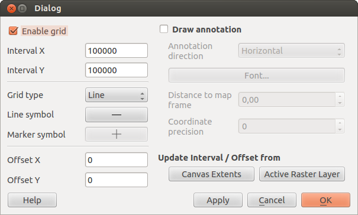

# Ansicht {#view}

## Vorheriger/Nächster Ausschnitt {#previous-next-extent}

Beim Bewegen in der Karte kann über die Funktion *Vorheriger Ausschnitt* auf den vorher angezeigten Kartenausschnitt zurückgekehrt werden. Über *Nächster Ausschnitt* wird wieder auf den danach gewählten Kartenausschnitt gewechselt.

## Neues Kartenfenster {#new-map-window}

Über die Funktion *Neues Kartenfenster* können weitere Kartenfenster geöffnet werden. Diese werden automatisch angeordnet, können aber auch mit der Maus an eine andere Stelle innerhalb oder ausserhalb des Programmfensters bewegt werden.

Die angezeigten Ebenen können unabhängig vom Hauptfenster im Menu *Fenster* ausgewählt werden. Durch Aktivierung des Schlosssymbols wird der angezeigte Kartenausschnitt immer vom Hauptfenster übernommen. Ist die Kopplung nicht aktiviert, kann im zusätzlichen Kartenfenster der Ausschnitt mit der Maus eigenständig gewählt werden.

## 3D {#d}

Über die Funktion *3D* wird ein zusätzliches Fenster mit einer Globus-Ansicht geöffnet. Dieses Fenster wird automatisch angeordnet, kann aber auch mit der Maus an eine andere Stelle innerhalb oder ausserhalb des Programmfensters bewegt werden.

### Einstellungen {#settings}

Die angezeigten Ebenen können unabhängig vom Hauptfenster im Menu *Fenster* ausgewählt werden.

-   **Ausschnitt synchronisieren**: Über das Symbol Ausschnitt synchronisieren wird auf dem Globus zum Kartenausschnitt des Hauptfensters navigiert.

-   **Szene neu laden**: Über das Symbol Szene neu laden wird die Ebenen im Globus neu geladen.

-   **Globus Einstellungen**: Über das Symbol Globus Einstellungen wird ein Dialog mit weiteren Einstellungsmöglichkeiten aufgerufen.

### Navigation {#navigation}

-   **Navigation Ansichtswinkel**: Im oberen Navigationsrad wird die Kamera über die Links-/Rechts-Pfeile nach links bzw. rechts gedreht. Über die Auf-/Ab-Pfeile wird der vertikale Sichtwinkel der Kamera geändert.

-   **Navigation auf Globus**: Im unteren Navigationsrad wird der Globus über die Pfeiltasten entsprechend nach links, rechts, oben oder unten gedreht.

-   **+**: Die Kamera bewegt sich näher zum Globus, das heisst die Höhe der Kamera wird reduziert.

-   **-**: Die Kamera bewegt sich weiter vom Globus weg, das heisst die Höhe der Kamera wird angehoben.

## Gitter {#grid}

 Gitter ermöglicht es Ihnen ein Koordinatengitter und Koordinatenbeschriftungen der Karte hinzuzufügen.

**Gitter Dialog:**

1.  Wählen Sie das Menü *Ansicht‣ Dekorationen ‣ Gitter*. Der Dialog öffnet sich.
2.  Aktivieren Sie das Kontrollkästchen  Aktiviere Gitter und machen Sie Definitionen gemäß den Layern die Sie ins Kartenfenster geladen haben.
3.  Aktivieren Sie das Kontrollkästchen  Beschriftungen zeichnen und machen Sie Beschriftungsdefinitionen gemäß den im Kartenfenster geladenen Layern.
4.  Klicken Sie [Anwenden] um sicherzugehen, dass es so aussieht wie sie es erwarten oder [OK], wenn Sie zufrieden sind.
