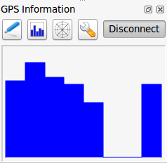
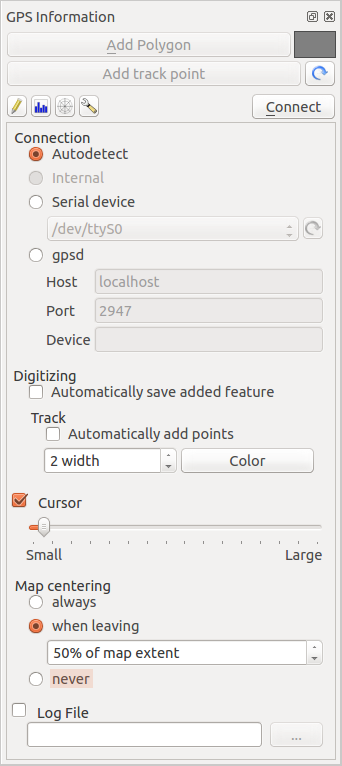

# Live GPS tracking {#live-gps-tracking}

Um das Live GPS tracking in KADAS zu aktivieren müssen Sie *Einstellungen ‣ Bedienfelder ‣*  *GPS-Information* wählen. Es erscheint ein neues Dockfenster auf der linken Seite der Oberfläche.

Es sind 4 Bildschirme im GPS Tracking Fenster möglich:

-    GPS Positionskoordinaten und eine Schnittstelle für manuelles Eintragen von Stützpunkten und Objekten.

-    GPS Signalstärke von Satellitenverbindungen

-    GPS Polarbildschirm der die Anzahl und die polare Position von Satelliten zeigt

-    GPS Optionsansicht (siehe <a href="#figure-gps-options" class="reference internal">figure_gps_options</a>)

Mit einem angeschlossenen GPS-Empfänger (muss auch von Ihrem Betriebssystem unterstützt werden) reicht ein einfacher Klick auf den Knopf **\[Verbinden\]**. Ein zweiter Klick (jetzt auf **\[Trennen\]**) trennt die Verbindung zu dem GPS-Empfänger wieder. Für GNU/Linux wurde gpsd Support integriert. Dadurch ist eine einfache Verbindung zu den meisten GPS Geräten gewährleistet. Sie müssen gpsd im Vorfeld konfigurieren, damit KADAS sich damit verbinden kann.

Warnung

Wenn Sie Ihre Position in die Oberfläche aufnehmen wollen müssen Sie erst einen neuen Vektorlayer erstellen und diesen in den Bearbeitungsmodus bringen um Ihren Track aufnehmen zu können.

## Positionskoordinaten {#position-and-additional-attributes}

 Wenn das GPS Signale von Satelliten empfängt werden Sie Ihre Position als Länge, Breite und Höhe zusammen mit zusätzlichen Attributen sehen.

**Figure GPS Position:**

GPS Tracking Position und zusätzliche Attribute 

## GPS Signalstärke {#gps-signal-strength}

 Hier können Sie die Signalstärke der Satelliten von denen Sie Signale empfangen sehen.

**Figure GPS Strength:**

GPS Tracking Signalstärke 

## GPS Polar-Bildschirm {#gps-polar-window}

 Wenn Sie wissen wollen, wo sich die Satelliten befinden, mit denen Sie gerade verbunden sind, wechseln Sie zum GPS Polarbildschirm. Sie können auch die IDs der Satelliten sehen, von denen Sie Signale empfangen.

**Figure GPS polar window:**

GPS Tracking Polarbildschirm 

## GPS Optionen {#gps-options}

 Wenn es Probleme bei der Verbindung zum GPS-Gerät geben sollte können Sie innerhalb dieser Einstellungen wechseln:

-    *Automatisch feststellen*

-    *Intern*

-    *Serielles Gerät*

-    *gpsd* (wählt den Host, Port und das Gerät mit dem Ihr GPS verbunden ist)

Ein wiederholter Klick auf **\[Verbinden\]** stellt die Verbindung zum GPS-Gerät wieder her.

**Figure GPS Tracking 2:**

GPS Tracking Optionsansicht 

Sie können  *Hinzugefügte Objekte automatisch speichern* aktivieren wenn Sie sich im Bearbeitungsmodus befinden. Oder Sie können  *Punkte automatisch hinzufügen* aktivieren um Punkte mit einer bestimmten Größe und Farbe der Kartenansicht hinzuzufügen.

Indem Sie das Kontrollkästchen  *Cursor* aktivieren, können Sie den Schieberegler  verwenden, um den Positionscursor im Kartenfenster kleiner oder größer zu machen.

Das Aktivieren des Radioknopfes  *Karte zentrieren* ermöglicht es auszuwählen, wie das Kartenfenster aktualisiert werden soll. Dies enthält ‘immer beim Verlassen’, wenn die aufgenommenen Koordinaten den Bereich des Kartenfensters verlassen oder ‘niemals’, um die Kartenausschnitt beizubehalten.

Schliesslich können Sie das Kontrollkästchen  *Logdatei* aktivieren und einen Pfad angeben, wo die Logdateien über die GPS-Messung abgelegt werden.

Wenn Sie ein Objekt manuell angeben wollen, müssen Sie zurück zu  Position gehen und dann auf **\[Punkt hinzufügen\]** oder **\[Wegpunkt hinzufügen\]** klicken.

## Ein Bluetooth GPS fürs Live Tracking anbinden {#connect-to-a-bluetooth-gps-for-live-tracking}

Mit KADAS können Sie ein Bluetooth GPS für das Aufnehmen von Felddaten anbinden. Um dies durchzuführen benötigen Sie ein Bluetooth Gerät und einen Bluetooth Empfänger auf Ihrem Computer.

Als erstes müssen Sie Ihr GPS Gerät erkennen lassen und mit dem Computer verbinden. Stellen Sie das GPS an, gehen Sie zum Bluetooth Icon in Ihrem Infobereich und suchen Sie nach einem Neuen Gerät.

Vergewissern Sie sich dass auf der rechten Seite Ihrer Geräteauswahlmaske alle Geräte ausgewählt sind so dass Ihre GPS Einheit darunter in Erscheinung tritt. Im nächsten Schritt sollte ein serieller Verbindungsservice erhältlich sein, wählen Sie ihn aus und klicken Sie auf den **\[Verbinden\]** Knopf.

Denken Sie daran dass die an die GPS Verbindung angebundenen COM Ports aus den Bluetooth Eigenschaften resultieren.

Machen Sie die Kopplung für die Verbindung nachdem das GPS erkannt wurde. Normalerweise ist der Authorisationskode `0000`.

Öffnen Sie jetzt das *GPS-Information* Bedienfeld und wechseln Sie zur  GPS Optionsansicht. Wählen Sie den zu der GPS Verbindung zugewiesenen COM Port und klicken Sie **\[Verbinden\]**. Nach kurzer Zeit sollte ein Cursor, der Ihre Position anzeigt erscheinen.

Wenn KADAS keine GPS Daten empfangen kann sollten Sie Ihr GPS Gerät neustarten, 5-10 Sekunden warten und dann wieder eine Verbindung versuchen. Normalerweise funktioniert diese Lösung. Wenn Sie wieder einen Verbindungsfehler erhalten vergewissern Sie sich dass kein anderer Bluetoothempfänger, der an die gleiche GPS Einheit gekoppelt ist, in Ihrer Nähe ist.

## GPSMAP 60cs verwenden {#using-gpsmap-60cs}

### MS Windows {#ms-windows}

Der einfachste Weg, damit es funktioniert ist eine Middleware (Freeware, nicht offen) genannt <a href="http://update.gpsgate.com/install/GpsGateClient.exe" class="reference external">GPSGate</a> zu verwenden.

Starten Sie das Programm, lassen Sie es nach GPS Geräten suchen (funktioniert sowohl mit USB als Bluetooth Geräten), und klicken in Sie in KADAS einfach **\[Verbinden\]** wobei Sie im Live Tracking Bedienfeld den  *Automatisch feststellen* Modus verwenden.

### Ubuntu/Mint GNU/Linux {#ubuntu-mint-gnu-linux}

Wie unter Windows ist der einfachste Weg einen Server, in diesem Fall GPSD, dazwischen zu benutzen, also

    sudo apt-get install gpsd

Laden Sie dann das `garmin_gps` Kernelmodul

    sudo modprobe garmin_gps

Und verbinden Sie dann die Einheit. Überprüfen Sie dann mit `dmesg` die aktuelle von dem Gerät verwendete Einheit, zum Beispiel `/dev/ttyUSB0`. Starten Sie jetzt gpsd

    gpsd /dev/ttyUSB0

Und verbinden Sie sich zuletzt mit dem KADAS Live Tracking Tool.

## BTGP-38KM Datenlogger verwenden (nur Bluetooth) {#using-btgp-38km-datalogger-only-bluetooth}

Sie können GPSD (unter Linux) oder GPSGate (unter Windows) mühelos verwenden.

## BlueMax GPS-4044 Datenlogger verwenden (sowohl BT als auch USB) {#using-bluemax-gps-4044-datalogger-both-bt-and-usb}

### MS Windows {#id1}

Das Live Tracking funktioniert mit USB und BT Modus, mit oder ohne GPSGate, benutzen Sie einfach den  *Automatisch feststellen* Modus oder stellen Sie das Tool auf den richtigen Port ein.

### Ubuntu/Mint GNU/Linux {#id2}

**Für USB**

Das Live Tracking funktioniert sowohl mit GPSD

    gpsd /dev/ttyACM3

oder ohne es, indem man das KADAS Live Tracking Tool direkt mit dem Gerät verbindet (zum Beispiel `/dev/ttyACM3`).

**Für Bluetooth**

Das Live Tracking funktioniert sowohl mit GPSD

    gpsd /dev/rfcomm0

oder ohne es, indem man das KADAS Live Tracking Tool direkt mit dem Gerät verbindet (zum Beispiel `/dev/rfcomm0`).

