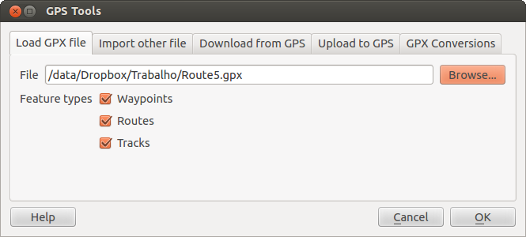

# GPS Plugin {#gps-plugin}

## Was ist GPS? {#what-is-gps}

GPS, das Global Positioning System, ist ein satellitenbasiertes System das es jedem mit einem GPS Empfänger ermöglicht seine genaue Position überall auf der Welt zu finden. GPS wird als Navigationshilfe in Flugzeugen, in Schiffen und von Wanderern benutzt. Der GPS Empfänger verwendet die Signale von den Satelliten um seine Länge, Breite und (manchmal) Höhe zu berechnen. Die meisten Empfänger haben auch die Fähigkeit Orte (bekannt als **Wegpunkte**), Sequenzen von Wegpunkten, die zusammen eine geplante **Route** ergeben und Tracklogs oder **Spuren** der zeitlichen Bewegung des Empfängers zu speichern. Wegpunkte, Routen und Spuren sind die drei Grundtypen in GPS Daten. KADAS stellt Wegpunkte in Punktlayern dar, wohingegen Routen und Spuren in Vektorlinien dargestellt werden.

## GPS-Daten aus einer Datei laden {#loading-gps-data-from-a-file}

Es gibt dutzende von verschienden Dateiformaten zum Speichern von GPS Daten. Das Format das KADAS benutzt wird GPX (GPS eXchange format) genannt, welches ein Standardaustauschformat ist welches eine beliebige Anzahl von Wegpunkten, Routen und Spuren in einer Datei enthalten kann.

To load a GPX file, you first need to load the plugin. *Plugins ‣*  *Plugin Manager...* opens the Plugin Manager Dialog. Activate the  *GPS Tools* checkbox. When this plugin is loaded, a button with a small handheld GPS device will show up in the toolbar and in *Layer ‣ Create Layer ‣* :

-    GPS-Werkzeuge

-    *Create new GPX Layer*

Zum Arbeiten mit GPS Daten stellen wir Ihnen eine Beispiel GPX Datei, die im KADAS Beispieldatensatz zu finden ist, zur Verfügung: `qgis_sample_data/gps/national_monuments.gpx`. Siehe Abschnitt <a href="../introduction/getting_started.html#label-sampledata" class="reference internal"><em>Beispieldaten</em></a> für weitere Informationen über die Beispieldaten.

1.  Wählen Sie *Vektor ‣ GPS ‣ GPS Werkzeuge* oder klicken Sie das  GPS-Werkzeuge Icon in der Werkzeugleiste und öffnen Sie den *GPX-Datei laden* Reiter (siehe <a href="#figure-gps-1" class="reference internal">figure_GPS_1</a>).

2.  Suchen Sie den Ordner `qgis_sample_data/gps/`, wählen Sie die GPX-Datei `national_monuments.gpx` und klicken Sie **\[Öffnen\]**.

**Figure GPS 1:**

Das *GPS Werkzeuge* Dialogfenster 

Use the **\[Browse...\]** button to select the GPX file, then use the checkboxes to select the feature types you want to load from that GPX file. Each feature type will be loaded in a separate layer when you click **\[OK\]**. The file `national_monuments.gpx` only includes waypoints.

Bemerkung

GPS Einheiten ermöglichen es Ihnen Daten in verschiedenen Koordinatensystemen zu speichern. Wenn Sie eine GPX Datei herunterladen (von Ihrer GPS Einheit oder einer Webseite) und Sie dann in KADAS laden versichern Sie sich das die Daten die in Ihrer GPX-Datei gespeichert sind WGS 84 (Länge/Breite) verwenden. KADAS erwartet dieses und es ist die offizielle GPX Spezifikation. Siehe <a href="http://www.topografix.com/GPX/1/1/" class="uri" class="reference external">http://www.topografix.com/GPX/1/1/</a> .

## GPSBabel {#gpsbabel}

Weil KADAS nur das GPX-Format unterstützt, müssen Sie einen Weg finden, um andere GPS-Datenformate nach GPX zu konvertieren. Dies können Sie in vielen Fällen mit der Freien Software GPSBabel erledigen, erhältlich unter der URL: <a href="http://www.gpsbabel.org" class="uri" class="reference external">http://www.gpsbabel.org</a>. Diese Software kann auch GPS-Daten von Ihrem PC zu Ihrem GPS-Empfänger transferieren und umgekehrt. KADAS benutzt GPSBabel auch dazu, daher ist es ratsam, es zu installieren. Wenn Sie aber lediglich GPX-Dateien in KADAS laden möchten, geht dies auch ohne GPSBabel. Version 1.2.3 funktioniert auf jeden Fall mit KADAS, neuere aber wahrscheinlich auch.

## GPS-Daten importieren {#importing-gps-data}

Um GPS-Daten aus einer Datei, die nicht im GPX-Format vorliegt zu importieren, benutzen Sie den Reiter *Aus anderer Datei importieren*. Wählen Sie dann die Datei (und den Dateityp), die importiert werden soll aus, von welchem Datenformat Sie importieren möchten und wo die konvertierte GPX-Datei unter welchem Namen abgelegt werden soll. Beachten Sie, dass nicht für alle Datenformate die drei GPS-Datentypen Wegpunkte, Routen und Spuren unterstützt werden. Manchmal sind es nur ein oder zwei.

## GPS-Daten von einem Empfänger herunterladen {#downloading-gps-data-from-a-device}

KADAS kann mit dem Programm GPSBabel GPS-Daten direkt von einem GPS-Empfänger in einen Vektorlayer laden. Dazu können Sie den Reiter *Vom GPS herunterladen* verwenden (siehe <a href="#figure-gps-2" class="reference internal">Figure_GPS_2</a>), indem Sie den Typ Ihres GPS-Empfängers angeben, den Verbindungsport (oder USB wenn Ihr GPS dies unterstützt), den Namen der GPX-Datei, in welche die Daten konvertiert werden sollen und schließlich den Namen des neuen Vektorlayers in KADAS.

**Figure GPS 2:**

Das Downloadwerkzeug

Durch die Angabe des Typs Ihres GPS-Empfängers legen Sie fest, wie GPSBabel mit dem Gerät kommuniziert. Wenn kein vorhandener Typ mit Ihrem Empfänger funktioniert, können Sie einen eigenen, neuen Gerätetyp erstellen (vgl. Abschnitt <a href="#defining-new-device" class="reference internal"><em>Neues GPS-Gerät definieren</em></a>).

Der Verbindungsport ist ein Dateiname oder ein anderer Name, den Ihr System als Referenz für den physischen Port benutzt, über den eine Verbindung zum GPS-Empfänger hergestellt wird. Es kann auch einfach USB sein, wenn dies von dem GPS-Gerät unterstützt wird.

-    Unter Linux ist dies etwas wie `/dev/ttyS0` oder `/dev/ttyS1`.

-    Unter Windows ist dies `COM1` oder `COM2`.

Wenn Sie **\[OK\]** klicken werden die Daten vom GPS-Empfänger heruntergeladen und in KADAS als Vektorlayer dargestellt.

## GPS-Daten auf einen Empfänger hochladen {#uploading-gps-data-to-a-device}

Sie können auch einen Vektorlayer aus KADAS auf einen GPS-Empfänger hochladen, indem Sie den Reiter *Zum GPS hochladen* verwenden. Der Vektorlayer muss dazu ein GPX-Layer sein. Sie wählen dazu einen entsprechenden Layer aus, den Typ Ihres GPS-Empfängers und den Verbindungsport (oder USB). Genau wie beim Reiter *Vom GPS herunterladen* können Sie bei Bedarf auch einen eigenen, neuen Empfänger-Typ erstellen, wenn Ihr Gerät nicht in der Liste auftaucht.

Dieses Werkzeug ist sehr nützlich in Kombination mit den Vektorbearbeitungsfunktionen von KADAS. Es ermöglicht Ihnen eine Karte zu laden, Wegpunkte und Routen zu erstellen und diese dann auf Ihr GPS Gerät hochzuladen und zu verwenden.

## Neues GPS-Gerät definieren {#defining-new-device-types}

Es gibt eine große Vielfalt an GPS-Empfängern, und die KADAS Entwickler können nicht alle testen. Wenn Sie also ein Gerät haben, das nicht mit einem der bereits vorhandenen Gerätetypen, die in *Vom GPS herunterladen* und *Zum GPS hochladen* aufgelistet sind, funktioniert, können Sie selbst einen erstellen. Dazu klicken Sie auf den Knopf **\[Editiere Geräte\]** im Hochladen Reiter oder Herunterladen Reiter.

Um ein neues Gerät zu definieren klicken Sie einfach den Knopf **\[Neu\]**, geben einen Namen, einen Downloadbefehl und einen Uploadbefehl für Ihr Gerät ein und klicken den **\[Aktualisieren\]** Knopf. Danach steht der Name des Gerätes in den Reitern *Zum GPS hochladen* und *Vom GPS herunterladen* zur Verfügung und kann in Form jeder Zeichenfolge eingegeben werden. Der Downloadbefehl ist der Befehl der zum Downloaden der Daten von einem Gerät in eine GPX-Datei verwendet wird. Dies ist wahrscheinlich ein GPSBabelbefehl, man kann aber auch jedes andere Kommandozeilenprogramm das eine GPX-Datei erstellen kann benutzen. KADAS wird die Schlüsselwörter `%type` , `%in` und `%out` ersetzen, wenn das Kommando ausgeführt wird.

`%type` wird ersetzt durch `-w`, wenn Sie Wegpunkte herunterladen, `-r` wenn es eine Route ist und `-t`, wenn es sich um Spuren handelt. GPSBabel erfährt dadurch, um welchen GPS-Datentyp es sich handelt.

`%in` wird ersetzt durch den Namen des Verbindungsports und `%out` durch den Namen, den Sie für die GPX-Datei gewählt haben. Wenn Sie also einen neuen Gerätetyp mit dem Kommando `gpsbabel %type -i garmin -o gpx %in %out` (es handelt sich hierbei um das Standard Kommando für einen ‘Garmin Serial’) definieren und diesen benutzen, um Wegpunkte von Port `/dev/ttyS0` in die Datei `output.gpx` zu schreiben, dann ersetzt KADAS die Schlüsselworte und startet das Kommando `gpsbabel -w -i garmin -o gpx /dev/ttyS0 output.gpx`.

Das Kommando hinaufladen wird benutzt, um die Daten auf Ihren GPS-Empfänger zu transferieren. Es werden dazu die gleichen Schlüsselworte benutzt, nur dass `%in` durch den Namen der hochzuladenen GPX-Datei und `%out` durch den Namen des Verbindungsports ersetzt wird.

Sie können mehr über GPSBabel und seine Funktionen unter der URL <a href="http://www.gpsbabel.org" class="uri" class="reference external">http://www.gpsbabel.org</a> erlernen.

Wenn Sie einmal einen eigenen Gerätetypen erstellt haben, wird dieser in der Liste der GPS-Geräte dauerhaft angezeigt werden.

## Downloaden von Punkten/Spuren von GPS Einheiten {#download-of-points-tracks-from-gps-units}

Wie in vorigen Abschnitten beschrieben verwendet KADAS GPSBabel um Punkte/Spuren direkt ins Projekt herunterzuladen. KADAS wird mit einem vordefinierten Profil zum Downloaden von Garmingeräten zur Verfügung gestellt. Unglücklicherweise gibt es dort einen <a href="http://hub.qgis.org/issues/6318" class="reference external">bug</a> der es unmöglich macht andere Profile zu erstellen, also ist das direkte Downloaden in KADAS mithilfe der GPS Werkzeuge im Moment auf Garmin UBS Einheiten begrenzt.

### Garmin GPSMAP 60cs {#garmin-gpsmap-60cs}

**MS Windows**

Installieren Sie Garmin USB Treiber von <a href="http://www8.garmin.com/support/download_details.jsp?id=591" class="uri" class="reference external">http://www8.garmin.com/support/download_details.jsp?id=591</a>

Connect the unit. Open GPS Tools and use `type=garmin serial` and `port=usb:` Fill the fields *Layer name* and *Output file*. Sometimes it seems to have problems saving in a certain folder, using something like `c:\temp` usually works.

**Ubuntu/Mint GNU/Linux**

Es wird zuerst ein Eintrag über die Rechte des Gerätes benötigt, wie beschrieben auf <a href="https://wiki.openstreetmap.org/wiki/USB_Garmin_on_GNU/Linux" class="uri" class="reference external">https://wiki.openstreetmap.org/wiki/USB_Garmin_on_GNU/Linux</a>. Sie können versuchen eine Datei `/etc/udev/rules.d/51-garmin.rules` zu erstellen, die diese Regel enthält.

    ATTRS{idVendor}=="091e", ATTRS{idProduct}=="0003", MODE="666"

Danach ist es nötig sicher zu gehen das das `garmin_gps` Kernelmodul nicht geladen ist

    rmmod garmin_gps

und dann können Sie die GPS Werkzeuge verwenden. Leider scheint es einen <a href="http://hub.qgis.org/issues/7182" class="reference external">bug</a> zu geben und KADAS friert mehrere Male ein bevor die Operation gut funktioniert.

### BTGP-38KM Datenlogger (nur Bluetooth) {#btgp-38km-datalogger-only-bluetooth}

**MS Windows**

Der bereits erwähnte Bug lässt es nicht zu, dass Daten innerhalb von KADAS heruntergeladen werden, also müssen Sie GPSBabel aus der Kommandozeile heraus oder mit Hilfe seiner Schnittstelle verwenden.

    gpsbabel -t -i skytraq,baud=9600,initbaud=9600 -f COM9 -o gpx -F C:/GPX/aaa.gpx

**Ubuntu/Mint GNU/Linux**

Verwenden Sie den gleichen Befehl (oder Einstellungen wenn Sie die GPSBabel GUI verwenden) wie in Windows. Unter Linux ist vielleicht üblich eine Nachricht wie folgt zu erhalten

    skytraq: Too many read errors on serial port

es ist einfach eine Frage des aus- und anschalten des Dateloggers und es erneut zu versuchen.

### BlueMax GPS-4044 Datenlogger (sowohl BT als auch USB) {#bluemax-gps-4044-datalogger-both-bt-and-usb}

**MS Windows**

Bemerkung

Es muss seine Treiber installieren bevor man es unter Windows 7 verwendet. Sehen Sie in den Herstellerseiten für den richtigen Download nach.

Downloaden mit GPSBabel, mit USB und BR, gibt immer einen Fehler heraus wie

    gpsbabel -t -i mtk -f COM12 -o gpx -F C:/temp/test.gpx
    mtk_logger: Can't create temporary file data.bin
    Error running gpsbabel: Process exited unsucessfully with code 1

**Ubuntu/Mint GNU/Linux**

**Mit USB**

Nachdem Sie das Kabel angeschlossen haben verwenden Sie den `dmesg` Befehl um zu verstehen welcher Port benutzt wird, zum Beispiel `/dev/ttyACM3`. Benutzen Sie dann wie immer GPSBabel aus der Kommandozeile oder der GUI.

    gpsbabel -t -i mtk -f /dev/ttyACM3 -o gpx -F /home/user/bluemax.gpx

**Mit Bluetooth**

Verwenden Sie Blueman Device Manager um das Gerät zu verbinden und machen Sie es über einen Systemport zugänglich, starten Sie dann GPSBabel.

    gpsbabel -t -i mtk -f /dev/rfcomm0 -o gpx -F /home/user/bluemax_bt.gpx

