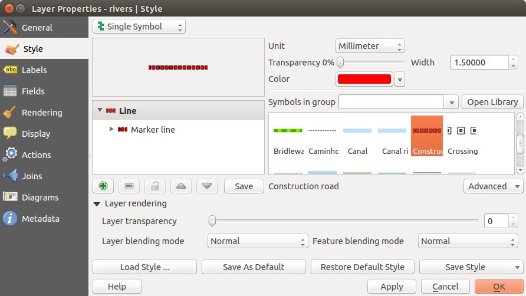
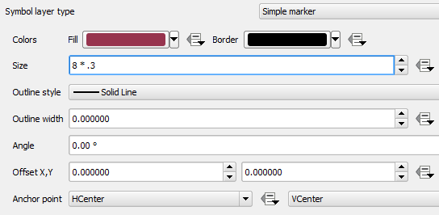
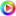
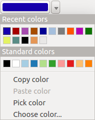
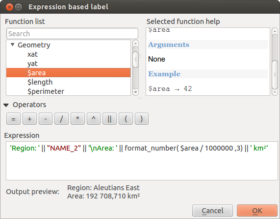
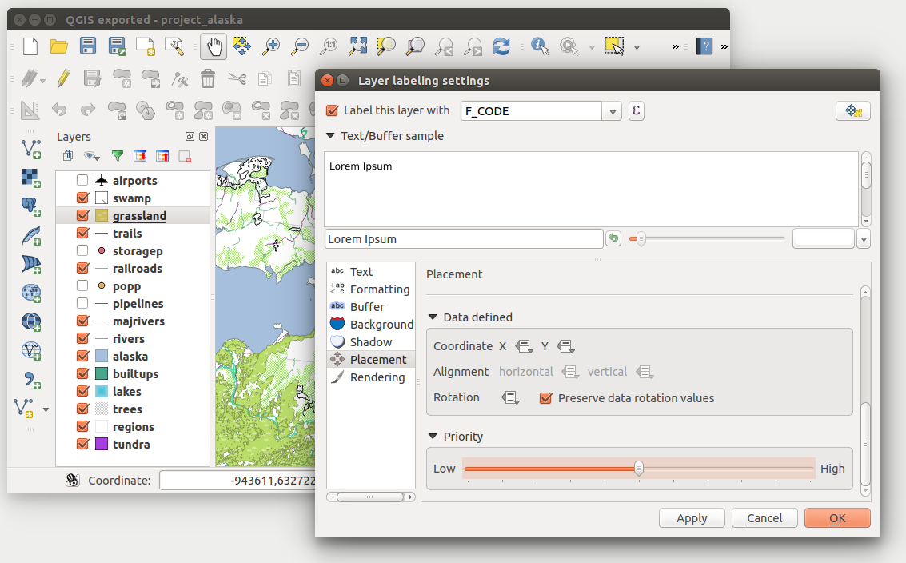
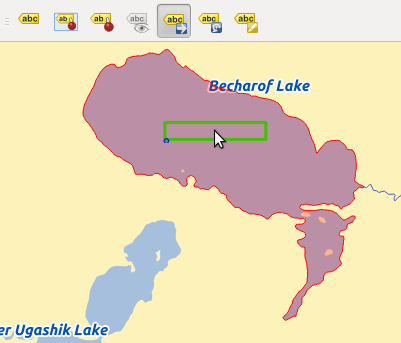
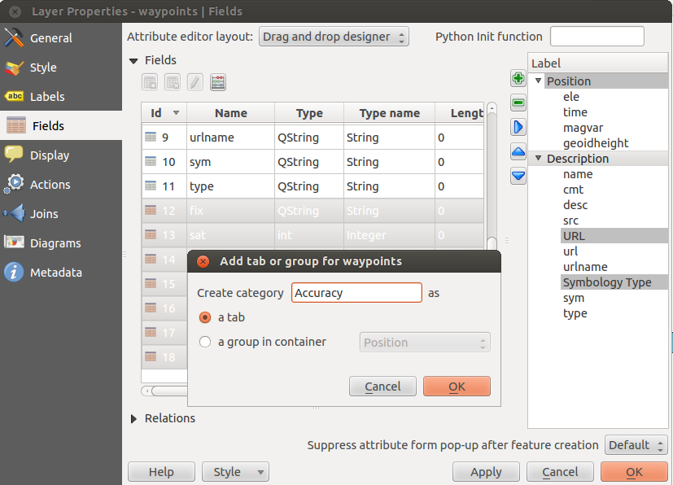
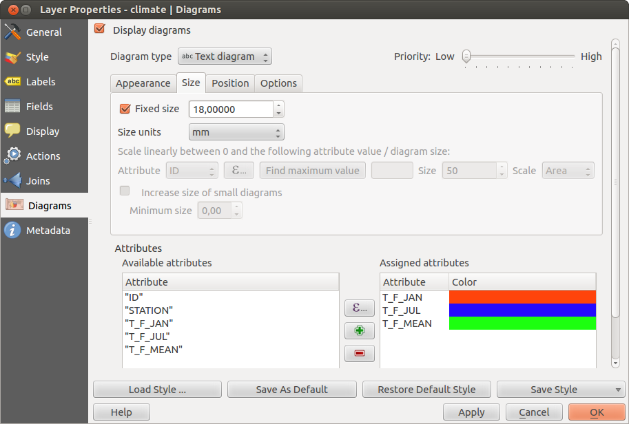

# Vektorlayereigenschaften {#the-vector-properties-dialog}

Der *Layereigenschaften*-Dialog stellt Informationen über den Layer, Darstellungseinstellungen und Beschriftungsoptionen bereit. Wenn ein Vektorlayer aus einer PostgreSQL/PostGIS Datenbank geladen wurde, können über den Dialog *Layereigenschaften* auch SQL-Abfragen mit dem *Objektuntermenge*-Dialog im Menü *Allgemein* angewendet werden. Um den *Layereigenschaften*-Dialog zu erreichen doppelklicken Sie einen Layer in der Legende oder machen Sie einen Rechtsklick auf den Layer und wählen Sie *Eigenschaften* aus dem Popupmenü.

**Figure Vector Properties 1:**

Vektor Layereigenschaften Dialog 

## Menü Stil {#style-menu}

Das Menü Stil stellt Ihnen ein umfassendes Werkzeug zum Darstellen und symbolisieren Ihrer Vektordaten zur Verfügung. Sie können *Layerdarstellung ‣* Werkzeuge, die für alle Vektordaten gleich sind, genauso wie spezielle Symbolisierungstools, die für die verschiedenen Arten von Vektordaten konzipiert wurden, verwenden.

### Darstellungen {#renderers}

Der Renderer ist dafür verantwortlich ein Objekt zusammen mit dem richtigen Symbol zu zeichnen. Es gibt vier Arten von Renderern: Einzelsymbol, Kategorisiert, Abgestuft, Regelbasierend und Punktverdrängung. Es gibt keinen kontinuirliche Farbe Renderer da es in der Tat einfach ein spezieller Fall des Abgestuft Renderers ist. Die Kategorisiert und Abgestuft Renderer können erstellt werden indem ein Symbol und ein Farbverlauf festgelegt werden - Sie werden die Farben für Symbole angemessen einsetzen. Für Punktlayer ist ein Punktverdrängung Renderer erhältlich. Für jeden Datentyp (Punkte, Linien und Polygone) sind Symbollayertypen erhältlich. Abhängig vom ausgesuchten Renderer gibt es im Menü *Stil* verschiedene zusätzliche Bereiche. Im rechten unteren Teil des Symbologie Dialogs gibt es einen **\[Symbol\]** Knopf der den Zugang zum Stilmanager ermöglicht (siehe Abschnitt [vector\_style\_manager\_](#id2)). Mit dem Stilmanager können Sie bestehende Symbole bearbeiten und entfernen als auch neue Symbole hinzufügen.

Nachdem alle nötigen Veränderungen vorgenommen wurden kann das Symbol zur Liste der aktuellen Stilsymbole hinzugefügt werden (indem Sie **\[Symbol\]**  *Speichern* verwenden) und dann kann es auf einfache Weise später benutzt werden. Darüberhinaus können Sie den **\[Stil speichern ...\]**  Knopf um das Symbol als QGIS-Layerstildatei (.qml) oder SLD-Datei (.sld) zu speichern benutzen. SLDs können von jedem Darstellungstyp - Einzelsymbol, Kategorisiert, Abgestuft oder Regelbasierend - exportiert werden, aber wenn Sie ein SLD importieren wird entweder nur Einzelsymbol oder oder Regelbasierend erstellt. Das heisst dass Kategorisierte oder Abgestufte Stile nach Regelbasierend konvertiert werden. Wenn Sie diese Darstellungsarten beibehalten wollen müssen Sie zum QML-Format greifen. Auf der anderen Seite kann es sehr nützlich sein diese einfache Art, Stile nach Regelbasierend zu konvertieren, anzuwenden.

Wenn Sie den Darstellungstyp beim Einstellen des Stils eines Vektorlayers ändern werden die Einstellungen für das Symbol beibehalten. Beachten Sie dass dieses Vorgehen nur für eine Änderunge funktioniert. Wenn Sie den Darstellungstyp wiederholt ändern gehen die Einstellungen für das Symbol verloren.

If the datasource of the layer is a database (PostGIS or Spatialite for example), you can save your layer style inside a table of the database. Just click on *Save Style* comboxbox and choose **Save in database** item then fill in the dialog to define a style name, add a description, an ui file and if the style is a default style. When loading a layer from the database, if a style already exists for this layer, KADAS will load the layer and its style. You can add several style in the database. Only one will be the default style anyway.

**Figure Vector Properties 2:**

Stil in Datenbank speichern Dialog 

Tipp

**Auswahl und Ändern von Mehrfachsymbolen**

Mit der Symbologie können Sie Mehrfachsymbole auswählen und Rechtsklicken um Farbe, Transparenz, Größe oder Breite der ausgewählten Einträge zu ändern.

**Einzelsymbol Darstellung**

Der Einzelsymbol Renderer wird verwendet um alle Objekte des Layers mit einem einfachen benutzerdefinierten Symbol darzustellen. Die Eigenschaften, die im Menü *Stil* angepasst werden können, hängen teilweise von dem Typ des Layers ab, wobei alle Typen die folgende Dialogstruktur befolgen. Im oberen linken Teil des Menüs gibt es einen Preview von den aktuellen Symbolen die dargestellt werden sollen. Im rechten Teil des Menüs gibt es eine Liste von Symbolen die bereits für den aktuellen Stil definiert wurden, welche durch Auswählen aus der Liste benutzt werden können. Das aktuelle Symbol kann mit dem Menü auf der rechten Seite verändert werden.

Wenn Sie auf die erste Ebene im *Symbollayer* Dialog auf der linken Seite klicken ist es möglich grundlegende Parameter wie *Größe*, *Transparenz*, *Farbe* und :guilabel:[\`](#id1)Drehung´ zu definieren. Hier werden die Ebenen zusammengeführt.

**Figure Symbology 3:**

Linieneigenschaften Einzelsymbol 

In any spinbox in this dialog you can enter expressions. E.g. you can calculate simple math like multiplying the existing size of a point by 3 without resorting to a calculator.

**Figure Symbology 4:**

Expression in Size spinbox 

If you click on the second level in the *Symbol layers* dialog a ‘Data-defined override’ for nearly all settings is possible. When using a data-defined color one may want to link the color to a field ‘budged’. Here a comment functionality is inserted.

    /* This expression will return a color code depending on the field value.
     * Negative value: red
     * 0 value: yellow
     * Positive value: green
     */
    CASE
      WHEN value < 0 THEN '#DC143C' -- Negative value: red
      WHEN value = 0 THEN '#CCCC00' -- Value 0: yellow
      ELSE '#228B22'                -- Positive value: green
    END

**Figure Symbology 5:**

Data-defined symbol with Edit... menu

**Kategorisierte Darstellung**

Der Kategorisiert Renderer wird verwendet um alle Objekte eines Layers darzustellen indem man ein einfaches benutzerdefiniertes Symbol, dessen Farbe den Wert des ausgewählten Attributs des Objekts wiedergibt. Im *Stil* Menü können Sie folgendes auswählen:

-   Das Attribut (indem Sie die Spalten Listbox oder die  *Spaltenausdruck einstellen* Funktion benutzen, siehe <a href="expression.html#vector-expressions" class="reference internal"><em>Ausdrücke</em></a>)

-   Das Symbol (über die Auswahl Symbol)

-   Die Farben (indem Sie die Farbverlauf Listbox verwenden)

Klicken Sie dann auf den **Klassifizieren** Knopf um Klassen aus den unterschiedlichen Werten der Attributspalte zu erstellen. Jede Klasse kann ausgeschaltet werden indem Sie das Kontrollkästchen links vom Klassennamen deaktivieren.

You can change symbol, value and/or label of the class, just double click on the item you want to change.

Right-click shows a contextual menu to **Copy/Paste**, **Change color**, **Change transparency**, **Change output unit**, **Change symbol width**.

Mit dem **\[Erweitert\]** Knopf in der rechten unteren Ecke des Dialogs können Sie die Felder, die Drehungs- und Größenskalierungsinformationen enthalten, einstellen. Der Einfachheit halber werden in der Mitte des Menüs die Werte aller aktuell ausgewählten Attribute zusammen aufgeführt, inklusive der Symbole die dargestellt werden sollen.

The example in <a href="#figure-symbology-6" class="reference internal">figure_symbology_6</a> shows the category rendering dialog used for the rivers layer of the KADAS sample dataset.

**Figure Symbology 6:**

Kategorisierte Symbolisierungsoptionen 

**Abgestufte Darstellung**

Der Abgestuft Renderer wird verwendet alle Objekte eines Layers darzustellen indem ein einfaches benutzerdefiniertes Symbol dessen Farbe die Zuweisung eines Objektattributes zu einer Klasse reflektiert.

**Figure Symbology 7:**

Abgestufte Symbolisierungsoptionen 

Wie beim Kategorisiert Renderer können Sie mit dem Abgestuft Renderer die Drehung und Größenskalierung von angegebenen Spalten definieren.

Genauso können Sie -analog zum Kategorisierten Renderer - im Menü *Stil* auswählen:

-   Das Attribut (indem Sie die Spalten Listbox oder die  *Spaltenausdruck einstellen* Funktion benutzen, siehe das <a href="expression.html#vector-expressions" class="reference internal"><em>Ausdrücke</em></a> Kapitel)

-   Das Symbol (über die Auswahl Symbol)

-   Die Farben (indem man die Farbverlaufsliste verwendet)

Zusätzlich können Sie die Anzahl der Klassen und auch den Modus für das Klassifizieren von Objekten innerhalb der Klassen (indem man die Modus-Liste verwendet). Die möglichen Modi sind:

-   Gleiches Intervall: jede Klasse hat die gleich Größe (z.B. Werte von 0 bis 16 und 4 Klassen, jede Klasse hat eine Größe von 4);

-   Quantil: jede Klasse beinhaltet die gleiche Anzahl von Elementen (nach der Idee eines Boxplots);

-   Natürliche Unterbrechungen (Jenks): die Varianz innerhalb jeder Klasse ist minimal währenddessen die Varianz zwischen Klassen maximal ist;

-   Standardabweichung: Klassen werden abhängig von der Standardabweichung der Werte erstellt;

-   Schöne Unterbrechungen: das gleiche wie Natürliche Unterbrechungen nur dass die extremen Werte jeder Klasse Ganzzahlen sind.

Das Listenfeld im mittleren Teill des *Stil* Menüs führt die Klassen zusammen mit ihren Bereichen, Beschriftungen und Symbolen die dargestellt werden auf.

Klicken Sie auf den **Klassifizieren** Knopf um Klassen anhand des ausgewählten Modus zu erstellen. Jede Klasse kann anhand des Deaktivierens des Kontrollkästchens links neben dem Klassennamen ausgeschaltet werden.

Sie können das Symbol, den Wert oder die Beschriftung verändern, klicken Sie einfach auf das Element, das Sie ändern wollen.

Right-click shows a contextual menu to **Copy/Paste**, **Change color**, **Change transparency**, **Change output unit**, **Change symbol width**.

The example in <a href="#figure-symbology-7" class="reference internal">figure_symbology_7</a> shows the graduated rendering dialog for the rivers layer of the KADAS sample dataset.

Tipp

**Thematische Karten anhand von Ausdrücken erstellen**

Kategorisierte und Abgestufte thematische Karten können jetzt anhand des Ergebnisses eines Ausdrucks erstellt werden. Im Eigenschaftendialog für Vektorlayer wurde die Attributauswahl um eine  *Set column expression* Funktion ergänzt. Jetzt brauchen Sie nicht länger das Klassifikationsattribut in eine neue Spalte in Ihrer Attributtabelle schreiben wenn Sie wollen, dass das Klassifikationsattribut eine Zusammenstellung von mehreren Feldern wie z.B. eine Formel irgendeiner Art ist.

**Regelbasierende Darstellung**

Der regelbasierte Renderer wird verwendet um alle Objekte eines Layers anhand eines regelbasierten Symbols dessen Farbe die Zuordnung eines ausgewählten Objektattributs zu einer Klasse wiedergibt, darzustellen. Die Regeln basieren auf SQL-Anweisungen. Mit dem Dialog können Sie anhand von Filtern oder Maßstäben gruppieren und Sie können entscheiden ob Sie die Zeichenreihenfolge benutzen wollen oder nur die erste zutreffende Regel benutzen wollen.

The example in <a href="#figure-symbology-8" class="reference internal">figure_symbology_8</a> shows the rule-based rendering dialog for the rivers layer of the KADAS sample dataset.

To create a rule, activate an existing row by double-clicking on it, or click on ‘+’ and click on the new rule. In the *Rule properties* dialog, you can define a label for the rule. Press the  button to open the expression string builder. In the **Function List**, click on *Fields and Values* to view all attributes of the attribute table to be searched. To add an attribute to the field calculator **Expression** field, double click its name in the *Fields and Values* list. Generally, you can use the various fields, values and functions to construct the calculation expression, or you can just type it into the box (see <a href="expression.html#vector-expressions" class="reference internal"><em>Ausdrücke</em></a>). You can create a new rule by copying and pasting an existing rule with the right mouse button. You can also use the ‘ELSE’ rule that will be run if none of the other rules on that level match. The rules appear in a tree hierarchy in the map legend. Just double-klick the rules in the map legend and the Style menu of the layer properties appears showing the rule that is the background for the symbol in the tree.

**Figure Symbology 8:**

Regelbasierte Symbolisierungsoptionen 

**Punkt-Verschiebung**

Für Punktlayer gibt es eine Darstellungsart, mit der es möglich ist, sämtliche Punkte eines Layers auch dann darzustellen, wenn sie sich teilweise an derselben Stelle befinden. Die Punkte werden dabei um ein Zentrumssymbol herum auf einem Versatzkreis angeordnet und dargestellt.

**Figure Symbology 9:**

Dialog Punktverdrängung 

Tipp

**Symbologie exportierten**

You have the option to export vector symbology from KADAS into Google \*.kml, \*.dxf and MapInfo \*.tab files. Just open the right mouse menu of the layer and click on *Save selection as ‣* to specify the name of the output file and its format. In the dialog, use the *Symbology export* menu to save the symbology either as *Feature symbology ‣* or as *Symbol layer symbology ‣*. If you have used symbol layers, it is recommended to use the second setting.

**Umgekehrte Polygone**

Inverted polygon renderer allows user to define a symbol to fill in outside of the layer’s polygons. As before you can select subrenderers. These subrenderers are the same as for the main renderers.

**Figure Symbology 10:**

Umgekehrte Polygone Dialog 

Tipp

**Switch quickly between styles**

Once you created one of the above mentioned styles you can right-klick on the layer and choose *Styles ‣ Add* to save your style. Now you can easily switch between styles you created using the *Styles ‣* menu again.

**Heatmap**

With the Heatmap renderer you can create live dynamic heatmaps for (multi)point layers. You can specify the heatmap radius in pixels, mm or map units, choose a color ramp for the heatmap style and use a slider for selecting a tradeoff between render speed and quality. When adding or removing a feature the heatmap renderer updates the heatmap style automatically.

### Farbwahl {#color-picker}

Unabhängig vom Stiltyp, der verwendet wird, zeigt der *Farbe wählen* Dialog e san wenn Sie klicken um eine Farbe zu wählen - entweder Füllungs- oder Rahmenfarbe. Der Dialog besitzt 4 verschiedene Reiter, die es Ihnen ermöglichen Farben anhand des  Farbverlaufs,  Farbkreises, der  Farbproben oder der  Farbwahl auszuwählen.

Egal welche Methode Sie verwenden, die ausgewählte Farbe wird immer durch Farbregler für HSV- (Hue, Saturation, Value) und RGB- (Rot, Blau, Grün) Werte beschrieben. Es gibt auch einen *Deckkraft*-Regler um den Transparenzgrad einzustellen. Im linken unteren Teil des Dialogs können Sie einen Vergleich zwischen *Aktuell* und *Alt* Farbe, die Sie zur Zeit auswählen und im rechten unteren Teil haben Sie die Option eine Farbe hinzuzufügen, aus der Sie gerade einen Farbknopf gemacht haben.

**Figure color picker 1:**

Farbwahl Verlauf Reiter 

Mit dem  Farbverlauf oder mit dem  Farbkreis können Sie alle möglichen Farbkombinationen suchen. Dennoch gibt es auch noch andere Möglichkeiten. Indem Sie Farbproben  verwenden können Sie aus einer vorausgewählten Liste wählen. Diese ausgewählte Liste wird mit einer drei Methoden *Recent colors*, *Standard colors* oder *Project colors* gefüllt.

**Figure color picker 2:**

Farbwahl Farbproben Dialog 

Eine andere Option ist die  Farbwahl zu benutzen, die es Ihnen ermöglicht eine Farbprobe unter Ihrem Mauszeiger in jedem Teil von QGIS oder sogar von einer anderen Anwendung zu nehmen, indem Sie die Leertaste drücken. Bitte beachten Sie, dass die Farbwahl betriebssystemabhängig ist und aktuell nicht von OSX unterstützt wird.

Tipp

\*\* schnelle Farbwahl + Farben kopieren/einfügen\*\*

Sie können schnell aus *Recent colors*, *Standard colors* auswählen oder einfach eine Farbe *Kopieren* oder *Einfügen* indem Sie den Drop-down-Pfeil klicken, der einer aktuellen Farbbox folgt.

**Figure color picker 3:**

Schnelle Farbwahl Menü 

### Layerdarstellung {#layer-rendering}

-   *Layertransparenz* : Sie können den unten liegenden Layer in der Kartenansicht mit diesem Werkzeug sichtbar machen. Verwenden Sie den Slider um die Sichtbarkeit Ihres Vektorlayers an Ihre Bedürfnisse anzupassen. Sie können auch eine genaue Definition des Prozentgrades der Sichtbarkeit im Menü neben dem Slider vornehmen.

<!-- -->

-   guilabel:Layermischmodi und *Objektmischmodi*: Sie können spezielle Darstellungseffekte mit diesen Werkzeugen, die Sie vorher nur von Grafikprogrammen gekannt haben, erzielen. Die Pixel der oben auf liegenden und darunter liegenden Layer werden anhand der unten beschriebenen Einstellungen gemischt.

    -   Normal: Dies ist der Standardmischmodus, der den Alphakanal des oben liegenden Pixels mit dem darunter liegenden Pixel vermischt. Die Farben werden nicht vermischt.

    -   Heller: Dies wählt das Maximum jeder Komponente der Vordergrund- und Hintergrundpixel. Seien Sie sich bewusst dass die Ergebnisse zackig und hart aussehen können.

    -   Bildschirm: Helle Pixel der Quelle werden über die des Ziels gezeichnet wohingegen dunkle Pixel nicht verwendet werden. Dieser Modus ist am nützlichsten für das Mischen der Textur eines Layers mit einem anderen Layer (z.B. kann man eine Schummerung dazu verwenden einen anderen Layer mit einer Textur zu versehen).

    -   Abwedeln: das Abwedeln erhellt und sättigt unten liegende Pixel auf Basis der Helligkeit des oben liegenden Pixels. Demzufolge erhöhen hellere oben liegende Pixel die Sättigung und Helligkeit des unten liegenden Pixels. Dies funktioniert am Besten wenn die oben liegenden Pixel nicht zu hell sind; andernfalls ist der Effekt zu extrem.

    -   Addition: Dieser Mischmodus fügt einfach die Pixelwerte eines Layers denen eines anderen Layers hinzu. Im Falle von Werten größer 1 (im Fall von RGB) wird weiß dargestellt. Dieser Modus ist dafür geeignet Objekte hervorzuheben.

    -   Dunkler: Dies erstellt ein Ergebnispixel das die kleinste Komponente der Vordergrund und Hintergrundpixel erhält. Wie das Aufhellen neigen die Ergebnisse dazu zackig und hart zu sein.

    -   Multiplizieren: Hier werden die Nummern für jedes Pixel des oben liegenden Layers mit den entsprechenden Pixeln des unteren Layers multipliziert. Das Ergebnis sind dunklere Bilder.

    -   Einbrennen: Dunklere Farben im oben liegenden Layer bewirken ein Verdunkeln des unten liegenden Layers. Einbrennen kann dazu benutzt werden um unten liegende Layer zu optimieren und zu colorieren.

    -   Überlagern: Dieser Modus kombiniert die Multiplizieren und Bilschirm Mischmodi. Im Ergebnispixel werden helle Bereiche heller und dunkle Bereiche dunkler.

    -   Weiches Licht: Dieses ist dem Überlagern sehr ähnlich nur dass anstelle Multiplizieren/Bildschirm Einbrennen/Abwedeln verwendet wird. Hier soll das Leuchten eines weichen Lichtes auf ein Bild nachgeahmt werden.

    -   Hartes Licht: Auch Hartes Licht ist dem Überlagerungsmodus sehr ähnlich. Hier soll die Projektion eines sehr intensiven Lichts auf ein Bild nachgeahmt werden.

    -   Unterschied: Unterschied subtrahiert das oben liegende Pixel von dem unten liegenden Pixel oder andersherum um immer einen positiven Wert zu bekommen. Das Mischen mit Schwarz produziert keinen Unterschied, da die Differenz mit allen Farben Null ist.

    -   Abziehen: Dieser Mischmodus zieht einfach die Pixelwerte eines Layers von dem anderen ab. Im Fall von negativen Werten wird Schwarz dargestellt.

## Menü Beschriftungen {#labels-menu}

Die  Beschriftungen Kernanwendung stellt intelligentes Beschriften für Punkt-, Linien- und Polygonlayer zur Verfügung und erfordert nur wenige Parameter. Diese neue Anwendung untersützt auch spontan transformierte Layer. Die Kernfunktionen der Anwendung wurden überarbeitet. In KADAS gibt es eine Anzahl von anderen Funktionen die das Beschriften verbessern. Die folgenden Menüs wurden erstellt um die Vektorlayer zu beschriften:

-   Text
-   Formatierung

-   Puffer

-   Hintergrund

-   Schatten

-   Platzierung

-   Darstellung

Lassen Sie uns sehen wie die Menüs für verschiedene Vektorlayer benutzt werden können.

**Punktlayer beschriften**

Starten Sie KADAS und laden Sie einen Punktlayer. Aktivieren Sie den Layer in der Legende und klicken Sie auf das  Layerbeschriftungseinstellungen Icon in der KADAS Werkzeugleiste.

Der erste Schritt besteht darin das  *Layer beschriften mit* Kontrollkästchen zu aktivieren und eine Attributspalte für das Beschriften auszuwählen. Klicken Sie  wenn Sie ausdrucksbasierte Beschriftungen definieren wollen - Siehe <a href="#labeling-with-expressions" class="reference internal">labeling_with_expressions</a>.

Die folgenden Schritte beschreiben ein einfaches Beschriften ohne die Verwendung der *Datendefinierten Übersteuerung* Funktionen, die neben den Drop-Down Menüs untergebracht sind.

Sie können den Textstil im *Text* Menü definieren (siehe <a href="#figure-labels-1" class="reference internal">Figure_labels_1</a>). Verwenden Sie die *Schriftart Groß-/Kleinschreibung* Option um die Textdarstellung zu beeinflussen. Sie haben die Möglichkeit den Text mit ‘Nur Großbuchstaben’, ‘Nur Kleinbuchstaben’ oder ‘Erstes Zeichen groß’ darzustellen. Verwenden Sie Mischmodi um Effekte die Sie von Grafikprogrammen kennen zu erstellen (siehe <a href="#blend-modes" class="reference internal">blend_modes</a>).

Im Menü *Formatierung* können Sie einen Buchstaben für einen Zeilenumbruch in den Beschriftungen mit der ‘Bei Zeichen umbrechen’ Funktion definieren. Verwenden Sie die  *Zahlenformatierung* Option um die Nummern in einer Attributtabelle zu formatieren. Hier können Dezimalstellen eingefügt werden. Wenn Sie diese Option aktivieren werden erst einmal drei Dezimalstellen als Standard eingestellt.

Um einen Puffer zu erstellen aktivieren Sie einfach die  *Textpuffer zeichnen* im Menü *Puffer*. Die Pufferfarbe ist variabel. Auch hier können Sie Mischmodi verwenden ( siehe <a href="#blend-modes" class="reference internal">blend_modes</a>).

Wenn das  *Pufferfüllung einfärben* Kontrollkästchen aktivieren, wird es mit teiltransparentem Text interagieren und gemischte Farbtransparenzergebnisse liefern. Das Abschalten der Pufferfüllung behebt das Problem (es sein denn der innere Aspekt der Pufferausdehnung überschneidet sich mit der Textfüllung) und ermöglicht das Erstellen von umrandetem Text.

Im Menü *Hintergrund* können Sie mit *Größe X* und *Größe Y* die Form Ihres Hintergrunds definieren. Verwenden Sie *Größenart* um einen zusätzlichen ‘Puffer’ in Ihren Hintergrund einzufügen. Der Hintergrund besteht dann aus dem Puffer mit dem Hintergrund in *Größe X* und *Größe Y*. Sie können eine *Drehung* festlegen wobei Sie zwischen ‘Mit Beschriftung abgleichen’, ‘Beschriftungsversatz’ und ‘Fest’ wählen können. Indem Sie ‘Beschriftungsversatz’ und ‘Fest’ verwenden, können Sie den Hintergrund rotieren. Definieren Sie *X-,Y-Versatz* mit X und Y Werten und der Hintergrund wird versetzt. Wenn Sie *X-, Y-Radius* verwenden erhält der Hintergrund runde Ecken. Auch hier ist es möglich den Hintergrund mit den darunterliegenden Layern in der Kartenansicht anhand von *Mischmodi* zu mischen (siehe <a href="#blend-modes" class="reference internal">blend_modes</a>).

Verwenden Sie das *Schatten* Menü für einen benutzerdefinierten *Schattenwurf*. Das Zeichnen des Hintergrunds ist sehr variabel. Wählen Sie zwischen ‘Niedrigste Beschriftungskomponente’, ‘Text’, ‘Puffer’ und ‘Hintergrund’. Der *Versatz*-Winkel hängt von der Orientierung der Beschriftung ab. Wenn Sie das Kontrollkästchen  *Globalen Schatten verwenden* dann ist der Ausgangspunkt des Winkels immer nach Norden orientiert und hängt nicht von der Orientierung der Beschriftung ab. Sie können das Erscheinungsbild des Schattens mit *Radius verschmieren* beeinflussen. Je höher die Nummer desto weicher sind die Schatten. Das Erscheinungsbild des Schattenwurfs kann auch durch das Benutzen eines Mischmodus verändert werden (siehe <a href="#blend-modes" class="reference internal">blend_modes</a>).

Choose the *Placement* menu for the label placement and the labeling priority. Using the  *Offset from point* setting, you now have the option to use *Quadrants* to place your label. Additionally, you can alter the angle of the label placement with the *Rotation* setting. Thus, a placement in a certain quadrant with a certain rotation is possible. In the *priority* section you can define with which priority the labels are rendered. It interacts with labels of the other vector layers in the map canvas. If there are labels from different layers in the same location then the label with the higher priority will be displayed and the other will be left out.

Im Menü *Darstellung* können sie Beschriftungs- und Objektoptionen definieren. Unter *Beschriftungsoptionen* können Sie jetzt die maßstabsabhängige Sichtbarkeitseinstellung vornehmen. Sie können KADAS davon abhalten nur ausgewählte Beschriftungen darzustellen indem Sie das  *Alle Beschriftungen auf diesem Layer anzeigen (einschließlich kollidierender)* Kontrollkästchen benutzen. Unter *Objektoptionen* können Sie definieren ob jeder Teil eines Mulitpart Features beschriftet werden soll. Es ist möglich zu definieren ob die Nummer von Objekten die beschriftet werden soll begrenzt ist und  *Möglichst keine Objekte durch Beschriftungen verdecken*.

**Figure Labels 1:**

Intelligentes Beschriften von Punktlayern 

**Linienlayer beschriften**

Der erste Schritt ist es das  *Layer beschriften mit* Kontrollkästchen im *Beschriftungen* Menü zu aktivieren und eine Attributspalte für das Beschriften auszuwählen. Klicken Sie  wenn Sie ausdrucksbasierte Beschriftungen definieren wollen - siehe <a href="#labeling-with-expressions" class="reference internal">labeling_with_expressions</a>.

Danach können Sie den Textstil im *Text* Menü definieren. Hier können Sie die gleichen Einstellungen wie für Punktlayer verwenden.

Auch im Menü *Formatierung* sind die gleichen Einstellungen wie für Punktlayer möglich.

Das Menü *Puffer* hat die gleichen Funktionen wie in Abschnitt <a href="#labeling-point-layers" class="reference internal">labeling_point_layers</a>.

Das Menü *Hintergrund* hat die gleichen Einträge wie in Abschnitt <a href="#labeling-point-layers" class="reference internal">labeling_point_layers</a> beschrieben.

Auch das *Schatten* Menü hat die gleichen Einträge wie in section <a href="#labeling-point-layers" class="reference internal">labeling_point_layers</a> beschrieben.

Im Menü *Platzierung* finden Sie spezielle Einstellungen für Linienlayer. Die Beschriftung kann  *Parallel*,  *Gebogen* oder  *Horizontal* platziert werden. Mit der  *Parallel* und radiobuttonoff| *Gebogen* Option können Sie die Position  *Über Linie*,  *Auf der Linie* und  *Unter Linie* definieren. Es ist möglich mehrere Optionen auf einmal auszuwählen. In diesem Fall wird KADAS nach der optimalen Position der Beschriftung suchen. Zusätzlich können Sie *Größter Winkel zwischen Zeichen auf Kurven* definieren wenn Sie die  *Gebogen* Option auswählen (siehe <a href="#figure-labels-2" class="reference internal">Figure_labels_2</a>).

Sie können eine Minimaldistanz zum Wiederholen von Beschriftungen einstellen. Der Abstand kann in mm oder Karteneinheiten angegeben werden.

Some Placement setup will display more options, for example, *Curved* and *Parallel* Placements will allow the user to set up the position of the label (above, below or on the line), *distance* from the line and for *Curved*, the user can also setup inside/outside max angle between curved label. As for point vector layers you have the possibility to define a *Priority* for the labels.

Das *Darstellung* Menü hat fast die gleichen Einträge wie das bei Punktlayern. In den *Objektoptionen* können Sie jetzt *Objekte nicht beschriften, wenn kürzer als*.

**Figure Labels 2:**

Intelligentes Beschriften von Linienlayern 

**Polygonlayer beschriften**

Der erste Schritt ist es das  *Layer beschriften mit* Kontrollkästchen zu aktivieren und eine Attributspalte für das Beschriften auszuwählen. Klicken Sie  wenn Sie ausdrucksbasierte Beschriftungen definieren wollen - Siehe <a href="#labeling-with-expressions" class="reference internal">labeling_with_expressions</a>.

Definieren Sie den Textstil im *Text* Menü. Die Einträge sind die gleichen wie die für Punkt- und Linienlayer.

Das Menü *Formatierung* ermöglicht es Ihnen mehrzeilige Zeilen zu formatieren wie schon bei Punkt- und Linienlayern.

Wie bei Punkt- und Linienlayern können Sie einen Textpuffer im *Puffer* Menü erstellen.

Verwenden Sie das Menü *Hintergrund* um einen komplexen benutzerdefinierten Hintergrund für den Polygonlayer zu erstellen. Sie können das Menü wie bei Punkt- und Linienlayern benutzen.

Die Einträge in dem Menü *Schatten* sind die gleichen wie für Punkt- und Linienlayer.

Im Menü *Platzierung* finden Sie spezielle Einstellungen für Polygonlayer (siehe <a href="#figure-labels-3" class="reference internal">Figure_labels_3</a>).  *Abstand vom Zentrum*,  *Horizontal (langsam), |radiobuttonoff| :guilabel:\`Um Zentrum*,  *Frei (langsam)* und  *Nach Umfang* sind möglich.

In den  *Abstand vom Zentrum* Einstellungen können Sie festlegen ob der Zentroid sich auf  *sichtbarem Polygon* oder  *ganzem Polygon* bezieht. Das heißt dass entweder der Zentroid für das Polygon das Sie auf der Karte sehen verwendet wird oder der Zentroid für das ganze Polygon bestimmt wird egal ob Sie das ganze Objekt auf der Karte sehen. Sie können hier Ihre Beschriftung anhand von Quadranten platzieren sowie Versatz und Drehung definieren. Die  *Um Zentrum* Einstellung macht es möglich die Beschriftung um einen Zentroiden herum mit einer bestimmten Distanz zu platzieren. Auch hier können Sie  *sichtbarem Polygon* oder  *ganzem Polygon* für den Zentroiden definieren. Mit den  *Nach Umfang* Einstellungen können Sie eine Position und einen Abstand für die Beschriftung definieren. Für die Position sind  *Über Linie*,  *Auf Linie´, |checkbox| :guilabel:\`Unter Linie* und  *Linienrichtungsabhängige Position* möglich.

Related to the choice of Label Placement, several options will appear. As for Point Placement you can choose the distance for the polygon outline, repeat the label around the polygon perimeter.

As for point and line vector layers you have the possibility to define a *Priority* for the polygon vector layer.

Die Einträge in das Menü *Darstellung* sind die gleichen wie für Linienlayer. Sie können auch *Objekte nicht beschriften wenn kürzer als* in den *Objektoptionen*.

**Figure Labels 3:**

Intelligentes Beschriften von Polygonlayern 

**Ausdrucksbasierte Beschriftungen definieren**

Mit KADAS können Sie Ausdrücke benutzen um Objekte zu beschriften. Klicken Sie einfach das  Icon im Menü  Beschriftungen des Eigenschaften Dialogs. In <a href="#figure-labels-4" class="reference internal">figure_labels_4</a> sehen Sie einen Beispielausdruck um die Alaska Regionen mit Namen- und Flächengröße, abhängig vom Feld ‘NAME\_2’, etwas beschreibenden Text und die Funktion ‘$area()’ in Kombination mit ‘format\_number()’ damit sie besser aussieht.

**Figure Labels 4:**

Ausdrücke für das Beschriften verwenden 

Mit dem ausdrucksbasierten Beschriften können Sie auf einfache Art und Weise arbeiten. Alles worum Sie sich kümmern müssen ist dass Sie alle Elemente (Zeichenketten, Felder und Funktionen) mit einem String-Verkettungszeichen ‘||’ kombinieren und dass Felder in “doppelten Anführungszeichen” und Zeichenketten in ‘einfachen Anführungszeichen’ geschrieben werden. Lassen Sie uns einen Blick auf einige Beispiele werfen:

     # label based on two fields 'name' and 'place' with a comma as separater
     "name" || ', ' || "place"

     -> John Smith, Paris

     # label based on two fields 'name' and 'place' separated by comma
     'My name is ' || "name" || 'and I live in ' || "place"

     -> My name is John Smith and I live in Paris

     # label based on two fields 'name' and 'place' with a descriptive text
     # and a line break (\n)
     'My name is ' || "name" || '\nI live in ' || "place"

     -> My name is John Smith
        I live in Paris

     # create a multi-line label based on a field and the $area function
     # to show the place name and its area size based on unit meter.
     'The area of ' || "place" || 'has a size of ' || $area || 'm²'

     -> The area of Paris has a size of 105000000 m²

     # create a CASE ELSE condition. If the population value in field
     # population is <= 50000 it is a town, otherwise a city.
     'This place is a ' || CASE WHEN "population <= 50000" THEN 'town' ELSE 'city' END

    -> This place is a town

As you can see in the expression builder, you have hundreds of functions available to create simple and very complex expressions to label your data in QGIS. See <a href="expression.html#vector-expressions" class="reference internal"><em>Ausdrücke</em></a> chapter for more information and examples on expressions.

**Datendefinierte Übersteuerung für das Beschriften**

Mit der datendefinierten Übersteuerung werden die Einstellungen für das Beschriften von Einträgen in der Attributtabelle überschrieben. Sie können die Funktion mit dem Rechte-Maus-Knopf aktivieren und deaktivieren. Fahren Sie über das Symbol und Sie sehen die Information über die datendefinierte Übersteuerung einschließlich des aktuellen Definitionsfeldes. Wir beschreiben jetzt ein Beispiel indem wir die datendefinierte Übersteuerungsfunktion für die Beschriftung\\ verschieben Funktion verwenden (siehe <a href="#figure-labels-5" class="reference internal">figure_labels_5</a> ).

1.  Importieren Sie `lakes.shp` aus dem KADAS Beispieldatensatz.

2.  Doppelklicken Sie den Layer um die Layereigenschaften zu öffnen. Klicken Sie auf *Beschriftungen* und *Platzierung*. Wählen Sie  *Abstand vom Punkt*.

3.  Suchen Sie nach den *Datendefiniert* Einträgen. Klicken Sie das  Icon um den Feldtyp für die *Koordinate* zu definieren. Wählen Sie ‘xlabel’ für X und ‘ylabel’ für Y aus. Die Icons sind jetzt in gelb hervorgehoben.

4.  Zoomen Sie auf einen See.

5.  Gehen Sie zur Beschriftung Werkzeugleiste und klicken Sie das  Icon. Jetzt können Sie die Beschriftung manuell in eine andere Position verschieben (siehe <a href="#figure-labels-6" class="reference internal">figure_labels_6</a>). Die neue Position der Beschriftung ist in den ‘xlabel’ und ‘ylabel’ Spalten der Attributtabelle gespeichert.

**Figure Labels 5:**

Das Beschriften von Polygonlayern mit datendefinierter Übersteuerung 

**Figure Labels 6:**

Beschriftungen verschieben 

## Menü Felder {#fields-menu}

 Innerhalb des *Felder* Menüs können die Feldattribute des ausgewählten Datensatzes manipuliert werden. Die Knöpfe  Neue\\ Spalte und  Spalte\\ löschen können benutzt werden wenn der Datensatz im  Bearbeitungsstatus\\ umschalten Modus ist.

**Bearbeitungselement**

**Figure Fields 1:**

Dialog um ein Bearbeitungselement für eine Attributspalte auszuwählen 

Innerhalb des Menüs *Felder* finden Sie auch eine **Bearbeitungselement** Spalte. Diese Spalte kann dazu benutzt werden Werte oder eine Spanne von Werten zu definieren die zu der bestimmten Attributtabellenspalte hinzugefügt werden dürfen. Wenn Sie auf den **\[Eingabezeile\]** Knopf klicken öffnet sich ein Dialog indem Sie verschiedene Elemente definieren können. Diese Elemente sind:

-   **Kontrollkästchen**: Gibt ein Kontrollkästchen wieder und Sie können definieren welches Attribut der Spalte hinzugefügt wird wenn das Kontrollkästchen aktiviert ist oder nicht.

-   **Klassifikation**: Auswahlliste mit den Attributwerten, die im Menü *Stil* als Legendentyp Eindeutiger Wert für die Klassifikation benutzt werden.

-   [\*\*](#id1)Farbe\*: Stellt einen Farbknopf dar, der es dem Anwender ermöglicht eine Farbe von einem Farbdialogfenster auszuwählen.

-   **Date/Time**: Displays a line field which can open a calendar widget to enter a date, a time or both. Column type must be text. You can select a custom format, pop-up a calendar, etc.
-   **Aufzählung**: Öffnet eine Kombobox mit Werten die innerhalb eines Spaltentyps benutzt werden können. Dieses wird aktuell nur vom PostgreSQL Provider untersützt.

-   **Dateiname**: Vereinfacht die Dateiauswahl durch einen Dateiauswahldialog.

-   **Versteckt**: Ein verstecktes Attribut ist unsichtbar. Der Anwender kann den Inhalt nicht sehen.

-   **Foto**: Feld enthält einen Dateinamen für ein Bild. Die Breite und Höhe des Feldes kann definiert werden.

-   **Bereich**: Erlaubt Ihnen numerische Werte eines bestimmten Wertebereichs festzulegen. Das Bearbeitungselement kann entweder ein Schieber oder ein Drehfeld sein.

-   **Beziehungsreferenz**: Mit diesem Element können Sie das Objektformular des referenzierten Layers in das Objektformular des aktuellen Layers einbetten. Siehe *vector\_relations*.

-   **Texteditor** (voreingestellt): Dies öffnet einen Textbearbeitungsfeld mit dem Sie einfachen Text oder mehrere Zeilen verwenden können. Wenn Sie mehrzeilig gewählt haben können Sie auch HTML wählen.

-   **Eindeutige Werte**: Sie können einen der Werte die bereits in der Attributtabelle verwendet werden aussuchen. Wenn ‘Änderbar’ aktiviert ist, wird eine Eingabezeile mit Autovervollständigungsunterstützung gezeigt, andernfalls wird eine Kombobox verwendet.

-   **UUID Generator**: Erstellt ein schreibgeschütztes UUID (Universally Unique Identifiers)-Feld wenn es leer ist.

-   **Wertabbildung**: Eine Kombobox mit vordefinierten Elementen. Der Wert ist im Attribut gespeichert, die Beschreibung wird in der Kombobox gezeigt. Sie können Werte manuell definieren oder sie aus einem Layer oder einer CSV-Datei laden.

-   **Wertbeziehung**: Bietet Werte aus einer verknüpften Tabelle in einem Auswahlmenü an. Sie können Layer, Schlüsselspalte und Wertspalte auswählen.

-   **Webansicht**: Feld enthält eine URL. Die Breite und Höhe des Feldes ist variabel.

Bemerkung

KADAS has an advanced ‘hidden’ option to define your own field widget using python and add it to this impressive list of widgets. It is tricky but it is very well explained in following excellent blog that explains how to create a real time validation widget that can be used like described widgets. See <a href="http://blog.vitu.ch/10142013-1847/write-your-own-qgis-form-elements" class="uri" class="reference external">http://blog.vitu.ch/10142013-1847/write-your-own-qgis-form-elements</a>

With the **Attribute editor layout**, you can now define built-in forms (see <a href="#figure-fields-2" class="reference internal">figure_fields_2</a>). This is usefull for data entry jobs or to identify objects using the option auto open form when you have objects with many attributes. You can create an editor with several tabs and named groups to present the attribute fields.

Choose ‘Drag and drop designer’ and an attribute column. Use the  icon to create a category to insert a tab or a named group (see <a href="#figure-fields-3" class="reference internal">figure_fields_3</a>). When creating a new category, KADAS will insert a new tab or named group for the category in the built-in form. The next step will be to assign the relevant fields to a selected category with the  icon. You can create more categories and use the same fields again.

Other options in the dialog are ‘Autogenerate’ and ‘Provide ui-file’.

-   ‘Autogenerate’ just creates editors for all fields and tabulates them.
-   The ‘Provide ui-file’ option allows you to use complex dialogs made with the Qt-Designer. Using a UI-file allows a great deal of freedom in creating a dialog. For detailed information, see <a href="http://nathanw.net/2011/09/05/qgis-tips-custom-feature-forms-with-python-logic/" class="uri" class="reference external">http://nathanw.net/2011/09/05/qgis-tips-custom-feature-forms-with-python-logic/</a>.

KADAS Dialoge können eine Python-Funktion beinhalten, die aufgerufen wird wenn der Dialog geöffnet wird. Verwenden Sie diese Funktion um Ihren Dialogen eine zusätzliche Logik hinzuzufügen. Ein Beispiel ist (im Modul MyForms.py):

    def open(dialog,layer,feature):
    geom = feature.geometry()
    control = dialog.findChild(QWidged,"My line edit")

Die Referenz in der Python Init Function sieht in etwa so aus: MyForms.open

MyForms.py muss in den PYTHONPATH wie in .qgis2/python oder innerhalb des Projektordners eingetragen werden.

**Figure Fields 2:**

Dialog **Attributeditorzusammenstellung** um Kategorien zu erstellen

**Figure Fields 3:**

Resulting built-in form with tabs and named groups

## Menü Allgemein {#general-menu}

 Verwenden Sie dieses Menü um allgemeine Einstellungen für den Vektorlayer zu machen. Es stehen mehrere Optionen zur Verfügung:

Layerinformation

-   Ändern Sie den Anzeigenamen des Layers in *angezeigt als*

-   Definieren Sie die *Layerquelle* des Vektorlayers

-   Definieren Sie *Datenquellenkodierung* um providerspezifische Optionen zu definieren und um in der Lage zu sein die Datei zu lesen.

Koordinatenbezugssystem

-   Verwenden Sie *Festlegen* für das Koordinatensystem. Hier können Sie die Projektion eines bestimmten Vektorlayers ansehen oder verändern.

-   Erstellen Sie einen *Räumlichen Index* (nur OGR-unterstützte Formate)

-   Die *Ausmaße aktualisieren* für einen Layer

-   Sehen Sie sich die Projektion eins spezifischen Vektorlayers an oder ändern Sie diese indem Sie auf *Festlegen ...* klicken.

 *Maßstabsabhängige Sichtbarkeit*

-   Sie können den *Maximum (inklusive)* und *Minimum (exklusiv)* Maßstab einstellen. Der Maßstab kann auch mit den **\[Aktuell\]** Knöpfen eingestellt werden.

Objektuntermenge

-   Mit dem **\[Abfrageerstellung\]** Knopf können Sie eine Untermenge von Objekten im Layer erstellen, die dann dargestellt wird (lesen Sie auch die Informationen in *vector\_query\_builder*).

**Figure General 1:**

Menü Allgemein in Vektorlayer Eigenschaften Dialog 

## Menü Darstellung {#rendering-menu}

KADAS supports for on-the-fly feature generalisation. This can improve rendering times when drawing many complex features at small scales. This feature can be enabled or disabled in the layer settings using the  *Simplify geometry* option. There is also a new global setting that enables generalisation by default for newly added layers (see section <a href="../introduction/qgis_configuration.html#gui-options" class="reference internal"><em>Optionen</em></a>). **Note**: Feature generalisation may introduce artefacts into your rendered output in some cases. These may include slivers between polygons and inaccurate rendering when using offset-based symbol layers.

## Menü Darstellung {#display-menu}

 Dieses Menü ist speziell für Kartenhinweise erstellt worden. Es enthält eine neue Funktion: Kartentippanzeigetext in HTML. Während Sie weiterhin ein  *Feld* das angezeigt werden soll wenn Sie über ein Objekt auf der Karte gehen wählen können ist es jetzt möglich HTML Code der eine komplexe Anzeige erstellt wenn man darüber geht einzugeben. Um Kartenhinweise zu aktivieren wählen Sie die Menüoption *Ansicht ‣ Kartenhinweise*. Figure Display 1 zeigt ein Beispiel für HTML Code.

**Figure Display 1:**

HTML-Code für Kartenhinweis 

**Figure Display 2:**

Kartenhinweis erstellt mit HTML-Code 

## Menü Aktionen {#actions-menu}

 KADAS bietet die Möglichkeit, Aktionen auf Basis von Attributen einer Ebene durchzuführen. Dies kann für eine Vielzahl von Aktionen genutzt werden, z.B. um ein Programm mit Abfragen aus der Attributdatenbank zu füttern oder um Parameter an ein Web-Reporting-Tool weiterzugeben.

**Figure Actions 1:**

Überblick über den Dialog Aktionen mit einigen Beispielaktionen 

Aktionen auf Basis von Attributen sind sinnvoll wenn sie häufig eine externe Anwendung starten oder eine Internetseite auf Basis von einem oder mehreren Werten in Ihrem Vektorlayer visualisieren wollen. Sie sind in 6 Typen aufgeteilt und können wie folgt verwendet werden:

-   Allgemein, Mac, Windows und Unix Aktionen starten einen externen Prozess.

-   Python Aktionen führen einen Python-Ausdruck aus.

-   Allgemeine und Pythonaktionen sind überall sichtbar.

-   Mac, Windows und Unix Aktionen sind nur sichtbar auf der entsprechenden Plattform (z.B. können Sie drei ‘Bearbeiten’ Aktionen definieren um einen Editor zu öffnen und die Benutzer können nur die eine ‘Bearbeiten’ Aktion für Ihr Betriebssystem sehen und ausführen um den Editor zu starten).

Es gibt verschiedene Beispiele in diesem Dialog. Sie können Ihn laden indem Sie auf **\[Voreingestellte Aktion\]** klicken. In einem Beispiel wird eine Suche auf Basis eines Attributwertes durchgeführt. Dieses Konzept wird in der folgenden Diskussion verwendet.

**Aktionen definieren**

Attributaktionen werden im Vektor *Layer Eigenschaften* Dialog definiert. Um eine Aktion zu definieren öffnen Sie den Vektor *Layereigenschaften* Dialog und klicken Sie auf das Menü *Aktionen*. Gehen Sie zu den *Aktionseigenschaften*. Wählen Sie ‘Allgemein’ als Typ und vergeben Sie einen beschreibenden Namen für die Aktion. Die Aktion selbst muss den Namen der Anwendung, die ausgeführt wird wenn die Aktion zum Einsatz kommt, enhalten. Sie können einen oder mehrere Attributfeldwerte als Argumente der Applikation hinzufügen. Wenn die Aktion aufgerufen wird wird jeder Satz von Buchstaben, der mit einem `%` beginnt und auf den der Name eines Feldes folgt, durch den Wert des entsprechenden Feldes ersetzt. Die speziellen Buchstaben %% werden durch den Wert des Feldes, das durch das Objekte abfragen Werkzeug oder die Attributtabelle ausgewählt wurde, ersetzt (siehe <a href="#using-actions" class="reference internal">using_actions</a> unten). Anführungszeichen werden ignoriert wenn Ihnen ein Backslash vorausgeht.

If you have field names that are substrings of other field names (e.g., `col1` and `col10`), you should indicate that by surrounding the field name (and the % character) with square brackets (e.g., `[%col10]`). This will prevent the `%col10` field name from being mistaken for the `%col1` field name with a `0` on the end. The brackets will be removed by KADAS when it substitutes in the value of the field. If you want the substituted field to be surrounded by square brackets, use a second set like this: `[[%col10]]`.

Wenn Sie das *Objekte abfragen* Werkzeug verwenden, können Sie den *Identifikationsergebnis* Dialog öffnen. Es enthält eine *(Abgeleitet)* Item das layertyprelevante Informationen enthält. Die Werte in diesem Element können auf ähnliche Weise den anderen Feldern zugeordnet werden indem dem Abgeleitet Feldnamen ein `(Derived)` vorangeht. Zum Beispiel hat ein Punktlayer ein `X` und `Y` Feld und die Werte dieser Felder können in der Aktion mit `%(Derived).X` und `%(Derived).Y` verwendet werden. Die Abgeleitet Attribute sind nur in der *Objekte abfragen* Dialog Box erhältlich, jedoch nicht in der *Attributtabelle* Dialogbox.

Nachfolgend werden zwei Beispielaktionen gezeigt:

-   `konqueror http://www.google.com/search?q=%nam`
-   `konqueror http://www.google.com/search?q=%%`

Im ersten Beispiel wird der Webbrowser Konqueror eingebunden und öffnet eine URL. Die URL führt eine Googlesuche für den Wert des `nam` Feldes unseres Vektorlayers durch. Beachten Sie das die Anwendung oder das Skript das von der Anwendung aufgerufen wird im Pfad sein muss oder den vollen Pfad vermitteln muss. Um sicher zu sein könnten wir das erste Beispiel wie folgt umschreiben: `/opt/kde3/bin/konqueror http://www.google.com/search?q=%nam`. Dies wird versichern dass die Konqueroranwendung ausgeführt wird wenn die Aktion aufgerufen wird.

The second example uses the %% notation, which does not rely on a particular field for its value. When the action is invoked, the %% will be replaced by the value of the selected field in the identify results or attribute table.

**Aktionen anwenden**

Aktionen können entweder über den *Objekte abfragen* Dialog, den *Attributtabelle* Dialog oder über *Objektaktion durchführen* aufgerufen werden (erinnern Sie sich daran dass diese Dialoge durch Klicken von  Objekte\\ abfragen oder  Attributtabelle\\ öffnen oder  Objektaktion\\ ausführen geöffnet werden können). Um eine Aktion aufzurufen, klicken Sie mit der rechten Maustaste auf einen Eintrag im Popup Menü und wählen die gewünschte Aktion aus der Liste aus. Aktionen sind anhand des Namens den Sie beim Definieren der Aktion vergeben haben im Popup Menü aufgeführt. Klicken Sie auf die Aktion die sie aufrufen wollen.

Wenn Sie eine Aktion mit `%%` Notation verwenden, machen Sie einen Rechtsklick auf den Feldwert im *Objekte abfragen* Dialog oder im *Attributtabelle* Dialog den Sie der Anwendung oder dem Skript übergeben wollen.

In einem weiteren Beispiel soll gezeigt werden, wie Attributwerte eines Vektorlayers abgefragt und in eine Textdatei mit Hilfe der Bash und des `echo` Kommandos geschrieben werden (funktioniert also nur unter  und evtl.  ). Der Abfragelayer enthält die Felder Art `taxon_name`, Latitude `lat` und Longitude `long`. Wir möchten jetzt eine räumliche Selektion von Örtlichkeiten machen und diese Feldwerte in eine Textdatei für den ausgewählten Datensatz (in der KADAS Kartenansicht in gelb gezeigt) exportieren. Hier ist die Aktion, um dies zu erreichen:

    bash -c "echo \"%taxon_name %lat %long\" >> /tmp/species_localities.txt"

Nachdem ein paar Orte auf dem Bildschirm ausgewählt wurden (diese erscheinen gelb hinterlegt), starten wir die Aktion mit der rechten Maustaste über den Dialog *Abfrageergebnisse* und können danach in der Textdatei die Ergebnisse ansehen:

    Acacia mearnsii -34.0800000000 150.0800000000
    Acacia mearnsii -34.9000000000 150.1200000000
    Acacia mearnsii -35.2200000000 149.9300000000
    Acacia mearnsii -32.2700000000 150.4100000000

Als Übung können wir eine Aktion erstellen die eine Googlesuche auf Basis des `lakes` Layers durchführt. Zuerst müssen wir die URL, die gebraucht wird um eine Suche nach einem Stichwort durchzuführen, festlegen. Dies lässt sich einfach durchführen indem man einfach Google aufruft und eine einfache Suche durchführt und dann die URL aus der Adressleiste Ihres Browsers entnimmt. Mit diesem kleinen Aufwand können wir sehen dass das Format <a href="http://google.com/search?q=qgis" class="uri" class="reference external">http://google.com/search?q=qgis</a> ist, wobei `QGIS` das Suchwort ist. Anhand dieser Informationen können wir fortfahren:

1.  Laden Sie den Layer file:lakes.shp.

2.  Öffnen Sie den *Layereigenschaften* Dialog indem Sie einen Doppelklick auf den Layer in der Legende machen und wählen Sie *Eigenschaften* aus dem Popup-Menü.

3.  Klicken Sie auf das Menü *Aktionen*

4.  Geben Sie einen Namen für die Aktion ein, z.B. `Google Search`.

5.  Für diese Aktion ist es notwendig den Namen des externen Programms anzugeben. In diesem Fall können wir Firefox verwenden. Wenn das Programm sich nicht im Pfad befindet müssen Sie den vollständigen Pfad angeben.

6.  Hinter dem Namen des Programms geben wir die URL ein, die wir für die Internetsuche benutzen wollen, aber ohne das Schlüsselwort: `http://google.com/search?q=`

7.  Der Text imm Feld *Aktion* sollte nun folgendermaßen aussehen: `firefox http://google.com/search?q=`

8.  Klicken Sie nun auf die Drop–Down Box mit dem Spaltennamen der Attributtabelle des Layers `lakes`. Der Knopf ist gleich links neben dem Knopf **\[Attribut einfügen\]**.

9.  Selektieren Sie ‘NAMES’ aus der Drop–Down Box und klicken Sie **\[Attribut einfügen\]**.

10. Die Aktion sieht nun so aus:

    `firefox http://google.com/search?q=%NAMES`

11. Um die Aktion abzuschließen klicken Sie auf den **\[Zur Aktionsliste hinzufügen\]** Knopf.

Damit ist die Aktion fertig für den Einsatz. Der gesamte Befehl der Aktion sollte folgendermaßen aussehen:

    firefox http://google.com/search?q=%NAMES

Damit ist die Aktion fertig für den Einsatz. Schließen Sie den *Eigenschaften* Dialog und zoomen Sie in einen Bereich Ihrer Wahl. Stellen Sie sicher, dass der Layer `lakes` in der Legende aktiviert ist. Nun identifizieren Sie einen See. In der Ergebnisanzeige sollte nun die Aktion sichtbar sein:

**Figure Actions 2:**

Wählen Sie ein Objekt und eine Aktion aus 

Wenn wir nun auf das Wort `action` klicken, öffnet sich der Webbrowser Firefox und zeigt uns das Ergebnis der Internetrecherche z.B. nach dem See Tustumena an <a href="http://www.google.com/search?q=Tustumena" class="uri" class="reference external">http://www.google.com/search?q=Tustumena</a>. Es ist übrigens auch möglich, weitere Attributspalten zu ergänzen. Dazu fügen Sie einfach ein ‘+’-Zeichen an das Ende der Aktion, wählen eine weitere Attributspalte und klicken wieder auf den Knopf **\[Attribut einfügen\]**. In unserem Datensatz ist leider keine weitere sinnvolle Attributspalte vorhanden, nach der man im Internet suchen könnte.

Sie können auch mehrere Aktionen für einen Layer definieren. Sie alle werden dann bei der Abfrage von Objekten im *Identifikationsergebnis* Dialog angezeigt.

Sie sehen, man kann sich eine Vielzahl interessanter Aktionen ausdenken. Wenn Sie z.B. einen Punktlayer mit einzelnen Punkten haben, an denen Photos geschossen wurden, dann können Sie eine Aktion erstellen, über die Sie dann das entsprechende Foto anzeigen lassen können, wenn Sie auf den Punkt in der Karte klicken. Man kann auch zu bestimmten Attributen webbasierte Information ablegen (z.B. in einer HTML-Datei) und diese dann über eine Aktion anzeigen lassen, etwa so wie in dem Google Beispiel.

Wir können auch komplexere Beispiele erstellen, indem wir z.B. **Python** Aktionen verwenden.

Normalerweise wenn wir beim Erstellen von Aktionen zum Öffnen einer Datei mit einer externen Anwendung absolute Pfade, oder letztendlich relative Pfade verwenden ist im zweiten Fall der Pfad relativ zum Ort der ausführbaren Datei. Was aber wenn wir relative Pfade, die relativ zum ausgewählten Layer (eine dateibasierte, wie ein Shape oder SpatiaLite) sind, benutzen müssen ? Mit dem folgenden Code können wir einen Trick anwenden:

    command = "firefox";
    imagerelpath = "images_test/test_image.jpg";
    layer = qgis.utils.iface.activeLayer();
    import os.path;
    layerpath = layer.source() if layer.providerType() == 'ogr'
      else (qgis.core.QgsDataSourceURI(layer.source()).database()
      if layer.providerType() == 'spatialite' else None);
    path = os.path.dirname(str(layerpath));
    image = os.path.join(path,imagerelpath);
    import subprocess;
    subprocess.Popen( [command, image ] );

Wir müssen uns nur ins Gedächtnis rufen dass es sich um eine *Python* Aktion handelt und dass das Ändern der *command* und *imagerelpath* Variablen auf unsere Bedürfnisse angepasst wird.

Was aber wenn der relative Pfad relativ zur (gespeicherten) Projektdatei sein muss? Der Code der Python Aktion würde wie folgt lauten:

    command="firefox";
    imagerelpath="images/test_image.jpg";
    projectpath=qgis.core.QgsProject.instance().fileName();
    import os.path; path=os.path.dirname(str(projectpath)) if projectpath != '' else None;
    image=os.path.join(path, imagerelpath);
    import subprocess;
    subprocess.Popen( [command, image ] );

Ein anderes Python Aktion Beispiel ist das mit wir dem Projekt neue Layer hinzufügen können. Z.B. wird in den folgenden Beispielen dem Projekt ein Vektorlayer beziehungsweise ein Rasterlayer hinzugefügt. Die Namen der Dateien, die dem Projekt hinzugefügt werden sollen, und die Namen, die den Layern gegeben werden, sind datengesteuert (*filename* und *layername* sind Spaltennamen der Attributtabelle des Vektorlayers in dem die Aktion erstellt wurde):

    qgis.utils.iface.addVectorLayer('/yourpath/[% "filename" %].shp','[% "layername" %]',
      'ogr')

Um eine Rasterdatei hinzuzufügen (ein TIF-Bild in diesem Beispiel) wird daraus:

    qgis.utils.iface.addRasterLayer('/yourpath/[% "filename" %].tif','[% "layername" %]
    ')

## Menü Verknüpfungen {#joins-menu}

 Mit dem *Verknüpfungen* Menü können Sie eine geladene Attributtabelle mit einem geladenen Vektorlayer verknüpfen. Nach dem Klicken von  öffnet sich der *Vektorverknüpfung hinzufügen* Dialog. Als Schlüsselspalten müssen Sie einen Joinlayer definieren, den Sie mit dem Zielvektorlayer verbinden wollen. Dann müssen Sie das Verknüpfungsfeld, das der Joinlayer und der Zielvektorlayer gemeinsam haben, festlegen. Jetzt können Sie auch eine Untermenge von Feldern aus dem verknüpften Layer auf Basis des Kontrollkästchens  *Verknüpfte Felder wählen* festlegen. Als Ergebnis der Verknüpfung werden alle Informationen des Joinlayers und des Zielvektorlayers in der Attributtabelle des Zielvektorlayers als verknüpfte Information dargestellt. wenn Sie eine Untermenge von Feldern festgelegt haben dann werden nur diese Felder in der Attributtabelle des Zielvektorlayers dargestellt.

KADAS bietet zur Zeit Unterstützung für das Verknüpfen von nicht-räumlichen Tabellenformaten die von OGR unterstützt werden (z.B. CSV, DBF und Excel) und von Delimited Text und für den PostgreSQL Provider (siehe <a href="#figure-joins-1" class="reference internal">figure_joins_1</a>).

**Figure Joins 1:**

Verknüpfe eine Attributtabelle zu einem vorhandenen Vektorlayer 

Zusätzlich können Sie mit dem *Vektorverknüpfung hinzufügen* Dialog:

-    *Verknüpfung im Speicher cachen*

-    *Index auf Feld erzeugen*

-    *Choose which fields are joined*
-   Create a  *Custom field name prefix*

## Menü Diagramme {#diagrams-menu}

 Das Menü *Diagramme* ermöglicht es, ein Diagramm als Grafik über einen Vektorlayer zu visualisieren (siehe <a href="#figure-diagrams-1" class="reference internal">figure_diagrams_1</a>).

Die aktuelle Kernimplementation von Diagrammen bietet Unterstützung von Kuchendiagrammen, Textdiagrammen und Histogrammen.

Das Menü ist in vier Reiter aufgeteilt: *Darstellung*, *Größe*, *Position* und *Optionen*.

Im Fall des Textdiagramms und Kuchendiagramms werden Textwerte aus verschiedenen Datenspalten untereinander mit einem Kreis oder einer Box mit Teilern dargestellt. Im *Größe* Reiter basiert die Diagrammgröße auf einer festen Größe oder auf linearer Skalierung entsprechend eines Klassifikationsattributs. Die Platzierung der Diagramme, die im *Position* Reiter vorgenommen wird, interagiert mit dem neuen Beschriften, also werden Positionskonflikte zwischen Diagrammen und Beschriftungen aufgedeckt und gelöst. Zusätzlich können die Diagramme manuell befestigt werden.

**Figure Diagrams 1:**

Vektorlayer Eigenschaften Dialog mit Menü Diagramme 

Wir werden ein Beispiel zeigen und dem Alaskagrenzlayer ein Textdiagramm das Temperaturdaten von einem climate Vektorlayer zeigt überlagern. Beide Vektorlayer sind Teil des KADAS Beispieldatensatzes (siehe Abschnitt <a href="../introduction/getting_started.html#label-sampledata" class="reference internal"><em>Beispieldaten</em></a>).

1.  Klicken Sie erst auf das  Vektorlayer\\ hinzufügen Icon, browsen Sie zum KADAS Beispieldatensatzordner und laden Sie die beiden Vektorlayer `alaska.shp` und `climate.shp`.

2.  Doppelklicken Sie auf den `climate` Layer in der Kartenlegende um den Dialog *Layereigenschaften* zu öffnen.

3.  Klicken Sie auf das Menü *Diagramme*, aktivieren Sie *Diagramme anzeigen* und wählen Sie ‘Textdiagramm’ aus der *Diagrammtyp*  Kombo-Box aus.

4.  Im *Darstellung* Reiter wählen wir ein Hellblau als Hintergrundfarbe und im Reiter *Größe* stellen wir eine feste Größe von 18 mm ein.

5.  Im Reiter *Position* könnte die Platzierung auf ‘Um Punkt’ eingestellt werden.

6.  Im Diagramm wollen wir die Werte der drei Spalten `T_F_JAN`, `T_F_JUL` und `T_F_MEAN` darstellen. Wählen Sie erst `T_F_JAN` als *Attribute´ und klicken Sie den |mActionSignPlus| Knopf, dann \`\`T\_F\_JUL\`* und schließlich `T_F_MEAN`.

7.  Klicken Sie jetzt **\[Anwenden\]** um das Diagramm in KADAS anzuzeigen.

8.  Sie können die Diagrammgröße im *Größe* Reiter anpassen. Deaktivieren Sie  *Feste Größe* und stellen Sie die Größe des Diagramms auf Basis eines Attributes mit dem **\[Maximalwert suchen\]** Knopf und dem *Größe* Menü ein. Wenn die Diagramme auf dem Bildschirm zu klein erscheinen können Sie das  *Kleine Diagramme vergrößern* Kontrollkästchen aktivieren und die Minimalgröße des Diagramms definieren.

9.  Verändern Sie die Attributfarben indem Sie auf die Farbwerte im *Zugewiesene Attribute* Feld doppelklicken. <a href="#figure-diagrams-2" class="reference internal">Figure_diagrams_2</a> zeigt eine Vorstellung von dem Ergebnis.

10. Klicken Sie schließlich auf **\[Ok\]**.

**Figure Diagrams 2:**

Diagramm aus Temperaturdaten auf einer Karte dargestellt 

Behalten Sie im Hinterkopf dass im Reiter *Position* eine *Datendefinierte Position* der Diagramme möglich ist. Sie können hier Attribute verwenden um die Position des Diagramms zu definieren. Sie können auch eine maßstabsabhängige Sichtbarkeit im *Darstellung* Reiter einstellen.

Die Größe und die Attribute können auch ein Ausdruck sein. Verwenden Sie den  Knopf um einen Ausdrück einzufügen. Siehe Kapitel <a href="expression.html#vector-expressions" class="reference internal"><em>Ausdrücke</em></a> für weitere Informationen und Beispiele.

## Menü Metadaten {#metadata-menu}

 Das *Metadaten* Menü besteht aus *Beschreibung*, *Beschreibung*, *Metadaten-URL´ und :guilabel:\`Eigenschaften* Abschnitten.

Im Abschnitt *Eigenschaften* erhalten Sie allgemeine Informationen über den Layer, darunter Einzelheiten über den Typ und die Verortung, Anzahl der Objekte, Objekttyp und Bearbeitungsmöglichkeiten. Die *Ausdehnung* Tabelle zeigt Ihnen Layerausdehnungsinformationen und das *Räumliches Bezugssystem des Layers* Informationen über das CRS des Layers. Dies ist ein schneller Weg Informationen über den Layer herauszufinden.

Zusätzlich können Sie einen Titel und eine Zusammenfassung für den Layer im Abschnitt *Beschreibung* hinzufügen oder bearbeiten. Es ist hier außerdem möglich eine :guilabel: Stichwortliste\` zu definieren. Diese Stichwortlisten können in einem Metadatenkatalog verwendet werden. Wenn Sie einen Titel aus einer XML Metadatendatei verwenden wollen müssen Sie einen Link im *DateURL* Feld ausfüllen. Verwenden Sie *Beschreibung* um Attributdaten aus einem XML-Metadatenkatalog zu erhalten. In *Metadaten-URL* können Sie den allgemeinen Pfad zum XML-Metadatenkatalog definieren. Diese Information wird in der KADAS Projektdatei für nachfolgende Sitzungen gespeichert und wird für KADAS Server verwendet.

**Figure Metadata 1:**

Menü Metadaten im Vektorlayer Eigenschaften Dialog 

