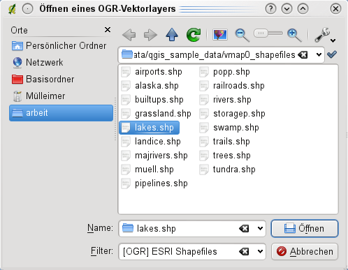

# Unterstützte Datenformate {#supported-data-formats}

KADAS verwendet die OGR-bibliothek um Vektordatenformate zu lesen und zu schreiben, einschließlich ESRI Shapedateien, MapInfo und MicroStation Dateiformate, AutoCAD DXF, PostGIS, SpatiaLite, Oracle Spatial und MSSQL Spatial Datenbanken und viele mehr. GRASS Vektor und PostgreSQL Support wird duch native Datenprovider Plugins bereitgestellt. Die Vektordaten können auch im Lesemodus aus zip- und gzip-Archiven ins KADAS geladen werden. Zum Zeitpunkt der Erstellung dieses Dokumentes werden 69 Vektorformate von der OGR-Bibliothek unterstützt (siehe OGR-SOFTWARE-SUITE in *literature\_and\_web*). Die vollständige Liste ist auf <a href="http://www.gdal.org/ogr/ogr_formats.html" class="uri" class="reference external">http://www.gdal.org/ogr/ogr_formats.html</a> zu finden.

## ESRI Shapes {#esri-shapefiles}

Die ESRI Shapedatei ist das Standard Vektorformat in QGIS und wird durch die OGR Simple Feature Library (<a href="http://www.gdal.org/ogr/" class="uri" class="reference external">http://www.gdal.org/ogr/</a> ) bereitgestellt.

Ein Shape besteht derzeit aus mehreren Dateien. Die folgenden drei sind erforderlich:

1.  `shp` Datei (enthält die Geometrien)

2.  `.dbf` Datei (enthält die Attribute im dBase-Format)

3.  `.shx` Indexdatei

Darüber hinaus kann eine Datei mit .prj Endung existieren. Diese enthält die Projektionsinformationen des Shapes. Während es sehr nützlich ist eine Projektionsdatei zu verwenden ist dies nicht zwingend erforderlich. Ein Shape-Datensatz kann zusätzliche Dateien enthalten. Details dazu finden sich in der technischen Spezifikation von ESRI unter <a href="http://www.esri.com/library/whitepapers/pdfs/shapefile.pdf" class="uri" class="reference external">http://www.esri.com/library/whitepapers/pdfs/shapefile.pdf</a>.

### Shape Layer laden {#loading-a-shapefile}

When loading a vector layer, the following dialog opens:

**Figure Vector 1:**

Vektorlayer hinzufügen Dialog 

Wählen Sie aus den möglichen Quelltypen  *Datei* und klicken Sie auf den Knopf **\[Durchsuchen\]**. Dadurch erscheint ein weiterer Dialog zum Öffnen (siehe <a href="#figure-vector-2" class="reference internal">figure_vector_2</a>) mit dem Sie im Dateisystem navigieren können und Sie ein Shape oder eine andere unterstützte Datenquelle laden können. Die Auswahlbox *Filter*  ermöglicht es Ihnen einige OGR-untersützte Dateiformate vorzuwählen.

Außerdem kann auch der Kodierungstyp für die Shapedatei eingestellt werden, falls dies notwendig ist.

**Figure Vector 2:**

Öffnen eines OGR-Vektorlayers Dialog 

Selecting a shapefile from the list and clicking **\[Open\]** loads it into KADAS.

Tipp

**Farben von Vektorlayern**

Wenn Sie einen neuen Vektorlayer in QGIS laden, werden Farben zufällig zugewiesen. Wenn Sie mehrere neue Vektorlayer laden, werden jeweils unterschiedliche Farben zugewiesen.

Nach dem Laden können Sie mit den Navigationstools aus der Werkzeugleiste beliebig zoomen. Um den Stil eines Layers zu verändern öffnen Sie den *Layereigenschaften* Dialog in dem Sie auf den Layernamen doppelklicken oder indem Sie einen Rechtsklick auf den Namen in der Legende machen und *Eigenschaften* im Popupmenu wählen. Vergleichen Sie Abschnitt *vector\_style\_tab* für weitere Informationen zum Editieren der Eigenschaften von Vektorlayern.

### Die Darstellungsgeschwindigkeit von Shapdedateien verbessern {#improving-performance-for-shapefiles}

Um die Darstellungsgeschwindigkeit zu optimieren, kann ein räumlicher Index erstellt werden. Ein räumlicher Index erhöht die Geschwindigkeit beim Zoomen und Verschieben. Räumliche Indizes haben in KADAS die Endung `.qix`.

Benutzen Sie folgende Schritte zum Erstellen eines räumlichen Index:

-   Um eine Shapedatei zu laden klicken Sie auf den  Vektorlayer\\ hinzufügen Knopf in der Werkzeugleiste oder drücken einfach `Strg+Umschalt+V`.

-   Öffnen Sie den *Eigenschaften*-Dialog des Vektorlayers, indem Sie auf den Namen des Layers in der Legende doppelklicken oder mit der rechten Maustaste *Eigenschaften* auswählen.

-   Im Menü *Allgemein* klicken Sie auf den **\[Räumlichen Index erzeugen\]** Knopf.

### Problem beim Laden eines Shapes mit .prj Datei {#problem-loading-a-shape-prj-file}

Wenn Sie eine Shapedatei mit `.prj`-Datei laden und KADAS ist nicht in der Lage, die Projektionsinformationen korrekt auszulesen, ist es notwendig das Koordinatenbezugsystem (KBS) manuell im *Allgemein* Menü des *Layereigenschaften* Dialog anhand des **\[Festlegen ...\]** Knopfs anzugeben. Hintergrund ist, dass `.prj` Dateien oftmals nicht die vollständigen Projektionsparameter enthalten, so wie KADAS sie benötigt und auch im *KBS* Dialog anzeigt.

Aus diesem Grund, wenn Sie ein neues Shapefile mit KADAS erstellen, werden derzeit zwei unterschiedliche Projektionsdateien angelegt. Eine `.prj` Datei, mit den unvollständigen Projektionsparametern, wie sie z.B. von ESRI Software gelesen und erstellt wird, und eine `.qpj` Datei, in der die vollständigen Projektionsparameter anthalten sind. Wenn Sie dann ein Shape in KADAS laden, und QGIS findet eine `.qpj` Datei, dann wird diese anstelle der `.prj` Datei benutzt.

## MapInfo Layer laden {#loading-a-mapinfo-layer}

 To load a MapInfo layer, change the file type filter *Files of type* : to ‘Mapinfo File \[OGR\] (\*.mif \*.tab \*.MIF \*.TAB)’ and select the MapInfo layer you want to load.

## ArcInfo Binary Coverage laden {#loading-an-arcinfo-binary-coverage}

 To load an ArcInfo Binary Coverage, select  *Directory* as *Source type*. Change the file type filter *Files of type*  to ‘Arc/Info Binary Coverage’. Navigate to the directory that contains the coverage file, and select it.

Auf die gleiche Art und Weise können auch andere Verzeichnis-basierte Vektorlayer geladen werden, wie etwa das U.K. National Transfer Format oder das raw TIGER Format des U.S. Census Bureau.

