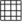

# View {#view}

## Previous/Next extent {#previous-next-extent}

After panning or zooming the map, the function *Previous Extent* allows the user to return to the previously visible map extent. Similarly the function *Next Extent* allows to move forward in the extent history.

## New map window {#new-map-window}

The *new map window* function opens up additional map views. These are automatically layed out inside the application window, but can be moved around within or outside the application window by dragging on their title bar.

The displayed layers can be toggled independently from the view window title bar. If the lock button is active, the extent of the child view will always be synchronized with the main view. If view synchronization is not enabled, the extent of the child view can be altered independently from the main view.

## 3D {#d}

The *3D* function opens an additional child window with a 3D globe view. It can be moved around within or outside the application window by dragging on their title bar.

### Settings {#settings}

The displayed layers can be toggled from the secondary view window title bar.

-   **Synchronize extent**: The button Synchronize extent synchronizes the globe viewport with the current extent of the main map view.
-   **Reload scene**: The button Reload scene triggers a refresh of all layers displayed on the globe.
-   **Globe settings**: The button Globe settings opens the globe configuration dialog.

### Navigation {#navigation}

-   **Camera position navigation**: The upper navigation wheel allows the user to modify the horizontal and vertical viewing angles of the camera.
-   **Navigation auf Globus**: The lower navigation wheel allows the user to pan around the globe. The same can be accomplished by pressing the keyboard arrows.
-   **+**: Reduces the camera height from the globe surface.
-   **-**: Increases the camera distance from the globe surface.

## Grid {#grid}

 Grid allows you to add a coordinate grid and coordinate annotations to the map canvas.

**Figure Decorations 1:**

The Grid Dialog 

1.  Select from menu *View ‣ Decorations ‣ Grid*. The dialog starts (see <a href="#figure-decorations-1" class="reference internal">figure_decorations_1</a>).
2.  Activate the  *Enable grid* checkbox and set grid definitions according to the layers loaded in the map canvas.
3.  Activate the  *Draw annotations* checkbox and set annotation definitions according to the layers loaded in the map canvas.
4.  Click **\[Apply\]** to verify that it looks as expected.
5.  Click **\[OK\]** to close the dialog.

-   [next](analysis.html "Analysis")
-   [previous](my_maps.html "My maps") |

