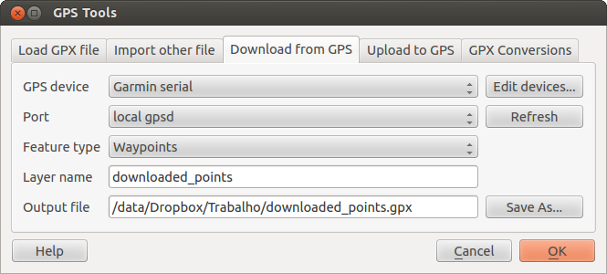

# Extension GPS {#gps-plugin}

## Qu’est ce que le GPS ? {#what-is-gps}

Le GPS, Global Positioning System, est un système basé sur des satellites qui permet à toute personne possédant un récepteur GPS d’obtenir sa position exacte n’importe où dans le monde. Il est utilisé comme aide à la navigation, par exemple pour les avions, dans les bateaux et par les voyageurs. Le récepteur GPS utilise les signaux des satellites pour calculer la latitude, la longitude et (parfois) l’élévation. La plupart des récepteurs ont également la possibilité de stocker la position (nommé **points d’intérêt** ou **waypoints**), des séquences de positions qui constituent un **itinéraire** prévu et un journal de suivi ou **track** des déplacements du récepteur en fonction du temps. Points d’intérêt, itinéraires et tracks sont les trois types d’objet basiques dans les données GPS. KADAS affiche les points d’intérêt dans des couches points tandis que les itinéraires et les tracks sont affichés dans des couches linéaires.

## Charger des données GPS à partir d’un fichier {#loading-gps-data-from-a-file}

Il y a des dizaines de formats de fichier différent pour stocker des données GPS. Le format que KADAS utilise est appelé GPX (GPS eXchange format), qui est un format d’échange standard qui peut contenir n’importe quel nombre de waypoints, itinéraires et tracks dans un même fichier.

Pour charger un fichier GPX vous devez d’abord charger l’extension : allez dans *Extension ‣*  *Installer/ Gérer les extensions* puis cochez la case  *Outils GPS*. Quand l’extension est chargée, deux boutons avec un petit périphérique GPS apparaissent dans la barre d’outils et dans *Couche ‣ Créer couche ‣* :

-    Outils\\ GPS

-    *Créer une nouvelle couche GPS*

Pour travailler sur des données GPS, nous utiliserons le fichier GPX fourni dans le jeu de données test de KADAS : `qgis_sample_data/gps/national_monuments.gpx`. Référez-vous à la section <a href="../introduction/getting_started.html#label-sampledata" class="reference internal"><em>Échantillon de données</em></a> pour plus d’informations sur le jeu de données test.

1.  Sélectionnez le menu *Vecteur ‣ GPS ‣ Outils GPS* ou cliquez sur l’icône  Outils\\ GPS dans la barre d’outils et ouvrez l’onglet *Charger un fichier GPX* (voir <a href="#figure-gps-1" class="reference internal">figure_GPS_1</a>).

2.  Naviguez vers le répertoire `qgis_sample_data/gps/`, sélectionnez le fichier `national_monuments.gpx` et cliquez sur le bouton **\[Ouvrir\]**.

**Figure GPS 1:**

La fenêtre d’*Outils GPS* 

Utilisez le bouton **\[Parcourir\]** pour sélectionner le fichier GPX, puis utilisez la case à cocher pour sélectionner les types de géométrie que vous voulez charger à partir de ce fichier GPX. Chaque type d’objet sera chargé dans une couche séparée lors du clic sur le bouton **\[OK\]**. Le fichier `national_monuments.gpx` ne contient que des waypoints.

Note

Les récepteurs GPS permettent de stocker des données dans différents systèmes de coordonnées. Lorsque vous récupérez un fichier GPX (depuis votre GPS ou un site web) et le chargez dans KADAS , assurez-vous que les données sont dans le système WGS84 (latitude/longitude). Cela correspond à la spécification officielle du format GPX et KADAS la suit. Voir <a href="http://www.topografix.com/GPX/1/1/" class="uri" class="reference external">http://www.topografix.com/GPX/1/1/</a>

## GPSBabel {#gpsbabel}

Comme KADAS ne lit que les fichiers GPS au format GPX, vous avez besoin d’un moyen pour convertir les autres formats de fichier GPS en GPX. Le logiciel libre GPSBabel le fait pour de nombreux formats. Il est disponible sur <a href="http://www.gpsbabel.org" class="uri" class="reference external">http://www.gpsbabel.org</a>. Ce programme peut aussi transférer des données GPS entre votre ordinateur et un périphérique GPS. KADAS utilise GPSBabel pour réaliser ces tâches, il est donc recommandé de l’installer. Cependant si vous voulez juste charger des données à partir de fichiers GPX vous n’en avez pas besoin. La version 1.2.3 de GPSBabel est connue pour bien fonctionner avec KADAS, mais vous pouvez devriez pouvoir utiliser des versions plus récentes sans problème.

## Importer des données GPS {#importing-gps-data}

Pour importer des données d’un fichier qui n’est pas un fichier GPX, vous devez utiliser l’outil *Importer un autre fichier* dans la fenêtre des outils GPS. Vous sélectionnez le fichier que vous voulez importer, le type de géométrie, l’emplacement où stocker le fichier GPX converti et sous quel nom l’enregistrer. Tous les formats de données GPS ne supportent pas les trois types d’entités, ne vous laissant le choix qu’entre un ou deux types.

## Télécharger des données GPS à partir d’un périphérique {#downloading-gps-data-from-a-device}

KADAS peut utiliser GPSBabel pour télécharger des données d’un périphérique GPS directement vers de nouvelles couches vecteurs. Pour cela, utilisez l’onglet *Télécharger depuis le récepteur GPS* de la fenêtre Outils GPS (voir <a href="#figure-gps-2" class="reference internal">Figure_GPS_2</a>). Vous y choisissez votre type de périphérique GPS, le port auquel il est connecté (ou USB si le GPS le permet), le type de géométrie que vous voulez télécharger, le fichier GPX où les données seront stockées et le nom de la nouvelle couche.

**Figure GPS 2:**

L’outil de téléchargement

Le type de périphérique que vous sélectionnez dans le menu périphérique GPS détermine comment GPSBabel tente de communiquer avec votre périphérique GPS. Si aucun des types ne fonctionne avec votre périphérique GPS, vous pouvez créer un nouveau type adapté (voir la section <a href="#defining-new-device" class="reference internal"><em>Définir de nouveaux types de périphériques</em></a>).

Le port peut être un nom de fichier ou n’importe quel autre nom que votre système d’exploitation utilise comme référence vers le port physique de votre ordinateur sur lequel est connecté le périphérique GPS. Cela peut aussi être de l’USB, si votre périphérique GPS fonctionne dans ce mode.

-    Sous Linux, il s’agit de quelque chose qui ressemble à `/dev/ttyS0` ou `/dev/ttyS1`.

-    Sous Windows, il s’agit de `COM1` ou `COM2`.

Quand vous cliquez sur **\[OK\]**, les données seront chargées depuis le périphérique et apparaîtront comme une nouvelle couche dans KADAS.

## Envoyer des données GPS vers un appareil {#uploading-gps-data-to-a-device}

Vous pouvez également envoyer directement vos données depuis une couche vecteur de KADAS vers un périphérique GPS en utilisant l’onglet *Uploader vers le GPS* de la fenêtre des Outils GPS. Pour cela, vous devez sélectionner la couche que vous voulez envoyer (qui doit être au format GPX), le type de votre périphérique GPS et le port (com ou USB) auquel il est connecté. De la même manière que pour l’outil de téléchargement, vous pouvez définir de nouveaux types de périphérique si le vôtre n’est pas dans la liste.

Cet outil est très utile lorsque combiné avec les capacités d’édition vectorielle de KADAS. Il permet de charger une carte, créer des points et des itinéraires, puis de les envoyer pour les utiliser dans votre périphérique GPS.

## Définir de nouveaux types de périphériques {#defining-new-device-types}

Il y a beaucoup de types différents de périphériques GPS. Les développeurs de KADAS ne peuvent pas les tester tous, si vous en avez un qui ne fonctionne pas avec un des types de périphériques dans les outils *Uploader vers le GPS* et *Télécharger depuis le récepteur GPS*, vous pouvez définir votre propre type de périphérique. Cela se fait via l’éditeur de périphérique GPS en cliquant sur le bouton **\[Éditer les périphériques\]** depuis les onglets de téléchargement et d’upload.

Pour définir un nouveau périphérique, cliquez sur le bouton **\[Nouveau\]**, entrez un nom, saisissez les commandes de téléchargement et d’envoi de données vers votre GPS et cliquez sur le bouton **\[Mise à jour\]**. Le nom sera listé dans la liste des périphériques des onglets de téléchargement et d’upload, il peut s’agir de n’importe quelle chaîne de caractère. La commande de téléchargement est la commande qui est utilisée pour récupérer les données du périphérique vers un fichier GPX. Il s’agira certainement d’une commande GPSBabel, mais vous pouvez utiliser un autre programme en ligne de commande qui crée un fichier GPX. KADAS remplacera les mots clé `%type`, `%in`, et `%out` lorsqu’il lancera la commande.

`%type` sera remplacé par `-w` si vous téléchargez des waypoints, `-r` pour des routes et `-t` pour des tracks. Ce sont des options de la ligne de commande qui précisent à GPSBabel quel type d’objet télécharger.

`%in` sera remplacé par le port que vous avez choisi dans l’onglet de téléchargement et `%out` sera remplacé par le nom choisi pour le fichier GPX dans lequel les données téléchargées doivent être stockées. Donc si vous créez un type de périphérique avec la commande de téléchargement `gpsbabel %type -i garmin -o gpx %in %out` (qui correspond à celle définie pour le type ‘Garmin serial’) et l’utilisez pour télécharger les waypoints depuis le port `/dev/ttyS0` vers le fichier `output.gpx`, KADAS remplacera les mots-clés et lancera lacommande `gpsbabel -w -i garmin -o gpx /dev/ttyS0 output.gpx`.

La commande de téléchargement est la commande qui est utilisée pour télécharger des données vers le périphérique. Les même mots-clés sont utilisés mais `%in` est maintenant remplacé par le nom du fichier GPX pour la couche qui est à uploader et `%out` est remplacé par le nom du port.

Pour en savoir plus sur GPSBabel et les options de ligne de commande disponibles, référez-vous à <a href="http://www.gpsbabel.org" class="uri" class="reference external">http://www.gpsbabel.org</a>.

Une fois le nouveau type de périphérique créé, celui-ci apparaîtra dans les listes de périphériques des outils de téléchargement et d’upload.

## Chargement de points/traces depuis un périphérique GPS {#download-of-points-tracks-from-gps-units}

Comme précisé dans les sections précédentes, QGIS utilise GPSBabel pour télécharger les points et traces directement dans le projet. QGIS est fourni avec un profil pré-défini pour charger depuis des périphériques GPS Garmin. Malheureusement il existe un <a href="http://hub.qgis.org/issues/6318" class="reference external">bug #6318</a> qui ne permet pas de créer d’autres profils, aussi le téléchargement direct dans QGIS depuis les Outils GPS est pour le moment limité aux périphériques Garmin.

### Garmin GPSMAP 60cs {#garmin-gpsmap-60cs}

**MS Windows**

Installez les drivers USB Garmin depuis <a href="http://www8.garmin.com/support/download_details.jsp?id=591" class="uri" class="reference external">http://www8.garmin.com/support/download_details.jsp?id=591</a>

Connect the unit. Open GPS Tools and use `type=garmin serial` and `port=usb:` Fill the fields *Layer name* and *Output file*. Sometimes it seems to have problems saving in a certain folder, using something like `c:\temp` usually works.

**Ubuntu/Mint GNU/Linux**

Il est d’abord nécessaire de régler un problème concernant les permissions du périphérique, comme cela est expliqué à cette adresse : <a href="https://wiki.openstreetmap.org/wiki/USB_Garmin_on_GNU/Linux" class="uri" class="reference external">https://wiki.openstreetmap.org/wiki/USB_Garmin_on_GNU/Linux</a>. Vous pouvez essayer de créer un fichier `/etc/udev/rules.d/51-garmin.rules` contenant cette règle

    ATTRS{idVendor}=="091e", ATTRS{idProduct}=="0003", MODE="666"

Après cela il est nécessaire de s’assurer que le module du noyau `garmin_gps` n’est pas chargé

    rmmod garmin_gps

vous pouvez alors utiliser les Outils GPS. Malheureusement il semble y avoir un <a href="http://hub.qgis.org/issues/7182" class="reference external">bug #7182</a> et généralement QGIS se bloque plusieurs fois avant que l’opération ne réussisse.

### BTGP-38KM datalogger (seulement Bluetooth) {#btgp-38km-datalogger-only-bluetooth}

**MS Windows**

Un bug connu ne permet pas de télécharger les données depuis QGIS, aussi il est nécessaire d’utiliser GPSBabel depuis la ligne de commande ou à travers son interface dédiée. La commande qui fonctionne est

    gpsbabel -t -i skytraq,baud=9600,initbaud=9600 -f COM9 -o gpx -F C:/GPX/aaa.gpx

**Ubuntu/Mint GNU/Linux**

Avec Windows, utilisez la même commande (ou les mêmes paramètres si vous utilisez l’interface de GPSBabel). Sous Linux il est possible que vous obteniez un message du genre

    skytraq: Too many read errors on serial port

vous pouvez tenter d’allumer et d’éteindre le datalogger avant de réessayer.

### BlueMax GPS-4044 datalogger (BT et USB) {#bluemax-gps-4044-datalogger-both-bt-and-usb}

**MS Windows**

Note

Il est nécessaire d’installer ses drivers avant l’utilisation dans Windows 7. Voir le site du fabricant pour le téléchargement des drivers.

Télécharger avec GPSBabel, aussi bien en USB ou BT retourne toujours une erreur du genre

    gpsbabel -t -i mtk -f COM12 -o gpx -F C:/temp/test.gpx
    mtk_logger: Can't create temporary file data.bin
    Error running gpsbabel: Process exited unsucessfully with code 1

**Ubuntu/Mint GNU/Linux**

**Avec USB**

Après avoir connecté le cable, utilisez la commande `dmesg` pour afficher le port qui est utilisé, par exemple `/dev/ttyACM3`. Ensuite utilisez GPSBabel comme d’habitude depuis la ligne de commande ou son interface dédiée.

    gpsbabel -t -i mtk -f /dev/ttyACM3 -o gpx -F /home/user/bluemax.gpx

**Avec Bluetooth**

Utilisez le gestionnaire de périphériques Blueman (Blueman Device Manager) pour associer le périphérique et le rendre accessible à travers un port du système, puis lancez GPSBabel

    gpsbabel -t -i mtk -f /dev/rfcomm0 -o gpx -F /home/user/bluemax_bt.gpx

