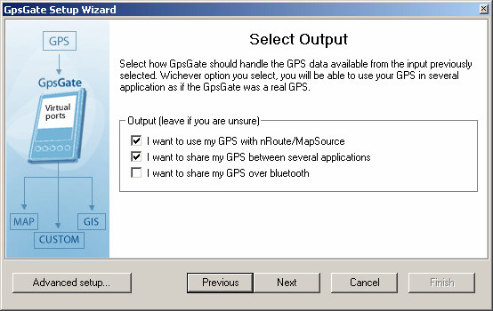
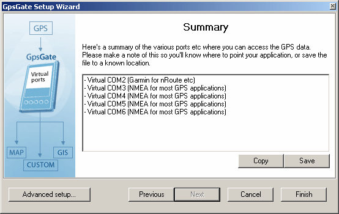

# GpsGate {#gpsgate}

## Run GpsGate {#run-gpsgate}

You can launch GpsGate under “Start-&gt;Programs-&gt;KADAS-&gt;GpsGate”.

The first time GpsGate is run a setup Wizard will start. The Wizard will help you to find your GPS and tell you how to connect your GPS applications to GpsGate.

## Running the setup Wizard {#running-the-setup-wizard}

Make sure you turn your GPS on, and connect it to your computer, if it is a wireless Bluetooth GPS simply turn it on. To speed up the search you can uncheck the types of GPS receivers you do not want to search for. If you are unsure, keep all options checked. After this is done, click “Next” and the Wizard will scan your computer for a connected GPS.

If you are an advanced user, click “Advanced setup…” for a setup process where you have complete control. You can always run the Wizard again from the Settings Dialog.

Click Next. The Wizard will now start searching for a GPS. This can take some time.

When the Wizard finds a GPS, a message dialog is displayed. Click “Yes” to accept the found GPS as input. If you have several GPS receivers connected, click “No” until GpsGate finds the receiver you want to use.

If GpsGate won’t find your GPS, you need to use “Advanced Setup…”

Select Output and click “Next”. If you are unsure, simply click “Next”.

The next screen displays a summary. It is importaint to save this summary. You can save it to a file and print it. You can also find the this information later in the Settings dialog (from the Tray menu).

You connect Garmin applications like nRoute to the first port in the list, and other NMEA applications to the remaining ports. You can only connect one application to one port at a time. If you need to create more ports you can do that from the Settings Dialog at any time.

Now you can start your GPS applications and connect them to the ports created by GpsGate in the last step above. You can run all the GPS applications at the same time!

When GpsGate is running it is displayed as a Tray Icon. By clicking on this icon you can access its functions.

You can re-run the Wizard at any time by selecting clicking “Setup Wizard..” in the Settings dialog. Tray icon colors and shapes

The tray icon always indicates the status of GpsGate. Here is a list of the possible displayed tray icons:

No GPS or NMEA data is detected by GpsGate.

Valid GPS data has been detected at the selected input, but the GPS data has no fix, that is it cannot determine its position (yet).

A valid GPS position (fix) has been detected at the selected input.

If the tray icon is not green your GPS application will not display/use a correct position.

