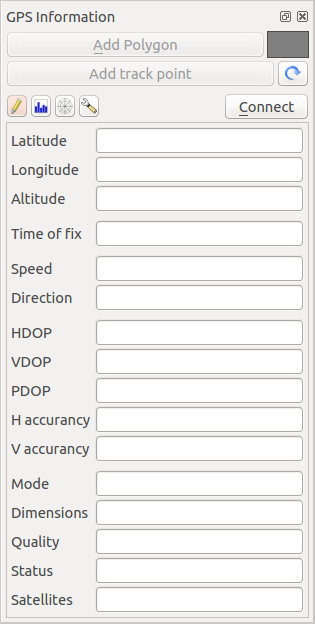
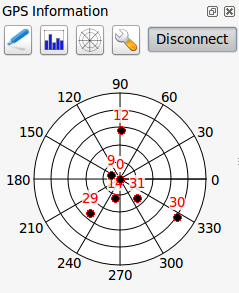

# Suivi GPS en direct {#live-gps-tracking}

Pour activer le suivi GPS en direct dans KADAS, sélectionnez le menu *Vue ‣Panneaux*  *Information GPS*. Une nouvelle fenêtre sera ancrée à gauche de la carte.

Cette fenêtre propose quatre écrans différents :

-    Coordonnées de la position GPS et saisie manuelle de sommets et d’entités

-    Force des signaux GPS des satellites connectés

-    Graphe polaire montrant le numéro et la position des satellites

-    Écran des options GPS (voir <a href="#figure-gps-options" class="reference internal">figure_gps_options</a>)

Avec un récepteur GPS connecté (il doit être compatible avec votre système d’exploitation), un simple clic sur **\[Connexion\]** connecte le GPS à KADAS. Un second clic (maintenant sur **\[Déconnexion\]**), déconnecte le récepteur de l’ordinateur. Sous GNU/Linux, le support gpsd est intégré afin de gérer la connexion de la majorité des récepteurs GPS. De ce fait, vous devez préalablement configurer gpsd pour se connecter correctement à KADAS.

Warning

Si vous désirez enregistrer votre position sur la carte, vous devez au préalable, créer une nouvelle couche et la passer en mode édition.

## Coordonnées de la position {#position-and-additional-attributes}

 Si le GPS reçoit les signaux d’un nombre suffisant de satellites, vous verrez votre position exprimée en latitude, longitude et élévation ainsi que d’autres attributs.

**Figure GPS Position:**

Coordonnées de la position GPS et autres attributs 

## Force du signal GPS {#gps-signal-strength}

 Cet écran affiche la force des signaux GPS des satellites connectés sous forme de barres.

**Figure GPS Strength:**

Force du signal GPS 

## Graphe polaire {#gps-polar-window}

 Si vous voulez connaître la position des satellites connectés, vous devez passer à l’écran du graphe polaire. Vous y voyez également les identifiants ID des satellites dont vous recevez un signal.

**Figure GPS polar window:**

Graphe polaire GPS 

## Configuration GPS {#gps-options}

 Si vous avez des problèmes de connexion, vous pouvez tester :

-    *Autodétecter*

-    *Interne*

-    *Port Série*

-    *gpsd* (en indiquant l’Hôte, le Port et le Périphérique auquel le GPS est connecté)

Cliquez à nouveau sur **\[Connecter\]** pour réinitialiser la connexion avec le récepteur GPS.

**Figure GPS Tracking 2:**

Configuration du suivi GPS

Vous pouvez activer  *Enregistrer automatiquement chaque entité ajoutée* lorsque vous êtes en mode édition. Ou vous pouvez activer  *Ajouter automatiquement des points* en choisissant la largeur et la couleur.

En activant  *Curseur*, utilisez le curseur  pour augmenter ou diminuer la taille du curseur marquant la position du GPS sur la carte.

 *Centrer la carte* vous permet de choisir comment mettre à jour l’emprise de la carte. Par exemple ‘toujours’ ou ‘lorsque l’on sort’, si les coordonnées enregistrées commencent à sortir de la carte, ou encore ‘jamais’.

Enfin, vous pouvez activer le  *Fichier journal* et définir un fichier pour enregistrer les messages du suivi GPS.

Si vous voulez enregistrer une entité manuellement, vous devez retourner à l’écran  Coordonnées\\ de\\ la\\ position et cliquer sur **\[Ajouter des entités\]** ou **\[Ajouter un point de tracé\]**.

## Connexion à un GPS Bluetooth pour le suivi en direct {#connect-to-a-bluetooth-gps-for-live-tracking}

Avec QGIS, vous pouvez vous connecter à une GPS Bluetooth pour la récupération de données terrain. Pour réaliser cette tâhce, voux aurez besoin d’un GPS Bluetooth et d’un récepteur Bluetooth sur votre ordinateur.

Au démarrage, vous devez faire en sorte que votre GPS soit reconnue et appairé avec votre ordinateur. Allumez le GPS, allez dans l’icône Bluetooth de votre barre de notification et rechercher un Nouveau Périphérique.

Sur le côté droit du masque de sélection des périphériques, assurez-vous que tous les périphériques sont sélectionnés pour garantir que votre unité GPS apparaissent dans cette sélection. Dans la prochaine étape, un service de connexion série devrait être disponible. Sélectionnez-le et cliquez sur le bouton **\[Configurer\]**.

Retenez le numéro du port COM affecté à la connexion GPS dans les propriétés Bluetooth.

Une fois que le GPS a été reconnu, faîtes l’appariement avec la connexion. Généralement, le code d’autorisation est `0000`.

Maintenant, ouvrez le panneau *Information GPS* et basculez  dans l’écran des options GPS. Sélectionnez le port COM de la connexion GPS et cliquez sur le bouton **\[Connect\]**. Après un moment, un curseur indiquant votre position doit apparaître.

Si QGIS ne peut recevoir de données GPS, vous devriez alors redémarrer votre GPS, attendre 5-10 secondes et réessayer de le connecter. Généralement, celle solution fonctionne. Si vous avez de nouveau une erreur de connexion, assurez-vous que vous n’avez pas un autre capteur Bluetooth à proximité, apparairé avec le GPS.

## Utiliser un Garmin GPSMAP 60cs {#using-gpsmap-60cs}

### MS Windows {#ms-windows}

Le moyen le plus facile pour le faire fonctionner est d’utiliser un logiciel intermédiaire (en freeware mais pas libre) appelé <a href="http://update.gpsgate.com/install/GpsGateClient.exe" class="reference external">GPSGate</a>.

Lancez le programme, faîtes-le rechercher les périphériques GPS (fonctionne pour les GPS USB et Bluetooth) et sous QGIS, cliquez sur **\[Connecter\]** dans le panneau de suivi en direct en utilisant le mode  *Auto-détection*.

### Ubuntu/Mint GNU/Linux {#ubuntu-mint-gnu-linux}

Comme pour Windows le plus simple est d’utiliser un serveur intermédiaire, dans ce cas GPSD, donc

    sudo apt-get install gpsd

Vous pouvez alors charger le module du noyau `garmin_gps`

    sudo modprobe garmin_gps

Connectez ensuite l’unité. Vérifiez avec `dmesg` que le périphérique utilisé par l’unité, par exemple `/dev/ttyUSB0`. Maintenant, vous pouvez lancer qpsd.

    gpsd /dev/ttyUSB0

Connectez enfin avec l’outil de suivi en direct de QGIS.

## Utiliser BTGP-38KM datalogger (seulement Bluetooth) {#using-btgp-38km-datalogger-only-bluetooth}

Utiliser GPSD (sous GNU/Linux) ou GPSGate (sous Windows) est très facile.

## Utiliser BlueMax GPS-4044 datalogger (BT et USB) {#using-bluemax-gps-4044-datalogger-both-bt-and-usb}

### MS Windows {#id1}

Le suivi en direct fonctionne pour les modes USB et BT en utilisant GPSGate ou même sans lui. Utilisez le mode  *Auto-détection* ou pointez l’outil dans le bon port.

### Ubuntu/Mint GNU/Linux {#id2}

**Via USB**

Le suivi en direct fonctionne avec les deux sous GPSD.

    gpsd /dev/ttyACM3

ou sans lui en connectant l’outil de suivi en direct de QGIS directement au périphérique (par exemple `/dev/ttyACM3`).

**Via Bluetooth**

Le suivi en direct fonctionne avec les deux sous GPSD.

    gpsd /dev/rfcomm0

ou sans lui en connectant l’outil de suivi en direct de QGIS directement au périphérique (par exemple `/dev/rfcomm0`).

