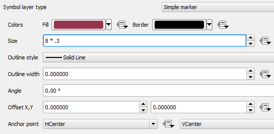
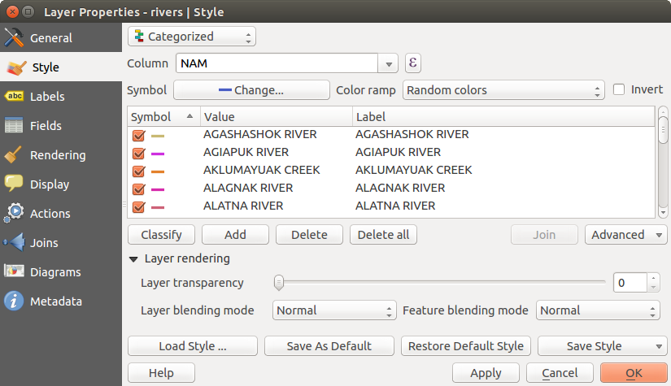
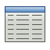

# Fenêtre Propriétés d’une couche vecteur {#the-vector-properties-dialog}

La fenêtre *Propriétés de la couche* pour une couche vectorielle fournit des informations sur la couche, les paramètres de représentation et les options d’étiquetage. Si votre couche a été chargée depuis une base PostgreSQL/PostGIS, vous pouvez également modifier la requête SQL d’appel de la couche, en l’éditant dans la fenêtre *Constructeur de requête* de l’onglet *Général*. Pour accéder à la fenêtre *Propriétés de la couche*, double-cliquez sur la couche dans la légende ou faites un clic droit sur la couche et sélectionnez *Propriétés* dans le menu qui apparait.

**Figure Vector Properties 1:**

Fenêtre de Propriétés d’une couche vecteur 

## Onglet Style {#style-menu}

The Style menu provides you with a comprehensive tool for rendering and symbolizing your vector data. You can use *Layer rendering ‣* tools that are common to all vector data, as well as special symbolizing tools that were designed for the different kinds of vector data.

### Modes de rendu {#renderers}

Le moteur de rendu est chargé de dessiner une entité avec son symbole correct. Il existe quatre types de moteurs de rendu : symbole unique, catégorisé, gradué et basé sur des règles. Il n’y a pas de rendu de couleur continue, car il s’agit en fait d’un cas particulier du rendu gradué. Les moteurs de rendu classés et gradués peuvent être créés en spécifiant un symbole et une rampe de couleur - ils définissent les couleurs pour les symboles de manière appropriée. Pour les couches de points, il y a un moteur de rendu par déplacement de point disponible. Pour chaque type de données (points, lignes et polygones), des types de couches de symboles vectoriels sont disponibles. Selon le moteur de rendu choisi, l’onglet *Style* fournit différentes sections supplémentaires. Dans la fenêtre de symbologie, il y a un bouton **\[Ouvrir la bibliothèque\]** qui donne accès au Gestionnaire de Symboles (voir *vector\_style\_manager*). Le Gestionnaire de Symboles vous permet de modifier et de supprimer des symboles existants et d’en ajouter de nouveaux.

Après toutes modifications, le symbole peut-être ajouté à la liste courante des symboles disponibles (via le bouton **\[Enregistrer\]**), et pourra donc être facilement réutilisé. De plus, vous pouvez utiliser le bouton **\[Style –&gt; Enregistrer le style\]** pour sauvegarder le style en .qml (fichier de style de couche QGIS) ou au format SLD (.sld). Les SLD peuvent être exportés depuis n’importe quel style de rendu – symbole simple, catégories, gradués, basés sur des règles – mais lors de l’import d’un SLD, un rendu du type symbole simple ou basé sur des règles est créé. Cela signifie que les catégories ou symboles gradués sont convertis en ensemble de règles. Si vous voulez préserver ce type de rendu, vous devez utiliser le format QML. D’un autre coté, cela peut être parfois très pratique d’avoir la possibilité de simplement convertir des styles en ensemble de règles.

Si, en travaillant sur le style d’une couche vectorielle, vous changez de mode de rendu, les changements effectués sur le symbole sont mémorisés. Notez que cela ne fonctionne qu’une seule fois. Si vous changez à nouveau de mode de rendu, les paramètres seront perdus.

Si la source d’une couche est une base de données (PostGIS ou Spatialite par exemple), vous pouvez sauvegarder le style de la couche dans une table de la base de données. Cliquez simplement sur la liste déroulante *Enregistrer le style* et choisissez **Enregistrer dans la base de données**. Renseignez ensuite dans la fenêtre le nom du style, sa description, un fichier ui et s’il s’agit du style par défaut. En ouvrant une couche issue d’une base de données, si un style a été défini pour cette couche, KADAS le chargera automatiquement. Vous pouvez ajouter plusieurs styles dans la base de données. Un seul pourra être le style par défaut.

**Figure Vector Properties 2:**

Fenêtre d’enregistrement d’un style dans une base de données 

Astuce

**Sélectionner et modifier plusieurs symboles**

Il est possible de sélectionner plusieurs symboles, de faire un clic-droit dessus et de changer en une seule opération leur couleur, leur transparence, leur taille ou leur épaisseur.

**Symboles uniques**

Le mode de rendu en symbole unique est utilisé pour représenter toutes les entités de la couche de la même façon, définie par l’utilisateur. Les propriétés, qui peuvent être ajustées dans l’onglet *Style*, dépendent du type de géométrie de la couche, mais partagent une structure similaire. En haut à gauche figure un aperçu du symbole tel qu’il apparaîtra. A droite est affichée la liste des symboles déjà existants pour le style courant, prêts à être sélectionnés d’un simple clic. Le symbole courant peut être modifié en utilisant les outils à droite de l’aperçu.

Si vous cliquez sur le premier niveau de la liste des *Couches de symbole*, sur la gauche, il est possible de choisir un certain nombre de paramètres basiques comme la *Taille*, la *Transparence*, la *Couleur* ou l’angle de *Rotation*. Ces paramètres s’appliquent à toutes les couches de symboles.

**Figure Symbology 3:**

Propriétés “Symbole Unique” de ligne 

Dans chaque zone de sélection numérique de cette boîte de dialogue vous pouvez taper des expressions. Par exemple, vous pouvez faire des calculs mathématiques simples comme multiplier la taille actuelle d’un point pas 3 sans avoir recours à une calculette.

**Figure Symbology 4:**

Expression dans le champ Taille 

Si vous cliquez sur le deuxième niveau dans la boîte de dialogue *Symbol layers* il est possible d’avoir presque tous les paramètres ‘Définis par les données’. Lorsqu’une couleur est définie par les données on peut lier la couleur à un champ ‘calculé’. Une fonctionnalité de commentaires est insérée ci-dessous.

    /* This expression will return a color code depending on the field value.
     * Negative value: red
     * 0 value: yellow
     * Positive value: green
     */
    CASE
      WHEN value < 0 THEN '#DC143C' -- Negative value: red
      WHEN value = 0 THEN '#CCCC00' -- Value 0: yellow
      ELSE '#228B22'                -- Positive value: green
    END

**Figure Symbology 5:**

Symbole défini par les données via le menu Édition...

**Symboles catégorisés**

Le rendu Catégorisé est utilisé pour représenter toutes les entités d’une couche classées par catégorie qui dépend d’un des attributs de l’entité. L’onglet *Style* permet de sélectionner :

-   L’attribut (en utilisant la liste déroulante de Colonne ou la fonction  *Définir une expression de colonne* voir <a href="expression.html#vector-expressions" class="reference internal"><em>Expressions</em></a>)

-   le symbole (en utilisant la fenêtre de Sélection de symbole)

-   Les couleurs (en utilisant la liste de palettes de couleur)

Cliquez ensuite sur le bouton **Classer** pour générer les classes pour toutes les valeurs différentes trouvées dans le champ de la table attributaire. Chaque classe peut être désactivée en décochant la case située à gauche du symbole de classe.

Vous pouvez changer le symbole, la valeur et / ou la légende en double-cliquant sur l’élément à modifier.

Un clic-droit vous propose de **Copier / Coller**, **Modifier la couleur**, **Modifier la transparence**, **Modifier l’unité de sortie** ou **Modifier la taille**.

Le bouton **\[Avancé\]** dans le coin inférieur droit de la fenêtre vous permet de choisir un champ pour faire varier l’angle de rotation et la taille des symboles. Tous les champs de la couche sont alors disponibles, même s’ils ne sont pas utilisés pour le rendu par catégorie.

L’exemple de la figure <a href="#figure-symbology-6" class="reference internal">figure_symbology_6</a> montre le rendu des catégories de la couche des rivières de l’échantillon de données de KADAS.

**Figure Symbology 6:**

Options du mode de rendu Catégorisé 

**Symboles gradués**

Le rendu gradué est utilisé pour afficher toutes les entités d’une couche, en utilisant un symbole de couche défini par l’utilisateur dont la couleur reflètera la plage d’appartenance d’une valeur d’un attribut.

**Figure Symbology 7:**

Options du mode de rendu Gradué 

De la même manière que le rendu catégorisé, le rendu Gradué permet de faire varier l’angle de rotation et la taille des symboles selon les valeurs des champs spécifiés.

De la même façon que le rendu Catégorisé, l’onglet *Style* vous permet de modifier les points suivants :

-   L’attribut (en utilisant la liste déroulante de Colonne ou la fonction  *Définir une expression de colonne*, voir <a href="expression.html#vector-expressions" class="reference internal"><em>Expressions</em></a>)

-   Le symbole (en utilisant le bouton Changer)

-   Les couleurs (en utilisant la liste des palettes de couleur)

De plus, vous pouvez choisir le nombre de classes et la méthode de classification (depuis la liste déroulante Mode). Les modes disponibles sont :

-   Intervalles égaux : toutes les classes sont de même taille (par exemple, avec des valeurs allant de 0 à 16 et 4 classes, chaque classe aura une taille de 4);

-   Quantile : toutes les classes auront le même effectif (même principe que pour les boîtes à moustache);

-   Ruptures naturelles (Jenks) : la variance de chaque classe est minimale tandis que la variance entre les différentes classes est maximale;

-   Écart-type : les classes sont construites en fonction le l’écart-type calculé sur l’ensemble des valeurs;

-   Jolies ruptures : même principe que pour les intervalles égaux mais les limites de classe sont des entiers.

La zone de liste dans la partie centrale du menu *Style* répertorie les classes ainsi que leurs étendues, étiquettes et symboles de rendu.

Cliquez sur le bouton **Classer** pour générer les classes selon le mode choisi. Chaque classe peut être désactivée en décochant la case située à gauche du symbole de classe.

Vous pouvez changer le symbole, la valeur et / ou la légende en double-cliquant sur l’élément à modifier.

Un clic-droit vous propose de **Copier / Coller**, **Modifier la couleur**, **Modifier la transparence**, **Modifier l’unité de sortie** ou **Modifier la taille**.

L’exemple de la figure <a href="#figure-symbology-7" class="reference internal">figure_symbology_7</a> montre le rendu gradué de la couche des rivières de l’échantillon de données de KADAS.

Astuce

**Cartes thématiques utilisant une expression**

Les cartes thématiques faites avec le rendu Catégorisé ou Gradué peuvent désormais être créées en utilisant le résultat d’une expression. Dans la fenêtre Propriétés des couches vectorielles, le sélecteur de colonne accueille une fonction  *Définir une expression* de colonne. Alors maintenant, vous n’avez plus besoin d’écrire l’attribut de la classification dans une nouvelle colonne de votre table si vous souhaitez que l’attribut de classification soit un composite de plusieurs champs, ou une formule quelconque.

**Rendu basé sur un ensemble de règles**

Ce moteur de rendu est utilisé pour afficher toutes les entités d’une couche en utilisant un ensemble de règles prédéfinies dont la couleur reflète la manière dont une entité a été classée en fonction de ses attributs. Les règles sont définies par des expressions SQL. La fenêtre permet de regrouper les règles par type de filtre ou échelle de validité. Vous pouvez activer le rendu selon les niveaux de symboles ou arrêter le rendu à la première règle validée pour chaque entité.

L’exemple de la figure <a href="#figure-symbology-8" class="reference internal">figure_symbology_8</a> montre le rendu basé sur des règles pour la couche des rivières de l’échantillon de données de KADAS.

To create a rule, activate an existing row by double-clicking on it, or click on ‘+’ and click on the new rule. In the *Rule properties* dialog, you can define a label for the rule. Press the  button to open the expression string builder. In the **Function List**, click on *Fields and Values* to view all attributes of the attribute table to be searched. To add an attribute to the field calculator **Expression** field, double click its name in the *Fields and Values* list. Generally, you can use the various fields, values and functions to construct the calculation expression, or you can just type it into the box (see <a href="expression.html#vector-expressions" class="reference internal"><em>Expressions</em></a>). You can create a new rule by copying and pasting an existing rule with the right mouse button. You can also use the ‘ELSE’ rule that will be run if none of the other rules on that level match. The rules appear in a tree hierarchy in the map legend. Just double-klick the rules in the map legend and the Style menu of the layer properties appears showing the rule that is the background for the symbol in the tree.

**Figure Symbology 8:**

Options du mode de rendu par Ensemble de Règles 

**Déplacement de point**

Le rendu de Déplacement de point permet une visualisation de tous les points d’une couche, même si ceux-ci se superposent. Pour se faire, les symboles des points sont répartis en cercle autour d’un symbole central.

**Figure Symbology 9:**

Fenêtre Déplacement de points 

Astuce

**Exporter le style d’une couche vecteur**

You have the option to export vector symbology from KADAS into Google \*.kml, \*.dxf and MapInfo \*.tab files. Just open the right mouse menu of the layer and click on *Save selection as ‣* to specify the name of the output file and its format. In the dialog, use the *Symbology export* menu to save the symbology either as *Feature symbology ‣* or as *Symbol layer symbology ‣*. If you have used symbol layers, it is recommended to use the second setting.

**Polygones inversés**

Le rendu en polygones inversés permet de définir un symbole à appliquer à l’extérieur des polygones de la couche. Vous pouvez alors choisir parmi des sous-mode de rendu. Il s’agit des mêmes que les principaux modes.

**Figure Symbology 10:**

Fenêtre du mode de rendu en Polygones Inversés 

Astuce

**Basculer rapidement entre styles**

Lorsque vous avez créé un des styles mentionnés ci-dessus vous pouvez faire un clic droit sur la couche et sélectionner *Styles ‣ Ajouter* pour sauver votre style. Vous pouvez maintenant basculer rapidement entre les styles que vous avez créés en utilisant de nouveau le menu *Styles ‣*.

**Carte de chaleur**

Avec le rendu de Carte de chaleur vous pouvez créer des cartes de chaleur en temps réel et dynamiques pour des couches (multi-)points. Vous pouvez définir le rayon de la carte de chaleur en pixels, mm ou unités cartographiques, choisir une rampe de couleur pour le style de carte de chaleur et utiliser une jauge pour choisir entre la vitesse du rendu et la qualité. Lorsque une entité est ajoutée ou retirée le rendu de carte de chaleur met automatiquement à jour le style de carte de chaleur.

### Sélecteur de Couleur {#color-picker}

Indépendamment du type de style utilisé, la fenêtre *Sélectionner la couleur* s’affiche dès que vous cliquez pour modifier une couleur - de bordure ou de remplissage. Quatre onglets vous permettent de sélectionner une couleur via une  Palette\\ de\\ couleur, une  Roue\\ chromatique, des  Aplats\\ de\\ couleur ou un  Sélecteur\\ de\\ couleur.

Quelle que soit la méthode de sélection, la couleur est toujours décrite en valeurs TSV (Teinte, Saturation, Valeur) et RVB (Rouge, Vert, Bleu). Il y a également la valeur d’*Opacité* pour régler le niveau de transparence. En bas à gauche de la fenêtre s’affiche la comparaison entre la couleur *Actuelle* et l’*Ancienne*. En bas à droite, vous avez la possibilité d’ajouter la couleur sélectionnée à un bouton de couleur.

**Figure color picker 1:**

Onglet Palette de Couleur de la fenêtre de Sélectionner la couleur 

Avec la  Palette\\ de\\ couleur ou la  Roue\\ chromatique, vous parcourez toutes les combinaisons de couleurs possibles. Il y a cependant d’autres possibilités. En utilisant les Aplats de couleur , vous pouvez choisir à partir d’une liste prédéfinie. Cette liste correspond aux *Couleurs récentes*, aux *Couleurs standards* et aux *Couleurs du projet*.

**Figure color picker 2:**

Onglet Aplats de couleur de la fenêtre Sélectionner la couleur 

Une autre possibilité est d’utiliser le  Sélecteur\\ de\\ couleur qui permet d’échantillonner une couleur directement avec le pointeur de la souris depuis n’importe quelle partie de l’interface de QGIS et depuis une autre application en appuyant sur la barre espace. Cet outil dépend du système d’exploitation et n’est pas fonctionnel pour le moment sur OSX.

Astuce

**Raccourci pour la sélection de couleur + copier/coller des couleurs**

Vous pouvez rapidement choisir une *Couleur récente*, une *Couleur standard* ou simplement *copier* / *coller* une couleur en cliquant sur la flèche située à droite du bouton qui affiche la couleur.

**Figure color picker 3:**

Raccourci pour la sélection de couleur 

### Rendu de couche {#layer-rendering}

-   *Transparence de la couche*  : permet de rendre visible les couches situées en dessous. Utiliser le curseur pour adapter la visibilité de la couche vectorielle à vos besoins. Vous pouvez également définir directement le pourcentage de transparence dans la zone de texte située à côté.

<!-- -->

-   *Layer blending mode* and *Feature blending mode*: You can achieve special rendering effects with these tools that you may previously only know from graphics programs. The pixels of your overlaying and underlaying layers are mixed through the settings described below.
    -   Normal : il s’agit du mode de fusion standard qui utilise la valeur de transparence (canal alpha) du pixel supérieur pour le fusionner avec le pixel sous-jacent, les couleurs ne sont pas mélangées.

    -   Eclaircir : Sélectionne le maximum entre chaque composante depuis les pixels du premier-plan et de l’arrière-plan. Soyez attentif au fait que le résultat obtenu peut présenter un aspect dur et crénelé.

    -   Filtrer : Les pixels lumineux de la source sont affichés par dessus la destination, alors que les pixels sombres ne le sont pas. Ce mode est utile pour mélanger la texture d’une couche avec une autre (c’est-à-dire que vous pouvez utiliser un relief ombré pour texturer une autre couche).

    -   Eviter : Ce mode va éclaircir et saturer les pixels sous-jacents en se basant sur la luminosité du pixel au-dessus. La brillance des pixels supérieurs va donc provoquer une augmentation de la saturation et de la brillance des pixels inférieurs. Cela fonctionne mieux si les pixels supérieurs ne sont pas lumineux, sinon l’effet sera trop prononcé.

    -   Addition : Ce mode de fusion ajoute simplement les valeurs de pixels d’une couche avec une autre. Dans le cas de valeurs obtenues au-dessus de un (en ce qui concerne le RVB), du blanc sera affiché. Ce mode est approprié pour mettre en évidence des entités.

    -   Assombrir : Ce mode créé un pixel résultant qui conserve le plus petit composant parmi les pixels du premier-plan et de l’arrière-plan. Comme avec le mode éclaircir, le résultat peut présenter un aspect dur et crénelé.

    -   Multiplier : Dans ce cas, les valeurs pour chaque pixel de la couche supérieure sont multipliées par celles des pixels correspondants de la couche inférieure. Les images obtenues sont plus sombres.

    -   Découper : Les couleur sombres de la couche supérieure provoquent un obscurcissement des couches inférieures. Découper peut être utilisé pour ajuster et teinter les couches inférieures.

    -   Revêtement : Ce mode combine les modes multiplier et filtrer. Dans l’image résultante, les parties lumineuses deviennent plus lumineuses et les parties sombres plus sombres.

    -   Lumière douce : Ce mode est très similaire au mode revêtement, mais au lieu d’utiliser multiplier/filtrer il utilise découper/éviter. Il est censé émuler une lumière douce rayonnante dans l’image.

    -   Lumière dure : Ce mode est lui aussi très similaire au mode revêtement. Il est censé émuler une lumière très intense projetée dans l’image.

    -   Différencier : Ce mode soustrait le pixel supérieur au pixel inférieur et vice-versa, de façon à toujours obtenir une valeur positive. Le mélange avec du noir ne produit aucun changement, étant donné que toutes les couleurs sont nulles.

    -   Soutraire : Ce mode soustrait les valeurs de pixel d’une couche avec une autre. En cas de valeurs négatives obtenues, du noir est affiché.

## Onglet Étiquettes {#labels-menu}

Le moteur d’ Étiquettes fournit un système d’étiquetage intelligent pour les couches de points, lignes et polygones et ne nécessite que peu de paramètres. Ce nouveau système gère les couches reprojetées à la volée. Les fonctionnalités principales ont été re-designées et KADAS en propose de nouvelles qui améliorent l’étiquetage. Les menus suivants ont été créés pour les couches vectorielles :

-   Texte

-   Formatage

-   Tampon

-   Fond

-   Ombre

-   Emplacement

-   Rendu

Voyons ce que l’on peut faire avec les nouveaux onglets pour chaque type de couche.

**Étiqueter une couche de points**

Lancez KADAS et chargez une couche vectorielle de points. Sélectionnez la couche dans la légende et cliquez sur le bouton  Paramètres\\ d’étiquetage\\ de\\ la\\ couche de la barre d’outils KADAS.

La première étape consiste à cocher la case  *Étiqueter cette couche avec* et à sélectionner un champ attributaire à utiliser pour l’étiquette. Cliquez sur  si vous souhaitez définir les étiquettes en vous basant sur des expressions. Voir <a href="#labeling-with-expressions" class="reference internal">labeling_with_expressions</a>.

Les étapes présentées ci-dessous décrivent un étiquetage simple, sans utilisation des fonctions de *Valeurs définies par les données*, situées à droite des paramètres à définir.

Vous pouvez définir le style du texte dans le menu *Texte* (voir <a href="#figure-labels-1" class="reference internal">Figure_labels_1</a> ). Utilisez l’option *Casse* pour influencer le rendu du texte. Vous avez la possibilité d’afficher le texte ‘Tout en majuscules’, ‘Tout en minuscules’ ou ‘Premières lettres en majuscules’. Utilisez le mode de fusion pour créer des effets bien connus des logiciels de graphisme (voir <a href="#blend-modes" class="reference internal">blend_modes</a>).

Dans le menu *Formatage*, vous pouvez définir un caractère de retour à la ligne afin de découper l’étiquette sur de multiples lignes. Utilisez l’option  *Nombres formatés* pour formater les valeurs numériques de la table attributaire. Les chiffres après la virgule sont insérés. L’activation de cette option ajoute par défaut trois chiffres après la virgule.

Pour créer un tampon, cochez simplement la case  *Afficher un tampon* depuis le menu *Tampon*. La couleur du tampon est personnalisable. Vous pouvez également appliquer un mode de fusion (voir <a href="#blend-modes" class="reference internal">blend_modes</a>).

Si la case à cocher *Colorier le remplissage du tampon* est activé, il va interagir avec le texte partiellement transparent et donner des résultats mitigés en matière de transparence de la couleur. La désactivation du remplissage du tampon corrige ce problème (sauf là où l’aspect intérieur du contour du tampon intersecte avec le texte de remplissage) et permet également de faire du texte encadré.

Dans le menu *Fond*, vous pouvez définir la forme de votre arrière-plan avec *Taille X* et *Taille Y*. Utilisez *Taille selon* pour ajouter une zone de ‘Tampon’ à votre arrière-plan. La taille du tampon est définie par défaut ici. Le fond est alors constitué de la zone tampon et du fond défini par les valeurs *Taille X* et *Taille Y*. Vous pouvez aussi définir une *Rotation* correspondant à ‘Angle de l’étiquette’, ‘Angle par rapport à l’étiquette’ ou encore ‘Valeurs fixes’. Définissez un *Décalage X,Y* avec les valeurs X et Y et le fond sera déplacé. En appliquant *Angles arrondis X,Y*, l’arrière-plan s’arrondit aux angles. Il est également possible de fusionner le fond avec les couches sous-jacentes dans la fenêtre de carte en utilisant le *Mode de fusion* (voir <a href="#blend-modes" class="reference internal">blend_modes</a>).

Utilisez le menu *Ombre* pour une *Ombre portée* définie par l’utilisateur. Le dessin de l’arrière-plan est très variable. Choisissez entre ‘l’objet le plus bas de l’étiquette’, ‘Texte’, ‘Tampon’ et ‘Fond’. L’angle du *Décalage* dépend de l’orientation de l’étiquette. Si vous cochez la case *Utilise une ombre globale*, alors le point zéro de l’angle est toujours orienté vers le nord et ne dépend pas de l’orientation de l’étiquette. Vous pouvez influencer l’apparence de l’ombre avec le *Rayon d’estompage*. Plus le nombre sera faible et plus les ombres seront douces. L’apparence de l’ombre portée peut également être modifiée en choisissant un mode de fusion (voir <a href="#blend-modes" class="reference internal">blend_modes</a>).

Sélectionnez le menu *Emplacement* pour définir la position de l’étiquette et les priorités d’étiquetage. L’option  *Décalage par rapport au point* offre maintenant la possibilité d’utiliser les *Quadrants* pour placer l’étiquette. En outre, vous pouvez modifier l’orientation de l’étiquette avec l’option *Rotation*. Ainsi, un emplacement dans un quadrant donné avec une rotation donnée est désormais possible. Dans la section *Priorité* vous pouvez définir la priorité d’emplacement de l’étiquette. Elle interagit avec les étiquettes des autres couches vectorielles du canevas de cartes. S’il y a des étiquettes de couches différentes au même emplacement alors l’étiquette ayant la plus haute priorité sera affichée et les autres ne le seront pas.

Dans le menu *Rendu*, vous pouvez définir des options d’étiquettes et d’entités. Sous *Options des étiquettes*, vous trouverez maintenant le paramètre de visibilité selon l’échelle. Vous pouvez empêcher KADAS de n’afficher qu’un certain nombre d’étiquettes à l’aide de l’option  *Afficher toutes les étiquettes pour cette couche (même celles en conflit)*. Sous *Options des entités*, vous pouvez définir si chaque partie d’une entité multi-parties doit avoir son étiquette. Il est possible de définir un nombre limite d’entités à étiqueter et d’  *Éviter que l’étiquette ne recouvre des objets*.

**Figure Labels 1:**

Étiquetage d’une couche vectorielle de points 

**Étiqueter une couche de lignes**

La première étape consiste à cocher la case  *Etiqueter cette couche avec* dans l’onglet *Étiquettes* et à sélectionner un champ attributaire à utiliser pour l’étiquette. Cliquez sur  si vous souhaitez définir les étiquettes en vous basant sur des expressions. Voir <a href="#labeling-with-expressions" class="reference internal">labeling_with_expressions</a>.

Ensuite, vous pouvez définir le style de texte dans le menu *Texte*. Ici, les options sont identiques à celles proposées pour les couches de points.

De même, dans le menu *Formatage*, les paramètres sont identiques à ceux des couches de points.

Le menu *Tampon* offre les mêmes fonctions que celles définies dans la section <a href="#labeling-point-layers" class="reference internal">labeling_point_layers</a>.

Le menu *Fond* offre les mêmes entrées que celles définies dans la section <a href="#labeling-point-layers" class="reference internal">labeling_point_layers</a>.

Le menu *Ombre* offre les mêmes entrées que celles définies dans la section <a href="#labeling-point-layers" class="reference internal">labeling_point_layers</a>.

Dans le menu *Emplacement*, vous trouverez des options spécifiques aux couches de lignes. L’étiquette peut avoir un alignement  *Parallèle*,  *Courbé* ou  *Horizontal*. Avec les options  *Parallèle* et  *Courbé*, vous pouvez définir une position  *Au-dessus de la ligne*,  *Sur la ligne* ou  *En-dessous de la ligne*. Il est possible de sélectionner plusieurs options à la fois. Dans ce cas, KADAS recherchera la position optimale pour l’étiquette. Sachez que vous pouvez aussi utiliser l’orientation de la ligne pour positionner l’étiquette. En outre, vous pouvez définir un *Angle maximal des lettres (étiquettes courbes)* lorsque vous optez pour un emplacement  *Courbé* (voir <a href="#figure-labels-2" class="reference internal">Figure_labels_2</a> ).

Vous pouvez définir une distance minimale pour répéter les étiquettes. Cette distance peut être en mm ou en unités de la carte.

Certaines configurations de placement proposeront plus d’options, par exemple, les Emplacements *Courbé* et *Parallèle* permettent de définir la position de l’étiquette (au-dessus, en-dessous ou sur la ligne), la *Distance* à la ligne et, pour *Courbé*, l’utilisateur peut aussi définir l’angle maximal interne/externe entre les étiquettes courbées. De la même façon que pour les couches de points vous avez la possibilité de définir une *Priorité* pour les étiquettes.

Le menu *Rendu* offre presque les mêmes fonctions que celles définies pour les couches de points. Dans les *Options des entités*, vous pouvez maintenant *Ne pas afficher d’étiquettes pour les entités plus petites que*.

**Figure Labels 2:**

Étiquetage d’une couche vectorielle de lignes 

**Étiqueter une couche de polygones**

La première étape consiste à cocher la case  *Etiqueter cette couche avec* et à sélectionner un champ attributaire à utiliser pour l’étiquette. Cliquez sur  si vous souhaitez définir les étiquettes en vous basant sur des expressions. Voir <a href="#labeling-with-expressions" class="reference internal">labeling_with_expressions</a>.

Le menu *Texte* définit le style de texte. Les options proposées sont identiques à celles des couches de points et de lignes.

Le menu *Formatage* permet de formater l’étiquette sur des lignes multiples comme pour les couches de points ou de lignes.

Comme pour les points et les lignes, vous pouvez définir une zone tampon autour du texte dans le menu *Tampon*.

Utilisez le menu *Fond* pour créer des arrière-plans personnalisés pour les étiquettes de polygones. Ce menu est identique à celui des couches de points ou de lignes.

Les entrées du menu *Ombre* sont identiques à celles des couches de points ou de lignes.

Le menu *Emplacement* propose des options spécifiques aux couches de polygones (voir <a href="#figure-labels-3" class="reference internal">Figure_labels_3</a>). Il s’agit notamment de  *Décalage par rapport au centroïde*,  *Horizontal (lent)*,  *Autour du centroïde*,  *Libre (lent)* et  *Selon le périmètre*.

Avec l’option  *Décalage par rapport au centroïde*, vous pouvez définir si le centroïde est celui du  *polygone visible* ou du  *polygone complet*. Cela signifie que soit le centroïde utilisé correspond à celui de la portion de polygone qui apparaît dans votre carte, soit il est défini par rapport au polygone en entier, que vous l’ayez entièrement affiché dans votre carte ou pas. Vous pouvez placer l’étiquette selon les quadrants et définir un décalage et une rotation. L’option  *Autour du centroïde* permet de placer l’étiquette autour du centroïde, à une certaine distance. Là encore, il y a la possibilité de définir si le centroïde est  *polygone visible* ou  *polygone complet*. Avec l’option  *Selon le périmètre*, vous pouvez définir une position et une distance de placement pour l’étiquette. Les positions possibles sont  *Au-dessus de la ligne*,  *Sur la ligne*,  *En-dessous de la ligne* et  *Orientation de la ligne suivant la position*.

En fonction du choix de la position des étiquettes, plusieurs options sont affichées. Vous pouvez ici choisir la distance au contour des polygones et l’intervalle de répétition des étiquettes sur le contour des polygones.

De la même façon que pour les couches vectorielles de points et de lignes vous avez le possibilité de définir une *Priorité* pour les couches vectorielles de polygones.

Le sous-menu *Rendu* propose les mêmes fonctions que celles définies pour les couches de lignes. Dans les *Options des entités*, vous pouvez choisir de *Ne pas afficher d’étiquettes pour les entités plus petites que*.

**Figure Labels 3:**

Étiquetage d’une couche vectorielle de polygones 

**Défini des étiquettes basées sur des expressions**

QGIS permet d’utiliser des expressions pour étiqueter les entités. Cliquez sur l’icône  dans le menu Étiquettes  de la boîte de dialogue Propriétés. Sur <a href="#figure-labels-4" class="reference internal">figure_labels_4</a> vous pouvez voir un exemple d’expression pour étiqueter les régions de l’Alaska avec leur nom et leur superficie, en se basant sur le champ ‘NAME\_2’, un texte de description et la fonction ‘$area()’ en combinaison avec ‘format\_number()’ pour améliorer l’affichage numérique.

**Figure Labels 4:**

Utiliser des expressions pour l’étiquetage 

L’étiquetage basé sur des expressions est simple à utiliser. Tout ce dont vous avez à vous préoccuper est de combiner tous les éléments (chaînes de caractères, champs et fonctions) avec l’opérateur de concaténation || et que les champs soient entourés par des “apostrophes doubles ” et les chaînes par des ‘apostrophes simples’. Voici quelques exemples :

     # label based on two fields 'name' and 'place' with a comma as separater
     "name" || ', ' || "place"

     -> John Smith, Paris

     # label based on two fields 'name' and 'place' separated by comma
     'My name is ' || "name" || 'and I live in ' || "place"

     -> My name is John Smith and I live in Paris

     # label based on two fields 'name' and 'place' with a descriptive text
     # and a line break (\n)
     'My name is ' || "name" || '\nI live in ' || "place"

     -> My name is John Smith
        I live in Paris

     # create a multi-line label based on a field and the $area function
     # to show the place name and its area size based on unit meter.
     'The area of ' || "place" || 'has a size of ' || $area || 'm²'

     -> The area of Paris has a size of 105000000 m²

     # create a CASE ELSE condition. If the population value in field
     # population is <= 50000 it is a town, otherwise a city.
     'This place is a ' || CASE WHEN "population <= 50000" THEN 'town' ELSE 'city' END

    -> This place is a town

Comme vous pouvez le constater dans le constructeur d’expressions, vous avez à votre disposition une centaine de fonctions pour créer des expressions simples ou très complexes afin d’étiqueter vos données avec KADAS. Voir <a href="expression.html#vector-expressions" class="reference internal"><em>Expressions</em></a> pour plus d’informations et des exemples d’expressions.

**Utiliser des valeurs de paramètres définies par les données pour l’étiquetage**

Avec les fonctions de remplacement défini par les données, les paramètres de l’étiquetage sont remplacées par les entrées de la table d’attributs. Vous pouvez activer et désactiver cette fonction avec le bouton droit de la souris. Survolez le symbole et vous verrez les informations sur le remplacement des données définies, y compris le domaine de la définition actuelle. Nous décrivons maintenant un exemple d’utilisation de la fonction de correction de données défini pour la fonction :sup: déplacement d’étiquette (voir <a href="#figure-labels-5" class="reference internal">figure_labels_5</a>).

1.  Importez la couche `lakes.shp` depuis le jeu de données test de KADAS.

2.  Double-cliquez la couche pour ouvrir la fenêtre des Propriétés. Sélectionnez *Etiquettes* puis *Emplacement* et enfin  *Décalage par rapport au centroïde*.

3.  Dans le cadre *Défini par les données*, cliquez sur l’icône  pour définir le champ correspondant à la *coordonnée*. Choisissez ‘xlabel’ pour X et ‘ylabel’ pour Y. Les icônes revêtent maintenant une surbrillance jaune.

4.  Zoomez sur un lac.

5.  Sélectionnez l’outil  de la barre d’outils Étiquettes. Vous pouvez maintenant déplacer l’étiquette manuellement vers une autre position (voir <a href="#figure-labels-6" class="reference internal">figure_labels_6</a>). La nouvelle position est sauvegardée dans les colonnes ‘xlabel’ et ‘ylabel’ de votre table attributaire.

**Figure Labels 5:**

Étiquetage d’une couche vectorielle de polygones avec l’option ‘Défini par les données’ 

**Figure Labels 6:**

Déplacer des étiquettes 

## Onglet Champs {#fields-menu}

 Le menu *Champs* permet de manipuler les champs attributaires du jeu de données sélectionné. Les boutons  : sup:Nouvelle colonne et  : sup:Effacer une colonne peuvent être utilisés lorsque la couche est en  Mode\\ édition.

**Outils d’édition**

**Figure Fields 1:**

Fenêtre d’édition d’une colonne attributaire 

Dans le menu *Champs* se trouve également une colonne **Outil d’édition**. Cette colonne peut être utilisée pour définir des valeurs ou des plages de valeurs à utiliser pour ce champ précis de la table attributaire. Si vous cliquez sur **\[Outil d’édition\]**, il s’ouvre une fenêtre de dialogue dans laquelle vous pouvez définir différentes modalités. Celles-ci sont :

-   **Boîte à cocher** : Affiche une case à cocher et vous pouvez définir quelle valeur stocker quand la case est cochée ou pas.

-   **Classification** : Affiche une liste déroulante avec les valeurs utilisées pour la classification, si vous avez choisi le style ‘Catégorisé’ dans l’onglet *Style* de la fenêtre de propriétés.

-   **Couleur** : Affiche un bouton de couleur permettant de choisir une couleur via la fenêtre Sélectionner une couleur.

-   **Date/Heure** : Affiche un champ de type date/heure qui peut ouvrir un calendrier permettant de choisir une date, une heure ou les deux. Le champ doit être de type texte. Vous pouvez choisir un format personnalisé, l’affichage d’un calendrier, etc.

-   **Énumération** : Ouvre une liste déroulante avec les valeurs qui peuvent être utilisées selon la définition du type de champ. Ce mode d’édition n’est actuellement disponible que pour les couches PostgreSQL.

-   **Nom de fichier** : Simplifie la sélection d’un fichier par l’ouverture d’un explorateur de fichiers.

-   **Cachée** : Un attribut caché sera invisible. L’utilisateur ne pourra pas visualiser son contenu.

-   **Photo** : Champ contenant le nom d’un fichier de photo. La largeur et la hauteur peuvent être précisées.

-   **Plage** : Vous permet de spécifier une plage de valeurs numériques disponibles. Il peut s’agir d’une barre coulissante ou d’une zone de texte éditable.

-   **Référence de la relation**: Ce widget vous permet d’incorporer le formulaire d’entités de la couche référencée dans le formulaire de la couche courante. *vector\_relations*.

-   **Édition de texte** (par défait) : Ceci permet l’édition d’un texte simple ou multi-ligne. Si vous choisissez Multi-ligne, vous pouvez spécifier s’il s’agit d’un contenu en HTML.

-   **Valeurs uniques** : Vous pouvez sélectionner l’une des valeurs déjà utilisées dans cette colonne. Une ligne est affichée avec le support de l’auto-complétion si la case ‘Éditable’ est cochée, une boîte de saisie est utilisée sinon.

-   **Générateur d’UUID** : Champ en lecture seule qui génère un UUID (Identifiant Unique Universel) lorsqu’il est vide.

-   **Liste de valeurs** : Une liste déroulante avec des valeurs prédéfinies. La valeur est stockée dans l’attribut, la description est affichée dans la liste. Vous pouvez définir des valeurs manuellement ou les charger depuis la couche ou depuis un fichier CSV.

-   **Valeur relationnelle** : Propose les valeurs stockées dans un champ d’une autre table. Vous choisissez la table, le champ clé et le champ de valeur.

-   **Vue web** : Champ contenant une URL. La largeur et la hauteur sont variables.

Note

KADAS has an advanced ‘hidden’ option to define your own field widget using python and add it to this impressive list of widgets. It is tricky but it is very well explained in following excellent blog that explains how to create a real time validation widget that can be used like described widgets. See <a href="http://blog.vitu.ch/10142013-1847/write-your-own-qgis-form-elements" class="uri" class="reference external">http://blog.vitu.ch/10142013-1847/write-your-own-qgis-form-elements</a>

Avec **l’Éditeur de mise en page des attributs** vous pouvez maintenant définir des formulaires intégrés (voir <a href="#figure-fields-2" class="reference internal">figure_fields_2</a>). C’est utile pour les travaux de saisie de données ou pour identifier des objets en utilisant l’option d’ouverture automatique du formulaire lorsqu’il y a des objets ayant beaucoup d’attributs. Vous pouvez créer un éditeur ayant plusieurs onglets et groupes nommés pour présenter les champs d’attributs.

Choose ‘Drag and drop designer’ and an attribute column. Use the  icon to create a category to insert a tab or a named group (see <a href="#figure-fields-3" class="reference internal">figure_fields_3</a>). When creating a new category, KADAS will insert a new tab or named group for the category in the built-in form. The next step will be to assign the relevant fields to a selected category with the  icon. You can create more categories and use the same fields again.

Other options in the dialog are ‘Autogenerate’ and ‘Provide ui-file’.

-   ‘Autogenerate’ just creates editors for all fields and tabulates them.
-   The ‘Provide ui-file’ option allows you to use complex dialogs made with the Qt-Designer. Using a UI-file allows a great deal of freedom in creating a dialog. For detailed information, see <a href="http://nathanw.net/2011/09/05/qgis-tips-custom-feature-forms-with-python-logic/" class="uri" class="reference external">http://nathanw.net/2011/09/05/qgis-tips-custom-feature-forms-with-python-logic/</a>.

Les fenêtres de KADAS peuvent être associées à une fonction Python qui peut être appelée à l’ouverture de la fenêtre. Utilisez cette fonction pour ajouter des éléments supplémentaires à vos fenêtres. Un exemple est (dans le module MyForms.py):

    def open(dialog,layer,feature):
    geom = feature.geometry()
    control = dialog.findChild(QWidged,"My line edit")

Référence à la Fonction Python Init comme ceci : MyForms.open

Le fichier MyForms.py doit être présent dans le PYTHONPATH, dans le dossier .qgis2/python ou dans le dossier du projet.

**Figure Fields 2:**

Fenêtre de création de catégories avec la **Mise en page de l’éditeur d’attribut**

**Figure Fields 3:**

Formulaire intégré obtenu avec onglets et groupes nommés

## Onglet Général {#general-menu}

 Utilisez cet onglet pour définir les paramètres généraux de la couche vecteur. Plusieurs options sont disponibles :

Informations sur la couche

-   Changez le nom affiché de la couche dans *Nom de la couche*

-   Définissez le fichier *Source de la couche* vectorielle

-   Définissez l’*Encodage de la source des données* pour spécifier le type d’encodage utilisé dans les données source et pour pouvoir les lire correctement

Système de Coordonnées de Référence

-   *Sélectionner le SCR*, système de coordonnées de référence. Ici vous pouvez visualiser ou modifier le SCR de la couche.

-   *Créer un index spatial* (uniquement pour les formats gérés par OGR),

-   *Mettre à jour l’emprise* dans les informations de la couche,

-   Voir ou modifier la projection de la couche vecteur en cliquant sur *Sélectionner le SCR*

 *Visibilité dépendante de l’échelle*

-   Vous pouvez définir les échelles *Maximum (inclusif)* et *Minimum (exclusif)* de visualisation de la couche. Les échelles peuvent être définies via les boutons **\[Un outil pour définir l’échelle de visibilité\]**.

Sous-ensemble de la couche

-   Le bouton **\[Constructeur de requête\]** permet de définir un sous-ensemble de la couche qui sera visualisé en lieu et place de la couche complète (référez-vous également à la section *vector\_query\_builder*).

**Figure General 1:**

Onglet Général de la fenêtre de Propriétés d’une couche vecteur 

## Onglet Rendu {#rendering-menu}

KADAS supports for on-the-fly feature generalisation. This can improve rendering times when drawing many complex features at small scales. This feature can be enabled or disabled in the layer settings using the  *Simplify geometry* option. There is also a new global setting that enables generalisation by default for newly added layers (see section <a href="../introduction/qgis_configuration.html#gui-options" class="reference internal"><em>Options</em></a>). **Note**: Feature generalisation may introduce artefacts into your rendered output in some cases. These may include slivers between polygons and inaccurate rendering when using offset-based symbol layers.

## Onglet Infobulles {#display-menu}

 Cet onglet est spécialement créé pour les infobulles. Il inclut une nouvelle fonctionnalité : les infobulles qui affichent du texte en HTML. Alors que vous pouvez toujours choisir un  *Champ* à afficher lors du survol d’une entité sur la carte, il est maintenant possible d’insérer du code HTML qui crée un affichage complexe. Pour activer les infobulles, sélectionnez l’option de menu *Vue‣ Infobulles*. La figure 1 montre un exemple de code HTML.

**Figure Display 1:**

Code HTML pour les infobulles 

**Figure Display 2:**

Infobulles basées sur du code HTML 

## Onglet Actions {#actions-menu}

 KADAS est capable d’effectuer des actions basées sur les attributs d’une entité. Il peut s’agir de nombreuses actions, par exemple exécuter un programme avec des arguments construits à partir des attributs d’une entité, ou encore, passer des paramètres à un outil de publication de rapports sur internet.

**Figure Actions 1:**

Vue d’ensemble de la fenêtre Actions avec quelques exemples d’actions 

Les actions sont utiles si vous voulez exécuter fréquemment une application externe ou charger une page web basée sur une ou plusieurs valeurs de votre couche vecteur. Il en existe six types qui peuvent être utilisés de la sorte :

-   Les actions de type Générique, Mac, Windows et Unix lancent un processus externe.

-   Les actions Python lancent un code Python.

-   Les actions de type Générique et Python sont disponibles quel que soit le système d’exploitation.

-   Les actions Mac, Windows et Unix sont disponibles uniquement depuis les systèmes d’exploitation correspondants (c’est à dire que vous pouvez définir trois actions ‘Éditer’ qui ouvrent un éditeur et les utilisateurs ne verront que l’action correspondant à leur système d’exploitation).

Quelques exemples d’actions sont fournis. Vous pouvez les charger en cliquant sur **\[Ajouter les actions par défaut\]**. Un des exemples effectue une recherche basée sur la valeur d’un attribut. C’est ce qui est développé par la suite.

**Définir des actions**

Les actions sur les attributs sont définies depuis la fenêtre *Propriétés de la couche* vecteur. Pour définir une action, ouvrez la fenêtre *Propriétés de la couche* vecteur et cliquez sur le menu *Actions*. Allez à *Propriétés de l’action*. Sélectionnez le type ‘Générique’ et fournissez un nom d’identification à l’action. Le texte de l’action doit lui-même contenir le nom de l’application qui sera exécutée lorsque l’action est invoquée. Vous pouvez ajouter un ou plusieurs champs en arguments pour l’application. Lorsque l’action est invoquée, tout jeu de caractères commençant par `%` suivi d’un champ sera remplacé par la valeur de ce champ. Les caractères spéciaux %% sont remplacés par la valeur du champ sélectionné dans la fenêtre *Identifier les résultats* ou dans la *Table attributaire* ( voir <a href="#using-actions" class="reference internal">using_actions</a> ci-après). Les guillemets double peuvent être utilisés pour regrouper le texte dans un argument unique pour l’application, le script ou le programme. Ils sont ignorés lorsque précédés d’un antislash.

If you have field names that are substrings of other field names (e.g., `col1` and `col10`), you should indicate that by surrounding the field name (and the % character) with square brackets (e.g., `[%col10]`). This will prevent the `%col10` field name from being mistaken for the `%col1` field name with a `0` on the end. The brackets will be removed by KADAS when it substitutes in the value of the field. If you want the substituted field to be surrounded by square brackets, use a second set like this: `[[%col10]]`.

En utilisant l’outil *Identifier les entités*, vous ouvrez la fenêtre *Identifier les résultats*. Elle inclut une entrée *(Dérivé)* qui contient des informations pertinentes selon le type de couche. Les valeurs de cette entrée sont accessibles de la même manière que les autres champs en ajoutant `(Derived).` avant le nom du champ. Par exemple, une couche de points a un champ `X` et `Y` et leurs valeurs peuvent être utilisées dans l’action avec `%(Derived).X` et `%(Derived).Y`. Les attributs dérivés sont disponibles uniquement depuis la fenêtre *Identifier les résultats* mais pas par la *Table d’attributs*.

Deux exemples d’action sont proposés ci-dessous :

-   `konqueror http://www.google.com/search?q=%nam`
-   `konqueror http://www.google.com/search?q=%%`

Dans le premier exemple, le navigateur internet konqueror est lancé avec une URL. L’URL effectue une recherche Google sur la valeur du champ `nam` de la couche vecteur. Notez que l’application ou le script appelé par l’action doit être dans le path sinon vous devez fournir le chemin complet vers l’application. Pour être certain, nous pouvons réécrire le premier exemple de cette manière : `/opt/kde3/bin/konqueror http://www.google.com/search?q=%nam`. Ceci assurera que l’application konqueror sera exécutée quand l’action sera invoquée.

The second example uses the %% notation, which does not rely on a particular field for its value. When the action is invoked, the %% will be replaced by the value of the selected field in the identify results or attribute table.

**Utiliser les actions**

Les actions se lancent depuis la fenêtre *Identifier les résultats*, depuis la *Table d’attributs* ou depuis *Exécuter l’action de l’entité* (rappelez-vous que ces fenêtres s’ouvrent en cliquant sur  Identifier\\ les\\ entités,  Ouvrir\\ la\\ table\\ d’attributs ou  Exécuter\\ l’action\\ de\\ l’entité). Pour lancer une action, faites un clic droit sur un enregistrement et choisissez l’action depuis le menu qui apparaît. Les actions sont listées dans le menu par le nom que vous leur avez donné en les définissant. Cliquez ensuite sur l’action que vous souhaitez lancer.

Si vous faites appel à une action qui utilise la notation `%%`, faites un clic droit sur la valeur du champ que vous souhaitez passer à l’application ou au script, dans la fenêtre *Identifier les résultats* ou dans la *Table attributaire*.

Voici un autre exemple qui récupère des données d’une couche vecteur et qui les insère dans un fichier utilisant bash et la commande `echo` (cela ne marchera que sur  et peut-être ). La couche en question a des champs pour le nom d’espèce `taxon_name`, la latitude `lat` et la longitude `long`. Nous souhaiterions faire une sélection spatiale de localisations et exporter les valeurs des enregistrements sélectionnés dans un fichier texte (ils apparaissent en jaune sur la carte dans QGIS). Voici l’action qui permettra de le faire :

    bash -c "echo \"%taxon_name %lat %long\" >> /tmp/species_localities.txt"

Après avoir sélectionné quelques localités et lancé l’action sur chacune d’entre elles, le fichier de destination ressemblera à ceci :

    Acacia mearnsii -34.0800000000 150.0800000000
    Acacia mearnsii -34.9000000000 150.1200000000
    Acacia mearnsii -35.2200000000 149.9300000000
    Acacia mearnsii -32.2700000000 150.4100000000

Comme exercice, nous allons créer une action qui réalise une recherche Google sur la couche `lakes`. Tout d’abord, nous avons besoin de déterminer l’URL nécessaire pour effectuer une recherche sur un mot clé. Il suffit simplement d’aller sur Google et faire une recherche simple puis récupérer l’URL dans la barre d’adresse de votre navigateur. De cela, nous en déduisons la formulation : <a href="http://google.com/search?q=qgis" class="uri" class="reference external">http://google.com/search?q=qgis</a>, où `qgis` est le terme recherché. À partir de tout cela, nous pouvons poursuivre :

1.  Assurez-vous que la couche `lakes` est chargée.

2.  Ouvrez la fenêtre *Propriétés de la couche* en double cliquant sur la couche dans la légende ou en faisant un clic droit et en choisissant *Propriétés* dans le menu qui apparaît.

3.  Cliquez sur l’onglet *Actions*

4.  Entrez un nom pour l’action, par exemple `Recherche Google`.

5.  Pour l’action, nous devons fournir le nom du programme externe à lancer. Dans ce cas, nous allons utiliser Firefox. Si le programme n’est pas dans votre path, vous devez fournir le chemin complet.

6.  A la suite du nom de l’application externe, ajoutez l’URL utilisée pour faire la recherche Google, jusqu’au terme de recherche, mais sans l’ajouter : `http://google.com/search?q=`

7.  Le texte dans le champ *Action* devrait ressembler à ceci : `firefox http://google.com/search?q=`

8.  Cliquez sur le menu déroulant contenant les noms des champs pour la couche `lakes`. Il est situé juste à gauche du bouton **\[Insérer un champ\]**.

9.  Sélectionnez le champ ‘NAMES’ du menu déroulant et cliquez sur **\[Insérer un champ\]**.

10. Votre texte Action ressemble maintenant à :

    `firefox http://google.com/search?q=%NAMES`

11. Pour finaliser l’action, cliquez sur le bouton **\[Ajouter l’action à la liste\]**.

L’action est donc entièrement définie et prête à être utilisée. Le texte final de l’action devrait correspondre à ça :

    firefox http://google.com/search?q=%NAMES

Nous pouvons maintenant utiliser l’action. Fermez la fenêtre *Propriétés de la couche* et zoomez sur une zone d’intérêt. Assurez-vous que la couche `lakes` est active puis identifiez un lac. Dans la fenêtre de résultats, vous constatez que notre action est maintenant visible :

**Figure Actions 2:**

Sélection de l’entité et choix de l’action 

Quand vous cliquez sur l’action, cela ouvre Firefox et charge l’URL <a href="http://www.google.com/search?q=Tustumena" class="uri" class="reference external">http://www.google.com/search?q=Tustumena</a>. Il est également possible d’ajouter d’autres champs attributs à l’action. Pour faire cela, vous pouvez ajouter un `+` à la fin du texte de l’action, sélectionnez un autre champ et cliquez sur **\[Insérer un champ\]**. Dans cet exemple, la recherche sur un autre champ n’aurait pas de sens.

Vous pouvez définir de multiples actions pour une couche et chacune apparaitra dans la fenêtre *Identifier les résultats*.

Vous pouvez imaginer toutes sortes d’utilisations pour ces actions. Par exemple, si vous avez une couche de points contenant la localisation d’images ou de photos ainsi qu’un nom de fichier, vous pouvez créer une action qui lancera un visualiseur pour afficher les images. Vous pouvez également utiliser les actions pour lancer des rapports sur internet pour un champ attributaire ou une combinaison de champs, en les spécifiant de la même manière que dans l’exemple d’une recherche Google.

Nous pouvons également fournir des exemples plus complexes, notamment sur la manière d’utiliser des actions **Python**.

D’ordinaire, lorsque l’on crée une action pour ouvrir un fichier avec une application externe, on peut utiliser un chemin absolu ou relatif. Dans ce dernier cas, le chemin dépend donc de l’emplacement du fichier d’exécution du programme externe. Mais si nous souhaitons utiliser des chemins relatifs à la couche sélectionnée (stockée sous forme de fichier comme un shapefile ou une base SpatiaLite) ? Le code suivant permet de le faire :

    command = "firefox";
    imagerelpath = "images_test/test_image.jpg";
    layer = qgis.utils.iface.activeLayer();
    import os.path;
    layerpath = layer.source() if layer.providerType() == 'ogr'
      else (qgis.core.QgsDataSourceURI(layer.source()).database()
      if layer.providerType() == 'spatialite' else None);
    path = os.path.dirname(str(layerpath));
    image = os.path.join(path,imagerelpath);
    import subprocess;
    subprocess.Popen( [command, image ] );

Il faut simplement se rappeler qu’il s’agit d’une action *Python* et qu’il faut modifier les variables *command* et *imagerelpath* selon vos besoins.

Et si le chemin relatif doit dépendre du fichier de projet (sauvegardé) ? Le code de l’action Python deviendra :

    command="firefox";
    imagerelpath="images/test_image.jpg";
    projectpath=qgis.core.QgsProject.instance().fileName();
    import os.path; path=os.path.dirname(str(projectpath)) if projectpath != '' else None;
    image=os.path.join(path, imagerelpath);
    import subprocess;
    subprocess.Popen( [command, image ] );

Un autre exemple d’action Python consiste à ajouter de nouvelles couche au projet. L’exemple qui suit montre comment ajouter une couche vecteur et un raster. Les noms des fichiers à ajouter au projet et les noms à donner aux couches dépendent de données attributaires (*filename* et *layername* sont deux champs de la table attributaire de la couche sur laquelle l’action est créée) :

    qgis.utils.iface.addVectorLayer('/yourpath/[% "filename" %].shp','[% "layername" %]',
      'ogr')

Pour ajouter un raster (ici une image TIF), cela devient :

    qgis.utils.iface.addRasterLayer('/yourpath/[% "filename" %].tif','[% "layername" %]
    ')

## Onglet Jointures {#joins-menu}

 L’onglet *Jointures* permet de joindre une table attributaire chargée à une couche vecteur chargée. Après avoir cliqué sur le bouton , la fenêtre *Ajouter une jointure vectorielle* apparaît. Vous devez définir une couche de jointure à connecter à la couche cible. Ensuite, vous devez définir un champ de jointure qui sera commun à la table à joindre et à la table attributaire de la couche cible. Vous pouvez enfin spécifier la liste des champs à joindre en cochant la case  *Choisir les champs à joindre*. Il en résulte que toutes les informations de la table à joindre seront affichés en plus des champs de la table cible. Si vous avez spécifié une liste de champs à joindre, seuls ceux-ci apparaîtront dans la table attributaire de la couche cible.

Actuellement, KADAS gère les jointures de tables non spatiales aux formats pris en charge par OGR (par exemple CSV, DBF, Excel), au format texte délimité et issues de PostgreSQL (voir <a href="#figure-joins-1" class="reference internal">figure_joins_1</a>).

**Figure Joins 1:**

Joindre une table attributaire à une couche vectorielle existante 

De plus, la fenêtre de jointure vous permet de :

-    *Mettre la couche jointe en cache dans la mémoire virtuelle*

-    *Créer un index des attributs joins*

-    *Choisir les champs à joindre*

-    *Personnaliser le préfixe du champ*

## Onglet Diagrammes {#diagrams-menu}

 L’onglet *Diagrammes* permet d’ajouter une couche de graphiques sur une couche vecteur (voir <a href="#figure-diagrams-1" class="reference internal">figure_diagrams_1</a>).

Cet onglet permet de générer des diagrammes circulaires, textes et des histogrammes.

L’onglet est subdivisé en quatre sous-onglets : *Apparence*, *Taille*, *Postion* et *Options*.

Dans les cas de diagramme texte ou en camembert, les valeurs texte des différentes colonnes de données sont affichées les unes en-dessous des autres à l’intérieur d’un cercle ou dans une boîte avec des diviseurs. Dans l’onglet *Taille*, la taille du diagramme est basée sur une taille fixe ou sur la mise à l’échelle linéaire selon un attribut de classification. Le placement des diagrammes, qui se fait dans l’onglet *Position*, est en interaction avec l’étiquetage, donc des conflits de position entre les diagrammes et les étiquettes sont détectés et résolus. En outre, les positions de diagramme peuvent être fixées manuellement.

**Figure Diagrams 1:**

Onglet Diagrammes de la fenêtre de Propriétés d’une couche vecteur 

Nous allons vous montrer un exemple en superposant aux frontières de l’Alaska des données concernant la température issues d’une couche vecteur portant sur le climat. Toutes ces couches sont disponibles dans l’échantillon de données QGIS (voir section <a href="../introduction/getting_started.html#label-sampledata" class="reference internal"><em>Échantillon de données</em></a>).

1.  Tout d’abord, cliquez sur le bouton  Ajouter\\ une\\ couche\\ vecteur, naviguez jusqu’au jeu de données exemples de KADAS et ajoutez les deux couches `alaska.shp` et `climate.shp`.

2.  Double-cliquez sur la couche `climate` dans la légende pour ouvrir la fenêtre de *Propriétés de la Couche*.

3.  Cliquez sur l’onglet *Diagrammes*, activez la case  *Afficher les diagrammes* et choisissez ‘Diagramme texte dans la liste déroulante [|](#id1)selectstring|\`Type de diagramme\`.

4.  Dans l’onglet *Apparence*, nous choisissons le bleu clair comme couleur de fond et définissons une taille fixe de 18 mm dans l’onglet *Taille*.

5.  Dans l’onglet *Position*, l’emplacement défini est Autour du point.

6.  Sur le diagramme, nous souhaiterions afficher les valeurs de trois colonnes T\_F\_JAN\`, `T_F_JUL` et `T_F_MEAN`. D’abord, sélectionnez `T_F_JAN` de la colonne *Attributs* et cliquez sur le bouton  puis `T_F_JUL` et enfin `T_F_MEAN`.

7.  Cliquez maintenant sur **\[Appliquer\]** pour afficher les diagrammes sur la carte.

8.  Vous pouvez adapter la taille du graphique dans l’onglet *Taille*. Décochez  *Taille Fixe* et définissez la taille des diagrammes en fonction d’un attribut avec le bouton **\[Trouver la valeur maximale\]** et la liste déroulante *Taille*. Si les diagrammes apparaissent trop petits à l’écran, vous pouvez cocher la case  *Augmenter la taille des petits diagrammes* et définir la Taille minimale des diagrammes.

9.  Changez les couleurs des attributs en double-cliquant sur les rectangles colorées dans le champ *Attributs utilisés*. <a href="#figure-diagrams-2" class="reference internal">Figure_diagrams_2</a> donne un aperçu.

10. Cliquez enfin sur **\[OK\]**.

**Figure Diagrams 2:**

Diagrammes issus de données de températures sur une carte 

N’oubliez pas que, dans l’onglet *Position*, en cochant la case  *Source de définition de la position*, vous pouvez utiliser des valeurs d’attributs pour choisir l’emplacement des diagrammes. Par ailleurs, dans l’onglet *Apparence*, vous pouvez définir la visibilité en fonction de l’échelle.

La taille et les attributs peuvent aussi être une expression. Utilisez le bouton  pour ajouter une expression. Voir <a href="expression.html#vector-expressions" class="reference internal"><em>Expressions</em></a> pour plus d’informations et des exemples.

## Onglet Métadonnées {#metadata-menu}

 Le menu *Métadonnées* comprend les sections *Description*, *Attribution*, *URL Métadonnées*, *LegendURL* et *Propriétés*.

Dans la section *Propriétés*, vous disposez des informations générales sur la couche, y compris celles spécifiques à son type, sa localisation, le nombre d’entités, le type d’entités et les possibilités d’édition. La table *Emprise* vous fournit les informations sur l’emprise de la couche et le *Système de Référence Spatiale de la Couche* qui est une information sur le SCR de la couche. Voici un moyen rapide d’obtenir des informations sur la couche.

En complément, vous pouvez ajouter ou éditer un titre ainsi qu’un résumé pour la couche dans la section *Description*. Il est aussi possible de définir ici une *Liste de mots-clés*. Ces listes de mots-clés peuvent être utilisées dans un catalogue de métadonnées. Si vous souhaitez utiliser un titre depuis un fichier XML de métadonnées, vous devez renseigner un lien dans le champ *DataUrl*. Utilisez *Attribution* pour récupérer les données d’attributs depuis un catalogue de métadonnées XML. Dans le champ *URL Métadonnées*, vous pouvez définir le chemin général d’accès au catalogue de métadonnées XML. Cette information sera stockée dans le fichier de projet KADAS pour les sessions suivantes et sera utilisée par KADAS server.

**Figure Metadata 1:**

Onglet Métadonnées de la fenêtre de Propriétés d’une couche vecteur 

