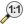
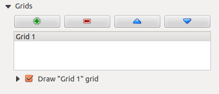
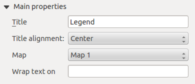

# Compositore di stampe {#print-composer}

Con il Compositore di Stampa puoi creare mappe belle e atlanti, che possono essere stampati o salvati in formato PDF, immagine o SVG. Questo è utile per condividere informazioni geografiche prodotte con KADAS che possono essere incluse in relazioni o pubblicate.

The Print Composer provides growing layout and printing capabilities. It allows you to add elements such as the KADAS map canvas, text labels, images, legends, scale bars, basic shapes, arrows, attribute tables and HTML frames. You can size, group, align, position and rotate each element and adjust the properties to create your layout. The layout can be printed or exported to image formats, PostScript, PDF or to SVG (export to SVG is not working properly with some recent Qt4 versions; you should try and check individually on your system). You can save the layout as a template and load it again in another session. Finally, generating several maps based on a template can be done through the atlas generator. See a list of tools in <a href="#table-composer-1" class="reference internal">table_composer_1</a>:

Icona

Azione

Icona

Azione

 
 
 
 

Salva progetto

Nuova composizione

Duplica composizione

Gestore di stampe

Caraica da modello

Salva come modello

Stampa o esporta come

Esporta come immagine

Esporta come SVG

Esporta come PDF

Annulla l’ultimo cambiamento

Rispristina l’ultimo cambiamento

Vista ad estensione massima

Zoom al 100%

Ingrandisci

Rimpicciolisci

Aggiorna la vista

 
 

Sposta

Zoom a una regione specifica

Scegli/Sposta oggetto

Sposta contenuto elemento

Aggiungi una nuova immagine dalla mappa di KADAS

Aggiungi immagine

Aggiungi etichetta

Aggiungi nuova legenda vettoriale

Aggiungi nuova barra di scala alla composizione di stampa

Aggiungi forma base

Aggiungi freccia

Aggiungi tabella attributi

Aggiungi una cornice HTML

 
 

Raggruppa oggetti

Rimuovi raggruppamento

[|bloccato|](#id8)

Blocca gli oggetti selezionati

[|sbloccato|](#id10)

Sblocca tutti gli elementi

Muovi in alto

Muovi in basso

Porta in cima

Porta in fondo

Allinea a sinistra

Allinea a destra

Allinea su asse verticale

Allinea su asse orizzontale

Allinea in alto

Allinea in basso

Anteprima atlante

Prima geometria

Geometria precedente

Geometria successiva

Ultima geometria

Stampa atlante

Esporta atlante come immagini

Impostazioni atlante

Strumenti del Compositore di Stampe

Tutti gli strumenti del compositore di stampe sono disponibili sia dai menu che dalle icone. Puoi disattivare la barra degli strumenti facendo click con il tasto destro del mouse sulla barra stessa.

## Panoramica del compositore di stampe {#overview-of-the-print-composer}

All’apertura il compositore di stampa presenta una mappa bianca che rappresenta la superficie del foglio da utilòizzare per la stampa. Trovi icone per aggiungere voci mappa compositore; l’attuale KADAS mappa, testi, immagini, leggende, barre di scala, forme base, frecce, tabelle di attributi e frame HTML. Negli strumenti trovi la barra degli strumenti per navigare, lo zoom e panoramica della vista, la barra degli strumenti per selezionare un elemento della mappa compositore e per spostare il contenuto della mappa.

<a href="#figure-composer-overview" class="reference internal">Figure_composer_overview</a> mostra la vista iniziale del compositore di stampa prima dell’aggiunta di elementi.

**Figure Composer Overview:**

Compositore di stampe 

A destra della mappa accanto la tela si trovano due pannelli. Il pannello superiore contiene le schede: guilabel: \`\` degli articoli e: guilabel: Command Storia dell’Attore e il pannello inferiore contiene le schede: guilabel: Composizione\`,: guilabel: Proprietà oggetto,guilabel:Generazione atlante e: guilabel:Oggetti.

-   La scheda *Items* mostra una lista di tutti gli oggetti agginti al foglio.

-   La scheda: guilabel:Storico dei comandi visualizza una cronologia di tutte le modifiche applicate al compositore. Con un clic del mouse, è possibile annullare e ripetere le operazioni avanti e indietro.

-   La scheda :guilabel: Composizione consente di impostare il formato del foglio, l’orientamento, lo sfondo della pagina, il numero di pagine e qualità di stampa per il file di output in dpi. Inoltre, puoi attivare la [|casella|](#id12) :guilabel: Stampa come raster. Ciò significa che tutti gli articoli saranno convertiti in raster prima di stampare o salvare in PostScript o PDF. In questa scheda, puoi anche personalizzare le impostazioni per reticolo e guide.

-   La scheda *Proprietà oggetto* mostra le proprietà dell’oggetto selezionato. Clic  Seleziona/Sposta\\ oggetto icona per selezionare un elemento (ad esempio, la leggenda, barra di scala o etichetta) sul foglio. Quindi fare clic sulla scheda *Proprietà oggetto* e personalizza le impostazioni per l’elemento selezionato.

-   La scheda *Generazione atlante* ti permette di abilitare la generazioni di un atlante per la composizione attuale avrai accesso a tutti i suoi parametri.

-   Infine, puoi salvare la composizione di stampa con il bottone : sup: Salva progetto.

Nella parte inferiore della finestra del compositore di stampe, troverai una barra di stato con la posizione del mouse, il numero attuale della pagine e un menu a tendina per selezionare il livello di zoom.

Puoi aggiungere elementi multipli al compositore. Puoi anche visualizzare più di una mappa o legenda o barra di scala nella vista del compositore su una o più pagine. Ogni elemento ha le sue proprietà e, nel caso della mappa, la sua estensione. Se vuoi rimuovere un qualsiasi elemento dalla vista selezionalo e premi il pulsante `Delete` o `Backspace`.

### Strumenti per l’esplorazione del layout di stampa {#navigation-tools}

Per navigare nella mappa, il compositore ti offre diversi strumenti:

-    Ingrandisci

-    Rimpicciolosci

-    Zoom\\ full
-    Zoom\\ al\\ 100%

-    Refresh\\ view (if you find the view in an inconsistent state)
-    Sposta\\ compositore

-    Zoom (zoom to a specific region of the Composer)

You can change the zoom level also using the mouse wheel or the combo box in the status bar. If you need to switch to pan mode while working in the Composer area, you can hold the `Spacebar` or the the mouse wheel. With `Ctrl+Spacebar`, you can temporarily switch to zoom mode, and with `Ctrl+Shift+Spacebar`, to zoom out mode.

## Esempio {#sample-session}

Per creare una mappa segui le seguenti istruzioni.

1.  Nella Barra degli strumenti Oggetti del compositore, selezionare il  Aggiungi\\ nuova\\ mappa e disegna un rettangolo sulla tela tenendo premuto il tasto sinistro del mouse. All’interno del rettangolo disegnato la visualizzazione della mappa QGIS alla tela.

2.  Seleziona  Aggiungi\\ nuova\\ barra\\ di\\ scala e posiziona l’oggetto con il pulsante sinistro del mouse sul foglio del compositore di stampe. Una barra di scala sarà aggiunta.

3.  Seleziona il bottone  Aggiungi\\ nuova\\ legenda e disegna un rettangolo sul foglio tenendo premuto il pulsante sinistro del mouse. Nel rettangolo verrà disegnata una legenda.

4.  Seleziona  Seleziona/Muovi\\ oggetto per selezionare la mappa sul foglio e spostarla.

5.  While the map item is still selected you can also change the size of the map item. Click while holding down the left mouse button, in a white little rectangle in one of the corners of the map item and drag it to a new location to change it’s size.
6.  Click the *Item Properties* tab on the left lower panel and find the setting for the orientation. Change the value of the setting *Map orientation* to ‘15.00° ‘. You should see the orientation of the map item change.
7.  Infine, puoi salvare la composizione di stampa con il bottone : sup: Salva progetto.

## Opzioni compositore di stampe {#print-composer-options}

Dal menu *Settings ‣ Opzioni compositore* puoi scegliere alcune opzioni che verranno usate in maniera predefinita durante il flusso di lavoro.

-   *Opzioni predefinite del compositore* ti permette di scegliere il carattere da usare.

-   With *Grid appearance*, you can set the grid style and its color. There are three types of grid: **Dots**, **Solid** lines and **Crosses**.
-   *Grid and guide defaults* defines spacing, offset and tolerance of the grid.

## Scheda Composizione — Impostazioni generali {#composition-tab-general-composition-setup}

Nella scheda *Composizione* puoi scegliere le impostazioni generali della tua composizione di stampa.

-   Puoi scegliere una delle opzioni *Preimpostazioni* per i tuoi fogli di carta oppure puoi inserire manualmente i valori di *larghezza* e *altezza*.

-   Puoi ora dividere la composizione in diverse pagine. Per esempio, la prima pagina mostra una mappa, la seconda mostra la tabella degli attributi di un vettore e la terza mostra una cornice HTML della tua azienda. Imposta il *Numero di pagine* con il valore che preferisci. Puoi scegliere l’*Orientamento* e la *Risoluzione di esportazione*. Quando spuntata, la casella di controllo  *stampa come raster* permette di trasformare in raster tutti gli elementi prima del salvataggio o esportazione in PostScript o PDF.

-   *Grid and guides* lets you customize grid settings like *spacings*, *offsets* and *tolerance* to your need. The tolerance is the maximum distance below which an item is snapped to smart guides.

Puoi attivare l’aggancio al reticolo e/o le guide intelligenti dal menu *Visualizza*. In questo menu puoi anche scegliere se mostrare o nascondere il reticolo e le guide intelligenti.

## Opzioni generali degli oggetti del compositore {#composer-items-common-options}

Gli oggetti del compositore hanno proprietà comuni che trovi nella scheda *Proprietà oggetto*: Posizione e dimensione, Rotazione, Cornice, Sfondo, ID oggetto e visualizzazione (Vedi <a href="#figure-composer-common-1" class="reference internal">figure_composer_common_1</a>)

**Figure Composer Common 1:**

Finestra di dialogo delle proprietà dell’oggetto 

-   La voce *Posizione e dimensione* ti permette di scegliere la posizione della cornice che contiene l’oggetto. Puoi anche scegliere quale deve essere il *Punto di riferimento* delle coordinate **X** e **Y**.

-   Con *Rotazione* puoi impostare la rotazione dell’elemento (in gradi).

-   The  *Frame* shows or hides the frame around the label. Use the *Frame color* and *Thickness* menus to adjust those properties.
-   Use the *Background color* menu for setting a background color. With the dialog you can pick a color (see <a href="../working_with_vector/vector_properties.html#color-picker" class="reference internal"><em>Selettore di colore</em></a> ).
-   Usa *ID oggetto* per creare una relazione con altri oggetti del compositore. Questa opzione è usata con KADAS server e altri potenziali web client. Puoi impostare un ID di un oggetto (per esempio una mappa e un’etichetta) e poi il web client sarà in grado di impostare un corretto stile per i dati (esempio le etichette). Il comando GetProjectSettings elencherà gli oggetti e quali ID sono disponibili nel layout.

-   Puoi selezionare la modalità *Visualizzazione* con la giusta opzione. Vedi <a href="#rendering-mode" class="reference internal">Rendering_Mode</a>.

Nota

-   The  Data\\ defined\\ override icon next to a field means that you can associate the field with data in the map item or use expressions. These are particularly helpful with atlas generation (See <a href="#atlas-data-defined-overrides" class="reference internal">atlas_data_defined_overrides</a>).

KADAS ti permette di effettuare visualizzazioni avanzate per ogni elemento del compositore proprio come per i vettori e per i raster.

**Figure Composer common 2:**

Modalità Visualizzazione 

-   *Transparency* : You can make the underlying item in the Composer visible with this tool. Use the slider to adapt the visibility of your item to your needs. You can also make a precise definition of the percentage of visibility in the menu beside the slider.

-    *Exclude item from exports*: You can decide to make an item not visible in all exports. After activating this checkbox, the item will not be included in PDF’s, prints etc..

-   *Modalità fusione*: grazie a questi strumenti usati soprattutto in ambito grafico, potrai creare effettivi visivi speciali. I pixel del vettore più in alto vengono mischiati con i pixel di tutti gli elementi sottostanti. Hai molte scelte diverse.

    > -   Normale: è la modalità fusione predefinita che usa il canale alpha del pixel più in alto fondendolo con quello sotto. I colori non sono quindi mescolati.
    >
    > -   Schiarisci: seleziona il valore massimo di ogni componente dal basso verso l’alto. Il risultato può apparire frastagliato e duro.
    >
    > -   Scolorisci: i pixel chiari provenienti dal vettore sorgente vengono dipinti sopra la destinazione, mentre i pixel più scuri no. Questa modalità è molto utile per mescolare le trame di un vettore con un altro (per esempio un raster di ombreggiatura con un altro layer).
    >
    > -   Scherma: questa modalità schiarirà e saturerà i pixel sottostanti in base a quanto sono chiari i pixel di sopra. In questo modo, i pixel più chiari in cima aumenteranno la saturazione e schiariranno i pixel sottostanti. Otterrai il miglior risultato se i pixel in cima non sono troppo chiari, altrimenti l’effetto sarà troppo estremo.
    >
    > -   Addizione: questa modalità addiziona semplicemente il valore dei pixel di un vettore con i valori dei layer sottostanti. Se i valori sono maggiori di uno (ovvero quando si lavora con bande RGB) verrà mostrato il bianco. Questa modalità è ottima per evidenziare dei particolari.
    >
    > -   Scurisci: il pixel finale conserva il valore minore dei pixel del layer in cima e in fondo. Come la modalità schiarsci, il risultato tende a essere frastagliato e duro.
    >
    > -   Moltiplica: qui, il valore di ogni pixel del layer in cima viene moltiplicato per il valore dei pixel corrispondenti di tutti i layer sottostanti. Il risultato tende quindi a essere piuttosto scuro.
    >
    > -   Brucia: i colori più scuri del layer in cima scuriranno i layer sottostanti. Questa modalità è utile per aggiustare e colorare i layer sottostanti.
    >
    > -   Sovrapponi: è una combinazione delle modalità moltiplica e scolorisci. Le parti chiare risulteranno ancora più chiare e quelle scure ancora più scure.
    >
    > -   Luce diffusa: molto simile alla modalità sovrapponi, ma invece di combinare le modalità moltiplica/scolorisci, combina brucia/scherma. Il risultato è una luce chiara e luccicante su tutta l’immagine.
    >
    > -   Luce intensa: anche questa modalità è simile alla modalità sovrapponi. Proietta una luce molto intensa su tutta l’immagine.
    >
    > -   Differenza: vengono sottratti i pixel in cima da quelli sul fondo, oppure al contrario, ma in modo da ottenere sempre valori positivi. Questa modalità non ha effetti con il nero, perché la differenza di questo colore con tutti gli altri è sempre zero.
    >
    > -   Sottrai: questa modalità sottrae semplicemente i valori di un pixel dagli altri pixel. Se il valore dovesse essere negativo verrà visualizzato il nero.
    >
## Oggetto mappa {#the-map-item}

Clicca sul pulsante  Aggiungi\\ mappa presente nella barra degli strumenti del compositore per aggiungere una mappa. Ora tieni premuto il pulsante del mouse e trascina il rettangolo corrispondente per aggiungere la mappa. Per visualizzare la mappa attuale puoi scegliere fra tre differenti modalità accessibili dalla scheda *Proprietà oggetto*:

-   **Rettangolo** visualizza un rettangolo vuoto con la scritta ‘La mappa verrà stampata qui’.

-   **Cache** disegna la mappa alla risoluzione corrente dello schermo. Se ingrandisci/rimpiccolisci la finestra del compositore, la mappa non viene ridisegnata, ma l’immagine viene scalata.

-   **Visualizza** a differenza del metodo cache, in questo caso se ridimensioni la finestra del compositore, la mappa viene ridisegnata.

**Cache** è la modalità predefinita per ogni nuova composizione di stampa.

Puoi ridimensionare la mappa in un momento successivo cliccando sul pulsante  Seleziona/Sposta\\ oggetto, selezionando un elemento e trascinando uno dei quadrati agli angoli della mappa. Una volta selezionata una mappa, puoi regolarne ulteriori proprietà nella scheda *Opzioni oggetto*.

To move layers within the map element, select the map element, click the  Move\\ item\\ content icon and move the layers within the map item frame with the left mouse button. After you have found the right place for an item, you can lock the item position within the Print Composer canvas. Select the map item and use the toolbar  Lock\\ Selected\\ Items or the *Items* tab to Lock the item. A locked item can only be selected using the *Items* tab. Once selected you can use the *Items* tab to unlock individual items. The Unlock\\ All\\ Items icon will unlock all locked composer items.

### Proprietà principali {#main-properties}

The *Main properties* dialog of the map *Item Properties* tab provides the following functionalities (see <a href="#figure-composer-map-1" class="reference internal">figure_composer_map_1</a>):

**Figure Composer Map 1:**

Scheda proprietà oggetti 

-   L’area **Anteprima** ti permette di scegliere fra le modalità ‘Rettangolo’, ‘Cache’ e ‘Visualizza’ descritte sopra. Se cambi la vista della mappa in KADAS cambiando le proprietà dei vettori e dei raster, puoi aggiornare la vista del compositore selezionando l’elemento corrispondente e premendo il pulsante **\[Aggiorna anteprima\]**.

-   Il campo *Scala*  ti permette di inserire una scala manuale.

-   The field *Map rotation*  allows you to rotate the map element content clockwise in degrees. The rotation of the map view can be imitated here. Note that a correct coordinate frame can only be added with the default value 0 and that once you defined a *Map rotation* it currently cannot be changed.
-    *Disegna elementi sulla mappa* ti permette di visualizzare le note testuali che hai aggiunto sulla mappa di KADAS.

-   You can choose to lock the layers shown on a map item. Check  *Lock layers for map item*. After this is checked, any layer that would be displayed or hidden in the main KADAS window will not appear or be hidden in the map item of the Composer. But style and labels of a locked layer are still refreshed according to the main KADAS interface. You can prevent this by using *Lock layer styles for map item*.
-   The  button allows you to add quickly all the presets views you have prepared in QGIS. Clicking on the  button you will see the list of all the preset views: just select the preset you want to display. The map canvas will automatically lock the preset layers by enabling the  *Lock layers for map item*: if you want to unselect the preset, just uncheck the  and press on the  button. See <a href="../introduction/qgis_gui.html#label-legend" class="reference internal"><em>Legenda mappa</em></a> to find out how to create presets views.

### Estensione mappa {#extents}

The *Extents* dialog of the map item tab provides the following functionalities (see <a href="#figure-composer-map-2" class="reference internal">figure_composer_map_2</a>):

**Figure Composer Map 2:**

Finestra di dialogo estensione mappa 

-   The **Map extents** area allows you to specify the map extent using X and Y min/max values and by clicking the **\[Set to map canvas extent\]** button. This button sets the map extent of the composer map item to the extent of the current map view in the main KADAS application. The button **\[View extent in map canvas\]** does exactly the opposite, it updates the extent of the map view in the QGIS application to the extent of the composer map item.

If you change the view on the KADAS map canvas by changing vector or raster properties, you can update the Print Composer view by selecting the map element in the Print Composer and clicking the **\[Update preview\]** button in the map *Item Properties* tab (see <a href="#figure-composer-map-1" class="reference internal">figure_composer_map_1</a>).

### Grids {#grids}

The *Grids* dialog of the map *Item Properties* tab provides the possibility to add several grids to a map item.

-   With the plus and minus button you can add or remove a selected grid.
-   With the up and down button you can move a grid in the list and set the drawing priority.

Cliccando sul reticolo aggiunto è possibile assegnarli un altro nome.

**Figure Composer Map 3:**

Finestra di dialogo reticolo 

After you have added a grid, you can activate the checkbox  *Show grid* to overlay a grid onto the map element. Expand this option to provide a lot of configuration options, see <a href="#figure-composer-map-4" class="reference internal">Figure_composer_map_4</a>.

**Figure Composer Map 4:**

Draw Grid Dialog 

As grid type, you can specify to use a ‘Solid’, ‘Cross’, ‘Markers’ or ‘Frame and annotations only’. ‘Frame and annotations only’ is especially useful when working with rotated maps or reprojected grids. In the devisions section of the Grid Frame Dialog mentioned below you then have a corresponding setting. Symbology of the grid can be chosen. See section <a href="#rendering-mode" class="reference internal">Rendering_Mode</a>. Furthermore, you can define an interval in the X and Y directions, an X and Y offset, and the width used for the cross or line grid type.

**Figure Composer Map 5:**

Grid Frame Dialog 

-   There are different options to style the frame that holds the map. Following options are available: No Frame, Zebra, Interior ticks, Exterior ticks, Interior and Exterior ticks and Lineborder.
-   With ‘LatitudeY/ only’ and ‘Longitude/X only’ setting in the devisions section you have the possibility to prevent a mix of latitude/y and longitude/x coordinates showing on a side when working with rotated maps or reprojected grids.
-   Advanced rendering mode is also available for grids (see section <a href="#rendering-mode" class="reference internal">Rendering_mode</a>).
-   The  *Draw coordinates* checkbox allows you to add coordinates to the map frame. You can choose the annotation numeric format, the options range from decimal to degrees, minute and seconds, with or without suffix, and aligned or not. You can choose which annotation to show. The options are: show all, latitude only, longitude only, or disable(none). This is useful when the map is rotated. The annotation can be drawn inside or outside the map frame. The annotation direction can be defined as horizontal, vertical ascending or vertical descending. In case of map rotation you can Finally, you can define the annotation font, the annotation font color, the annotation distance from the map frame and the precision of the drawn coordinates.

**Figure Composer map 6:**

Grid Draw Coordinates dialog 

### Panoramiche {#overviews}

The *Overviews* dialog of the map *Item Properties* tab provides the following functionalities:

**Figure Composer Map 7:**

Finestra di dialogo panoramica 

You can choose to create an overview map, which shows the extents of the other map(s) that are available in the composer. First you need to create the map(s) you want to include in the overview map. Next you create the map you want to use as the overview map, just like a normal map.

-   Con i pulsanti più e meno è possibile aggiungere o rimuovere una panoramica.

-   With the up and down button you can move an overview in the list and set the drawing priority.

Open *Overviews* and press the green plus icon-button to add an overview. Initially this overview is named ‘Overview 1’ (see <a href="#figure-composer-map-7" class="reference internal">Figure_composer_map_7</a>). You can change the name when you double-click on the overview item in the list named ‘Overview 1’ and change it to another name.

When you select the overview item in the list you can customize it.

-   The  *Draw “&lt;name\_overview&gt;” overview* needs to be activated to draw the extent of selected map frame.
-   The *Map frame* combo list can be used to select the map item whose extents will be drawn on the present map item.
-   The *Frame Style* allows you to change the style of the overview frame.
-   The *Blending mode* allows you to set different transparency blend modes. See <a href="#rendering-mode" class="reference internal">Rendering_Mode</a>.
-   The  *Invert overview* creates a mask around the extents when activated: the referenced map extents are shown clearly, whereas everything else is blended with the frame color.
-   The  *Center on overview* puts the extent of the overview frame in the center of the overview map. You can only activate one overview item to center, when you have added several overviews.

## The Label item {#the-label-item}

Per aggiungere un’etichetta, clicca sull’icona  Aggiungi\\ etichetta e scegli dove inserirla cliccando sulla mappa con il mouse. Puoi personalizzare le etichette nella scheda *Proprietà oggetto*.

The *Item Properties* tab of a label item provides the following functionality for the label item (see <a href="#figure-composer-label" class="reference internal">Figure_composer_label</a>):

**Figure Composer 8:**

Scheda proprietà etichette 

### Proprietà principali {#id1}

-   La voce proprietà principali è il posto dove devi inserire il testo (HTML oppure normale) o l’espressione che vuoi che compaia sull’etichetta.

-   Puoi inserire del testo HTML per le etichette: spunta la casella di controllo  *Visualizza come HTML*. Ora puoi inserire un URL, un’immagine collegata a un sito web oppure qualcosa di più complesso.

-   You can also insert an expression. Click on **\[Insert an expression\]** to open a new dialog. Build an expression by clicking the functions available in the left side of the panel. Two special categories can be useful, particularly associated with the atlas functionality: geometry functions and records functions. At the bottom, a preview of the expression is shown.

### Appearance {#appearance}

-   Define *Font* by clicking on the **\[Font...\]** button or a *Font color* selecting a color using the color selection tool.
-   You can specify different horizontal and vertical margins in mm. This is the margin from the edge of the composer item. The label can be positioned outside the bounds of the label e.g. to align label items with other items. In this case you have to use negative values for the margin.
-   Using the *Alignment* is another way to position your label. Note that when e.g. using the *Horizontal alignment* in *Center* Position the *Horizontal margin* feature is disabled.

## The Image item {#the-image-item}

Per aggiungere un’immagine, clicca sull’icona  Aggiungi\\ immagine e scegli dove inserirla cliccando sulla mappa con il mouse. Puoi personalizzare l’immagine nella scheda *Proprietà oggetto*.

The picture *Item Properties* tab provides the following functionalities (see <a href="#figure-composer-image-1" class="reference internal">figure_composer_image_1</a>):

**Figure Composer image 1:**

Scheda proprietà immagine 

You first have to select the image you want to display. There are several ways to set the *image source* in the **Main properties** area.

1.  Use the browse button  of *image source* to select a file on your computer using the browse dialog. The browser will start in the SVG-libraries provided with KADAS. Besides `SVG`, you can also select other image formats like `.png` or `.jpg`.
2.  You can enter the source directly in the *image source* text field. You can even provide a remote URL-address to an image.
3.  From the **Search directories** area you can also select an image from *loading previews ...* to set the image source.
4.  Use the data defined button  to set the image source from a record or using a regular expression.

With the *Resize mode* option, you can set how the image is displayed when the frame is changed, or choose to resize the frame of the image item so it matches the original size of the image.

You can select one of the following modes:

-   Zoom: Enlarges the image to the frame while maintaining aspect ratio of picture.
-   Stretch: Stretches image to fit inside the frame, ignores aspect ratio.
-   Clip: Use this mode for raster images only, it sets the size of the image to original image size without scaling and the frame is used to clip the image, so only the part of the image inside the frame is visible.
-   Zoom and resize frame: Enlarges image to fit frame, then resizes frame to fit resultant image.
-   Resize frame to image size: Sets size of frame to match original size of image without scaling.

Selected resize mode can disable the item options ‘Placement’ and ‘Image rotation’. The *Image rotation* is active for the resize mode ‘Zoom’ and ‘Clip’.

With *Placement* you can select the position of the image inside it’s frame. The **Search directories** area allows you to add and remove directories with images in SVG format to the picture database. A preview of the pictures found in the selected directories is shown in a pane and can be used to select and set the image source.

Images can be rotated with the *Image rotation* field. Activating the  *Sync with map* checkbox synchronizes the rotation of a picture in the KADAS map canvas (i.e., a rotated north arrow) with the appropriate Print Composer image.

It is also possible to select a north arrow directly. If you first select a north arrow image from **Search directories** and then use the browse button  of the field *Image source*, you can now select one of the north arrow from the list as displayed in <a href="#figure-composer-image-2" class="reference internal">figure_composer_image_2</a>.

Nota

Many of the north arrows do not have an ‘N’ added in the north arrow, this is done on purpose for languages that do not use an ‘N’ for North, so they can use another letter.

**Figure Composer Image 2:**

North arrows available for selection in provided SVG library

## The Legend item {#the-legend-item}

Per aggiungere una legenda, clicca su  Aggiungi\\ legenda, e scegli dove posizionarla con il tasto sinistro del mouse. Puoi personalizzare l’aspetto della legenda nella scheda *Proprietà oggetto*.

The *Item properties* of a legend item tab provides the following functionalities (see <a href="#figure-composer-legend-1" class="reference internal">figure_composer_legend_1</a>):

**Figure Composer Legend 1:**

Scheda proprietà legenda 

### Proprietà principali {#id3}

The *Main properties* dialog of the legend *Item Properties* tab provides the following functionalities (see <a href="#figure-composer-legend-2" class="reference internal">figure_composer_legend_2</a>):

**Figure Composer Legend 2:**

Finestra di dialogo proprietà principali della legenda 

In Main properties you can:

-   Change the title of the legend.
-   Set the title alignment to Left, Center or Right.
-   You can choose which *Map* item the current legend will refer to in the select list.
-   You can wrap the text of the legend title on a given character.

### Oggetti della legenda {#legend-items}

The *Legend items* dialog of the legend *Item Properties* tab provides the following functionalities (see <a href="#figure-composer-legend-3" class="reference internal">figure_composer_legend_3</a>):

**Figure Composer Legend 3:**

Finestra di dialogo oggetti legenda 

-   The legend will be updated automatically if  *Auto-update* is checked. When *Auto-update* is unchecked this will give you more control over the legend items. The icons below the legend items list will be activated.

-   The legend items window lists all legend items and allows you to change item order, group layers, remove and restore items in the list, edit layer names and add a filter.

    -   The item order can be changed using the **\[Up\]** and **\[Down\]** buttons or with ‘drag-and-drop’ functionality. The order can not be changed for WMS legend graphics.
    -   Use the **\[Add group\]** button to add a legend group.
    -   Use the **\[plus\]** and **\[minus\]** button to add or remove layers.
    -   The **\[Edit\]** button is used to edit the layer-, groupname or title, first you need to select the legend item.
    -   The **\[Sigma\]** button adds a feature count for each vector layer.
    -   Use the **\[filter\]** button to filter the legend by map content, only the legend items visible in the map will be listed in the legend.

    After changing the symbology in the KADAS main window, you can click on **\[Update All\]** to adapt the changes in the legend element of the Print Composer.

### Fonts, Columns, Symbol {#fonts-columns-symbol}

The *Fonts*, *Columns* and *Symbol* dialogs of the legend *Item Properties* tab provide the following functionalities (see <a href="#figure-composer-legend-4" class="reference internal">figure_composer_legend_4</a>):

**Figure Composer Legend 4:**

Finestra di dialogo caratteri, colonne, simboli e spaziatura legenda 

-   Puoi cambiare il carattere del titolo, gruppo, sotto-gruppo o elemento singolo della legenda. Clicca sul pulsante corrispondente per aprire la finestra **Selezione carattere**.

-   You provide the labels with a **Color** using the advanced color picker, however the selected color will be given to all font items in the legend..
-   Legend items can be arranged over several columns. Set the number of columns in the *Count*  field.
    -   La casella di controllo  *Uguale larghezza delle colonne* imposta come le colonne della legenda devono essere gestite.

    -   La casella di controllo  *Dividi layers* ti permette una divisione dei layer in base alla loro categorizzazione.

-   Puoi cambiare la larghezza e l’altezza di un simbolo della legenda.

### WMS LegendGraphic and Spacing {#wms-legendgraphic-and-spacing}

The *WMS LegendGraphic* and *Spacing* dialogs of the legend *Item Properties* tab provide the following functionalities (see <a href="#figure-composer-legend-5" class="reference internal">figure_composer_legend_5</a>):

**Figure Composer Legend 5:**

WMS LegendGraphic Dialogs 

When you have added a WMS layer and you insert a legend composer item, a request will be send to the WMS server to provide a WMS legend. This Legend will only be shown if the WMS server provides the GetLegendGraphic capability. The WMS legend content will be provided as a raster image.

*WMS LegendGraphic* is used to be able to adjust the *Legend width* and the *Legend height* of the WMS legend raster image.

Spacing around title, group, subgroup, symbol, icon label, box space or column space can be customized through this dialog.

## The Scale Bar item {#the-scale-bar-item}

Per aggiungere una barra di scala, clicca su  Aggiungi\\ nuova\\ barra\\ di\\ scala , scegli dove posizionarla e clicca con il tasto sinistro del mouse. Hai pieno accesso alla personalizzazione attraverso la scheda *Proprietà oggetto*.

The *Item properties* of a scale bar item tab provides the following functionalities (see <a href="#figure-composer-scalebar-1" class="reference internal">figure_composer_scalebar_1</a>):

**Figure Composer Scalebar 1:**

Proprietà barra di scala 

### Proprietà principali {#id4}

The *Main properties* dialog of the scale bar *Item Properties* tab provides the following functionalities (see <a href="#figure-composer-scalebar-2" class="reference internal">figure_composer_scalebar_2</a>):

**Figure Composer Scalebar 2:**

Proprietà principali della barra di scala 

-   Prima di tutto scegli a quale mappa vuoi aggiungere la barra di scala.

-   Poi scegli lo stile della barra di scale. Hai a disposizione sei stili:

    -   **Riquadro singolo** e **Riquadro doppio** che contengono una o due linee con colori alternati.

    -   **Linea con tacche al centro**, **Linea con tacche in basso** o **Linea con tacche in alto**.

    -   **Numerico** che mostra semplicemente il rapporto di scala (per esempio

### Unità e segmenti {#units-and-segments}

The *Units* and *Segments* dialogs of the scale bar *Item Properties* tab provide the following functionalities (see <a href="#figure-composer-scalebar-3" class="reference internal">figure_composer_scalebar_3</a>):

**Figure Composer scalebar 3:**

Unità e segmenti della barra di scala 

In queste due sezioni puoi scegliere come deve essere rappresentata la barra di scala.

-   Select the map units used. There are four possible choices: **Map Units** is the automated unit selection; **Meters**, **Feet** or **Nautical Miles** force unit conversions.
-   Specifica nel campo *Etichetta* il testo che descriverà l’unità scelta.

-   Il campo *Unità mappa per unità di barra* ti permette di fissare il rapporto fra le unità di mappa e la loro rappresentazione nella barra di scala.

-   Puoi scegliere quanti *Segmenti* devono essere disegnati a sinistra e a destra della barra di scala e quanto ogni segmento deve essere lungo (*Dimensione*). Puoi anche scegliere l’*Altezza*.

### Display {#display}

The *Display* dialog of the scale bar *Item Properties* tab provide the following functionalities (see <a href="#figure-composer-scalebar-4" class="reference internal">figure_composer_scalebar_4</a>):

**Figure Composer Scalebar 4:**

Scale Bar Display 

You can define how the scale bar will be displayed in its frame.

-   *Box margin* : space between text and frame borders
-   *Labels margin* : space between text and scale bar drawing
-   *Line width* : line widht of the scale bar drawing
-   *Join style* : Corners at the end of scalebar in style Bevel, Rounded or Square (only available for Scale bar style Single Box & Double Box)
-   *Cap style* : End of all lines in style Square, Round or Flat (only available for Scale bar style Line Ticks Up, Down and Middle)
-   *Alignment* : Puts text on the left, middle or right side of the frame (works only for Scale bar style Numeric)

### Fonts and colors {#fonts-and-colors}

The *Fonts and colors* dialog of the scale bar *Item Properties* tab provide the following functionalities (see <a href="#figure-composer-scalebar-5" class="reference internal">figure_composer_scalebar_5</a>):

**Figure Composer Scalebar 5:**

Scale Bar Fonts and colors Dialogs 

You can define the fonts and colors used for the scale bar.

-   Use the **\[Font\]** button to set the font
-   *Font color*: set the font color
-   *Fill color*: set the first fill color
-   *Secondary fill color*: set the second fill color
-   *Stroke color*: set the color of the lines of the Scale Bar

Fill colors are only used for scale box styles Single Box and Double Box. To select a color you can use the list option using the dropdown arrow to open a simple color selection option or the more advanced color selection option, that is started when you click in the colored box in the dialog.

## The Basic Shape Items {#the-basic-shape-items}

To add a basic shape (ellipse, rectangle, triangle), click the  Add\\ basic\\ shape icon or the  Add\\ Arrow icon, place the element holding down the left mouse. Customize the appearance in the *Item Properties* tab.

When you also hold down the `Shift` key while placing the basic shape you can create a perfect square, circle or triangle.

**Figure Composer Basic Shape:**

Scheda proprietà forma 

The *Shape* item properties tab allows you to select if you want to draw an ellipse, rectangle or triangle inside the given frame.

You can set the style of the shape using the advanced symbol style dialog with which you can define its outline and fill color, fill pattern, use markers etcetera.

For the rectangle shape, you can set the value of the corner radius to round of the corners.

Nota

Unlike other items, you can not style the frame or the background color of the frame.

## The Arrow item {#the-arrow-item}

To add an arrow, click the  Add\\ Arrow icon, place the element holding down the left mouse button and drag a line to draw the arrow on the Print Composer canvas and position and customize the appearance in the scale bar *Item Properties* tab.

When you also hold down the `Shift` key while placing the arrow, it is placed in an angle of exactly 45° .

The arrow item can be used to add a line or a simple arrow that can be used, for example, to show the relation between other print composer items. To create a north arrow, the image item should be considered first. KADAS has a set of North arrows in SVG format. Furthermore you can connect an image item with a map so it can rotate automatically with the map (see <a href="#the-image-item" class="reference internal">the_image_item</a>).

**Figure Composer Arrow:**

Scheda proprietà freccia 

### Item Properties {#item-properties}

The *Arrow* item properties tab allows you to configure an arrow item.

The **\[Line style ...\]** button can be used to set the line style using the line style symbol editor.

In *Arrows markers* you can select one of three radio buttons.

-   *Default* : To draw a regular arrow, gives you options to style the arrow head
-   *None* : To draw a line without arrow head
-   *SVG Marker* : To draw a line with an SVG *Start marker* and/or *End marker*

For *Default* Arrow marker you can use following options to style the arrow head.

-   *Arrow outline color* : Set the outline color of the arrow head
-   *Arrow fill color* : Set the fill color of the arrow head
-   *Arrow outline width* : Set the outline width of the arrow head
-   *Arrow head width*: Set the size of the arrow head

For *SVG Marker* you can use following options.

-   *Start marker* : Choose an SVG image to draw at the beginning of the line
-   *End marker* : Choose an SVG image to draw at the end of the line
-   *Arrow head width*: Sets the size of Start and/or End marker

SVG images are automatically rotated with the line. The color of the SVG image can not be changed.

## The Attribute Table item {#the-attribute-table-item}

Puoi aggiungere parti della tabella degli attributi di un vettore al compositore di stampe: clicca sull’icona  Aggiungi\\ tabella\\ attributi, scegli dove posizionarla e clicca con il tasto sinistro del mouse. In seguito potrai personalizzarne gli aspetti dalla scheda *Proprietà oggetto*.

The *Item properties* of an attribute table item tab provides the following functionalities (see <a href="#figure-composer-table-1" class="reference internal">figure_composer_table_1</a>):

**Figure Composer Attribute Table 1:**

Attribute table Item properties Tab 

### Proprietà principali {#id5}

The *Main properties* dialogs of the attribute table *Item Properties* tab provide the following functionalities (see <a href="#figure-composer-table-2" class="reference internal">figure_composer_table_2</a>):

**Figure Composer Attribute Table 2:**

Attribute table Main properties Dialog 

-   For *Source* you can normally select only ‘Layer features’.
-   With *Layer* you can choose from the vector layers loaded in the project.
-   The button **\[Refresh table data\]** can be used to refresh the table when the actual contents of the table has changed.
-   In case you activated the *Generate an atlas* option in the *Atlas generation* tab, there are two additional *Source* possible: ‘Current atlas feature’ (see <a href="#figure-composer-table-2b" class="reference internal">figure_composer_table_2b</a>) and ‘Relation children’ (see <a href="#figure-composer-table-2c" class="reference internal">figure_composer_table_2c</a>). Choosing the ‘Current atlas feature’ you won’t see any option to choose the layer, and the table item will only show a row with the attributes from the current feature of the atlas coverage layer. Choosing ‘Relation children’, an option with the relation name will show up. The ‘Relation children’ option can only be used if you have defined a relation using your atlas coverage layer as parent, and it will show the children rows of the atlas coverage layer’s current feature (for further information about the atlas generation see <a href="#atlasgeneration" class="reference internal">atlasgeneration</a>).

**Figure Composer Attribute Table 2b:**

Attribute table Main properties for ‘Current atlas feature’ 

**Figure Composer Attribute Table 2c:**

Attribute table Main properties for ‘Relation children’ 

-   The button **\[Attributes...\]** starts the *Select attributes* menu, see <a href="#figure-composer-table-3" class="reference internal">figure_composer_table_3</a>, that can be used to change the visible contents of the table. After making changes use the **\[OK\]** button to apply changes to the table.

    In the *Columns* section you can:

    -   Remove an attribute, just select an attribute row by clicking anywhere in a row and press the minus button to remove the selected attribute.
    -   Add a new attribute use the plus button. At the end a new empty row appears and you can select empty cell of the column *Attribute*. You can select a field attribute from the list or you can select to build a new attribute using a regular expression ( button). Of course you can modify every already existing attribute by means of a regular expression.
    -   Use the up and down arrows to change the order of the attributes in the table.
    -   Select a cel in the Headings column to change the Heading, just type in a new name.
    -   Select a cel in the Alignment column and you can choose between Left, Center or Right alignment.
    -   Select a cel in the Width column and you can change it from Automatic to a width in mm, just type a number. When you want to change it back to Automatic, use the cross.
    -   The **\[Reset\]** button can always be used to restore it to the original attribute settings.

    In the *Sorting* section you can:

    -   Add an attribute to sort the table with. Select an attribute and set the sorting order to ‘Ascending’ or ‘Descending’ and press the plus button. A new line is added to the sort order list.
    -   select a row in the list and use the up and down button to change the sort priority on attribute level.
    -   use the minus button to remove an attribute from the sort order list.

**Figure Composer Attribute Table 3:**

Finestra di dialogo scegli attributo 

### Feature filtering {#feature-filtering}

The *Feature filtering* dialogs of the attribute table *Item Properties* tab provide the following functionalities (see <a href="#figure-composer-table-4" class="reference internal">figure_composer_table_4</a>):

**Figure Composer Attribute Table 4:**

Attribute table Feature filtering Dialog 

You can:

-   Define the *Maximum rows* to be displayed.

-   Activate  *Remove duplicate rows from table* to show unique records only.

-   Activate  *Show only visible features within a map* and select the corresponding *Composer map* to display the attributes of features only visible on selected map.

-   Activate  *Show only features intersecting Atlas feature* is only available when  *Generate an atlas* is activated. When activated it will show a table with only the features shown on the map of that particular page of the atlas.

-   Activate  *Filter with* and provide a filter by typing in the input line or insert a regular expression using the given  expression button. A few examples of filtering statements you can use when you have loaded the airports layer from the Sample dataset:

    -   `ELEV > 500`
    -   `NAME = 'ANIAK'`
    -   `NAME NOT LIKE 'AN%`
    -   `regexp_match( attribute( $currentfeature, 'USE' )  , '[i]')`

    The last regular expression will include only the arpoirts that have a letter ‘i’ in the attribute field ‘USE’.

### Appearance {#id6}

The *Appearance* dialogs of the attribute table *Item Properties* tab provide the following functionalities (see <a href="#figure-composer-table-5" class="reference internal">figure_composer_table_5</a>):

**Figure Composer Attribute Table 5:**

Attribute table appearance Dialog 

-   Click  *Show empty rows* to make empty entries in the attribute table visible.
-   With *Cell margins* you can define the margin around text in each cell of the table.
-   With *Display header* you can select from a list one of ‘On first frame’, ‘On all frames’ default option, or ‘No header’.
-   The option *Empty table* controls what will be displayed when the result selection is empty.
    -   **Draw headers only**, will only draw the header except if you have choosen ‘No header’ for *Display header*.
    -   **Hide entire table**, will only draw the background of the table. You can activate  *Don’t draw background if frame is empty* in *Frames* to completely hide the table.
    -   **Draw empty cells**, will fill the attribute table with empty cells, this option can also be used to provide additional empty cells when you have a result to show!
    -   **Show set message**, will draw the header and adds a cell spanning all columns and display a message like ‘No result’ that can be provided in the option *Message to display*
-   The option *Message to display* is only activated when you have selected **Show set message** for *Empty table*. The message provided will be shown in the table in the first row, when the result is an empty table.
-   With *Background color* you can set the background color of the table.

### Show grid {#show-grid}

The *Show grid* dialog of the attribute table *Item Properties* tab provide the following functionalities (see <a href="#figure-composer-table-6" class="reference internal">figure_composer_table_6</a>):

**Figure Composer Attribute Table 6:**

Attribute table Show grid Dialog 

-   Activate  *Show grid* when you want to display the grid, the outlines of the table cells.
-   With *Stroke width* you can set the thickness of the lines used in the grid.
-   The *Color* of the grid can be set using the color selection dialog.

### Fonts and text styling {#fonts-and-text-styling}

The *Fonts and text styling* dialog of the attribute table *Item Properties* tab provide the following functionalities (see <a href="#figure-composer-table-7" class="reference internal">figure_composer_table_7</a>):

**Figure Composer Attribute Table 7:**

Attribute table Fonts and text styling Dialog 

-   You can define *Font* and *Color* for *Table heading* and *Table contents*.
-   For *Table heading* you can additionally set the *Alignment* and choose from Follow column alignment, Left, Center or Right. The column alignment is set using the *Select Attributes* dialog (see <a href="#figure-composer-table-3" class="reference internal">Figure_composer_table_3</a> ).

### Frames {#frames}

The *Frames* dialog of the attribute table *Item Properties* tab provide the following functionalities (see <a href="#figure-composer-table-8" class="reference internal">figure_composer_table_8</a>):

**Figure Composer Attribute Table 8:**

Attribute table Frames Dialog 

-   With *Resize mode* you can select how to render the attribute table contents:
    -   Use existing frames displays the result in the first frame and added frames only.
    -   Extent to next page will create as many frames (and corresponding pages) as necessary to display the full selection of attribute table. Each frame can be moved around on the layout. If you resize a frame, the resulting table will be divided up between the other frames. The last frame will be trimmed to fit the table.
    -   Repeat until finished will also create as many frames as the Extend to next page option, except all frames will have the same size.
-   Use the **\[Add Frame\]** button to add another frame with the same size as selected frame. The result of the table that will not fit in the first frame will continue in the next frame when you use the Resize mode Use existing frames.
-   Activate  *Don’t export page if frame is empty* prevents the page to be exported when the table frame has no contents. This means all other composer items, maps, scalebars, legends etc. will not be visible in the result.
-   Activate  *Don’t draw background if frame is empty* prevents the background to be drawn when the table frame has no contents.

## The HTML frame item {#the-html-frame-item}

It is possible to add a frame that displays the contents of a website or even create and style your own HTML page and display it!

Click the  Add\\ HTML\\ frame icon, place the element by dragging a rectangle holding down the left mouse button on the Print Composer canvas and position and customize the appearance in the *Item Properties* tab (see <a href="#figure-composer-html-1" class="reference internal">figure_composer_html_1</a>).

**Figure Composer HTML 1:**

HTML frame, the item properties Tab 

### HTML Source {#html-source}

As an HTML source, you can either set a URL and activate the URL radiobutton or enter the HTML source directly in the textbox provided and activate the Source radiobutton.

The *HTML Source* dialog of the HTML frame *Item Properties* tab provides the following functionalities (see <a href="#figure-composer-html-2" class="reference internal">figure_composer_html_2</a>):

**Figure Composer HTML 2:**

HTML frame, the HTML Source properties 

-   In *URL* you can enter the URL of a webpage you copied from your internet browser or select an HTML file using the browse button . There is also the option to use the Data defined override button, to provide an URL from the contents of an attribute field of a table or using a regular expression.
-   In *Source* you can enter text in the textbox with some HTML tags or provide a full HTML page.
-   The **\[insert an expression\]** button can be used to insert an expression like `[%Year($now)%]` in the Source textbox to display the current year. This button is only activated when radiobutton *Source* is selected. After inserting the expression click somewhere in the textbox before refreshing the HTML frame, otherwise you will lose the expression.
-   Activate  *Evaluate QGIS expressions in HTML code* to see the result of the expression you have included, otherwise you will see the expression instead.
-   Use the **\[Refresh HTML\]** button to refresh the HTML frame(s) to see the result of changes.

### Frames {#id7}

The *Frames* dialog of the HTML frame *Item Properties* tab provides the following functionalities (see <a href="#figure-composer-html-3" class="reference internal">figure_composer_html_3</a>):

**Figure Composer HTML 3:**

HTML frame, the Frames properties 

-   With *Resize mode* you can select how to render the HTML contents:
    -   Use existing frames displays the result in the first frame and added frames only.
    -   Extent to next page will create as many frames (and corresponding pages) as necessary to render the height of the web page. Each frame can be moved around on the layout. If you resize a frame, the webpage will be divided up between the other frames. The last frame will be trimmed to fit the web page.
    -   Repeat on every page will repeat the upper left of the web page on every page in frames of the same size.
    -   Repeat until finished will also create as many frames as the Extend to next page option, except all frames will have the same size.
-   Use the **\[Add Frame\]** button to add another frame with the same size as selected frame. If the HTML page that will not fit in the first frame it will continue in the next frame when you use *Resize mode* or *Use existing frames*.
-   Activate  *Don’t export page if frame is empty* prevents the map layout from being exported when the frame has no HTML contents. This means all other composer items, maps, scalebars, legends etc. will not be visible in the result.
-   Activate  *Don’t draw background if frame is empty* prevents the HTML frame being drawn if the frame is empty.

### Use smart page breaks and User style sheet {#use-smart-page-breaks-and-user-style-sheet}

The *Use smart page breaks* dialog and *Use style sheet* dialog of the HTML frame *Item Properties* tab provides the following functionalities (see <a href="#figure-composer-html-4" class="reference internal">figure_composer_html_4</a>):

**Figure Composer HTML 4:**

HTML frame, Use smart page breaks and User stylesheet properties 

-   Activate  *Use smart page breaks* to prevent the html frame contents from breaking mid-way a line of text so it continues nice and smooth in the next frame.

-   Set the *Maximum distance* allowed when calculating where to place page breaks in the html. This distance is the maximum amount of empty space allowed at the bottom of a frame after calculating the optimum break location. Setting a larger value will result in better choice of page break location, but more wasted space at the bottom of frames. This is only used when *Use smart page breaks* is activated.

-   Activate  *User stylesheet* to apply HTML styles that often is provided in cascading style sheets. An example of style code is provide below to set the color of `<h1>` header tag to green and set the font and fontsize of text included in paragraph tags `
`.

        h1 {color: #00ff00;
        }
        p {font-family: "Times New Roman", Times, serif;
           font-size: 20px;
        }

-   Use the **\[Update HTML\]** button to see the result of the stylesheet settings.

#### Gestisci elementi {#manage-items}

## Dimensione e posizione {#size-and-position}

Puoi spostare/ridimensionare ogni elemento del compositore per creare un layout di stampa perfetto. Per entrambe le operazioni devi prima attivare cliccare sull’icona  Scegli/Sposta\\ oggetto e poi cliccare sull’oggetto corrispondente; ora puoi muoverlo con il pulsante sinistro del mouse. Se vuoi forzare lo spostamento lungo un asse orizzontale o verticale, tieni premuto il tasto `Shift`. Se hai bisogno di una maggiore precisione usa le `Frecce direzionali` della tastiera; se il movimento è troppo lento lo puoi velocizzare tenendo premuto il tasto `Shift`.

A selected item will show squares on its boundaries; moving one of them with the mouse, will resize the item in the corresponding direction. While resizing, holding `Shift` will maintain the aspect ratio. Holding `Alt` will resize from the item center.

The correct position for an item can be obtained using snapping to grid or smart guides. Guides are set by clicking and dragging in the rulers. Guides are moved by clicking in the ruler, level with the guide and dragging to a new place. To delete a guide move it off the canvas. If you need to disable the snap on the fly just hold `Ctrl` while moving the mouse.

Puoi usare lo strumento  Sposta/Muovi\\ oggetto su più oggetti contemporaneamente. Tieni premuto il tasto `Shift` e clicca su tutti gli oggetti che vuoi selezionare. Ora li puoi spostare o ridimensionare tutti in un colpo solo.

Once you have found the correct position for an item, you can lock it by using the items on the toolbar or ticking the box next to the item in the *Items* tab. Locked items are **not** selectable on the canvas.

Locked items can be unlocked by selecting the item in the *Items* tab and unchecking the tickbox or you can use the icons on the toolbar.

Per deselezionare un oggetto, cliccaci sopra tenendo premuto il tasto `Shift`.

Nel menu *Modifica*, puoi trovare diversi strumenti che ti permettono di selezionare tutti gli elementi, di pulire o invertire la selezione attuale.

## Allineamento {#alignment}

Raising or lowering functionalities for elements are inside the  Raise\\ selected\\ items pull-down menu. Choose an element on the Print Composer canvas and select the matching functionality to raise or lower the selected element compared to the other elements (see <a href="#table-composer-1" class="reference internal">table_composer_1</a>). This order is shown in the *Items* tab. You can also raise or lower objects in the *Items* tab by clicking and dragging an object’s label in this list.

**Figure Composer 28:**

Linee guida di allineamento del compositore di stampe 

Ci sono diverse funzionalità disponibili nel menu a tendina  Allinea\\ gli\\ oggetti\\ selezionati (vedi <a href="#table-composer-1" class="reference internal">table_composer_1</a>). Per usare una di queste funzionalità, seleziona prima alcuni oggetti e poi clicca sull’icona. In questo modo tutti gli elementi verranno allineati all’interno della loro cornice. Quando muovi gli elementi nel compositore, appaiono delle linee ai margini del foglio che ti aiutano ad allineare gli oggetti.

## Copia/Taglia e Incolla oggetti {#copy-cut-and-paste-items}

Il compositore di stampe include tutte le azioni più comuni di copia/taglia/incolla per gli oggetti del layout. Prima di tutto seleziona l’oggetto: nel menu *Modifica* potrai trovare le azioni che potrai effettuare. Mentre usi l’azione incolla, gli oggetti verranno incollati nella posizione attuale del mouse.

Nota

HTML items can not be copied in this way. As a workaround, use the **\[Add Frame\]** button in the *Item Properties* tab.

Durante la creazione di un layout di stampa puoi annullare e ripristinare le azioni. Lo puoi fare semplicemente usando lo strumento annulla/ripristina:

-    Revert\\ last\\ change
-    Restore\\ last\\ change

This can also be done by mouse click within the *Command history* tab (see <a href="#figure-composer-29" class="reference internal">figure_composer_29</a>).

**Figure Composer 29:**

Storico dei comandi del compositore di stampe 

Il compositore di stampe include anche una funzionalità che ti permette di creare automaticamente degli atlanti. Il concetto è quello di usare un vettore di copertura che contiene campi e geometrie. Per ogni geometria di questo vettore potrai creare un nuovo output: ogni nuovo output sarà centrato sulla geometria corrispondente. Puoi usare i campi delle geometrie come etichette per gli output.

Every page will be generated with each feature. To enable the generation of an atlas and access generation parameters, refer to the Atlas generation tab. This tab contains the following widgets (see <a href="#figure-composer-atlas" class="reference internal">Figure_composer_atlas</a>):

**Figure Composer Atlas:**

Scheda generazione atlante 

-    *Genera un atlante*, che attiva o disattiva la generazione dell’atlante.

-   Un menu a tendina *Layer di copertura*  che ti permette di scegliere il layer (vettore) contenente le geometrie che verranno iterate.

-   Una casella di controllo opzionale  *Layer copertura nascosto* che, se attivata, nasconderà solamente il layer di copertura durante la generazione dell’atlante.

-   Una casella opzionale *Filtra con* che ti permette di specificare un’espressione per filtrare le geometrie del layer di copertura. Se l’espressione non è vuota, solamente le geometrie valutate come `True` verranno selezionate. Premendo il pulsante sulla destra puoi aprire il costruttore di espressioni.

-   Usa la casella di testo *Espressione nome file di output* per generare un nome per ogni geometria. Si basa su un’espressione. Questo campo ha senso solamente per la creazione di file multipli.

-   Una casella di controllo  *Esporta file singolo se possibile* che ti permette di forzare la generazione di un singolo file se è compatibile con il formato di output scelto (per esempio, PDF). Se spuntata, il valore inserito in *Espressione del nome di file in output* non ha senso.

-   Una casella di controllo opzionale  *Ordina per* che ti permette di ordinare le geometrie del layer di copertura. Il menu a tendina associato ti permette di scegliere quale colonna dovrà essere usate per l’ordinamento. Puoi impostare l’ordine (crescente o decrescente) grazie al pulsante a destra del menu a tendina.

Puoi usare oggetti multipli con la generazione dell’atlante: ogni mappa verrà visualizzata secondo le geometrie del layer di copertura. Per impostare la generazione dell’atlante per un oggetto specifico, spunta la casella di controllo *Controllato dall’atlante* nella scheda delle proprietà dell’oggetto. Una volta spuntata potrai impostare:

-   A radiobutton  *Margin around feature* that allows you to select the amount of space added around each geometry within the allocated map. Its value is meaningful only when using the auto-scaling mode.
-   A  *Predefined scale* (best fit). It will use the best fitting option from the list of predefined scales in your project properties settings (see *Project –&gt; Project Properties –&gt; General –&gt; Project Scales* to configure these predefined scales).
-   A  *Fixed scale* that allows you to toggle between auto-scale and fixed-scale mode. In fixed-scale mode, the map will only be translated for each geometry to be centered. In auto-scale mode, the map’s extents are computed in such a way that each geometry will appear in its entirety.

## Etichette {#labels}

In order to adapt labels to the feature the atlas plugin iterates over, you can include expressions. For example, for a city layer with fields CITY\_NAME and ZIPCODE, you could insert this:

    The area of [% upper(CITY_NAME) || ',' || ZIPCODE || ' is ' format_number($area/1000000,2) %] km2

The information \[% upper(CITY\_NAME) || ‘,’ || ZIPCODE || ‘ is ‘ format\_number($area/1000000,2) %\] is an expression used inside the label. That would result in the generated atlas as:

The area of PARIS,75001 is 1.94 km2

## Data Defined Override Buttons {#data-defined-override-buttons}

There are several places where you can use a  Data\\ Defined\\ Override button to override the selected setting. These options are particularly usefull with Atlas Generation.

For the following examples the Regions layer of the KADAS sample dataset is used and selected for Atlas Generation. We also assume the paper format A4 (210X297) is selected in the *Composition* tab for field *Presets*.

With a Data Defined Override button you can dynamically set the paper orientation. When the height (north-south) of the extents of a region is greater than it’s width (east-west), you rather want to use portrait instead of landscape orientation to optimize the use of paper.

In the *Composition* you can set the field *Orientation* and select Landscape or Portrait. We want to set the orientation dynamically using an expression depending on the region geometry. press the  button of field *Orientation*, select *Edit ...* so the *Expression string builder* dialog opens. Give following expression:

    CASE WHEN bounds_width($atlasgeometry) > bounds_height($atlasgeometry) THEN 'Landscape' ELSE 'Portrait' END

Now the paper orients itself automatically for each Region you need to reposition the location of the composer item as well. For the map item you can use the  button of field *Width* to set it dynamically using following expression:

    (CASE WHEN bounds_width($atlasgeometry) > bounds_height($atlasgeometry) THEN 297 ELSE 210 END) - 20

Use the  button of field *Heigth* to provide following expression:

    (CASE WHEN bounds_width($atlasgeometry) > bounds_height($atlasgeometry) THEN 210 ELSE 297 END) - 20

When you want to give a title above map in the center of the page, insert a label item above the map. First use the item properties of the label item to set the horizontal alignment to  *Center*. Next activate from *Reference point* the upper middle checkbox. You can provide following expression for field *X* :

    (CASE WHEN bounds_width($atlasgeometry) > bounds_height($atlasgeometry) THEN 297 ELSE 210 END) / 2

For all other composer items you can set the position in a similar way so they are correctly positioned when page is automatically rotated in portrait or landscape.

Information provided is derived from the excellent blog (in english and portugese) on the Data Defined Override options [Multiple\_format\_map\_series\_using\_QGIS\_2.6\_](#id14) .

This is just one example of how you can use Data Defined Overrides.

## Anteprima {#preview}

Una volta che hai configurato le impostazioni dell’atlante e che hai selezionato gli oggetti della mappa, puoi creare un’anteprima di tutte le pagine cliccando sul pulsante *Atlante ‣ Anteprima atlante* e usare le frecce dello stesso menu per navigare fra le varie geometrie.

## Generazione {#generation}

Puoi effettuare la generazione dell’atlante in modi diversi. Per esempio tramite il menu *Atlante ‣ Stampa atlante*. Puoi anche creare un PDF cliccando su *Atlente ‣ Esporta atlante come PDF*: ti verrà chiesto un percorso in cui salvare i PDF (eccetto se hai spuntato la casella di controllo  *Esporta file singolo se possibile*). Se devi stampare solamente una pagina dell’atlante, fai partire l’anteprima, fermati alla pagina che vuoi e clicca su *Compositore ‣ Stampa* (o esporta come PDF).

To maximise the space available to interact with a composition you can use *View –&gt;*  *Hide panels* or press `F10`.

:: note:

    It's also possible to switch to a full screen mode to have more space to interact by pressing
    :kbd:`F11` or using :guilabel:`View --> |checkbox| :guilabel:`Toggle full screen`.

<a href="#figure-composer-output" class="reference internal">Figure_composer_output</a> shows the Print Composer with an example print layout, including each type of map item described in the sections above.

**Figure Composer Output:**

Compositore con mappa, legenda, immagine, barra di scala, coordinate, testo e cornice HTML 

Before printing a layout you have the possibility to view your composition without bounding boxes. This can be enabled by deactivating *View –&gt;*  *Show bounding boxes* or pressing the shortcut `Ctrl+Shift+B`.

Il compositore di stampe ti permette di creare diversi formati di output e puoi scegliere la risoluzione (qualità di stampa) e il formato pagina:

-   L’icona  Stampa ti permette di stampare il layout su una stampante collegata o su un file PDF o Postscript.

-   L’icona  Esporta\\ come\\ immagine esporta il layout in diversi formati immagine come PNG, BPM, TIF, JPG,...

-   L’icona  Esporta\\ come\\ PDF esporta il layout in formato PDF.

-   L’icona  Esporta\\ come\\ SVG salva il layout di stampa in formato SVG (Scalable Vector Graphic).

If you need to export your layout as a **georeferenced image** (i.e., to load back inside KADAS), you need to enable this feature under the Composition tab. Check  *World file on* and choose the map item to use. With this option, the ‘Export as image’ action will also create a world file.

Nota

-   Currently, the SVG output is very basic. This is not a KADAS problem, but a problem with the underlying Qt library. This will hopefully be sorted out in future versions.
-   Exporting big rasters can sometimes fail, even if there seems to be enough memory. This is also a problem with the underlying Qt management of rasters.

