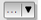
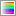
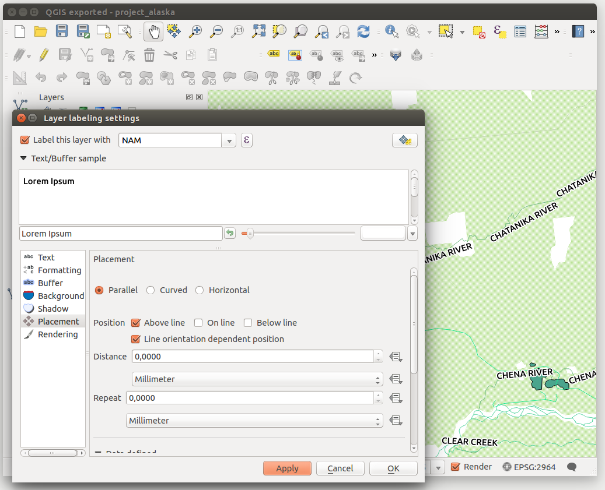
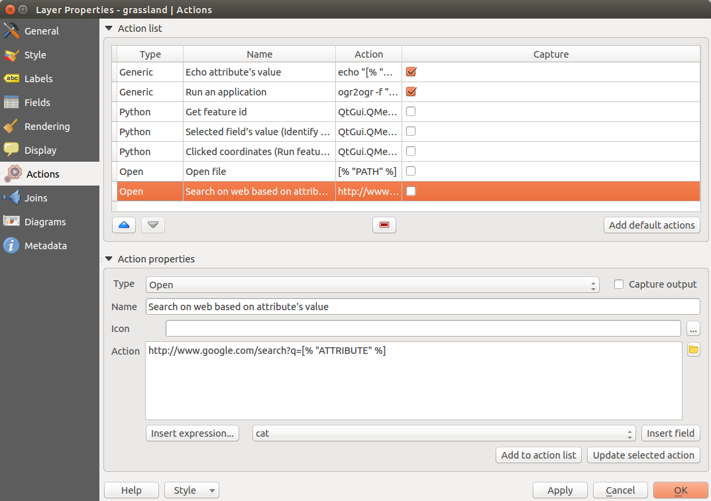
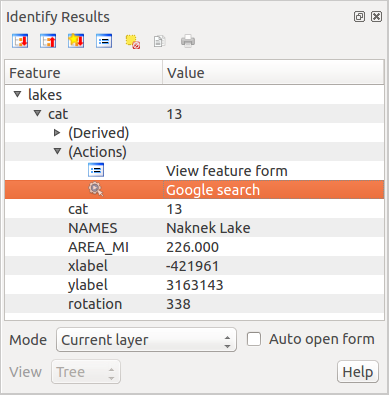

# Proprietà dei vettori {#the-vector-properties-dialog}

La finestra di dialogo *Proprietà layer* fornisce informazioni sul vettore, sulla simbologia e sulle opzioni di visualizzazione delle etichette. Inoltre, se hai caricato il vettore da un database PostgreSQL/PostGIS, puoi modificare l’espressione SQL che hai usato per caricarlo, grazie al *Costruttore di interrogazioni* nel menu *Generale*. Per accedere alla finestra di dialogo *Proprietà layer*, fai doppio click sul vettore nella legenda o clicca con il tasto destro sul vettore e seleziona *Proprietà* dal menu contestuale.

**Figure Vector Properties 1:**

Finestra di dialogo delle proprietà del vettore 

## Menu Stile {#style-menu}

Con il menu Stile puoi modificare lo stile e la visualizzazione dei vettori. Puoi usare sia lo strumento *Visualizzazione del layer ‣*, comune a tutti i tipi di vettori, sia simbologie specifiche in funzione del tipo di vettore.

### Tipi di visualizzazioni {#renderers}

Il visualizzatore è responsabile del disegno di una geometria con il simbolo corretto. Ci sono quattro tipi di visualizzazione: simbolo singolo, categorizzato, graduato e tramite regole. Non c’è visualizzatore di colore continuo, perché è solo un caso particolare dello stile graduato. I visualizzatori categorizzato e graduato possono essere creati specificando un simbolo e una scala di colori - i colori per i simboli saranno realizzati in modo appropriato. Per i vettori puntuali, c’è disponibile un visualizzatore spostamento punto. Per ogni tipo di vettori (punti, linee e poligoni), sono disponibili tipi di simboli. A seconda del visualizzatore selezionato, la *Style* offre diverse sezioni aggiuntive. In basso a destra della finestra di simbologia, c’è un pulsante \*\* \[Apri libreria\] \*\* , che dà accesso al Gestore di stili (vedi: ref: vector\_style\_manager). Il gestore di stili consente di modificare e rimuovere i simboli esistenti e aggiungerne di nuovi.

Dopo aver fatto le necessarie modifiche, il simbolo nella finestra di dialogo Selettore simbolo può essere aggiunto alla lista dei simboli (utilizzando \*\* \[Symbol\] \*\* : guilabel: Salva), e quindi può essere facilmente utilizzato in futuro. Inoltre, puoi utilizzare il pulsante **\[Salva stile\]**  per salvare il simbolo come file KADAS di stile (.qml) o un file SLD (.sld). SLD può essere esportata da qualsiasi tipo di visualizzatore - simbolo singolo, categorizzato o graduato o tramite regole si è laureato o basata su regole - ma se imèporti un file SLD, viene creato uno stile di simbolo singolo o di tramite regole. Ciò significa che gli stili categorizzati o graduati vengono convertiti in tramite regole. Se si desidera mantenere gli stili, è necessario attenersi al formato QML. D’altra parte, può essere molto utile a volte avere questo modo semplice di convertire stili tramite regole.

Se cambi il tipo di visualizzatore mentre imposti lo stile di un vettore, le impostazioni effettuate per il simbolo saranno mantenute. Questo funziona solo per un cambiamento. Se si ripete la modifica del tipo di visualizzatore le impostazioni per il simbolo saranno perse.

If the datasource of the layer is a database (PostGIS or Spatialite for example), you can save your layer style inside a table of the database. Just click on *Save Style* comboxbox and choose **Save in database** item then fill in the dialog to define a style name, add a description, an ui file and if the style is a default style. When loading a layer from the database, if a style already exists for this layer, KADAS will load the layer and its style. You can add several style in the database. Only one will be the default style anyway.

**Figure Vector Properties 2:**

Finestra di dialogo Salva nel database 

Suggerimento

**Selezionare e cambiare simboli multipli**

La Simbologia ti permette di scegliere simboli multipli e di cliccare con il tasto destro per cambiare il coloro, la trasparenza, la dimensione e lo spessore di quello che hai selezionato.

**Visualizzatore Simbolo singolo**

Usa il visualizzatore Simbolo singolo per visualizzare tutti gli elementi di un vettore usando un simbolo singolo predefinito. Le proprietà, che puoi modificare nel menu *Stile*, dipendono parzialmente dal tipo di vettore, ma tutti i vettori condividono la seguente struttura. Nella parte superiore sinistra del menu puoi vedere l’anteprima del simbolo attuale che hai scelto. Nella parte destra del menu vedrai un elenco di simboli già definiti che puoi selezionare semplicemente cliccandoci sopra. Puoi modificare il simbolo che hai scelto usando il menu nella parte destra.

Se clicchi sul primo livello nella parte sinistra puoi definire i parametri come *Unità*, *Traspsrenza*, *Colore* and *Rotazione*.

**Figure Symbology 3:**

Finestra di proprietà del simbolo singolo 

In any spinbox in this dialog you can enter expressions. E.g. you can calculate simple math like multiplying the existing size of a point by 3 without resorting to a calculator.

**Figure Symbology 4:**

Expression in Size spinbox 

If you click on the second level in the *Symbol layers* dialog a ‘Data-defined override’ for nearly all settings is possible. When using a data-defined color one may want to link the color to a field ‘budged’. Here a comment functionality is inserted.

    /* This expression will return a color code depending on the field value.
     * Negative value: red
     * 0 value: yellow
     * Positive value: green
     */
    CASE
      WHEN value < 0 THEN '#DC143C' -- Negative value: red
      WHEN value = 0 THEN '#CCCC00' -- Value 0: yellow
      ELSE '#228B22'                -- Positive value: green
    END

**Figure Symbology 5:**

Data-defined symbol with Edit... menu

**Visualizzatore Categorizzato**

Il visualizzatore Categorizzato viene usato per visualizzare tutti gli elementi di un vettore, dove il colore di un simbolo singolo riflette i valori di un determinato attributo. Il menu *Stile* ti permette di scegliere:

-   L’attributo (usa la lista Colonna o l’espressione  *Imposta espressione*, vedi <a href="expression.html#vector-expressions" class="reference internal"><em>Expressions</em></a>)

-   Il simbolo (Simbolo)

-   I colori (usando la lista gradiente di colore)

Poi click sul pulsante **Classifica** per creare la classi dei distinti valori degli attributi colonna. Ogni classe può essere disabilitata spuntando la casella a sinistra del nome della classe.

Puoi cambiare simbolo, valore ed etichetta della classe, semplicemente facendo doppio-click sull’oggetto che vuoi cambiare

Il tasto destro mostra un menù contestuale con **Copia/Incolla**, **Cambia colore**, **Cambia trasparenza**, **Cambia unità**, Cambia dimensione del simbolo\*\*.

Il pulsante **\[Avanzato\]** nell’angolo inferiore destro nella finestra di dialogo ti permette di impostare i campi che contengono i valori di dimensione e rotazione. Per comodità, la parte centrale del menu elenca tutti i valori attualmente selezionati, inclusi i simboli che verranno visualizzati.

L’esempio in <a href="#figure-symbology-6" class="reference internal">figure_symbology_6</a> mostra il dialogo con le categorie di simboli usate per il layer dei fiumi dei dati di esempio di KADAS.

**Figure Symbology 6:**

Finestra di dialogo simbologia categorizzata 

**Visualizzatore Graduato**

Il visualizzatore Graduato visualizza tutti gli elementi del vettore tramite un unico simbolo. I colori riflettono la classificazione in classi dell’attributo scelto.

**Figure Symbology 7:**

Finestra di dialogo simbologia graduata 

Come il Visualizzatore Categorizzato, quello Graduato ti permette di impostare la rotazione e la dimensione della scala in base a valori presenti in colonne specifiche.

Ugualmente al visualizzatore Categorizzato, la scheda *Stile* ti permette di selezionare:

-   L’attributo (usando il menu a tendina per scegliere la colonna oppure la funzione  *Imposta espressione per la colonna*, vedi il capitolo ref:vector\_expressions)

-   Il simbolo (Simbolo)

-   I colori (usando la lista gradiente di colore)

Inoltre, puoi specificare il numero di classi e il modo di classificare gli elementi. Hai a disposizione i seguenti tipi di classificazione:

-   Intervallo uguale: ogni classe ha la stessa dimensione ( per esempio valori da 0 a 16 e quattro classi, ogni classe ha dimensione 4)

-   Quantile: ogni classe avrà lo stesso numero di elementi (l’idea di un diagramma a scatola e baffi)

-   Natural Breaks (Jenks): la varianza all’interno di ogni classe è minimo, mentre quella tra le classi è massima;

-   Deviazione standard: le classi sono costruite in funzione della deviazione standard dei valori;

-   Pretty Breaks: lo stesso del natural breaks ma i numeri estremi di ogni classe sono interi

Nella parte centrale della finestra *Stile*, puoi vedere tutte i valori e le classi di suddivisione insieme ai loro intervalli, etichette e simboli.

Poi click sul pulsante **Classifica** per creare la classi usando il metodo scelto. Ogni classe può essere disabilitata spuntando la casella a sinistra del nome della classe.

Puoi cambiare il simbolo, il valore e/o l’etichetta, basta fare doppio click sulla voce che si desidera modificare.

Il tasto destro mostra un menù contestuale con **Copia/Incolla**, **Cambia colore**, **Cambia trasparenza**, **Cambia unità**, Cambia dimensione del simbolo\*\*.

The example in <a href="#figure-symbology-7" class="reference internal">figure_symbology_7</a> shows the graduated rendering dialog for the rivers layer of the KADAS sample dataset.

Suggerimento

**Mappe tematiche usando un’espressione**

Puoi creare mappe tematiche categorizzate o graduate usando il risultato di un’espressione. Nella finestra di dialogo delle proprietà del vettore puoi selezionare su  *Imposta espressione della colonna*. Non hai quindi più bisogno di creare una nuova colonna nella tabella degli attributi di un vettore e sceglierla in un secondo momento per la categorizzazione.

**Visualizzatore Tramite regole**

Il visualizzatore Tramite regole visualizza tutti gli elementi di un vettore tramite simboli basati su regole, con i colori che riflettono la classificazione di un attributo di interesse. Le regole si basano su istruzioni SQL, che puoi creare con il Costruttore stringhe. Puoi creare dei raggruppamenti attraverso filtri o scale e puoi decidere se vuoi abilitare i livelli del simbolo oppure se far corrispondere la prima regola.

The example in <a href="#figure-symbology-8" class="reference internal">figure_symbology_8</a> shows the rule-based rendering dialog for the rivers layer of the KADAS sample dataset.

To create a rule, activate an existing row by double-clicking on it, or click on ‘+’ and click on the new rule. In the *Rule properties* dialog, you can define a label for the rule. Press the  button to open the expression string builder. In the **Function List**, click on *Fields and Values* to view all attributes of the attribute table to be searched. To add an attribute to the field calculator **Expression** field, double click its name in the *Fields and Values* list. Generally, you can use the various fields, values and functions to construct the calculation expression, or you can just type it into the box (see <a href="expression.html#vector-expressions" class="reference internal"><em>Expressions</em></a>). You can create a new rule by copying and pasting an existing rule with the right mouse button. You can also use the ‘ELSE’ rule that will be run if none of the other rules on that level match. The rules appear in a tree hierarchy in the map legend. Just double-klick the rules in the map legend and the Style menu of the layer properties appears showing the rule that is the background for the symbol in the tree.

**Figure Symbology 8:**

Finestra di dialogo simbologia basata su regole 

**Visualizzatore Spostamento punto**

Il visualizzatore Spostamento punto ti permette di visualizzare gli elementi di un vettore di punti anche se questi hanno la stessa posizione. I simboli vengono posizionati lungo un cerchio di spostamento intorno al centro del simbolo.

**Figure Symbology 9:**

Finestra di dialogo simbologia spostamento punto 

Suggerimento

**Esporta simbologia vettore**

You have the option to export vector symbology from KADAS into Google \*.kml, \*.dxf and MapInfo \*.tab files. Just open the right mouse menu of the layer and click on *Save selection as ‣* to specify the name of the output file and its format. In the dialog, use the *Symbology export* menu to save the symbology either as *Feature symbology ‣* or as *Symbol layer symbology ‣*. If you have used symbol layers, it is recommended to use the second setting.

**Poligoni invertiti**

Inverted polygon renderer allows user to define a symbol to fill in outside of the layer’s polygons. As before you can select subrenderers. These subrenderers are the same as for the main renderers.

**Figure Symbology 10:**

Finestra di dialogo Poligoni invertiti 

Suggerimento

**Switch quickly between styles**

Once you created one of the above mentioned styles you can right-klick on the layer and choose *Styles ‣ Add* to save your style. Now you can easily switch between styles you created using the *Styles ‣* menu again.

**Mappa di concentrazione**

With the Heatmap renderer you can create live dynamic heatmaps for (multi)point layers. You can specify the heatmap radius in pixels, mm or map units, choose a color ramp for the heatmap style and use a slider for selecting a tradeoff between render speed and quality. When adding or removing a feature the heatmap renderer updates the heatmap style automatically.

### Selettore di colore {#color-picker}

Indipendentemente dal tipo di stile da utilizzare, la finestra di dialogo :guilabel: Scegli colore si mostrerà quando fai clic per scegliere un colore - o bordo o colore di riempimento. Questa finestra ha quattro diverse schede che consentono di selezionare i colori:  scala\\ di\\ colori,  ruota\\ colori,  campioni\\ di\\ colori or  :sup:selettore di colori\`.

Qualunque sia il metodo utilizzato, il colore selezionato viene sempre descritto nei cursori dei colori per i valori HSV (Hue, Saturation, Value) e RGB (rosso, verde, blu). C’è anche un cursore :guilabel: opacity per impostare il livello di trasparenza. Nella parte in basso a sinistra della finestra di dialogo si può vedere un confronto tra il colore :guilabel: Vecchio e quello :guilabel: Attuale e nella parte in basso a destra si ha la possibilità di aggiungere il colore che appena ottimizzato in un pulsante di archivio colore.

**Figure color picker 1:**

Scheda selettore da scala di colore 

Con  :sup: scala di colori o con  :sup: ruota di colori, è possibile individuare tutte le possibili combinazioni di colori. Ci sono altre possibilità però. Usando campioni di colore  si può scegliere da un elenco preselezionato. Questo elenco preselezionato viene popolato con uno dei tre metodi:: guilabel: colori recenti, :guilabel: colori standard o :guilabel: colori di progetto.

**Figure color picker 2:**

Scheda selettore da campioni di colore 

Un’altra opzione è quella di utilizzare il : sup: selettore di colore che permette di campionare un colore da sotto il puntatore del mouse in qualsiasi parte di QGIS o anche da un’altra applicazione premendo la barra spaziatrice. Da notare che il selettore colore dipende dal sistema operativo e non è attualmente supportato da OSX.

Suggerimento

**selettore rapido di colore + copia/incolla colori**

Puoi rapidamente scegliere da *colori recenti*, da *colori atttuali* or semplicemente *copia* o *incolla* un colore facendo click sulla freccia a discesa di un pulsante colore.

**Figure color picker 3:**

Menu del selettore rapido di colore 

### Visualizzazione del layer {#layer-rendering}

-   *Trasparenza del layer* : con questo strumento puoi decidere il grado di visibilità del vettore. Usa questo cursore per adattare la trasparenza del vettore. Puoi anche impostare un valore preciso di trasparenza nella casella presente a destra del cursore.

<!-- -->

-   *Modalità fusione layer* e *Modalità fusione elementi*: grazie a questi strumenti usati soprattutto in ambito grafico, potrai creare effettivi visivi speciali. I pixel del vettore più in alto vengono mischiati con i pixel di tutti i layer sottostanti. Hai molte scelte diverse.

    -   Normale: è la modalità fusione predefinita che usa il canale alpha del pixel più in alto fondendolo con quello sotto. I colori non sono quindi mescolati.

    -   Schiarisci: seleziona il valore massimo di ogni componente dal basso verso l’alto. Il risultato può apparire frastagliato e duro.

    -   Scolorisci: i pixel chiari provenienti dal vettore sorgente vengono dipinti sopra la destinazione, mentre i pixel più scuri no. Questa modalità è molto utile per mescolare le trame di un vettore con un altro (per esempio un raster di ombreggiatura con un altro layer).

    -   Scherma: questa modalità schiarirà e saturerà i pixel sottostanti in base a quanto sono chiari i pixel di sopra. In questo modo, i pixel più chiari in cima aumenteranno la saturazione e schiariranno i pixel sottostanti. Otterrai il miglior risultato se i pixel in cima non sono troppo chiari, altrimenti l’effetto sarà troppo estremo.

    -   Addizione: questa modalità addiziona semplicemente il valore dei pixel di un vettore con i valori dei layer sottostanti. Se i valori sono maggiori di uno (ovvero quando si lavora con bande RGB) verrà mostrato il bianco. Questa modalità è ottima per evidenziare dei particolari.

    -   Scurisci: il pixel finale conserva il valore minore dei pixel del layer in cima e in fondo. Come la modalità schiarsci, il risultato tende a essere frastagliato e duro.

    -   Moltiplica: qui, il valore di ogni pixel del layer in cima viene moltiplicato per il valore dei pixel corrispondenti di tutti i layer sottostanti. Il risultato tende quindi a essere piuttosto scuro.

    -   Brucia: i colori più scuri del layer in cima scuriranno i layer sottostanti. Questa modalità è utile per aggiustare e colorare i layer sottostanti.

    -   Sovrapponi: è una combinazione delle modalità moltiplica e scolorisci. Le parti chiare risulteranno ancora più chiare e quelle scure ancora più scure.

    -   Luce diffusa: molto simile alla modalità sovrapponi, ma invece di combinare le modalità moltiplica/scolorisci, combina brucia/scherma. Il risultato è una luce chiara e luccicante su tutta l’immagine.

    -   Luce intensa: anche questa modalità è simile alla modalità sovrapponi. Proietta una luce molto intensa su tutta l’immagine.

    -   Differenza: vengono sottratti i pixel in cima da quelli sul fondo, oppure al contrario, ma in modo da ottenere sempre valori positivi. Questa modalità non ha effetti con il nero, perché la differenza di questo colore con tutti gli altri è sempre zero.

    -   Sottrai: questa modalità sottrae semplicemente i valori di un pixel dagli altri pixel. Se il valore dovesse essere negativo verrà visualizzato il nero.

## Menu Etichette {#labels-menu}

Lo strumento  Etichette ti dà la possibilità di etichettare in modo facile e intelligente punti, linee e poligoni specificando solamente pochi parametri. È supportata anche la riproiezione al volo. Abbiamo ridisegnato l’intera applicazione per le etichette, aggiungendo nuove caratteristiche e altre funzionalità. Hai a disposizione questi menu:

-   Testo

-   Formattazione

-   Contorno

-   Sfondo

-   Ombra

-   Posizionamento

-   Visualizzazione

Ecco come puoi usare il nuovo menu delle etichette con varie tipologie di vettori.

**Etichettare vettore di punti**

Avvia KADAS e carica un vettore di punti. Attiva il vettore nella legenda e clicca sull’icona  Opzioni\\ per\\ le\\ etichette\\ dei\\ layer nella barra degli strumenti.

Il primo passo è quello di spuntare la casella di controllo  *Etichetta questo vettore con* e selezionare un attributo fra quelli disponibili. Clicca su  se vuoi definire un’espressione per le etichette - vedi <a href="#labeling-with-expressions" class="reference internal">labeling_with_expressions</a>.

I seguenti passi descrivono un’etichettatura semplice, senza usare la funzione di *Sovrascrittura definita dai dati*, situata vicino ai menu a tendina.

Puoi specificare lo stile del testo dal menu *Testo* (vedi <a href="#figure-labels-1" class="reference internal">Figure_labels_1</a> ). Usa l’opzione *Tipo maiuscolo* per cambiare lo stile del testo. Puoi scegliere fra: ‘Tutto maiuscolo’, ‘Tutto minuscolo’ e ‘Prima lettera maiuscola’. Puoi anche usare le modalità di fusione per ricreare alcuni effetti di programmi di grafica (vedi <a href="#blend-modes" class="reference internal">blend_modes</a>).

Nel menu *Formattazione* puoi scegliere un carattere per andare a capo grazie alla funzione ‘A capo con il carattere’. Usa l’opzione  *Numeri formattati* per formattare i numeri della tabella degli attributi. Qui puoi inserire la parte decimale. In modo predefinito, se attivi questa opzione, vengono impostati tre decimali.

Per creare un contorno, attiva la casella di controllo  *Disegna contorno del testo* nel menu *Contorno*. Puoi scegliere sia il colore del contorno che la modalità di fusione (vedi <a href="#blend-modes" class="reference internal">blend_modes</a>).

Se hai attivato la casella  :guilabel: [\`](#id1)colore riempimento del contorno, allora interagirà con il testo, se parzialmente trasparente, e darà risultati di trasparenza del colore misti. Se spegni il riempimento del contorno, ridurrai i colori misti (salvo dove il contorno si interseca con il riempimento del testo), e permetti anche di rendere il testo delineato.

Nel menu *Sfondo*, tramite *Dimensione X* e *Dimensione Y* puoi ridimensionare lo sfondo. Usa *Tipo dimensione* per inserire un ‘Contorno’ aggiuntivo. In questo caso la dimensione dello sfondo è predefinita. Lo sfondo sarà costituito dal contorno più le dimensioni impostate in *Dimensione X* e *Dimensione Y*. Puoi impostare diversi tipi di *Rotazione*: ‘Sincronizza con l’etichetta’, ‘Offset dell’etichetta’ e ‘Fisso’. Queste due ultime opzioni ti permettono di ruotare lo sfondo. Se imposti un *Offset X,Y* allora lo sfondo verrò spostato. Ancora, se attivi *Raggio X,Y* allora lo sfondò avrà gli angoli arrotondati. Infine, puoi scegliere diverse *Modalità fusione* (vedi <a href="#blend-modes" class="reference internal">blend_modes</a>).

Usa il menu *Ombreggiatura* per aggiungere un’ombra alle etichette. Il risultato finale varierà molto in base alla scelta che farai. Hai a disposizione diverse possibilità: ‘Componente etichetta inferiore’, ‘Testo’, ‘Contorno’ e ‘Sfondo’. L’angolazione dell’ *Offset* dipende dall’orientamento dell’etichetta. Se spunti la casella di controllo  *Usa ombreggiatura globale* allora il punto zero dell’angolazione è sempre orientato verso nord e non dipende dall’orientamento dell’etichetta. Puoi influenzare l’apparenza dell’ombra tramite *Raggio di sfumatura*: più è alto il valore e più leggera sarà l’ombra. Puoi usare anche diverse modalità di fusione (vedi <a href="#blend-modes" class="reference internal">blend_modes</a>).

Choose the *Placement* menu for the label placement and the labeling priority. Using the  *Offset from point* setting, you now have the option to use *Quadrants* to place your label. Additionally, you can alter the angle of the label placement with the *Rotation* setting. Thus, a placement in a certain quadrant with a certain rotation is possible. In the *priority* section you can define with which priority the labels are rendered. It interacts with labels of the other vector layers in the map canvas. If there are labels from different layers in the same location then the label with the higher priority will be displayed and the other will be left out.

Nel menu *Visualizzazione* puoi impostare opzioni relative alle etichette e agli elementi delle etichette. Dal sottomenu *Opzioni etichetta* puoi impostare la visibilità delle etichette in funzione della scala. Puoi dire a KADAS di visualizzare solamente le etichette selezionate spuntando la casella di controllo  *Mostra tutte le etichette di questo vettore (incluse le etichette che collidono)*. Il sottomenu *Opzioni elementi* ti permette di scegliere quali elementi di una geometria di parti multiple devono essere etichettati. Puoi decidere dii limitare il numero di elementi da etichettare e puoi spuntare la casella di controllo  *Evita che le etichette si sovrappongano alle geometrie*.

**Figure Labels 1:**

Etichettatura intelligente per vettori puntuali 

**Etichettare vettore di linee**

Per prima cosa, dalla scheda *Impostazioni delle etichette* spunta la casella di controllo  *Etichetta questo vettore con* e seleziona un attributo fra quelli disponibili. Clicca su  se vuoi usare un’espressione per le etichette - vedi <a href="#labeling-with-expressions" class="reference internal">labeling_with_expressions</a>.

Imposta uno stile del testo dal menu *Testo*. Ci saranno le stesse impostazioni del vettore di punti.

Anche le impostazioni del menu *Formattazione* sono le stesse sia per i vettori di punti che per quelli di linee.

Il menu *Contorno* ha le stesse funzionalità di quelle descritte nella sezione <a href="#labeling-point-layers" class="reference internal">labeling_point_layers</a>.

Il menu *Sfondo* ha le stesse voci di quelle descritte nella sezione <a href="#labeling-point-layers" class="reference internal">labeling_point_layers</a>.

Anche il menu *Ombra* ha le stesse funzionalità di quelle descritte nella sezione <a href="#labeling-point-layers" class="reference internal">labeling_point_layers</a>.

Nel menu *Posizionamento* troverai impostazioni particolari per i vettori di linee. Puoi scegliere fra  *Parallelo*,  *Curvato* oppure  *Orizzontale*. Con le opzioni  *Parallelo* e  *Curvato* puoi impostare la posizione  *Sopra la linea*,  *Sulla linea* e  *Sotto la linea*. Puoi scegliere più impostazioni alla volta. In questo caso, KADAS cercherà automaticamente il posizionamento migliore per le etichette. Se hai scelto l’opzione *Curvato* puoi impostare anche un *Angolo massimo tra caratteri curvi* (vedi <a href="#figure-labels-2" class="reference internal">Figure_labels_2</a> ).

Puoi impostare una distanza minima per cui non si ripetano le etichette. La distanza può essere in mm oin unità di mappa.

Some Placement setup will display more options, for example, *Curved* and *Parallel* Placements will allow the user to set up the position of the label (above, below or on the line), *distance* from the line and for *Curved*, the user can also setup inside/outside max angle between curved label. As for point vector layers you have the possibility to define a *Priority* for the labels.

Il menu *Visualizzazione* ha praticamente le stesse voci dei vettori di punti. Dal sottomenu *Opzioni elementi* puoi scegliere anche l’opzione *Elimina l’etichettatura degli elementi più piccoli di*.

**Figure Labels 2:**

Etichettatura intelligente per vettori lineari 

**Etichettare vettore di poligoni**

Per prima cosaa spunta la casella di controllo  *Etichetta questo vettore con* e seleziona un attributo fra quelli disponibili. Clicca su  se vuoi usare un’espressione per definire le etichette - vedi

Il menu *Testo* ti permette di definire lo stile per il testo. Le voci sono le stesse sia per i vettori di punti che per quelli di linee.

Il menu *Formattazione* ti permette di scegliere il formato migliore per linee multiple, le opzioni disponibili sono simili per i vettori di punti e quelli di linee.

Come per i vettori di punti e linee, puoi creare un contorno al testo fal menu *Contorno*.

Usa il menu *Sfondo* per creare uno sfondo complesso per i vettori di poligoni. Puoi usare il menu anche per i vettori di punti e linee.

Le voci nel menu *Ombre* sono le stesse sia per i punti che per le linee.

Nel menu *Posizionamento* troverai impostazioni particolari per i vettori di poligoni (vedi <a href="#figure-labels-3" class="reference internal">Figure_labels_3</a>). Scegli fra:  *Offset dal centroide*,  *Orizzontale (lento)*,  *Attorno al centroide*,  *Libero (lento)* e  *Utilizzando il perimetro*.

L’opzione  *Offset dal centroide* ti permette di scegliere fra  *poligono visibile* o  *intero poligono*. Nel primo caso il centroide viene calcolato per il poligono visibile sulla mappa, nel secondo caso invece viene calcolato sull’intero poligono, anche se non tutte le geometrie sono visibili sulla mappa. Puoi usare il quadrante per determinare la posizione delle etichette, oltre che il loro offset e rotazione. L’opzione  *Attorno al centroide* ti permette di posizionare le etichette ad una certa distanza attorno al centroide. Anche in questo caso puoi scegliere fra  *poligono visibile* o  *intero poligono*. L’opzione *Usando il perimetro* ti permette di scegliere distanza e posizione precise per le etichette. Per la posizione puoi scegliere di spuntare diverse caselle di controllo:  *Sopra la linea*,  *Sulla linea*,  *Sotto la linea* e  *Posizione dipendente dall’orientazione della linea*.

Related to the choice of Label Placement, several options will appear. As for Point Placement you can choose the distance for the polygon outline, repeat the label around the polygon perimeter.

As for point and line vector layers you have the possibility to define a *Priority* for the polygon vector layer.

Le voci nel menu *Visualizzazione* sono le stesse dei vettori di linee. Puoi anche usare l’opzione *Elimina l’etichettatura degli elementi più piccoli di* dal menu *Opzioni elementi*.

**Figure Labels 3:**

Etichettatura intelligente per vettori poligonali 

**Definisci le etichette usando un’espressione**

KADAS ti permette di usare delle espressioni per etichettare i vettori. Clicca sull’icona  nel menu  Etichette. La figura <a href="#figure-labels-4" class="reference internal">figure_labels_4</a> mostra un esempio di espressione per etichettare la regione dell’Alaska con il nome e la dimensione dell’area. Sono stati scelti il campo ‘NAME\_2’, un breve testo descrittivo e la funzione ‘$area()’ combinata con ‘format\_number()’ per una visualizzazione ottimale.

**Figure Labels 4:**

Usare le espressioni per le etichette 

È facile utilizzare le espressioni per etichettare i tuoi dati. Ricordati solo che devi combinare tutti gli elementi (stringhe, campi e funzioni) con il simbolo di concatenazione ‘||’ , che i campi devono essere inclusi fra le “doppie virgolette” e le stringhe fra ‘virgolette singole’. Ecco qualche esempio:

     # label based on two fields 'name' and 'place' with a comma as separater
     "name" || ', ' || "place"

     -> John Smith, Paris

     # label based on two fields 'name' and 'place' separated by comma
     'My name is ' || "name" || 'and I live in ' || "place"

     -> My name is John Smith and I live in Paris

     # label based on two fields 'name' and 'place' with a descriptive text
     # and a line break (\n)
     'My name is ' || "name" || '\nI live in ' || "place"

     -> My name is John Smith
        I live in Paris

     # create a multi-line label based on a field and the $area function
     # to show the place name and its area size based on unit meter.
     'The area of ' || "place" || 'has a size of ' || $area || 'm²'

     -> The area of Paris has a size of 105000000 m²

     # create a CASE ELSE condition. If the population value in field
     # population is <= 50000 it is a town, otherwise a city.
     'This place is a ' || CASE WHEN "population <= 50000" THEN 'town' ELSE 'city' END

    -> This place is a town

As you can see in the expression builder, you have hundreds of functions available to create simple and very complex expressions to label your data in QGIS. See <a href="expression.html#vector-expressions" class="reference internal"><em>Expressions</em></a> chapter for more information and examples on expressions.

**Usare le opzioni definite dai dati sovrascrive le impostazioni dell’etichettatura**

La funzione **definito dai dati** sovrascrive tutte le impostazioni delle etichette e usa le voci presenti nella tabella degli attributii. Usa il tasto destro del mouse per attivare/disattivare questa funzione. Trascinado il mouse sopra il simbolo vedrai quali sono le informazioni usate per etichettare i dati. Ti mostriamo ora un esempio per la funzione Muovi\\ etichetta (vedi <a href="#figure-labels-5" class="reference internal">figure_labels_5</a> ).

1.  Importa il file `lakes.shp` dai dati campione.

2.  Fai doppio click per aprire la finestra di dialogo Proprietà del layer. Clicca su *Etichette* e poi scegli *Posizionamento*. Seleziona  *Offset fdal centroide*.

3.  Cerca la voce *Dati definiti*. Clicca sull’icona  per scegliere il campo per la *Coordinata*. Scegli ‘xlabel’ per X e ‘ylabel’ per Y. Vedrai le icone evidenziate in giallo.

4.  Fai zoom su un lago

5.  Vai sulla barra delle Etichette e clicca sull’icona . Ora potrai spostare manualmente le etichette in un’altra posizione (vedi <a href="#figure-labels-6" class="reference internal">figure_labels_6</a> ). Le coordinate della nuova posizione verranno salvate nelle rispettive colonne della tabella degli attributi.

**Figure Labels 5:**

Etichettatura di un poligono con proprietà definite dai dati 

**Figure Labels 6:**

Muovi etichette 

## Menu Campi {#fields-menu}

 tramite il menu *Campi*, puoi manipolare i campi e gli attributi dell’insieme di dati. Per attivare i pulsanti  Nuova\\ colonna e  Elimina\\ colonna devi entrare in modalità  Modifica.

**Widget modifica**

**Figure Fields 1:**

Finestra di dialogo per selezionare un widget da modificare per colonna degli attributi 

Nel menu *Campi* hai la possibilità di usare un **widget per la modifica**. In questo modo puoi specificare un tipo paricolare di colonna in funzione dei dati che contiene. Se clicchi sul pulsante **\[modifica contenuto\]** si aprirà una finestra di dialogo in cui puoi scegliere fra diversi widget:

-   **Casella di controllo**: mostra una casella di controllo: se spunti la casella allora l’attributo verrà aggiunto alla colonna, altrimenti verrà rimosso.

-   **Classificazione**: visualizza un menu a tendina con i valori usati per la classificazione se hai scelto ‘Categorizzato’ come tipo di visualizzatore nel menu *Stile* delle proprietà del vettore.

-   **Colore** virtualizza un pulsante che permette di scegliere un colore da un finestra Selettore di colore

-   **Date/Time**: Displays a line field which can open a calendar widget to enter a date, a time or both. Column type must be text. You can select a custom format, pop-up a calendar, etc.
-   **Enumerazione**: apre un menu a tendina con i valori che possono essere usati nelle tipologie delle colonne. Attualmente questa funzione è supportata solo da PostgreSQL.

-   **Nome file**: seleziona un file dal tuo computer grazie alla finestra dedicata.

-   **Nascosto**: rende invisibile la colonna, quindi non potrai vederne il contenuto.

-   **Foto**: campo che contiene un percorso ad una foto. Puoi specificare sia la larghezza che l’altezza del campo.

-   **Intervallo**: ti permette di impostare dei valori di un preciso intervallo numerico. Il widget può apparire come un cursore o come un campo modificabile.

-   **Riferimento alla relazione**: questo widget ti permette di nidificare il modulo di una relazione fra vettori. Per maggiori informazioni vedi *vector\_relations*.

-   \*\* Text Edit \*\* (default): apre un campo di modifica testo che consente di modificare un testo semplice o più righe da utilizzare. Se si sceglie più linee si può anche scegliere i contenuti html.

-   **Valori univoci**: puoi selezionare uno dei valori già presenti nella tabella degli attributi. Se la voce ‘Modificabile’ è attiva, allora comparirà anche una casella con l’autocompletamento, altrimenti verrà visualizzato un menu a tendina.

-   **Generatore UUID**: genera un campo UUID (Universally Unique Idetifiers) di sola lettura, se il campo è vuoto.

-   **Mappa valori**: un menu a tendina con oggetti predefiniti. Puoi associare una descrizione ad valore: nel menu a tendina potrai scegliere fra le varie descrizioni, ma nella tabella degli attributi verrà scritto il valore associato. Puoi specificare i valori manualmente oppure caricarli da un file CSV.

-   **Relazione valore**: potrai scegliere i valori da una tabella associata da un menu a tendina. In modo simile al widget ‘Mappa valori’, scegli un campo dal menu a tendina, ma nella tabella degli attibuti verrà scritto il valore corrispondente.

-   **Vista web**: il campo contiene un URL di una pagina internet. Puoi aggiustare la larghezza e l’altezza.

Nota

KADAS has an advanced ‘hidden’ option to define your own field widget using python and add it to this impressive list of widgets. It is tricky but it is very well explained in following excellent blog that explains how to create a real time validation widget that can be used like described widgets. See <a href="http://blog.vitu.ch/10142013-1847/write-your-own-qgis-form-elements" class="uri" class="reference external">http://blog.vitu.ch/10142013-1847/write-your-own-qgis-form-elements</a>

With the **Attribute editor layout**, you can now define built-in forms (see <a href="#figure-fields-2" class="reference internal">figure_fields_2</a>). This is usefull for data entry jobs or to identify objects using the option auto open form when you have objects with many attributes. You can create an editor with several tabs and named groups to present the attribute fields.

Choose ‘Drag and drop designer’ and an attribute column. Use the  icon to create a category to insert a tab or a named group (see <a href="#figure-fields-3" class="reference internal">figure_fields_3</a>). When creating a new category, KADAS will insert a new tab or named group for the category in the built-in form. The next step will be to assign the relevant fields to a selected category with the  icon. You can create more categories and use the same fields again.

Other options in the dialog are ‘Autogenerate’ and ‘Provide ui-file’.

-   ‘Autogenerate’ just creates editors for all fields and tabulates them.
-   The ‘Provide ui-file’ option allows you to use complex dialogs made with the Qt-Designer. Using a UI-file allows a great deal of freedom in creating a dialog. For detailed information, see <a href="http://nathanw.net/2011/09/05/qgis-tips-custom-feature-forms-with-python-logic/" class="uri" class="reference external">http://nathanw.net/2011/09/05/qgis-tips-custom-feature-forms-with-python-logic/</a>.

Le finestre di dialogo di KADAS possono essere accompagnate da una funzione python che viene caricata quando apri la finestra. Usa questa funzione per aggiungere delle logiche extra. Un esempio è (nel modulo MyForms.py):

    def open(dialog,layer,feature):
    geom = feature.geometry()
    control = dialog.findChild(QWidged,"My line edit")

Fa riferimento alla funzione Init di python come:

MyForms.py deve essere presente nel PYTHONPATH, in .qgis2/python, oppure nella cartella del progetto.

**Figure Fields 2:**

Finestra di dialogo per creare categorie con la **maschera di inserimento**

**Figure Fields 3:**

Resulting built-in form with tabs and named groups

## Menu Generale {#general-menu}

 Usa questo menu per gestire le impostazioni principali dei vettori. Hai a disposizione diverse opzioni:

Informazioni del layer

-   Cambia il nome visualizzato del vettore in *visualizzato come*

-   Specifica la *Sorgente layer* del vettore

-   Specifica la *Codifica sorgente dati* per abilitare codifiche specifiche e per poter leggere il file

Sistema di Riferimento

-   *Specifica* il sistema di riferimento delle coordinate. Qui puoi vedere o cambiare la proiezione del vettore.

-   *Crea indice spaziale* (solo per formati supportati da OGR)

-   *Aggiorna estensione* del vettore

-   Vedi o cambia la proiezione di un vettore cliccando su *Specifica ...*

 *Visibilità dipendente dalla scala*

-   Puoi impostare il *Massimo (incluso)* e *Minimo (escluso)* della scala. Puoi anche impostare la scale con il pulsante **\[attuale\]**.

Sottoinsieme di geometrie

-   Con il pulsante **\[Query Builder\]** puoi creare un sottoinsiem di elementi nel vettore che saranno visualizzati (consulta anche la sezione *vector\_query\_builder*).

**Figure General 1:**

Finestra di dialogo Generale 

## Menu Visualizzazione {#rendering-menu}

KADAS supports for on-the-fly feature generalisation. This can improve rendering times when drawing many complex features at small scales. This feature can be enabled or disabled in the layer settings using the  *Simplify geometry* option. There is also a new global setting that enables generalisation by default for newly added layers (see section <a href="../introduction/qgis_configuration.html#gui-options" class="reference internal"><em>Opzioni dell’interfaccia grafica (GUI)</em></a>). **Note**: Feature generalisation may introduce artefacts into your rendered output in some cases. These may include slivers between polygons and inaccurate rendering when using offset-based symbol layers.

## Menu Visualizza {#display-menu}

 Questo menu serve per visualizzare i Suggerimenti mappa. I suggerimenti vengono visualizzati in HTML. Quando trascini il mouse sopra un elemento, il suggerimento può corrispondere a un *Campo*, ma ora puoi anche inserire del codice HTML. Per attivare i Suggerimenti mappa, attiva l’opzione dal menu *Visualizza ‣ Suggerimenti mappa*. La figura Figure Display 1 mostra un esempio di codice HTML.

**Figure Display 1:**

Codice HTML per i suggerimenti mappa 

**Figure Display 2:**

Suggerimenti mappa creati con codice HTML 

## Menu Azioni {#actions-menu}

 KADAS ti offre la possibilità di creare azioni sulla base degli attributi associati ai singoli elementi del vettore. Potrai cosi creare un grande numero di azioni, per esempio, avviare un programma con argomenti costituiti dagli attributi di un vettore.

**Figure Actions 1:**

Panoramica della finestra di dialogo Azioni 

Le azioni sono utili quando vuoi avviare un’applicazione esterna oppure aprire una pagina web sulla base di uno o più valori associati al vettore. Ci sono sei tipologie di azioni che puoi usare nel seguente modo:

-   Le azioni Generic, Mac, Windows e Unix avviano un processo esterno.

-   Le azioni python eseguono un’espressione python,

-   Le azioni generic e python sono visibili ovunque.

-   Le azioni Mac, Windows e Unix sono visibili solo sulle rispettive piattaforme (cioè puoi definire le azioni, ma sari in grado di vedere i risultati solamente sulla piattaforma dalla quale è stato lanciato l’editor).

Ci sono diversi esempi presenti nella finestra di dialogo. Puoi caricarli cliccando su **\[Aggiungi azioni predefinite\]**. Un esempio è eseguire una ricerca sul web basata su un valore presente nella tabella degli attributi. Di seguito una spiegazione.

**Definire le azioni**

Puoi definire le azioni dalla finestra di dialogo *Proprietà layer*. Per definire un’azione, apri questa finestra e clicca sul menu *Azioni*. Dal sottomenu *Proprietà azione* scegli ‘Generico’ come tipo e inserisci un nome per l’azione. L’azione deve contenere il nome dell’applicazione che verrà eseguita quando lancerai l’azione. Puoi aggiungere uno o più campi come argomenti per l’applicazione. L’azione inizierà sempre con il carattere `%` seguito dal nome del campo che verrà sostituito dal valore del campo stesso. I caratteri speciali %% verranno sostituiti dal valore del campo che hai scelto dalla tabella degli attributi (vedi <a href="#using-actions" class="reference internal">using_actions</a>). Puoi usare le doppie virgolette, “ per raggruppare il testo in un singolo argomento per il programma, script o comando. Le doppie virgolette saranno ignorate se precedute dal carattere [\`\`](#id1)[\`\`](#id3).

If you have field names that are substrings of other field names (e.g., `col1` and `col10`), you should indicate that by surrounding the field name (and the % character) with square brackets (e.g., `[%col10]`). This will prevent the `%col10` field name from being mistaken for the `%col1` field name with a `0` on the end. The brackets will be removed by KADAS when it substitutes in the value of the field. If you want the substituted field to be surrounded by square brackets, use a second set like this: `[[%col10]]`.

La finestra di dialogo *Informazione sui risultati* che compare quando usi lo strumento *Informazioni elementi* ha una voce *(Derivato)* che contiene informazioni che dipendono dal tipo di vettore interrogato. Puoi accedere ai valori di questa voce in modo simile a come accedi ad altri campi della tabella attributi anteponendo al nome del campo `(Derivato)`. Per esempio un vettore di punti ha due campi, `X` e `Y`, e puoi usare il loro valore nell’azione con l’espressione `%(Derivato).X` e `%(Derivato).Y`. Gli attributi derivati sono disponibili solo nella finestra *Informazione sui risultati* e non nella finestra *Tabella degli attributi*.

Due esempi di azioni sono di seguito indicati:

-   `konqueror http://www.google.com/search?q=%nam`
-   `konqueror http://www.google.com/search?q=%%`

Nel primo esempio, verrà lanciato il browser konqueror che aprirà un URL. L’URL crea una ricerca Google sul valore del campo `nam` nel vettore. Il programma o lo script richiamato dall’azione deve essere nel path delle variabili d’ambiente altrimenti dovrai specificare il percorso completo del programma. Il primo esempio infatti è accessibile anche con `/opt/kde3/bin/konqueror http://www.google.com/search?q=%nam`. In questo modo sei sicuro che l’applicazione konqueror verrà eseguita quando si richiama l’azione..

The second example uses the %% notation, which does not rely on a particular field for its value. When the action is invoked, the %% will be replaced by the value of the selected field in the identify results or attribute table.

**Uso delle azioni**

Le azioni possono essere richiamate sia dalla finestra *Informazioni sui risultati* che dalla *Tabella degli attributi* (ricordati che puoi aprire queste finestre rispettivamente cliccando sullo strumento  Informazioni\\ elementi  Apri\\ tabella\\ degli\\ attributi o  Avvia\\ azione\\ sull’elemento). Per eseguire l’azione, clicca con il tasto destro del mouse sul risultato e scegli l’azione dal menu contestuale. Le azioni sono indicate nel menu a tendina con il nome inserito. Clicca sull’azione che vuoi eseguire.

Se stai richiamando un’azione che usa l’annotazione `%%`, fai click con il tasto destro sul valore del campo nella finestra *Informazioni risultati* oppure dalla finestra *Tabella attributi* e scegli l’applicazione o lo script da assegnare.

In questo altro esempio viene mostrato come estrarre dati da un vettore per inserirli in un file usando il terminale e il comando `echo` (quindi funzionerà su  e forse su ). Il vettore in questione ha i seguenti campi nella tabella attributi: nome della specie `taxon_name`, latitudine `lat` e longitudine `long`. Vuoi eseguire una selezione spaziale delle specie (taxon) presenti in determinate posizioni, esportando i risultati in un file di testo (evidenziate in giallo sulla mappa di KADAS). Ecco l’azione giusta per questo scopo:

    bash -c "echo \"%taxon_name %lat %long\" >> /tmp/species_localities.txt"

Selezionando solo alcune posizioni, l’esecuzione dell’azione precedente genera un file di output fatto così:

    Acacia mearnsii -34.0800000000 150.0800000000
    Acacia mearnsii -34.9000000000 150.1200000000
    Acacia mearnsii -35.2200000000 149.9300000000
    Acacia mearnsii -32.2700000000 150.4100000000

Come esercizio puoi creare un’azione che lancia una ricerca su Google in base al vettore `lakes`. Prima di tutto devi impostare l’URL necessario per eseguire una ricerca basata su una parola chiave. Puoi copiare facilmente l’espressione facendo una ricerca semplice dalla pagina di Google. La pagina dei risultati avrà un indirizzo, visibile nella barra indirizzi del browser, del tipo: <a href="http://google.com/search?q=qgis" class="uri" class="reference external">http://google.com/search?q=qgis</a>, in cui `QGIS` è la parola ricercata. Ora puoi procedere:

1.  Assicurarti di aver caricato il vettore `lakes`.

2.  Apri la finestra di dialogo *Proprietà layer* facendo doppio click sul vettore o cliccandoci sopra con il tasto destro del mouse e scegliendo *Proprietà* dal menu contestuale.

3.  Clicca sul menu *Azioni*.

4.  Inserisci un nome descrittivo per l’azione, ad esempio `Ricerca Google`.

5.  Devi fornire il nome del programma esterno, in questo caso Firefox. Se il programma non è presente nel tuo path, devi inserire il path assoluto.

6.  Dopo il nome dell’applicazione esterna, aggiungi l’URL della ricerca di Google, senza includere il termine della ricerca:`http://google.com/search?q=`

7.  A questo punto il testo nel campo *Azioni* dovrebbe apparire così: `firefox http://google.com/search?q=`

8.  Clicca sul menu a tendina che contiene i nomi dei campi dell vettore `lakes`, posizionato immediatamente a sinistra del pulsante **\[Inserisci campo\]**.

9.  Dal menu a tendina, seleziona ‘NAMES’ e clicca su **\[Inserisci campo\]**.

10. Il testo dell’azione dovrebbe ora apparire come segue:

    `firefox http://google.com/search?q=%NAMES`

11. Per concludere questa azione, clicca sul pulsante **\[Aggiungi alla lista di azioni\]**.

Questo ultimo passo completa l’azione che è ora pronta per essere usata. Il testo finale dell’azione dovrebbe apparire così:

    firefox http://google.com/search?q=%NAMES

A questo punto puoi usare l’azione. Chiudi la finestra *Proprietà layer* e usa lo zoom su un’area a scelta. Assicurati che il vettore `lakes` sia attivo ed identifica con l’apposito strumento un lago qualsiasi. Nella finestra risultante dovrebbe essere visibile l’azione:

**Figure Actions 2:**

Seleziona un elemento e scegli un’azione 

Cliccando sull’azione, verrà lanciato Firefox all’URL <a href="http://www.google.com/search?q=Tustumena" class="uri" class="reference external">http://www.google.com/search?q=Tustumena</a>. Puoi anche aggiungere altri campi all’azione, aggiungendo un `+` alla fine della stringa che definisce l’azione, selezionando quindi un altro campo e cliccando sul pulsante **\[Inserisci campo\]**. Nel nostro esempio non c’è alcun altro campo sul quale avrebbe senso fare una ricerca.

Puoi definire più di un’azione per ogni vettore, ognuna delle quali verrà mostrata nella finestra *Informazioni sui risultati*.

Puoi creare tantissimi tipi di azione. Per esempio se hai un vettore di punti che fa riferimento alle posizioni dove sono state scattate foto o immagini, insieme al nome stesso del file, puoi creare un’azione per avviare un programma che visualizzerà l’immagine. Puoi usare le azioni anche per lanciare report sul web per uno o più campi della tabella degli attributi, definendole allo stesso modo dell’esempio per la ricerca con Google.

Ci sono esempi anche molto più complicati, per esempio usando le azioni **Python**.

Normalmente quando usi un’azione per aprire un file con un’applicazione esterna, puoi usare un path assoluto o relativo. Nel secondo caso, il path è relativo alla posizione dell’eseguibile dell’applicazione esterna. Ma come si fa se devi usare un path relativo al vettore selezionato (se è un file, come uno shapefile o Spatialite)? Ecco il trucco:

    command = "firefox";
    imagerelpath = "images_test/test_image.jpg";
    layer = qgis.utils.iface.activeLayer();
    import os.path;
    layerpath = layer.source() if layer.providerType() == 'ogr'
      else (qgis.core.QgsDataSourceURI(layer.source()).database()
      if layer.providerType() == 'spatialite' else None);
    path = os.path.dirname(str(layerpath));
    image = os.path.join(path,imagerelpath);
    import subprocess;
    subprocess.Popen( [command, image ] );

Ricordati che l’azione è del tipo *Python*, quindi devi cambiare le variabili *command* e *imagerelpath*.

E se il percorso relativo deve essere relativo al file di progetto (salvato)? Il codice per l’azione Python diventa:

    command="firefox";
    imagerelpath="images/test_image.jpg";
    projectpath=qgis.core.QgsProject.instance().fileName();
    import os.path; path=os.path.dirname(str(projectpath)) if projectpath != '' else None;
    image=os.path.join(path, imagerelpath);
    import subprocess;
    subprocess.Popen( [command, image ] );

Un altro esempio di azione python è quello che ti permette di aggiungere nuovi layer al progetto. In questo esempio aggiungeremo sia un vettore che un raster. Il nome dei file da aggiungere al progetto e il nome da assegnare ai layer è specificato dai dati (*filename* e *layname* sono nomi di colonne della tabella dagli attributi del vettore dove l’azione è stata creata):

    qgis.utils.iface.addVectorLayer('/yourpath/[% "filename" %].shp','[% "layername" %]',
      'ogr')

Per aggiungere un raster (in questo caso un’immagine TIF), diventa:

    qgis.utils.iface.addRasterLayer('/yourpath/[% "filename" %].tif','[% "layername" %]
    ')

## Menu Join {#joins-menu}

 Il *Join* consente di join una tabella degli attributi caricata a un layer vettoriale caricato. Dopo aver cliccato  viene visualizzata la finestra *Aggiungi vettore da unire (join)*. Come colonne chiave, è necessario definire un: index:Vettore da unire (join) che connetterai con il vettore. Quindi, è necessario specificare il campo join che è comune sia al livello di unirsi e il livello di destinazione. Ora è anche possibile specificare un sottoinsieme di campi dallo strato aderito in base alla casella|checkbox| :guilabel: Seleziona i campi per l’unione. Come risultato del join, tutte le informazioni dallo strato aderire e il livello di destinazione vengono visualizzati nella tabella attributo del vettore di destinazione come informazione unita. Se è stato specificato un sottoinsieme di campi solo questi campi vengono visualizzati nella tabella degli attributi del livello di destinazione.

KADAS attualmente supporta anche join di tabella non spaziali supportate da OGR (come CSV, DBF e EXcel), file di testo delimitato e PostgreSQL (vedi <a href="#figure-joins-1" class="reference internal">figure_joins_1</a>).

**Figure Joins 1:**

Unisci una tabella di attributi con un vettore 

Inoltre, la finestra di dialogo aggiungi vettore da unire ti permette di:

-    *Layer unito in memoria virtuale*

-    *Crea un indice nel campo unito*

-    *Choose which fields are joined*
-   Create a  *Custom field name prefix*

## Menu Diagrammi {#diagrams-menu}

 Il menu *Diagrammi* permette di sovrapporre diagrammi a un vettore (figura <a href="#figure-diagrams-1" class="reference internal">figure_diagrams_1</a>).

L’implementazione nativa per i diagrammi ti permette di creare grafici a torta, diagrammi di testo e istogrammi.

Il menu è suddiviso in quattro schede: *Aspetto*, *Dimensione*, *Posizione* e *Opzioni*.

Nel caso dei grafici a torta e dei diagrammi di testo, gli attributi dei campi scelti per la classificazione verranno visualizzati in un cerchio o in un riquadro. La dimensione dei diagrammi è basata su una scala fissa oppure in base a un attributo. La posizione dei diagrammi interagisce con il nuovo sistema di etichettatura, quindi eventuali conflitti fra etichette e diagrammi sono ora risolti. Inoltre puoi anche posizionare manualmente i diagrammi.

**Figure Diagrams 1:**

Finestra di dialogo dei diagrammi 

Ecco un esempio di creazione di un diagramma di testo delle temperature sovrapposto al vettore alaska; entrambi i vettori sono disponibili fra i dati campione di KADAS (sezione <a href="../introduction/getting_started.html#label-sampledata" class="reference internal"><em>Dati campione</em></a>).

1.  Per prima cosa, clicca su  Aggiungi\\ vettore e carica i due file `alaska.shp` e `climate.shp` dall’insieme di dati di KADAS.

2.  Fai doppio click sul vettore `climate` nella legenda per aprire la finestra di dialogo *Proprietà layer*.

3.  Clicca sulla scheda *Diagrammi*, spunta la casella di controllo  *Visualizza diagrammi* e scegli ‘Diagramma testo’ dal menu a tendina *Tipo di diagramma* .

4.  Nella scheda *Aspetto* scegli un blu chiaro come colore di sfondo e nella scheda *Dimensione* imposta 18 mm come dimensione fissa.

5.  Nella scheda *Posizione* scegli ‘Intorno al punto’ come posizionamento.

6.  Nel diagramma verranno visualizzati i valori di tre colonne: `T_F_JAN`, `T_F_JUL` e `T_F_MEAN`. Seleziona prima `T_F_JAN` come *Attributo* e clicca sul pulsante  poi esegui la stessa procedura per `T_F_JUL` e `T_F_MEAN`.

7.  Clicca su **\[Applica\]** per visualizzare il diagramma nella finestra principale di KADAS.

8.  Puoi aggiustare la dimensione del grafico nella scheda *Dimensione*. Disattiva la casella di controllo  *Dimensione fissa* e imposta la dimensione del diagramma in base all’attributo con il pulsante **\[Trova valore massimo\]**. Se il diagramma è troppo piccolo, spunta la casella di controllo  *Aumenta la dimensione dei diagrammi piccoli* e specifica la dimensione minima dei diagrammi.

9.  Cambia il colore degli attributi facendo doppio click su colore nel campo *Attributi assegnati*. La figura <a href="#figure-diagrams-2" class="reference internal">Figure_diagrams_2</a> ti dà un’idea del risultato.

10. Clicca su **\[OK\]**.

**Figure Diagrams 2:**

Diagrammi di temperatura sovrapposti su una mappa 

Ricordati che puoi usare anche l’opzione *Posizione definita da attributo* per posizionare i diagrammi. Inoltre puoi anche impostare la visibilità dei diagrammi in funzione di determinate scale dalla scheda *Aspetto*.

Le dimensioni e gli attributi possono anche essere un’espressione. Usa il pulsante  per aggiungere un’espressione. Vedi il capitolo <a href="expression.html#vector-expressions" class="reference internal"><em>Expressions</em></a> per ulteriori informazioni ed esempi.

## Menu Metadati {#metadata-menu}

 Il menu *Metadati* ha quattro sezioni: *Descrizione*, *Attribuzione*, *URL Metadati* e *Proprietà*.

Nella sezione *Proprietà* vengono elencate informazioni generali sul vettore, incluse le specifiche sul file, la sorgente del file, il numero di geometrie, il tipo di geometrie e le capabilities. La voce **Estensioni** fornisce l’estensione del vettore e le informazioni sul *Sistema di riferimento spaziale del layer*. Questo è un semplice e rapido metodo per ottenere informazioni sul vettore.

Inoltre puoi aggiungere un titolo e un breve riassunto del vettore nelle sezione *Descrizione*. Puoi anche impostare una *Lista delle parole chiave*. Questa lista può essere usata in un catalogo di metadati. Se vuoi usare un titolo di un file XML, devi aggiungere un collegamento in *URL dati*. Usa la sezione *Attribuzione* per ottenere dati sugli attributi da un catalogo metadati in XML. Nella sezione *URL Metadati* puoi specificare il path generico al catalogo dati XML. Le informazioni verranno salvate nel file di progetto di KADAS per sessioni future, ma lo puoi usare anche su KADAS server.

**Figure Metadata 1:**

Finestra di dialogo dei metadati 

