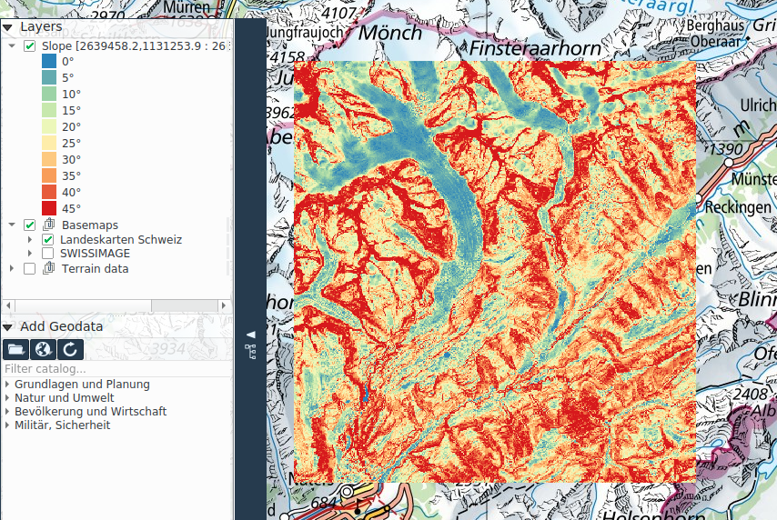

# Analyse

In der Registerkarte **_Analyse_** befinden sich die Werkzeuge zum Messen von Distanzen, Flächen, Kreise und Winkeln sowie verschiedene Geländeanalysefunktionen.

Um die Geländeanalysefunktionen verwenden zu können, muss im aktuellen Projekt ein Höhenmodell definiert sein. Eine Raster-Ebene kann in dessen Kontextmenü in der Kartenlegende als Höhenmodell ausgewählt werden.

## Distanzen, Flächen und Azimut Messen

Es werden vier Messmethoden angeboten:

+ Linie (Distanz)
+ Fläche
+ Kreisfläche
+ Azimuth

Sämtliche Messfunktionen arbeiten auf einem WGS84 Ellipsoid.

Nach dem Aktivieren einer Messfunktion kann der Benutzer eine entsprechende Messgeometrie im Kartenfenster zeichnen. Relevante Masse werden direkt neben der Messgeometrie angezeigt.

Für Distanz- und Flächenmessungen können mehrere Geometrien nacheinander gezeichnet werden. Das Messtotal wird im unteren Bereich des Kartenfensters angezeigt, wo auch die Messeinheit geändert werden kann. Ferner kann mittels dem Picker-Button eine existierende Geometrie gemessen werden.

## Höhenprofil und Sichtbarkeit

Mit der **_Profil Sicht_** Funktion können sowohl Höhenprofil wie auch Sichtbarkeitsanalysen durchgeführt werden. Um diese Funktion verwenden zu können, muss im Projekt ein Höhenmodell definiert sein. Eine Raster-Ebene kann in dessen Kontextmenü im Karteninhaltsverzeichnis als Höhenmodell ausgewählt werden.

Um ein Höhenprofil zu erstellen, kann der Benutzer auf der Karte eine Liniengeometrie zeichnen, entlang der das Profil gemessen werden soll. Das Resultat wird im separaten Dialogfenster dargestellt. Alternativ kann mittels Picker-Button auch eine entlang einer existierenden Liniengeometrie gemessen werden.

Besteht die Liniengeometrie aus nur einem Segment, kann entlang dieser Linie eine Sichtbarkeitsanalyse durchgeführt werden. Dazu muss im Höhenprofildialog die Sichtbarkeit Checkbox aktiv sein. Sichtbare bzw. unsichtbare Bereiche werden dann entsprechend Grün oder Rot gezeichnet. Fährt man mit der Maus in der Karte entlang der Messlinie, wird die entsprechende Position in der Graphik mit einem blauen Punkt angezeigt. Die Sichtbarkeitsanalyse berücksichtigt die Erdkrümmung. Konfigurationsmöglichkeiten der Sichtbarkeitsanalyse sind die Beobachterhöhe, die Zielhöhe sowie ob diese Höhen relativ zum Terrain oder dem Meeresspiegel interpretiert werden sollen. 

Die Höhenprofilgraphik lässt sich zusätzlich in die Zwischenablage kopieren, oder als Bild in die Karte einbetten.

## Neigung und Schummerung

Die Funktion **_Neigung_** berechnet ein Neigungsprofil des Geländes als farbkodiertes Raster.

Die Funktion **_Schummerung_** berechnet die Schattierung des Geländes, welches Halbtransparent über die Karte gelegt wird.

Um diese Geländeanalysefunktionen verwenden zu können, muss im Projekt ein Höhenmodell definiert sein.

Beide dieser Analysen werden innerhalb eines rechteckigen Auschnittes der Karte berechnet. Die Schummerung erfordert noch zusätzlich die Eingabe der horizontalen und vertikalen Winkel der Lichtquelle.

Die Ergebnisse der Neigungs- und Schummerungsanalysen werden als Raster-Ebenen der Karte hinzugefügt, und erscheinen dementsprechend im Karteninhaltsverzeichnis. Beim Speichern des Projektes werden diese Datensätze als Anhänge in der *<Projektname>.qgz* Projektdatei gespeichert.

## Einsehbarkeit

Das Werkszeug **_Einsehbarkeit_** berechnet den sichtbaren bzw. unsichtbaren Geländebereich in einem Kreissektor, ausgehend vom Kreismittelpunkt – dem Beobachterstandort. Die Einsehbarkeitsanalyse berücksichtigt die Erdkrümmung.

Um diese Geländeanalysefunktionen verwenden zu können muss im Projekt ein Höhenmodell definiert sein.

Die Einsehbarkeitsanalyse wird innerhalb eines Kreissektors oder einem Vollkreis berechnet. Beim ersten Mausklick auf die Karte wird der Beobachterstandort definiert, der zweite definiert den Radius, und der dritte den Sektoröffungswinkel. Falls die numerische Eingabe aktiv ist, können diese Parameter auch numerisch eingegeben werden. Nach dem erfassen der Analysefläche können die Berechnungsparameter angepasst werden, nämlich die Beobachterhöhe, die Zielhöhe, ob diese Höhen relativ zum Terrain oder dem Meeresspiegel interpretiert werden sollen, und ob der sichtbare oder der unsichtbare Berich angezeigt werden soll.

Das Ergebnis wird als Rasterebene der Karte hinzugefügt. Beim Speichern des Projektes wird diese als Anhang in der *<Projektname>.qgz* Projektdatei gespeichert.
