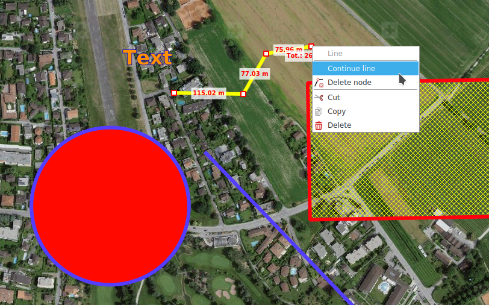

# Zeichnen

## Geometrie und Texte (Redlining)

Es können Geometrien der folgenden Typen gezeichnet werden:

+ Punkte
+ Linien
+ Polygone
+ Rechtecke
+ Kreise

Abhängig vom Geometrietyp können für Rand und Füllung die Farbe und das Muster angepasst werden, sowie auch die Linienbreite oder die Punktsymbolgrösse.

Für **_Texte_** können Schriftart und Grösse sowie Füllfarbe angepasst werden.

Gezeichnete Geometrien und Texte werden in der **_Redlining_** Ebene im Karteninhaltsverzeichnis abgelegt.

Bereits gezeichnete Geometrien oder Texte können nachträglich editiert werden, indem sie auf der Karte selektiert werden. Selektierte Objekte lassen sich verschieben, und, abhängig vom Geometrietyp, können Knotenpunkte individuell verschoben werden sowie per Kontextmenü erstellt oder entfernt werden.

Bestehende Linien- und Polygongeometrien lassen sich per Kontextmenü auf den Knoten fortführen.

Editieroperationen an einer Redlining-Zeichnung können via CTRL+Z und CTRL+Y oder mit den entsprechenden Schaltflächen am unteren Kartenrand rückgängig gemacht bzw. wiederholt werden

Beim Erstellen und Editieren von Geometrien werden gleichzeitig relevante Messwerte angezeigt.

Redlining-Zeichnungen können per Kontextmenü oder den üblichen Tastaturkürzel CTRL+C, CTRL+X und CTRL+V kopiert/ausgeschnitten und eingefügt werden. Mehrere Redlining-Zeichnungen können zusammen mit der CTRL-Taste selektiert werden und als Gruppe verschoben, kopiert, ausgeschnitten und eingefügt werden.

## Stecknadeln

Stecknadeln sind georeferenzierte **_Positions-Marker_**, welche zusätzlich mit einem Name sowie mit weiteren Anmerkungen versehen werden können.

Im Tooltip einer platzierten Stecknadel können Position und Höhe abgelesen werden. Ein Doppelklick auf die Stecknadel öffnet dessen Attributdialog. Web-Links können von einem Webbrowser in das Textfeld kopiert werden. Per Rechtsklick auf die Stecknadel kann dessen Position in die Zwischenablage kopiert werden.

Stecknadeln können in der globalen Suche nach Name und Anmerkungen durchsucht werden.

## Bild hinzufügen

### Rasterbilder

Rasterbilder in den üblichen Formaten (JPG, PNG, BMP) können als **_Annotationen_** der Karte hinzugefügt werden. Diese werden in einer Sprechblase angezeigt. Falls das Bild mit einer Georeferenzierung (EXIF-Tags) versehen ist, wird die Sprechblase am entsprechenden Ort platziert und die Position blockiert. Per Kontextmenü kann die Positionssperrung aktiviert oder deaktiviert werden. Ein Doppelklick auf die Sprechblase öffnet das Bild mit dem Standardbildbetrachtungsprogramm des Betriebssystems. Die Grösse der Sprechblase kann an dessen Eckpunkten verändert werden.

Rasterbilder werden in der Bilder Ebene angelegt.

### Vektorgraphiken

Ebenfalls durch die **_Bild hinzufügen_** Funktion lassen sich SVG Graphiken der Karte hinzufügen. Diese können mit der Maus durch ziehen an den entsprechenden Kontrollpunkte vergrössert bzw. verkleinert sowie rotiert werden.

Vektorgraphiken werden in der **_SVG Graphiken_** Ebene abgelegt.

## Einfügen

Mit der Funktion **_Einfügen_** lassen sich verschiene Objekte aus der Zwischenablage in die Karte einfügen:

- Geometrien: Diese werden als Redlining Objekt eingefügt
- MSS Symbole: Diese werden in der ausgewählten MilX Ebene eingefügt
- SVG Graphiken: Diese werden in der **_SVG Graphiken_** eingefügt.

## SymTaZ Symbole

SymTaZ ist ein externes Programm mit dem sich Symbole, taktische Zeichen und zivile Signaturen für militärische Schriftstücke gemäss Reglement 52.002.03 der Schweizer Armee erstellen lassen. Diese Symbole können in KADAS importiert werden, entweder durch die **_In Zwischenablage kopieren (Textform)_** Funktion in SymTaZ gefolgt von **_Einfügen_** in KADAS, oder durch speichern als SVG in SymTaZ und anschliessendes öffnen via **_Bild hinzufügen_** in KADAS.

## Führungsraster

Das Führungsraster ist ein Raster, bei welcher die Zeilen un Spalten mit Zahlen bzw. Buchstaben beschriftet werden. Das Führungsraster wird in eigener eigenen Ebene abgelegt und erscheint in der Kartenlegende. Sämtliche Gittereigenschaften sowie die Berschriftungsdarstellung lassen sich anpassen. Standardmässig wird das Gitter entsprechend dem aktuellen Kartenausschnitt erstellt. Es können beliebig viele Führungsrasterebenen erstellt werden.

## Bullseye

Ein Bullseye wird als eine Anzahl von konzentrischen Kreisen um einen ausgewählten Punkt und passende Achsen gezeichnet, die in regelmäßigen Abständen liegen. Analog zum Führungsgitter wird es in einer eigenen Ebene gespeichert, und verschiedene Eigenschaften sind frei konfigurierbar.

## Objekte löschen

Einzelne Objekte lassen sich per Kontextmenü oder DEL-Taste löschen. Das **_Objekte löschen_** Werkzeug erlaubt es, mehrere Objekte auf einmal in einem ausgewählten Ausschnitt zu löschen. Diese Funktion ist im Navigationsmodus auch per CTRL+Rechteck aufziehen aufrufbar.

