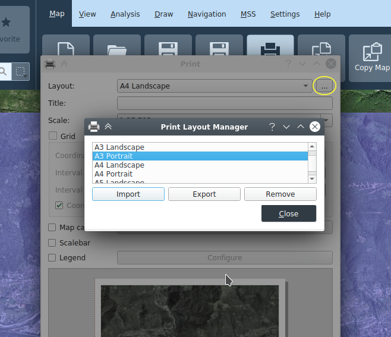

# Karte

## Projekte

Karten können als Projekte geladen und gespeichert werden. Es wird das QGIS Projektformat verwendet, mit Endung _*.qgz_. Projekte werden aus Vorlagen erstellt. Beim Starten der Applikation wird automatisch ein Projekt aus einer Online- oder Offline-Vorlage erstellt, abhängig davon, ob der Rechner am Netz angeschlossen ist.

## Neue Projekte anlegen und Speichern

Mit den Funktionen **_Neu_**, **_Öffnen_**, **_Speichern_** und **_Speichern als_** können neue Projekte (aus einer Vorlage) erstellt werden, existierende Projekte geöffnet werden und Projekte gespeichert werden.

## Projekte öffnen

Gespeicherte Karten (Projekte) können mit der Funktion **_Öffnen_** geladen werden.

## Drucken

Die aktuelle Karte kann über die Funktion **_Drucken_** auf den Drucker ausgegeben oder in einer Datei gespeichert werden.

Das Drucken basiert auf Vorlagen. Standardmässig werden Vorlagen für A0 bis A6 sowohl Quer- als Hochformat angeboten, sowie eine Custom Vorlage.

Bei ausgewählter Vorlage wird im Hauptkartenfenster ein blaues halb-transparentes Rechteck angezeigt, welches dem zu druckenden Ausschnitt entspricht. Bei den Vorlagen mit fixem Papierformat kann dieses Rechteck in der Hauptkarte verschoben werden, um den Druckbereich anzupassen. Die Grösse des Ausschnitts wird vom Papierformat und dem im Druckdialog angegebenen Massstab abgeleitet. Bei der _Custom_ Vorlage wird der Ausschnitt zusammen mit dem Massstab im Druckdialog numerisch definiert, und das resultierende Papierformat wird diesen Angaben entsprechend dynamisch berechnet.

Beim Drucken können zusätzliche Elemente, Koordinatengitter, Kartenkartusche, Legende, und Massstabbalken je nach Wunsch ein- oder ausgeblendet werden. Die Position dieser Elemente ist in der Vorlage definiert. 

### Druckdialog

+ **Vorlage**: Auswahl der Druckvorlage. Es wird eine Vorschau der Druckausgabe angezeigt.
+ **Titel**: Titel, der auf der Druckausgabe angezeigt wird.
+ **Massstab**: Druckmassstab
+ **Gitter**: Wird der Abschnitt Gitter aufgeklappt, wird im Ausdruck ein Gitternetz hinterlegt.
  + **Koordinatensystem**: Wahl des Gitter-Koordinatensystems
  + **X Intervall**: Abstand der Gitternetzlinien in X-Richtung
  + **Y Intervall**: Abstand der Gitternetzlinien in Y-Richtung
  + **Koordinatenbeschriftungen**: Ein-/Ausschalten der Gitternetzbeschriftungen
+ **Kartenkartusche**: Ein-/Ausschalten der Kartusche
+ **Kartenkartusche anpassen**: Konfiguration der Kartusche
+ **Massstabsbalken**: Ein-/Ausschalten der Masstabsanzeige
+ **Legende**: Ein-/Ausschalten der Legende, über *Anpassen* kann separat gewählt werden, welche Ebenen in der Legende erscheinen
+ **Dateiformat**: Auswahl des Formats für die Datei-Export Funktion

### Druckvorlagen

Die Druckvorlagen die im Projekt enthalten sind können im Druckzusammenstellungsdialog verwaltet werden, der durch die Schaltfläche rechts vom der Druckvorlageselektion geöffnet werden kann. Dort können einzelne Vorlagen importiert, exportiert sowie aus dem Projekt entfernt werden.

### Karten-Kartusche

Im diesem Dialog wird der Inhalt der **_Kartusche_** bestimmt. In den Eingabefeldern ist die Funktion des Textes hinterlegt. Ist die Checkbox **Übung** aktiviert, werden die Angaben zu einer Übung in der Kartusche angezeigt.

Des weiteren kann im Kartuschen-Dialog der Kartuscheninhalt als einzelständige XML Datei importiert und exportiert werden.

### Druckausgabe

+ **Exportieren**: Es wird eine Datei im gewählten Format erstellt.
+ **Drucken**: Über den Druckdialog kann ein eingerichter Drucker ausgewählt und die Ausgabe gestartet werden.
+ **Schliessen**: Der Druckdialog wird geschlossen.
+ **Fortgeschritten**: Aufruf der der erweiterten Layout-Funktionalität 

## Karte Kopieren / Karte Speichern

Diese Funktionen erlauben den im Hauptfenster sichtbaren Kartenausschnitt in die Zwischenablage oder in eine Datei zu speichern. Es wird jeweils immer genau der Inhalt des Kartenfenster gespeichert.

Die Funktion **_Karte speichern_** öffnet einen Datei-Dialog, in dem der Ausgabepfad und der Bildtyp (PNG, JPG, etc.) ausgewählt werden können. Eine im gleichen Ordner gespeicherte "World"-Datei (mit der Erweiterung PNGW, JPGW, etc.) georeferenziert das Bild.

## KML / KMZ Export und Import

Der Karteninhalt kann als KML oder KMZ exportiert werden. Bilder, Rasterebenen sowie MSS-Symbole der Lagedarstellung werden nur im KMZ Format exportiert.

KML/KMZ Dateien können in KADAS auch importiert werden.

*Hinweis*: KMZ und KML sind verlustbehaftete Export-Formate sind, und daher nicht geeignet für den Austausch zwischen KADAS Anwender ist. Dazu sollte das native _*.qgs_ Projektformat verwendet werden.

## GPKG Export und Import

Das KADAS GeoPackage (GPKG) ist ein SQLite basiertes Dateiformat, welches sowohl ein einem Projekt enthaltene lokale Geodaten als das Projekt selbst in eine Datei zusammenpackt, und bietet somit eine praktische Möglichkeit, Projekte und Daten auszutauschen.

Beim GPKG-Projektexport kann gewählt werde, welche Geodaten ins GeoPackage geschrieben werden sollen, das im GPKG gespeicherte Projekt wird dann die Daten direkt aus dem GPKG laden. Zudem kann entschieden werden, ob ein existierendes GPKG aktualisiert oder komplett ersetzt werden soll. Im ersten Fall bleiben bestehende Daten im GPKG enthalten, auch wenn sie vom Projekt nicht referenziert werden.

Beim Import wird ein KADAS Projekt im GPKG gesucht und geöffnet, dabei werden aus dem GPKG referenzierte GeoDaten direkt daraus geladen.

