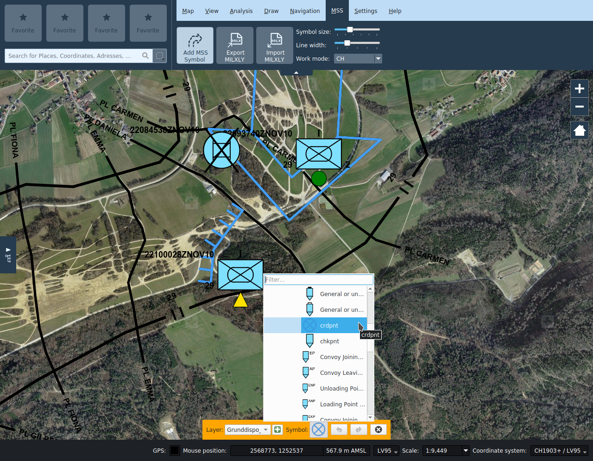
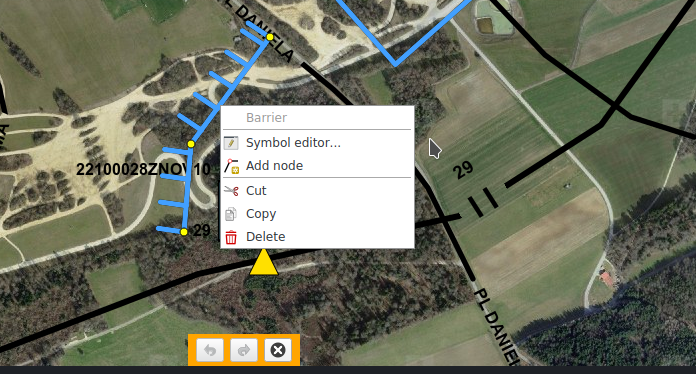

# MSS

The MSS tab contains the functionality for creating situation reports. This tab is inactive if the KADAS MSS-MilX interface is not installed. The situation report functionality includes drawing and editing MSS symbols and managing MilX layers.

## Draw MSS symbols

The **_Add Symbol_** button opens a searchable gallery of MSS icons. After an icon has been selected in the gallery, it can be placed on the map.

Symbols are stored in MilX layers. These are visible in the map layer tree. In the symbol gallery new MilX layers can be created as well specified to which layer newly drawn symbols are added.

## Edit MSS symbols

Already drawn symbols can be subsequently edited by selecting them on the map. **_Selected objects_** can be moved and, depending on the symbol type, nodes can be moved individually or created or removed via the context menu. The MilX symbol editor can be opened by double-clicking or editing the context menu.

For **_one-point symbols_**, the user can place the symbol at an offset from the anchor point. The latter is displayed as a red point when editing the symbol, and is by default placed in the middle of the symbols. If the symbol is moved by its anchor point, then the symbol will be moved together with the anchor. If the symbols is moved by its symbol graphic, then only the latter is moved, and a line between the anchor point and the symbol graphic center will appear. The offset can be removed from the symbol context menu.

For **_multi-point symbols_**, node points and control points, if any, can be edited depending on the respective symbol schema. When editing the symbol, node points are drawn as yellow points, and control points as red points. Latter typically control attributes such as arrow widths or weighting parameters of bezier. Besides moving these points, the user can add new nodes or delete existing ones from the context menu.

Similar to redlining objects, MSS symbols can be moved, copied, cut and pasted individually or as a group. In addition to the entries in the context menu and the usual keyboard shortcuts, there are also the **_Copy to..._** and **_Move to..._** buttons at the bottom of the map frame. The latter allow to explicitly specify a target layer, otherwise the currently selected MilX layer is taken as the target layer. If no MilX layer is selected, the user will be asked to specify the destination layer.

## Layer management

MSS symboles are stored in a dedicated **_MilX layer_** in the layer tree. Multiple independent MilX layers can be created. In the symbol gallery, the user can choose to which layer a new symbol will be added to. In the layer tree, individual layers can be enabled or disabled.

A special property of MilX layers is the possibility to mark them as **_Approved_**. Approved layers cannot be edited, and most symbols are drawn black and white. The user can set whether a layer is approved in the context menu of the layer tree.

## MilX import and export

MilX layers can be exported as MILXLY or MILXLYZ layers, and existing MILXLY or MILXLYZ layers can be imported. 

MILXLY (and the compressed variant MILXLYZ) is a format for the exchange of situation reports. It contains only MSS symbols of the situation report, and no further objects like redlining, pins or camera pictures.

When **_exporting_** to MILXLY(Z) you can select which MilX layers to export and in which version the file should be created. In addition, you can choose whether to export the map cartouche defined in the print dialog.

**_Importing_** a MILXLY(Z) file imports all the layers it contains. If the MSS file contains symbol definitions according to an older standard, these are automatically converted. Possible conversion losses or errors are communicated to the user. If one of the imported layers contains a cartouche, the user will be asked if they should be imported into KADAS.

## Symbol size, line width, work mode, leader line width and color

These settings influence the display of all MSS symbols on the map. They can be overriden individually for each layer in the MSS tab of the layer properties dialog.

