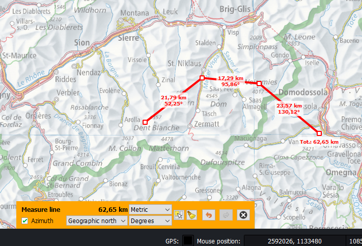

# Analyse

L’onglet **_Analyse_** contient les outils de mesures des distances, des surfaces, des circonférences et des angles ainsi que diverses fonctions d’analyse de terrain.

Pour utiliser les fonctions d’analyse de terrain, il faut définir un modèle d’altitude dans le projet actuel. Un niveau de raster peut être sélectionné comme modèle d’altitude dans son menu contextuel dans la légende de la carte.

## Mesurer des distances, surfaces et azimut

Quatre méthodes de mesure sont proposées :

+ Ligne (distance)
+ Surface
+ Surface circulaire
+ Azimut

Toutes les fonctions de mesures se basent sur un éllipsoïde WGS84.

En activant l’une des fonctions de mesures, l’utilisateur peut dessiner la géométrie de mesure correspondante dans la fenêtre de la carte. Les grandeurs pertinentes sont indiquées juste à côté de la géométrie de mesure.

Pour les mesures de géométrie et de distance, il est possible de dessiner plusieurs géométries l’une après l’autre. Le total des mesures s’affiche dans la partie inférieure de la fenêtre de la carte, là où l’unité de mesure peut aussi être modifiée. Plus loin, il est possible de mesurer une géométrie existante en cliquant sur le bouton Picker.

## Profil d’altitude et visibilité

La fonction **_Profil Mire_** permet d’établir des profils d’altitude et de réaliser des analyses de visibilité. Pour utiliser cette fonction, il faut définir un modèle d’altitude dans le projet. Un niveau de raster peut être sélectionné comme modèle d’altitude dans son menu contextuel dans le répertoire de la carte.

Pour établir un profil d’altitude, l’utilisateur peut dessiner une géométrie linéaire le long de laquelle le profil peut être mesuré. Le résultat s’affiche dans une fenêtre de dialogue séparée. À l’aide du boutton Picker, il est également possible de mesurer le long d’une géométrie linéaire existante.

Si la géométrie linéaire ne comprend qu’un seul segment, il est possible de réaliser une anayse de visibilité le long de cette ligne. Pour cela, la case visibilité doit être cochée dans la fenêtre de dialogue du profil d’altitude. Les zones visibles ou non visibles sont alors indiquées en rouge ou en vert. Si l’on suit la ligne de mesure sur la carte avec la souris, la position correspondante est indiquée dans le graphique par un point bleu. L’analyse de visibilité prend en compte la courbe terrestre. Les possibilités de configuration de l’analyse de visibilité sont la hauteur observateur et la hauteur du signal ; on peut également décider si ces hauteurs doivent être interprétées en fonction du terrain ou du niveau de la mer.

Le graphique de profil d’altitude peut également être copié dans l’archive provisoire ou être inséré dans la carte comme image.

## Pente et ombrage

La fonction **_Pente_** permet de représenter le profil de pente du terrain à l’aide d’un schéma à code couleurs.

La fonction **_Ombrage_** calcule l’ombrage du terrain, qui est superposé sur la carte en mi-transparence.

Pour utiliser ces fonctions d’analyse du terrain, il faut définir un modèle d’altitude dans le projet.

Ces deux analyses sont effectuées dans une portion rectangulaire de la carte. L’estompage nécessite également de saisir l’angle horizontal et vertical de la source de lumière.

Les résultats des analyses de pente et d’ombrage sont ajoutés à la carte comme niveaux de raster et apparaissent ainsi dans le répertoire de la carte. Lors de l’enregistrement du projet, ces données sont attachées au projet dans le fichier *<nom du projet>.qgz*.

## Bassin visuel

L’outil **_Bassin visuel_** calcule les zones de terrain visibles et invisibles dans un secteur circulaire dont le centre est l’emplacement de l’observateur. L’analyse de visibilité prend en compte la courbe terrestre.

Pour utiliser ces fonctions d’analyse du terrain, il faut définir un modèle d’altitude dans le projet.

L’analyse de visibilité est calculée au sein d’une portion de cercle ou d’un cercle complet. Le premier clic sur la carte permet de définir la position de l’observateur, le deuxième clic le rayon et le troisième l’angle d’ouverture du secteur. Si la saisie numérique est activée, ces paramètres peuvent également être saisis numériquement. Une fois que la surface à analyser a été saisie, les paramètres de calcul peuvent être modifiés, autrement dit l’altitude de l’observateur, la hauteur du signal, l’interprétation (ou non) de l’altitude en fonction du terrain ou du niveau de la mer et l’affichage (ou non) des portions de terrain visibles ou invisibles.

Après calcul, le résultat est ajouté à la carte sous forme de couche raster. Si vous sauvegardez le projet, cette couche sera attachée au projet dans le fichier *<nom du projet>.qgz*.

## Ephémérides

L'outil **_Ephémérides_** calcule les éphémérides du soleil et de la lune (position, heures de lever et de coucher, phase de la lune) à une position du terrain et à un moment donné dans le temps sélectionnés. La case à cocher permet de configurer si le relief est pris en compte pour le calcul.
