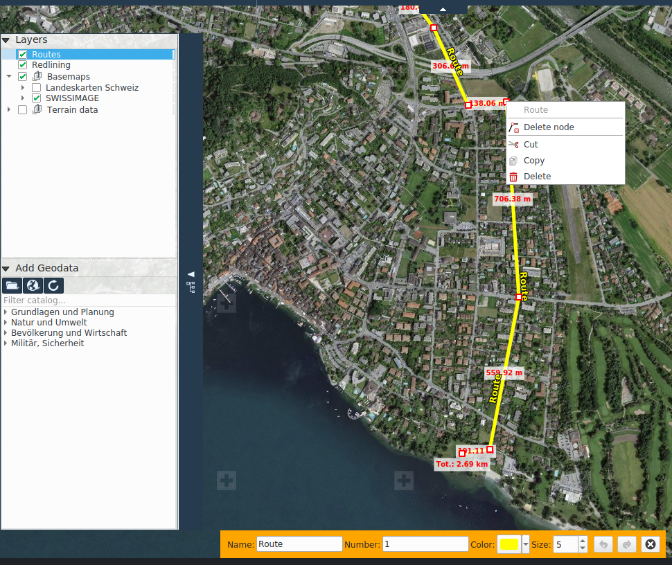

# Navigation

L’onglet GPS regroupe les fonctionnalités pour interagir avec un GPS connecté ainsi que les outils pour dessiner, importer et exporter des points de parcours et des routes GPX (GPS Exchange Format).

## Activer géolocalisation

Pour pouvoir utiliser un GPS avec KADAS sous Windows, il faut installer l’application GpsGate Splitter dans le système, v. [Configuration de GPSGate](gpsgate/gpsgate.md)

Le statut de la connexion GPS est indiqué dans la partie inférieure du programme. Le bouton statut GPS peut être activé ou désactivé pour établir ou couper la connexion. La couleur du bouton statut change en fonction de l’état de connexion.

+ **Noir** : GPS non activé
+ **Bleu** : la connexion est initialisée
+ **Blanc** : la connexion est initialisée mais aucune donnée n’a été reçue
+ **Rouge** : la connexion est initialisée mais aucune information sur la position n’est disponible
+ **Jaune** : connexion initialisée, seulement 2D Fix
+ **Vert** : connexion initialisée, 3D Fix

Dès que KADAS reçoit des données sur la position GPS, un marqueur de position apparaît sur la carte.

## Se déplacer avec la géolocalisation

Cette fonction active le déplacement automatique de la portion de carte visible pour qu’elle soit centrée sur la position GPS mise à jour.

## Dessiner des waypoints et des itinéraires

Cette fonction permet de dessiner des waypoints et des itinéraires qui pourront être sauvegardés ultérieurement en tant que GPX, p.ex. pour les charger sur un GPS.

Les **_waypoints_** sont de simples points sur la carte qui peuvent être nommés.

Les **_itinéraires_** sont des lignes que l’on peut nommer et numéroter.

Les waypoints et les itinéraires ont leur propre niveau dans l’arborescence, Routes GPS, tout comme le niveau Redlining.

## Exportation et importation GPX

Ces fonctions permettent d’exporter des routes et points de parcours dessinés dans un fichier GPX, ainsi que d’importer un fichier GPX existant dans le niveau **_Routes GPS_**.

