# Composeur d'Impression 

Avec le Composeur d'Impression vous pouvez créer de jolies cartes et des atlas qui peuvent être imprimés ou sauvegardés en tant que fichier PDF, image ou fichier SVG. C'est un moyen puissant de partager de l'information géographique produite avec KADAS qui peut être incluse dans des rapports ou publiée.

Le Composeur d'Impression fournit des fonctionnalités de plus en plus riches de mise en page et d'impression. Il vous permet d'ajouter des éléments tels que le canevas de carte KADAS, des zones de textes, des images, des légendes, des échelles graphiques, des formes de base, des flèches, des tables attributaires et des cadres HTML. Vous pouvez modifier la taille, grouper, aligner positionner et faire tourner chaque élément et ajuster leurs propriétés pour créer votre mise en page. Le résultat peut être imprimé ou exporté dans plusieurs formats d'image, en PostScript, PDF et SVG. Vous pouvez aussi l'enregistrer dans un modèle de mise en page de carte pour l'utiliser dans d'autres projets. Enfin vous pouvez générer un ensemble de cartes automatiquement grâce au Générateur d'Atlas. Une vue d'ensemble des fonctions disponibles est donnée dans la liste suivante:

*  *Enregistrer le projet*
*  *Nouveau composeur*
*  *Dupliquer une composition*
*  *Gestionnaire de Compositions*
*  *Charger depuis un modèle*
*  *Enregistrer le modèle*
*  *Imprimer ou exporter en PostScript*
*  *Exporter dans un format d'image*
*  *Exporter au format SVG*
*  *Exporter au format PDF*
*  *Annuler la dernière modification*
*  *Restaurer la dernière modification*
*  *Zoom sur l'emprise totale*
*  *Zoomer à 100%*
*  *Zoom +*
*  *Zoom -*
*  *Rafraîchir la vue*
*  *Déplacer le composeur*
*  *Zoomer sur une zone spécifique*
*  *Sélectionner/déplacer les objets dans le composeur de cartes*
*  *Déplacer le contenu*
*  *Ajouter une nouvelle carte à partir de la fenêtre principale de KADAS*
*  *Ajouter une image au composeur de cartes*
*  *Ajouter une étiquette au composeur de cartes*
*  *Ajouter une nouvelle légende au composeur de cartes*
*  *Ajouter une nouvelle échelle graphique au composeur d'impression*
*  *Ajouter une forme basique au composeur de cartes*
*  *Ajouter une flèche au composeur de cartes*
*  *Ajouter une table d'attributs dans le composeur de cartes*
*  *Ajouter du HTML*
*  *Grouper des objets du composeur d'impression*
*  *Dégrouper des objets du composeur d'impression*
*  *Verrouiller les objets sélectionnés*
*  *Déverrouiller tous les objets*
*  *Remonter l'objet sélectionné*
*  *Descendre l'objet sélectionné*
*  *Amener les objets sélectionnés au premier plan*
*  *Descendre les objets sélectionnés en arrière plan*
*  *Aligner les objets sélectionnés à gauche*
*  *Aligner les objets sélectionnés à droite*
*  *Aligner les objets sélectionnés au centre*
*  *Aligner les objets sélectionnés au centre verticalement*
*  *Aligner les objets sélectionnés en haut*
*  *Aligner les objets sélectionnés en bas*
*  *Aperçu de l'atlas*
*  *Première entité*
*  *Entité précédente*
*  *Entité suivante*
*  *Dernière entité*
*  *Impression de l'Atlas*
*  *Exporter l'Atlas en tant qu'images*
*  *Paramètres de l'Atlas*

Tous les outils du composeur d'impression sont disponibles dans les menus et la barre d'outils. Cette barre peut être affichée ou masquée en effectuant un clic droit dessus.

## Aperçu du Composeur d'impression 

L'ouverture du Composeur d'Impression vous donne un canevas blanc qui représente la surface de papier lorsqu'on utilise l'option d'impression. Initialement, vous trouvez des boutons sur le côté gauche du canevas pour ajouter des éléments du composeur de carte; le canevas de carte KADAS courant, les étiquettes de texte, les images, les légendes, les échelles graphiques, les formes de base, les flèches, les tables attributaires et les cadres HTML. Dans cette barre d'outils, vous trouver aussi des boutons de barre d'outils pour naviguer, zoomer sur une zone et déplacer la vue sur le composeur et des boutons de barre d'outils pour sélectionner un élément du composeur de carte et déplacer le contenu de l'élément carte.

La figure suivante montre la vue initiale du Composeur d'Impression avant qu'aucun élément n'y soit ajouté.

Sur la droite, à côté du canevas, vous trouverez deux panneaux. Le panneau supérieur contient les onglets *Éléments* et *Historique des commandes* et le panneau inférieur contient les onglets *Composition*, *Propriétés de l'objet* et *Génération d'atlas*.

-   L'onglet *Éléments* fournit une liste de tous les éléments du Composeur d'Impression ajouté au canevas.

-   L'onglet *Historique des commandes* affiche un historique des changements effectués dans le Composeur d'Impression. Avec un clic droit, il est possible de défaire et refaire des actions jusqu'à l'état choisi.

-   L'onglet *Composition* vous permet de définir la taille du papier, l'orientation, l'arrière-plan, le nombre de pages et la qualité d'impression pour le fichier de sortie en dpi/ppp. De plus vous pouvez activer l’ *Impression raster* qui permet de convertir tous les éléments en raster avant impression ou export en Postscript ou PDF. Vous pouvez également personnaliser les paramètres pour la grille et les guides.

-   L'onglet *Propriétés de l'objet* affiche les propriétés pour l'élément sélectionné sur la mise en page. Cliquez sur l'icône  *Sélectionner/déplacer un objet* pour sélectionner un élément (par exemple l'échelle graphique ou une étiquette) dans la feuille. Puis cliquez sur l'onglet *Propriétés de l'objet* et personnalisez les paramètres de l'élément sélectionné.

-   L'onglet *Génération d'atlas* permet d'activer la création d'un atlas en sortie de composeur et d'en gérer les paramètres.

-   Enfin, vous pouvez enregistrer votre mise en page avec le bouton  *Enregistrer le projet*.

En bas de la fenêtre de Composeur d'Impression, vous trouverez la barre d'état avec la position du curseur de la souris, le numéro de page et une liste déroulante permettant de choisir un niveau de zoom.

Vous pouvez ajouter de nombreux éléments au composeur. Il est également possible d'avoir plusieurs vues d'une carte, légendes ou échelles graphiques dans le canevas du Composeur d'Impression, sur une ou plusieurs pages. Chaque élément possède ses propres propriétés et dans le cas d'une carte, sa propre emprise géographique. Si vous voulez supprimer un élément du canevas du Composeur, vous pouvez le faire en utilisant les touches `Suppr.` ou `Retour arrière`.

### Outils de navigation 

Pour se déplacer sur la mise en page, quelques outils sont proposés:

-    *Zoom +*

-    *Zoom -*

-    *Zoom sur l'emprise totale*

-    *Zoomer à 100%*

-    *Rafraîchir la vue* pour actualiser l'affichage si nécessaire

-    *Déplacer le composeur*

-    *Zoom* (zoom sur une zone spécifique du Composeur)

Vous pouvez changer le niveau de zoom avec la molette de la souris ou la liste déroulante de la barre d'état. Si vous avez besoin de vous déplacer au sein du Composeur, vous pouvez maintenir la `barre espace` ou la molette de la souris enfoncée. Avec `Ctrl + barre espace`, vous passez temporairement en mode zoom + et avec `Ctrl + Shift + barre espace`, en mode zoom -.

## Session test 

Pour savoir comme créer une carte, veuillez suivre les instructions suivantes.

1.  Sur le côté gauche, sélectionnez le bouton de barre d'outils  *Ajouter une nouvelle carte* et dessinez un rectangle. A l'intérieur du rectangle dessiné, la carte de la vue KADAS est affichée .

2.  Sélectionnez le bouton de la barre d'outils  *Ajouter une nouvelle échelle graphique* et placez l'élément de la carte avec le bouton gauche de la souris dans le canevas du Composeur d'Impression. Une barre d'échelle sera ajoutée au canevas.

3.  Sélectionnez le bouton de la barre d'outils  *Ajouter une nouvelle légende* et dessinez un rectangle dans le canevas en maintenant enfoncé le bouton gauche de la souris. À l'intérieur du rectangle dessiné, la légende sera affichée.

4.  Sélectionnez l'icône  *Sélectionner/Déplacer un objet* pour sélectionner la carte sur le canevas et déplacez-le un peu.

5.  Tant que l'élément de carte est toujours sélectionné, vous pouvez aussi changer sa taille. Cliquez tout en maintenant enfoncé le bouton gauche de la souris sur un des coins de l'élément marqué par un petit rectangle blanc et déplacez-le pour changer la taille de la carte.

6.  Cliquez sur l'onglet *Propriétés de l'élément* dans le panneau inférieur gauche et trouvez le réglage pour l'orientation. Modifiez la valeur du paramètre *Orientation de la carte* sur'15.00° '. Vous devriez voir l'orientation de l'élément de carte changer.

7.  Enfin, vous pouvez enregistrer votre mise en page avec le bouton  *Enregistrer le projet*.

## Options du Composeur d'Impression 

Via le menu *Préférences ‣ Options du composeur*, vous pouvez définir les paramètres qui seront utilisés par défaut pendant votre travail.

-   *Valeurs par défaut pour les compositions* permet de spécifier la police de caractère par défaut.

-   Dans *Apparence de la grille*, vous définissez le style et la couleur de la grille. Il y a trois styles de grille: lignes en **Pointillés** ou **Continues** et **Croix**.

-   *Grille et guides par défaut* définit l'espacement, le décalage et la tolérance de la grille.

## Onglet Composition — Paramètres généraux de mise en page 

Dans l'onglet *Composition*, vous pouvez définir les paramètres généraux de votre mise en page.

-   Vous pouvez choisir un des formats *Préconfigurés* de papier ou entrer vos valeurs personnelles de *Largeur* et de *Hauteur*.

-   Une composition peut maintenant se répartir sur plusieurs pages. Par exemple, une première page montrant la carte, une deuxième la table d'attributs d'une des couches et une troisième un cadre HTML en lien avec le site internet de votre organisme. Choisissez le *Nombre de pages* à votre convenance. Vous pouvez choisir l’*Orientation* et la *Résolution de l'export*. Lorsque la case  *Impression raster* est cochée, tous les éléments seront rasterisés avant l'impression ou la sauvegarde en PostScript ou PDF.

-   *Grille et guides* vous permet de personnaliser les paramètres de la grille, comme *Espacement de la grille*, *Décalage de la grille* et *Tolérance d'accrochage*, à vos besoins. La tolérance est la distance maximale en-dessous de laquelle un objet est aimanté sur les guides intelligents.

L'accrochage à la grille et/ou aux guides peut s'activer depuis le menu *Vue*. Vous pouvez également y choisir de cacher ou afficher la grille et les guides.

## Options communes des éléments du composeur 

Les éléments du composeur disposent d'un ensemble de propriétés générales définies en bas de l'onglet *Propriétés de l'objet*: Position et taille, Rotation, Cadre, Fond, Identifiant de l'objet, Rendu.

-   *Position et taille* permet de définir la taille et la position du cadre contenant l'élément. Vous pouvez également choisir le *Point de référence* dont les coordonnées **X** et **Y** sont définies.

-   *Rotation* permet de définir un angle de rotation (en degrés) pour l'élément.

-   Le  *Cadre* permet d'afficher ou de cacher le cadre autour du label. Cliquez sur *Couleur du cadre* et *Épaisseur* pour modifier ces propriétés.

-   Utilisez le menu *Couleur d'arrière-plan* pour définir une couleur d'arrière-plan. Avec la boîte de dialogue, vous pouvez choisir une couleur.
-   Utilisez l’*Identifiant de l'objet* pour créer une lien avec d'autres éléments du Composeur. Ceci est utilisé par KADAS Serveur et tout client web potentiel. Vous pouvez donner un ID à un élément (par ex. une carte, une zone de texte), puis le client web peut envoyer des informations pour spécifier les propriétés de cet objet. La commande GetProjectSettings listera les éléments disponibles dans la mise en page avec leurs ID.

-   *Rendu* permet de choisir différents modes.

-   L'icône  *Défini par des données* à côté d'un champ signifie que vous pouvez associer le champ avec des données dans l'élément de carte ou utiliser des expressions. Elles sont particulièrement utiles avec la génération d'atlas.

KADAS propose maintenant des modes de rendu avancés pour les éléments du composeur, comme pour les couches vecteur et raster.

-   *Transparence* : Vous permet de rendre visible les couches situées en dessous. Utiliser le curseur pour adapter la visibilité de la couche vectorielle à vos besoins. Vous pouvez également définir directement le pourcentage de transparence dans la zone de texte située à côté.

-    *Exclure cet élément des exports*: Vous pouvez décider de faire un élément non visible dans tous les exports. Après avoir activé cette option, l'élément ne sera pas inclus dans les PDF, impressions etc...

-   *Mode de fusion*: Vous pouvez donner des effets de rendu spéciaux grâce à cet outil bien connu des logiciels de dessin. Les pixels de l'objet et des éléments sous-jacents sont fusionnés selon les manières décrites ci-dessous.

    > -   Normal: Il s'agit du mode de fusion standard qui utilise la valeur de transparence (canal alpha) du pixel supérieur pour le fusionner avec le pixel sous-jacent, les couleurs ne sont pas mélangées.
    >
    > -   Eclaircir: Sélectionne le maximum entre chaque composante depuis les pixels du premier-plan et de l'arrière-plan. Soyez attentif au fait que le résultat obtenu peut présenter un aspect dur et crénelé.
    >
    > -   Filtrer: Les pixels lumineux de la source sont affichés par dessus la destination, alors que les pixels sombres ne le sont pas. Ce mode est utile pour mélanger la texture d'une couche avec une autre (ie vous pouvez utiliser un relief ombré pour texturer une autre couche).
    >
    > -   Éviter: Ce mode va éclaircir et saturer les pixels sous-jacents en se basant sur la luminosité du pixel au-dessus. La brillance des pixels supérieurs vont donc provoquer une augmentation de la saturation et de la brillance des pixels inférieurs. Cela fonctionne mieux si les pixels supérieurs ne sont pas lumineux, sinon l'effet sera trop prononcé.
    >
    > -   Addition: Ce mode de fusion ajoute simplement les valeurs de pixels d'une couche avec une autre. Dans le cas de valeurs obtenues au-dessus de 1 (en ce qui concerne le RVB), du blanc sera affiché. Ce mode est approprié pour mettre en évidence des entités.
    >
    > -   Assombrir: Ce mode créé un pixel résultant qui conserve le plus petit composants parmi les pixels du premier-plan et de l'arrière-plan. Comme avec le mode éclaircir, le résultat peut présenter un aspect dur et crénelé.
    >
    > -   Multiplier: Dans ce cas, les valeurs pour chaque pixel de la couche supérieure sont multipliées par celles des pixels correspondants de la couche inférieure. Les images obtenues sont plus sombres.
    >
    > -   Découper: Les couleur sombres de la couche supérieure provoquent un obscurcissement des couches inférieures. Découper peut être utilisé pour ajuster et teinter les couches inférieures.
    >
    > -   Revêtement: Ce mode combine les modes multiplier et filtrer. Dans l'image résultante, les parties lumineuses deviennent plus lumineuses et les parties sombres plus sombres.
    >
    > -   Lumière douce: Ce mode est très similaire au mode revêtement, mais au lieu d'utiliser multiplier/filtrer il utilise découper/éviter. Il est censé émuler une lumière douce rayonnante dans l'image.
    >
    > -   Lumière dure: Ce mode est très similaire au mode revêtement. Il est censé émuler une lumière très intense projetée dans l'image.
    >
    > -   Différencier: Ce mode soustrait le pixel supérieur au pixel inférieur et vice-versa, de façon à toujours obtenir une valeur positive. Le mélange avec du noir ne produit aucun changement, étant donné que toutes les couleurs sont nulles.
    >
    > -   Soustraire: Ce mode soustrait les valeurs de pixel d'une couche avec une autre. En cas de valeurs négatives obtenues, du noir est affiché.
    >
## L'élément Carte 

Cliquez sur le bouton  *Ajouter une nouvelle carte* de la barre d'outils du composeur pour ajouter la carte telle qu'affichée dans la fenêtre principale de KADAS. Tracez ensuite un rectangle sur la mise en page avec le bouton gauche de la souris. Concernant l'affichage de la carte, vous pouvez choisir entre trois modes différents depuis l'onglet *Propriétés de l'objet*:

-   **Rectangle** est l'option par défaut. Elle n'affiche qu'un cadre vide avec un message *La carte sera imprimée ici*.

-   **Cache** affiche la carte dans sa résolution d'écran actuelle. Si vous zoomez sur le Composeur, la carte ne sera pas actualisée, mais l'image sera mise à l'échelle.

-   **Rendu** signifie que, si vous faites un zoom sur le Composeur, la carte sera actualisée, mais pour des raisons de performances, une résolution maximale a été prédéfinie.

**Cache** est le mode d'aperçu par défaut pour un Composeur nouvellement créé.

Vous pouvez redimensionner l'élément de la carte en cliquant sur le bouton  *Sélectionner/déplacer un objet*, en sélectionnant l'élément, et en déplaçant un des curseurs bleus dans le coin de la carte. Avec la carte sélectionnée, vous pouvez maintenant adapter plus de propriétés dans l'onglet *Propriétés de l'objet*.

Pour déplacer les couches au sein de l'élément carte, sélectionnez-le puis cliquez sur l'icône  *Déplacer le contenu de l'objet* et déplacez les couches dans le cadre de l'élément de carte avec le bouton gauche de la souris. Après avoir trouvé le bon emplacement, vous pouvez figer la position de cet élément au sein du Composeur. Sélectionnez l'élément de carte et utilisez l'outil  *Verrouiller les objets sélectionnés* ou encore dans la colonne verrouillage de l'onglet *Éléments*. Un objet verrouillé ne peut être sélectionné qu'en utilisant l'onglet *Éléments*. Une fois sélectionné, il est possible d'utiliser ce même onglet pour le déverrouiller. L'icône *Déverrouiller tous les objets* permet de déverrouiller tous les objets du composeur.

### Propriétés principales 

La zone *Propriétés principales* de l'onglet *Propriétés de l'objet* de la carte propose les fonctionnalités suivantes:

-   Les options d’**Aperçu** vous permettent de choisir parmi les modes *Cache*, *Rendu* ou *Rectangle* comme décrits ci-dessus. Si vous changez la vue dans la fenêtre principale de KADAS en modifiant des couches vecteurs ou raster, vous pouvez mettre à jour le Composeur en sélectionnant l'élément carte puis en cliquant sur le bouton **\[Mise à jour de l'aperçu\]**.

-   Le champ *Échelle*  permet de préciser manuellement une valeur d'échelle.

-   Le champ *Rotation de carte*  vous permet de définir l'angle de rotation de l'élément de la carte, dans le sens horaire, en degrés. C'est ici que la rotation de la vue de carte peut être imitée. Notez qu'un cadre de coordonnées correct ne peut être obtenu que lorsque l'angle de rotation a la valeur par défaut de 0 et que lorsqu'une *Rotation de carte* est définie, il ne peut plus être modifié.

-    *Dessiner les objets du canevas de la carte* permet de montrer les annotations placées sur la carte dans la fenêtre principale de KADAS.

-   Vous pouvez choisir de verrouiller les couches affichées sur la carte. Cochez  *Verrouiller les couches pour cette carte*. Après cela, toute couche qui serait rendue visible ou invisible sur la carte de la fenêtre principale de KADAS n'apparaîtra ou ne disparaîtra pas de la carte dans le composeur. Mais, le style et l'étiquetage des couches verrouillées sont toujours mis à jour par la fenêtre principale de KADAS. Vous pouvez éviter ce comportement en utilisant *Verrouiller les styles de couche pour cette carte*.

-   Le bouton  vous permet d'ajouter rapidement toutes les vues prédéfinies que vous avez préparées dans QGIS. En cliquant sur le bouton , vous pourrez consulter la liste des vues prédéfinies et sélectionner celle que vous voulez afficher. Le canevas de carte verrouillera automatiquement les couches prédéfinies en activant la  *Verrouiller les couches pour cette carte*. Si vous voulez désélectionner ce qui est prédéfini, décochez la  et appuyez sur le bouton . Consultez <a href="../introduction/qgis_gui.html#label-legend">*Légende de la carte*</a> pour voir comment créer des vues prédéfinies.

### Emprise 

La zone *Aperçus* de l'onglet *Propriétés de l'objet* de la carte propose les fonctionnalités suivantes:

-   L’**Emprise** vous permet de définir l'emprise de la carte en utilisant les valeurs X et Y minimales et maximales puis de cliquer sur le bouton **\[Fixer sur l'emprise courante du canevas de la carte\]**. Ce bouton paramètre l'emprise de la carte du composeur avec l'emprise de la vue courante dans l'application KADAS. Le bouton **\[Voir l'étendue sur la carte\]** fait exactement l'inverse: il met à jour l'emprise de la carte dans l'application QGIS avec l'étendue de la carte dans le composeur.

Si vous changez l'affichage sur la toile du canevas en changeant les propriétés vectorielles ou matricielles, vous pouvez mettre à jour l'affichage de Print Composer en sélectionnant l'élément de carte dans Print Composer et en cliquant sur le bouton **\[Actualiser prévisualisation\]** dans l'onglet *Propriétés des éléments* de l'élément carte.

### Graticules 

La boîte de dialogue *Graticules* de l'onglet *Propriétés de l'objet* de la carte propose la possibilité d'ajouter plusieurs graticules à l'élément carte.

-   Avec les boutons plus et moins, vous pouvez ajouter ou enlever une grille sélectionnée.

-   Avec les boutons haut et bas, vous pouvez déplacer une grille dans la liste et configurer la priorité d'affichage.

Lorsque vous double-cliquez sur la grille ajoutée, vous pouvez lui donner un autre nom.

Après avoir ajouté un graticule, vous pouvez activer l'option  *Afficher le graticule* pour superposer une grille sur l'élément carte. Développez cette option pour accéder à de nombreuses options de configuration.

Comme type de graticule, vous pouvez utiliser *Continue*, *Croix*, *Marqueurs* ou *Cadre et annotation seulement*. *Cadre et annotation seulement* est tout particulièrement utile lorsque vous travaillez avec des cartes qui ont subi une rotation ou des graticules reprojectés. Dans la section divisions de la boîte de dialogue Cadre du graticule mentionnée ci-dessous vous avez un tel paramètre. La symbologie du graticule peut être définie. De plus, vous pouvez définir l'intervalle dans les directions X et Y, un décalage en X et Y et l'épaisseur utilisée pour les croix ou les lignes du type de graticule.

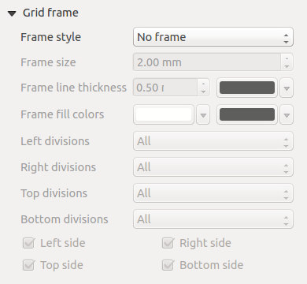

-   Il y a différentes options pour créer le cadre qui contient la carte. Les options suivantes sont disponibles: Pas de cadre, Zébré, Marqueurs à l'intérieur, Marqueurs à l'extérieur, Marqueurs à l'intérieur et à l'extérieur et Cadre simple.

-   Avec les paramètres Afficher uniquement la latitude et Afficher uniquement la longitude dans la section Afficher les coordonnées, vous avez la possibilité de prévenir la confusion entre les coordonnées de latitude/y et longitude/x affichées sur le côté lorsque vous travaillez avec des cartes tournées ou des grilles re-projetées.

-   Un mode de rendu avancé est également disponible pour les graticules.

-   La  *Afficher les coordonnées* permet d'ajouter les coordonnées au cadre de la carte. Vous pouvez choisir le format numérique des annotations, les options vont de décimal à degré, minute, seconde, avec ou sans suffixe, alignés ou non Vous pouvez choisir quelles annotations afficher. Les options sont: Tout afficher, Afficher uniquement la latitude, Afficher uniquement la longitude, Désactivé (aucune). Ceci est utile quand une rotation est appliquée à la carte. Les annotations peuvent être placées à l'intérieur ou à l'extérieur du cadre. L'orientation des annotations peut être définie par Horizontal, Ascendant vertical ou Descendant vertical. Finalement, vous pouvez définir la police, la couleur de police, la distance par rapport au cadre et la précision des coordonnées.

### Aperçus 

La zone *Aperçus* de l'onglet *Propriétés de l'objet* de la carte propose les fonctionnalités suivantes:

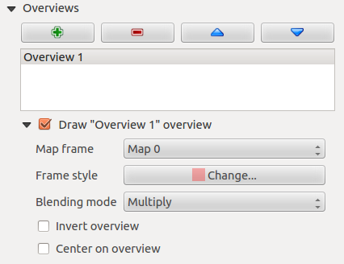

Vous pouvez choisir de créer un aperçu de carte, qui montre l'étendue des autres carte(s) qui sont disponibles dans le composeur. Premièrement, vous devez créer la carte(s) que vous voulez inclure dans l'aperçu de carte. Ensuite, vous créez une carte que vous voulez utiliser comme aperçu de carte, simplement comme une carte normale.

-   Avec les boutons plus et moins, vous pouvez ajouter ou enlever un aperçu.

-   Avec les boutons haut ou bas, vous pouvez déplacer un aperçu dans la liste et configurer la priorité d'affichage.

Ouvrez *Aperçus* et cliquez sur le bouton-icône plus vert pour ajouter un aperçu. Initialement, cet aperçu est nommé *Aperçu 1*. Vous pouvez changer le nom lorsque vous double-cliquez sur l'élément nommé *Aperçu 1* et ensuite le renommer.

Lorsque vous sélectionnez l'élément aperçu dans la liste, vous pouvez le personnaliser.

-   L'option  *Afficher l'aperçu *&lt;nom\_aperçu&gt;* doit être activée pour afficher l'étendue du cadre de la carte sélectionnée.

-   La liste combo *Cadre de carte* peut être utilisée pour sélectionner l'élément carte dont les extensions seront affichées sur l'élément carte présent.

-   Le *Style du cadre* vous permet de changer le style du cadre de l'aperçu.

-   Le *Mode de fusion* vous permet de mettre une transparence et un mode de fusion différent.

-   Si la case  *Inverser l'aperçu* est cochée, un masque est créé: l'emprise de l'autre zone de carte apparaît clairement alors que le reste est mis en transparence en utilisant le mode de fusion choisi.

-   La  *Centrer sur l'aperçu* paramètre l'emprise du cadre d'aperçu au centre de la carte d'aperçu. Vous pouvez activer uniquement un seul élément d'aperçu au centre lorsque vous avez plusieurs aperçus.

## L'élément Étiquette 

Pour ajouter une zone de texte, cliquez sur le bouton  *Ajouter une nouvelle étiquette*, placez l'élément sur la page par un clic-gauche et personnalisez son apparence grâce aux *Propriétés de l'objet*.

L'onglet *Propriétés de l'objet* d'un élément étiquette propose la fonctionnalité suivante pour l'élément étiquette:

### Propriétés principales 

-   C'est l'endroit où le texte (HTMLou pas) ou l'expression sont à insérer pour être affichés dans le Composeur.

-   Le texte saisi peut être interprété comme du code HTML si vous cochez la case  *Afficher en HTML*. Vous pouvez ainsi insérer une URL, une image cliquable qui renvoie à une page web ou tout autre code plus complexe.

-   Vous pouvez également insérer une expression. Cliquez sur **\[Insérer une expression...\]** pour ouvrir une nouvelle fenêtre. Construisez une expression en choisissant parmi les fonctions disponibles dans la partie gauche de cette fenêtre. Deux catégories de fonctions sont très utiles, notamment lorsque l'on utilise la génération d'atlas: les fonctions de géométrie et d'enregistrement. En bas de la fenêtre, un aperçu du résultat s'affiche.

### Apparence 

-   Définissez la *Police* en cliquant sur le bouton **\[Police...\]** ou une *Couleur de police* en sélectionnant une couleur via l'outil de sélection de couleur.

-   Vous pouvez spécifier des marges horizontale et verticale différentes, en millimètres. Il s'agit de la marge à partir du coin de l'objet. L'étiquette peut être positionnée en dehors de ses limites par exemple lors d'un alignement avec d'autres objets. Dans ce cas, utilisez des valeurs négatives pour les marges.

-   Utiliser *Alignement* est un autre moyen pour positionner votre étiquette. Notez que par exemple, en utilisant *Alignement horizontal* avec *Au centre*, la *Marge horizontale* n'est pas prise en compte.

## L'élément Image 

Pour ajouter une image, cliquez sur l'icône  *Ajouter une image* et placez l'élément sur le Composeur avec le bouton gauche de votre souris. Vous pouvez modifier la position et l'apparence avec l'onglet *Propriétés de l'objet* après avoir sélectionné l'élément.

L'onglet des *Propriétés principales* d'une image proposent les fonctionnalités suivantes:

Vous devez d'abord sélectionner l'image que vous voulez afficher. Il y a plusieurs moyens de configurez la *Source de l'image* dans la zone **Propriétés principales**.

1.  Utilisez le bouton parcourir  de la *Source de l'image* pour sélectionner un fichier sur votre ordinateur en utilisant la boîte de dialogue de l'explorateur. L'explorateur commencera dans la librairie SVG fournie avec KADAS. Outre *SVG*, vous pouvez aussi sélectionner d'autres formats d'image comme *PNG* ou *JPG*.

2.  Vous pouvez entrer la source directement dans la zone de texte *Source de l'image*. Vous pouvez même fournir une adresse URL distante à une image.

3.  Depuis la zone **Rechercher dans les répertoires**, vous pouvez également sélectionner une image depuis *Chargement des aperçus...* pour définir l'image source.

4.  Utilisez le bouton Source de définition  pour définir l'image source depuis un enregistrement ou en utilisant une expression régulière.

Avec l'option *Mode de redimensionnement*, vous pouvez définir comment l'image est affichée lorsque le cadre change, ou choisir de redimensionner le cadre de l'élément image afin qu'il s'ajuste avec la taille originale de l'image.

Vous pouvez sélectionner un des modes suivants:

-   Zoom: Agrandit l'image au cadre tout en conservant les proportions de l'image.

-   Étirement: Étire une image pour l'ajuster à l'intérieur du cadre, ignore les proportions.

-   Découper: Utilisez ce mode uniquement pour des images raster, il définit la taille de l'image à la taille de l'image originale sans mise à l'échelle, et le cadre est utilisé pour découper l'image, donc seule la partie de l'image à l'intérieur du cadre est visible.

-   Zoom et redimensionnement du cadre: Agrandit l'image pour s'ajuster avec le cadre, puis redimensionne le cadre pour s'ajuster à l'image résultante.

-   Redimensionner le cadre à la taille de l'image: Définit la taille du cadre pour correspondre à la taille originale de l'image sans mise à l'échelle.

Sélectionner un mode de redimensionnement peut désactiver les options de l'élément *Placement* et *Rotation de l'image*. La *Rotation de l'image* est active pour les modes de redimensionnement *Zoom* et *Découper*.

Avec le *Position*, vous pouvez sélectionner la position de l'image à l'intérieur de son cadre. La zone **Rechercher dans les répertoires** vous permet d'ajouter ou de supprimer des répertoires avec des images au format SVG de la base de données d'images. Un aperçu des images trouvées dans les répertoires sélectionnés est affiché dans un panneau et peut être utilisé pour sélectionner et configurer la source de l'image.

Les images peuvent être tournées avec le champ *Rotation de l'image*. L'activation de l'option  *Synchroniser avec la carte* synchronise la rotation d'une image dans le canevas de carte KADAS (par exemple, une flèche orientée nord) avec l'image appropriée du Composeur d'Impression.

Il est aussi possible de sélectionner directement une flèche nord. Si vous sélectionnez d'abord une image de flèche nord depuis **Rechercher dans les répertoires** et utilisez ensuite le bouton parcourir  du champ *Source de l'image*, vous pouvez dès lors sélectionner une des flèches nord de la liste.

Beaucoup de flèches Nord n'ont pas un *N* ajouté à la flèche Nord, cela est fait exprès pour les langues qui n'utilisent pas un *N* pour le Nord, de sorte qu'elles puissent utiliser une autre lettre.

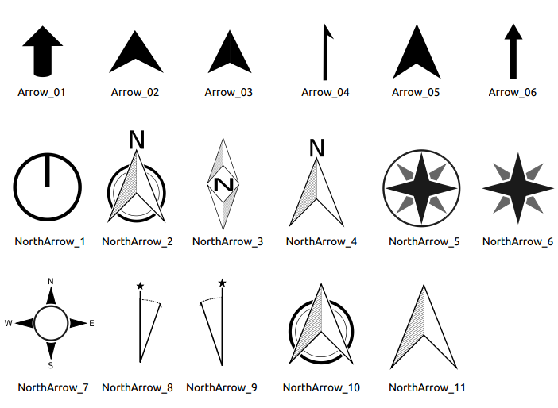

## L'élément Légende 

Pour ajouter une légende, cliquez sur l'icône  *Ajouter une nouvelle légende* et placez l'élément sur le Composeur avec le bouton gauche de votre souris. Vous pouvez modifier la position et l'apparence avec l'onglet *Propriétés de l'objet* après avoir sélectionné l'élément.

Les *Propriétés principales* d'une légende proposent les fonctionnalités suivantes:

### Propriétés principales 

La zone *Propriétés principales* de l'onglet *Propriétés de l'objet* de la légende propose les fonctionnalités suivantes:

Dans les Propriétés Principales vous pouvez:

-   Changer le titre de la légende.

-   Définir l'alignement du titre A Gauche, Au centre ou A droite.

-   Vous pouvez également choisir à quelle *Carte* doit correspondre la légende.

-   Vous pouvez choisir un caractère qui permet d'insérer des retours à la ligne.

### Éléments de légende 

La zone *Objets de légende* de l'onglet *Propriétés de l'objet* de la légende propose les fonctionnalités suivantes:

-   La légende sera automatiquement mise à jour si  *Mise à jour auto* est cochée. Lorsque *Mise à jour auto* n'est pas cochée, cela vous donnera plus de contrôle sur les éléments de la légende. Les icônes en-dessous de la liste des éléments de légende seront activés.

-   La fenêtre des éléments de légende répertorie tous les éléments de la légende et vous permet de changer l'ordre des éléments, de grouper les couches, de supprimer ou de restaurer des éléments de la liste, de modifier les noms des couche et d'ajouter un filtre.

    -   L'ordre des éléments peut être changé en utilisant les boutons **\[Monter\]** et **\[Descendre\]** ou avec la fonctionnalité *glisser-déposer*. L'ordre ne peut pas être changé pour les graphiques de légende WMS.

    -   Utilisez le bouton **\[Ajouter un groupe\]** pour ajouter un groupe de légende.

    -   Utilisez les boutons **\[plus\]** et **\[moins\]** pour ajouter ou supprimer des couches.

    -   Le bouton **\[Éditer\]** est utilisé pour modifier le nom de la couche, le nom du groupe ou le titre, vous devez d'abord sélectionner l'élément de la légende.

    -   Le bouton **\[Sigma\]** ajoute un nombre d'entités pour chaque couche vectorielle.

    -   Utilisez le bouton **\[filtre\]** pour filtrer la légende avec le contenu de la carte, seuls les éléments de la légende visibles dans la carte seront listés dans la légende.

    Après avoir changé la symbologie dans la fenêtre principale KADAS, vous pouvez cliquer sur **\[Tout mettre à jour \]** pour adapter les changements dans l'élément légende du Composeur d'impression.

### Polices, Colonnes, Symbole et Espacement 

Les zones *Polices*, *Colonnes* et *Symbole* de la légende dans l'onglet *Propriétés de l'objet* fournissent les fonctionnalités suivantes:

-   Vous pouvez changer la police du titre de la légende, du groupe, du sous-groupe et de l'élément (de couche) dans la légende. Cliquez sur la catégorie concernée pour ouvrir la fenêtre **Choisir une police**.

-   Vous pouvez choisir une **Couleur** pour les étiquettes avec le sélecteur de couleur avancé, cependant la couleur sélectionnée sera donnée à tous les éléments de police dans la légende.

-   Les éléments de légende peuvent être organisés sur plusieurs colonnes. Configurez le nombre de colonnes dans le champ *Compter* .

    -   La case  *Égaliser la largeur des colonnes* permet d'ajuster la taille des colonnes de la légende.

    -   L'option  *Séparer les couches* permet de présenter sur plusieurs colonnes les éléments de légende d'une couche ayant un style catégorisé ou gradué.

-   Vous pouvez changer la largeur et la hauteur du symbole de légende ici.

### Légende Graphique WMS et Espacement 

Les zones *Légende WMS* et *Espacement* de l'onglet *Propriétés de l'objet* fournissent les fonctionnalités suivantes:

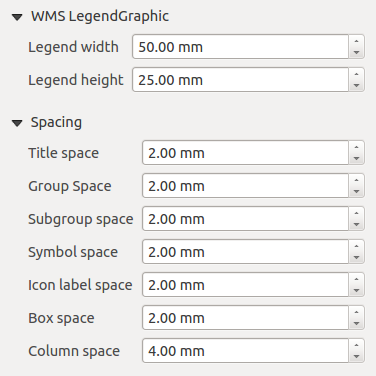

Lorsque vous avez ajouté une couche WMS et que vous insérez un élément de légende du composeur, une requête sera envoyée au serveur WMS pour fournir une légende WMS. Cette Légende sera uniquement affichée si le serveur WMS fournit la capacité GetLegendGraphic. Le contenu de la légende WMS sera fourni comme une image raster.

La *Légende WMS* est utilisée pour ajuster la *Largeur de la légende* et la *Hauteur de la légende* pour la légende WMS des images raster.

L'espacement autour du titre, des groupes, sous-groupes, symboles, libellés de légende, colonnes peut se personnaliser ici.

## L'élément Échelle graphique 

Pour ajouter une barre d'échelle, cliquez sur l'icône  *Ajouter une nouvelle échelle graphique*, placez l'élément sur le Composeur avec le bouton gauche de votre souris. Vous pouvez modifier la position et son apparence avec le panneau de *Propriétés de l'objet* après avoir sélectionné l'élément.

Les *Propriétés principales* d'une barre d'échelle proposent les fonctionnalités suivantes:

### Propriétés principales 

La zone *Propriétés principales* de l'onglet *Propriétés de l'objet* de la barre d'échelle propose les fonctionnalités suivantes:

-   Choisissez tout d'abord à quelle carte la barre d'échelle sera associée.

-   Ensuite, choisissez le style de la barre d'échelle. Six sont disponibles:

    -   Les styles **Boîte unique** ou **Boîte double** correspondent à une ou deux lignes de boîtes de couleurs alternées.

    -   Repères **au milieu**, **en-dessous** ou **au-dessus** de la ligne,

    -   **Numérique**: le ratio d'échelle est affiché (par exemple, 1:50000).

### Unités et segments 

Les zones *Unités* et *Segments* de l'onglet *Propriétés de l'objet* de la barre d'échelle proposent les fonctionnalités suivantes:

Avec ces deux séries de paramètres, vous pouvez choisir la manière dont la barre d'échelle sera représentée.

-   Sélectionnez les unités à utiliser. Il y a quatre choix possibles: **Unités de carte** est l'unité sélectionnée automatiquement; **Mètres**, **Pied** ou **Miles Nautiques** forcent la conversion des unités.

-   Le champ *Étiquette* permet de rentrer le texte à afficher concernant les unités de la barre d'échelle.

-   *Unités de carte par unité de l'échelle graphique* vous permet de préciser un ratio entre l'unité de la carte et les unités utilisées pour la barre d'échelle.

-   Vous pouvez définir combien de *Segments* seront dessinés à gauche et / ou à droite de la barre d'échelle ainsi que leur longueur (champ *Taille*) et leur hauteur (champ *Hauteur*).

### Affichage 

La boîte de dialogue *Affichage* de l'onglet *Propriétés de l'objet* de l'échelle graphique propose les fonctionnalités suivantes:

Vous pouvez définir comment l'échelle graphique sera affichée dans son cadre.

-   *Marge de la boîte*: espace entre le texte et les bords du cadre

-   *Marge de l'étiquette*: espace entre le texte et l'échelle graphique dessinée

-   *Largeur de ligne*: largeur de ligne de l'échelle graphique dessinée

-   *Style de jointure*: Coins à la fin de l'échelle graphique dans le style Oblique, Rond ou Angle droit (seulement disponible pour le style d'échelle graphique Boîte unique & Boîte double)

-   *Style d'extrémités*: Fin de toutes les lignes dans le style Carré, Rond ou Plat (seulement disponible pour le style d'échelle graphique Repères en-dessus, en-dessous et au milieu de la ligne)

-   *Alignement*: Met le texte sur la gauche, au milieu ou à droite du cadre (fonctionne uniquement pour l'Échelle graphique de style Numérique)

### Polices et couleurs 

La boîte de dialogue *Polices et couleurs* de l'onglet *Propriétés de l'objet* de l'échelle graphique propose les fonctionnalités suivantes:

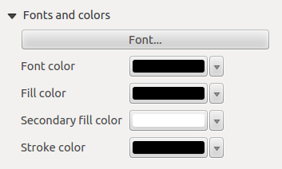

Vous pouvez définir les polices et couleurs utilisées pour l'échelle graphique.

-   Utilisez le bouton **\[Police\]** pour configurer la police

-   *Couleur de police*: configure la couleur de police

-   *Couleur de remplissage*: configure la première couleur de remplissage

-   *Couleur de remplissage secondaire*: configure la seconde couleur de remplissage

-   *Couleur du contour*: configure la couleur des lignes de l'Échelle graphique

Les couleurs de remplissage sont uniquement utilisées pour les boîtes de style d'échelle Boîte Unique et Boîte Double. Pour sélectionner une couleur, vous pouvez utiliser l'option liste en utilisant la flèche descendante pour ouvrir une option de sélection de couleur simple ou l'option de sélection de couleur avancée, qui s'ouvre lorsque vous cliquez dans la boîte colorée dans la boîte de dialogue.

## Les éléments Formes simples 

Pour ajouter une forme simple (ellipse, rectangle, triangle), cliquez sur l'icône  *Ajouter une forme simple* ou sur l'icône  *Ajouter une flèche*, placez l'élément en maintenant enfoncé le clic gauche de la souris. Personnalisez l'apparence dans l'onglet *Propriétés de l'objet*.

Lorsque vous maintenez également enfoncé la touche `Shift` lors du placement de la forme simple, vous pouvez créer un carré, un cercle ou un triangle parfait.

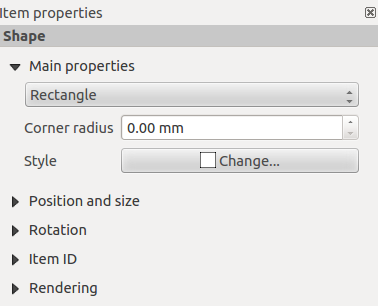

L'onglet *Forme* des propriétés de l'objet vous permet de sélectionner si vous voulez dessiner une ellipse, un rectangle ou un triangle à l'intérieur du cadre donné.

Vous pouvez définir le style de la forme en utilisant la boîte de dialogue avancée du style de symbole avec laquelle vous pouvez définir ses couleurs de bordure et de remplissage, son motif de remplissage, son utilisation de symboles etc.

Pour la forme rectangulaire, vous pouvez configurer la valeur du rayon de coin pour arrondir les coins.

À la différence des autres objets du composeur, vous ne pouvez pas personnaliser le cadre ou la couleur du fond du cadre.

## L'élément Flèche 

Pour ajouter une flèche, cliquez sur l'icône  *Ajouter une flèche*, placez l'élément en maintenant enfoncé le bouton gauche de la souris et tirez une ligne pour dessiner la flèche dans le canevas du Composeur d'Impression et la positionner, puis personnalisez l'apparence de la flèche dans l'onglet *Propriétés de l'objet*.

Lorsque vous maintenez également enfoncée la touche *Shift* tout en plaçant la flèche, celle-ci est placée dans un angle d'exactement 45°.

L'élément flèche peut être utilisé pour ajouter une ligne ou une simple flèche qui peut être ajoutée, par exemple, pour montrer la relation entre les autres éléments du Composeur d'Impression. Pour créer une flèche nord, l'élément image devrait être considéré d'abord. KADAS a un jeu de flèches Nord en format SVG. De plus, vous pouvez connecter un élément d'image avec une carte donc elle peut pivoter automatiquement avec la carte.

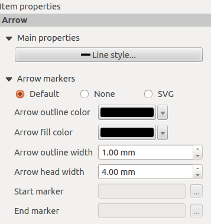

### Propriétés de l'objet 

L'onglet *Flèche* des propriétés de l'objet vous permet de configurer un élément flèche.

Le bouton **\[Style de ligne ...\]** peut être utilisé pour configurer le style de ligne en utilisant l'éditeur de symbole de style de ligne.

Dans les *Symboles de flèches*, vous pouvez sélectionner un des trois boutons radio.

-   *Défaut*: Pour dessiner une flèche régulière, vous donne des options pour personnaliser la tête de flèche

-   *Aucun*: Pour dessiner une ligne sans tête de flèche

-   *Symbole SVG*: Pour dessiner une ligne avec un *Symbole de départ* SVG et/ou un *Symbole de fin* SVG

Pour un symbole Flèche par *Défaut*, vous pouvez utiliser les options suivantes pour personnaliser la tête de flèche.

-   *Couleur de bordure de la flèche*: Configure la couleur de bordure de la tête de flèche

-   *Couleur de remplissage de la flèche*: Configure la couleur de remplissage de la tête de flèche

-   *Largeur de bordure de la flèche*: Configure la largeur de bordure de la tête de flèche

-   *Largeur de la tête*: Configure la taille de la tête de flèche

Pour le *Symbole SVG* vous pouvez utiliser les options suivantes.

-   *Marqueur de début*: Choisit une image SVG à dessiner au début de la ligne

-   *Marqueur de fin*: Choisit une image SVG à dessiner à la fin de la ligne

-   *Largeur de la tête de flèche*: Configure la taille du départ et/ou d'arrivée du symbole de tête

Les images SVG pivotent automatiquement avec la ligne. La couleur de l'image SVG ne peut pas être changée.

## L'élément Table Attributaire 

Il est possible d'ajouter des tables attributaires de couches vecteur au Composeur: cliquez sur le bouton  *Ajouter une table d'attributs*, placez l'élément sur le Composeur avec un clic-gauche puis personnalisez son apparence via l'onglet des *Propriétés de l'objet*.

Les *Propriétés principales* d'une table attributaire proposent les fonctionnalités suivantes:

### Propriétés principales 

La zone *Propriétés principales* de l'onglet *Propriétés de l'objet* de la table attributaire propose les fonctionnalités suivantes:

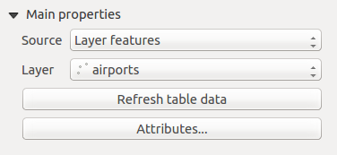

-   Pour *Source*, vous pouvez normalement sélectionner seulement *Entités de la couche*.

-   Avec *Couche*, vous pouvez choisir à partir des couches vecteurs chargées dans le projet.

-   Le bouton **\[Actualiser la table de données\]** peut être utilisé pour actualiser la table lorsque le contenu actuel de la table a changé.

-   Dans le cas où l'option *Générer un atlas* de l'onglet *Génération d'atlas* est activée, il y a deux nouvelles *Source* possibles: *Entité courante de l'atlas* ou *Relation enfant*. Choisir *Entité courante de l'atlas* implique que vous ne verrez aucune option pour choisir la couche, et l'objet table affichera seulement une ligne avec les attributs de l'entité courante de la couche de couverture. Choisir *Relation enfant* affichera une nouvelle option pour spécifier le nom de la relation. L'option *Relation enfant* ne peut être utilisée que si vous avez défini une relation utilisant la couche de couverture comme parent, et affichera les enregistrements enfants de l'objet courant de la couche de couverture.

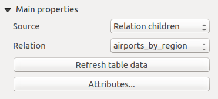

-   Le bouton **\[Attributs...\]** ouvre le menu *Sélection d'attributs*, qui peut être utilisé pour changer le contenu visible de la table. Après avoir fait les changements, utilisez le bouton **\[OK\]** pour appliquer les changements à la table.

    Dans la section *Colonnes*, vous pouvez:

    -   Supprimer un attribut: sélectionnez simplement une ligne d'attribut en cliquant n'importe où sur une ligne et cliquez sur le bouton moins pour supprimer l'attribut sélectionné.

    -   Pour ajouter de nouveaux attributs, utilisez le bouton plus. A la fin de la liste des colonnes, une nouvelle ligne vide apparaît et vous pouvez sélectionner une cellule vide de la colonne *Attribut*. Vous pouvez sélectionner un champ attributaire à partir de la liste ou vous pouvez construire un nouvel attribut en utilisant une expression ( button). Bien sûr vous pouvez modifier tous les attributs existants par le biais d'une expression régulière.

    -   Utiliser les flèches monter et descendre pour changer l'ordre des attributs dans la table.

    -   Sélectionner une cellule dans la colonne En-tête pour changer l'En-tête, en tapant simplement un nouveau nom.

    -   Sélectionner une cellule dans la colonne Alignement et vous pouvez choisir entre alignement Gauche, Centre ou Droit.

    -   Sélectionner une cellule dans la colonne Largeur et vous pouvez la changer de Automatique à une largeur en mm, simplement en tapant un nombre. Lorsque vous voulez la remettre à Automatique, utilisez la croix.

    -   Le bouton **\[Réinitialiser\]** peut toujours être utilisé pour le restaurer à ses paramètres d'attribut original.

    Dans la section *Trier*, vous pouvez:

    -   Ajouter un attribut pour trier la table avec. Sélectionnez un attribut et Définissez l'ordre de tri en *Croissant* ou *Décroissant* et cliquez sur le bouton plus. Une nouvelle ligne est ajoutée à la liste d'ordre de tri.

    -   Sélectionner une ligne dans la liste et utiliser les boutons monter et descendre pour changer la priorité du tri au niveau de l'attribut.

    -   Utiliser le bouton moins pour supprimer un attribut de la liste de l'ordre de tri.

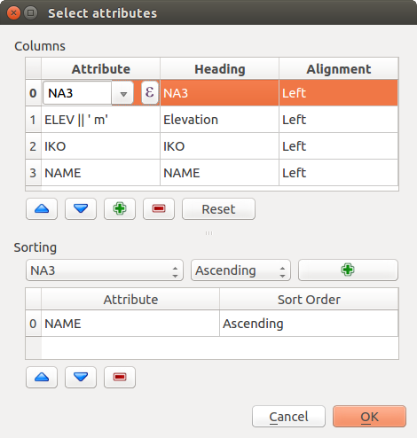

### Filtrage des entités 

La zone *Filtrage des entités* de l'onglet *Propriétés de l'objet* de la table attributaire propose les fonctionnalités suivantes:

Vous pouvez:

-   Définir un nombre de *Lignes maximales* à afficher.

-   Activer  *Supprimer les lignes en double de la table* pour montrer seulement les enregistrements uniques.

-   Activer  *Ne montrer que les entités visibles sur la carte* et sélectionner le *Composeur de carte* correspondant pour afficher seulement les attributs des entités visibles sur la carte sélectionnée.

-   Activer  *Ne montrer que les entités intersectant l'entité de l'atlas* est seulement disponible lorsque  *Générer un atlas* est activé. Lorsqu'il est activé, il affichera une table avec seulement les entités indiquées sur la carte de cette page en particulier de l'atlas.

-   Activer  *Filtrer avec* et fournir un filtre en tapant dans la ligne d'entrée ou insérer une expression régulière en utilisant le bouton d'expression . Voici quelques exemples de déclarations de filtrage que vous pouvez utiliser lorsque vous avez chargé la couche des aéroports à partir du jeu de données exemples:

    -   `ELEV > 500`
    -   `NAME = 'ANIAK'`
    -   `NAME NOT LIKE 'AN%`
    -   `regexp_match( attribute( $currentfeature, 'USE' )  , '[i]')`

    La dernière expression régulière inclura seulement les aéroports qui ont une lettre *i* dans le champ d'attribut *USE*.

### Apparence 

La zone *Apparence* de l'onglet *Propriétés de l'objet* de la table attributaire propose les fonctionnalités suivantes:

-   Cliquer sur  *Afficher des lignes vides* pour rendre visible les entrées vides de la table attributaire.

-   Avec les *Marges de cellule*, vous pouvez définir les marges autour du texte dans chaque cellule de la table.

-   Avec *Afficher l'en-tête*, vous pouvez sélectionner à partir d'une liste une des options par défaut *Sur le premier cadre*, *Sur tous les cadres*, ou *Pas d'en-tête’.

-   L'option *Tables vides* contrôle ce qui sera affiché lorsque la sélection des résultats est vide.

    -   **N'afficher que les en-têtes** affichera seulement l'en-tête, excepté si vous avez choisi *Pas d'en-tête* pour *Afficher l'en-tête*.

    -   **Masquer la table entière** affichera seulement le fond de la table. Vous pouvez activer  *Ne pas afficher le fond si le cadre est vide* dans *Cadres* pour cacher complètement la table.

    -   **Afficher des lignes vides** remplira la table attributaire avec des cellules vides, cette option peut aussi être utilisée pour proposer des cellules vides supplémentaires lorsque vous avez un résultat à montrer !

    -   **Afficher le message défini** affichera l'en-tête et ajoutera une cellule couvrant toutes les colonnes et affichera un message comme *Pas de résultat* qui peut être proposé dans l'option *Message à afficher*

-   L'option *Message à afficher* est seulement activée lorsque vous avez sélectionné **Afficher le message défini** pour *Table vide*. Le message proposé sera affiché dans la table sur la première ligne, lorsque le résultat est une table vide.

-   Avec *Couleur de fond*, vous pouvez définir la couleur de fond de la table.

### Afficher les bordures 

La boîte de dialogue *Afficher les bordures* de l'onglet *Propriétés de l'objet* de la table attributaire propose les fonctionnalités suivantes:

-   Activer  *Afficher les bordures* lorsque vous voulez afficher les bordures des cellules de la table.

-   Avec *Épaisseur du trait* vous pouvez définir l'épaisseur des lignes utilisées pour les bordures.

-   La *Couleur* des bordures peut être définie en utilisant la boîte de dialogue de sélection de couleur.

### Styles de polices et de textes 

La boîte de dialogue *Styles de polices et de textes* de l'onglet *Propriétés de l'objet* de la table attributaire propose les fonctionnalités suivantes:

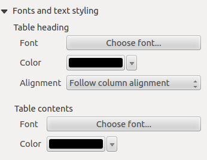

-   Vous pouvez définir la *Police* et la *Couleur* pour l’*En-tête de table* et le *Contenu de la table*.

-   Pour l’*En-tête de table* vous pouvez en plus définir l’*Alignement* et choisir entre Suivre l'alignement de la colonne, A gauche, Au centre ou A droite. L'alignement de la colonne est défini en utilisant la boîte de dialogue *Sélection d'attributs*.

### Cadres 

La boîte de dialogue *Cadres* de l'onglet *Propriétés de l'objet* de la table attributaire propose les fonctionnalités suivantes:

-   Avec le *Mode de redimensionnement* vous pouvez sélectionner la façon de rendre le contenu de la table attributaire:

    -   Utiliser les cadres existants affiche le résultat seulement dans le premier cadre et les cadres ajoutés.

    -   Étendre à la page suivante créera autant de cadres (et pages correspondantes) que nécessaire pour afficher l'intégralité de la sélection de la table attributaire. Chaque cadre peut être déplacé autour de la couche. Si vous redimensionnez un cadre, la table résultante sera répartie entre les autres cadres. Le dernier cadre sera rogné pour s'adapter à la table.

    -   Répéter jusqu'à la fin créera autant de cadre que pour l'option Étendre à la page suivante sauf que tous les cadres auront la même taille.

-   Utiliser le bouton **\[Ajouter un cadre\]** pour ajouter un autre cadre avec la même taille que le cadre sélectionné. Le résultat de la table qui ne rentre pas dans le premier cadre continuera dans le cadre suivant lorsque vous utilisez le mode Redimensionner Utiliser les cadres existants.

-   Activer  *Ne pas exporter la page si le cadre est vide* empêche la page d'être exportée lorsque le cadre de la table n'a pas de contenu. Cela signifie que tous les autres éléments du composeur, cartes, échelles graphiques, légendes, etc. ne seront pas visibles dans le résultat.

-   Activer  *Ne pas afficher le fond si le cadre est vide* empêche le fond d'être affiché lorsque le cadre de la table n'a pas de contenu.

## L'élément cadre HTML 

Il est possible d'ajouter un cadre qui affiche le contenu d'un site web ou même de créer et personnaliser votre propre page HTML et de l'afficher !

Cliquez sur l'icône  *Ajouter du HTML*, placez l'élément en glissant un rectangle dans le canevas du Composeur d'Impression en maintenant enfoncé le bouton gauche de la souris et positionnez puis personnalisez l'apparence dans l'onglet *Propriétés de l'élément*.

### Source du HTML 

Comme une source du HTML, vous pouvez soit configurer une URL et activer le bouton radio URL, ou entrer la source du HTML directement dans la zone de texte fournie et activer le bouton radio Source.

La boîte de dialogue *Source du HTML* de l'onglet *Propriétés de l'objet* du cadre HTML propose les fonctionnalités suivantes:

-   Dans *URL*, vous pouvez entrer l'URL d'une page internet que vous avez copiée depuis votre navigateur internet ou sélectionner un fichier HTML en utilisant le bouton Parcourir . Il y a aussi la possibilité d'utiliser le bouton de valeurs définies par les données, pour proposer une URL à partir du contenu d'un champ d'attribut d'une table ou en utilisant une expression régulière.

-   Dans *Source*, vous pouvez entrer un texte dans la zone de texte avec quelques balises HTML ou proposer une page HTML entière.

-   Le bouton **\[Insérer une expression\]** peut être utilisé pour insérer une expression comme `[%Year($now)%]` dans la zone de texte Source pour afficher l'année courante. Ce bouton est seulement activé lorsque le bouton radio *Source* est sélectionné. Après avoir inséré l'expression, cliquez quelque part dans la zone de texte avant de rafraîchir le cadre HTML, autrement vous perdrez l'expression.

-   Activez  *Évaluer l'expression QGIS dans la source du HTML* pour voir le résultat de l'expression que vous avez incluse, autrement vous verrez l'expression à la place.

-   Utilisez le bouton **\[Rafraîchir la page\]** pour rafraîchir le cadre(s) HTML pour voir le résultat des changements.

### Cadres 

La boîte de dialogue *Cadres* de l'onglet *Propriétés de l'objet* du cadre HTML propose les fonctionnalités suivantes:

-   Avec *Mode de redimensionnement*, vous pouvez sélectionner la façon de rendre le contenu HTML:

    -   Utiliser les cadres existants affiche le résultat seulement dans le premier cadre et les cadres ajoutés.

    -   Étendre à la page suivante créera autant de cadres (et de pages) que nécessaire pour afficher la page en entier. Chaque cadre peut être déplacé sur la mise en page. Si vous redimensionnez un cadre, la page web sera à nouveau répartie dans les cadres. Le dernier cadre sera rogné pour s'ajuster à la page web.

    -   Répéter sur chaque page répètera la partie supérieure gauche de la page web sur chaque pages du composeur dans des cadres de taille identique.

    -   Répéter jusqu'à la fin créera autant de cadre que pour l'option Étendre à la page suivante sauf que tous les cadres auront la même taille.

-   Utilisez le bouton **\[Ajouter un cadre\]** pour ajouter un autre cadre avec la même taille que le cadre sélectionné. Si la page HTML ne va pas dans le premier cadre, elle ira dans le cadre suivant lorsque vous utilisez *Mode de redimensionnement* ou *Utiliser les cadres existants*.

-   Activez  *Ne pas exporter la page si le cadre est vide* empêche que la carte mise en page soit exportée lorsque le cadre n'a pas de contenu HTML. Cela signifie que tous les autres éléments du composeur, cartes, barres d'échelle, légendes etc. ne seront pas visibles dans le résultat.

-   Activez  *Ne pas afficher le fond si le cadre est vide* empêche que le cadre HTML soit affiché si le cadre est vide.

### Utiliser des sauts de page intelligents 

La boîte de dialogue *Utiliser des sauts de page intelligents* de l'onglet *Propriétés de l'objet* du cadre HTML propose les fonctionnalités suivantes:

-   Activez  *Utiliser des sauts de pages intelligents* pour empêcher le contenu du cadre html de se casser à mi-chemin d'une ligne de texte afin qu'il continue bien dans le cadre suivant.

-   Paramètre la *Distance maximale* autorisée lors du calcul de l'emplacement du saut de page dans le html. Cette distance est la quantité maximale d'espace vide autorisé dans le bas du cadre après calcul de l'emplacement optimal du saut de page. Indiquer une grande valeur permettra de mieux définir l'emplacement du saut de page mais une plus grande quantité d'espace vide sera présent dans le bas des cadres. Cette valeur est utilisée uniquement lorsque *Utiliser des sauts de page intelligents* est activé.

-   Activez  *Feuille de style utilisateur* pour appliquer des styles HTML qui sont souvent fournis dans des feuilles de style en cascade. Un exemple de code de style est fourni ci-dessous pour définir la couleur de la balise d'en-tête `<h1>` au vert et définir la police et la taille de police du texte inclu dans les balises de paragraphe `
`.

        h1 {color: #00ff00;
        }
        p {font-family: "Times New Roman", Times, serif;
           font-size: 20px;
        }

-   Utilisez le bouton **\[Mise à jour du HTML\]** pour voir le résultat des paramètres de la feuille de style.

#### Gestion des éléments 

## Taille et position 

Chaque élément du Composeur peut être déplacé / redimensionné pour créer une mise en page parfaite. Pour chacune de ces opérations, la première étape est d'activer l'outil  *Sélectionner/Déplacer un objet* et de cliquer sur l'élément. Vous pouvez ensuite le déplacer avec la souris en maintenant le bouton gauche. Si vous souhaitez limiter les mouvements sur les axes horizontaux ou verticaux, pressez la touche `Shift` du clavier pendant le déplacement de la souris. Si vous avez besoin de plus de précision, vous pouvez déplacer l'élément sélectionné en utilisant les `flèches` du clavier et si les mouvements sont trop lents, utilisez en même temps la touche `Shift`.

Un élément sélectionné apparait avec des carrés à chaque coin du rectangle englobant. Déplacer un de ces carrés avec la souris redimensionnera l'élément dans la direction correspondante. Pendant le redimensionnement, presser la touche `Shift` permettra de maintenir les proportions. Presser la touche `Alt` redimensionnera depuis le centre de l'élément.

La position correcte d'un élément peut être obtenue en utilisant les guides ou l'accrochage à la grille. Les guides sont créés en cliquant et en dessinant dans les règles. Le guide est déplacé en cliquant dans la règle, en alignant le guide et en glissant vers un nouvel endroit. Pour supprimer un guide, déplacez-le en dehors du canevas. Si vous devez désactiver la comportement d'accrochage à la volée, maintenez appuyé la touche `Ctrl` lorsque vous déplacez la souris.

Vous pouvez sélectionner plusieurs éléments en même temps avec le bouton  *Sélectionner/Déplacer un objet*. Pressez simplement la touche `Shift` et cliquez sur tous les éléments souhaités. Vous pouvez ensuite les redimensionner ou les déplacer tous en même temps.

Une fois que vous avez trouvé la position correcte pour un élément, vous pouvez le verrouiller en utilisant les boutons sur la barre d'outils ou en cochant la boîte près de l'élément dans l'onglet *Éléments*. Les éléments verrouillés ne sont **pas** sélectionnables sur le canevas.

Les éléments verrouillés peuvent être déverrouillés en sélectionnant l'élément dans l'onglet *Éléments* et décochés dans la case à cocher, ou vous pouvez utiliser les boutons dans la barre d'outils.

Pour désélectionner un objet, cliquez dessus en maintenant la touche `Shift` appuyée.

Dans le menu *Éditer*, vous trouverez les actions permettant de sélectionner ou dé-selectionner tous les éléments ou d'inverser la sélection.

## Alignement 

Les fonctionnalités pour monter ou descendre des éléments sont présentes dans le menu déroulant  *Relever les objets sélectionnés*. Prenez un élément dans le Composeur de carte et sélectionnez la fonction correspondante pour le monter ou le descendre par rapport aux autres éléments. L'ordre est affiché dans l'onglet *Éléments*. Vous pouvez également monter ou descendre des éléments dans l'onglet *Éléments* par glissé-déposé dans cette liste.

Plusieurs options d'alignement sont disponibles via le menu déroulant  *Aligner les objets sélectionnés*. Pour en utiliser une, sélectionner d'abord les éléments puis cliquez sur l'outil d'alignement désiré. Tous les éléments sélectionnés seront alors alignés au sein de leur rectangle englobant commun. Lors du déplacement d'éléments dans le Composeur, des guides apparaissent lorsque les bords, les centres ou les coins sont alignés.

## Copier / Coller des éléments 

Le Composeur d'Impression propose des outils permettant de copier/couper/coller des éléments. Comme toujours vous devez d'abord sélectionner les éléments puis utiliser une des options. Vous les trouverez via le menu *Éditer*. Lorsque vous collez des éléments, ils seront positionnés au niveau du curseur de la souris.

Les objets HTML ne peuvent pas être copiés de cette manière. En guise de contournement, utilisez le bouton **\[Ajouter un cadre\]** dans l'onglet *Propriétés de l'objet*.

Pendant la mise en page de la carte, il est possible d'annuler et refaire des modifications. Cela peut être réaliser à l'aide des outils Annuler la dernière modification et Restaurer la dernière modification:

-    *Annuler la dernière modification*

-    *Restaurer la dernière modification*

Il est également possible de le faire via l’*Historique des commandes*.

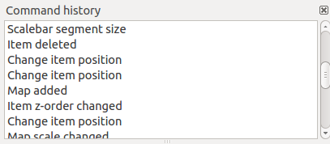

Le Composeur d'Impression fournit des outils vous permettant de générer automatiquement un ensemble de cartes. L'idée est d'utiliser la géométrie et les attributs d'une couche vectorielle. Pour chaque entité de la couche, une nouvelle carte est générée et son emprise correspond à la géométrie de l'entité. Les attributs de la couche peuvent être utilisés dans des zones de texte.

Un page est générée par entité de la couche. Pour générer un atlas et le paramétrer, allez sur l'onglet Génération d'atlas. Cet onglet propose les éléments suivants:

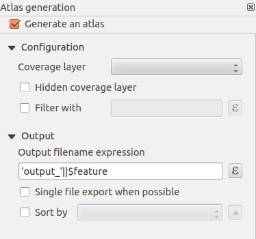

-    *Générer un atlas*, qui permet d'activer ou de désactiver la génération d'atlas.

-   La liste déroulante *Couche de couverture*  permet de choisir la couche (vecteur) contenant les géométries à partir desquelles générer chaque planche.

-   La case optionnelle  *Cacher la couche de couverture* permet de cacher la couche de couverture sur les planches en sortie.

-   La possibilité de *Filtrer avec* une expression les entités de la couche de couverture. Si une expression est rentrée, seules les entités satisfaisant la condition seront utilisées. Le bouton à droite permet d'ouvrir un constructeur de requête.

-   Le *Nom du fichier en sortie* est utilisé pour générer un nom de fichier pour chaque planche. Il est basé sur une expression. Il n'est utile que lorsque plusieurs fichiers sont produits.

-   L’ *Export d'un seul fichier (si possible)* vous permet de forcer la création d'un unique fichier quand le format de sortie choisi le permet (par exemple le PDF). Si cette case est cochée, le *Nom du fichier en sortie* n'est pas pris en compte.

-   La case optionnelle  *Trier par* vous permet de trier les entités de la couche de couverture. La liste déroulante associée permet de choisir un champ à utiliser pour le tri. L'ordre de tri (ascendant ou descendant) est spécifié par le bouton à droite représenté par une flèche ascendante ou descendante.

Vous pouvez utiliser plusieurs objets carte dans la génération d'atlas, chacun sera rendu en fonction de la couche de couverture. Pour activer la génération d'atlas pour un objet carte, vous devez cocher la case  *Paramètres contrôlés par l'Atlas* dans les propriétés de l'objet carte. Une fois cochée, vous pouvez définir:

-   Un bouton radio  *Marge autour des entités* vous permet de sélectionner la quantité d'espace ajouté autour de chaque géométrie dans la carte. Sa valeur n'a de sens que si vous utilisez le mode mise à l'échelle automatique.

-    *Echelle prédéfinie* (meilleur ajustement). Utilise la meilleure option d'ajustement de la liste des échelles prédéfinies dans votre projet (voir *Projet &rarr; Propriétés du projet &rarr; Général &rarr; Echelles du projet* pour configurer ces échelles prédéfinies).

-   Une  *Échelle fixe* qui permet de basculer du mode *Marge* au mode *Échelle fixe*. En échelle fixe, la carte est simplement translatée et centrée sur chaque entité. En mode *Marge*, l'emprise de la carte est calculée de telle sorte que l'entité de la couche de couverture apparaisse entièrement.

## Zones de texte 

Pour adapter les étiquettes aux entités à partir desquelles l'atlas génère les planches, vous pouvez utiliser des expressions. Par exemple, pour une couche de ville ayant les champs CITY\_NAME et ZIPCODE, vous pouvez insérer ceci:

    The area of [% upper(CITY_NAME) || ',' || ZIPCODE || ' is ' format_number($area/1000000,2) %] km2

L'information \[% upper(CITY\_NAME) || ',' || ZIPCODE || ‘ is ‘ format\_number($area/1000000,2) %\] est une expression utilisée dans la zone de texte. Cela sera traduit dans l'atlas généré par:

La superficie de PARIS,75001 est de 1.94 km2

## Boutons de Valeurs définies par des données 

Il y a plusieurs endroits où vous pouvez utiliser un bouton  *Valeurs définies par des données* pour définir le paramètre sélectionné. Ces options sont particulièrement utiles avec la Génération d'Atlas.

Pour les exemples suivants, la couche Regions du jeu de données d'exemple de KADAS est utilisée et sélectionnée pour la Génération d'Atlas. Nous supposons également que le format de la page A4 (210X297) est sélectionné dans l'onglet *Composition* pour le champ *Réglages*.

Avec un bouton Valeurs définies par des données, vous pouvez définir dynamiquement l'orientation de la page. Lorsque la hauteur (nord-sud) de l'emprise d'une région est plus grande que sa largeur (est-ouest), vous devriez plutôt utiliser l'orientation portrait plutôt que paysage pour optimiser l'utilisation de la page.

Dans la *Composition*, vous pouvez définir le champ *Orientation* et sélectionner Paysage ou Portrait. Nous voulons définir l'orientation dynamiquement en utilisant une expression dépendant de la géométrie de la région. Cliquez sur le bouton  du champ *Orientation*, sélectionnez *Éditer* afin d'ouvrir la boîte de dialogue *Constructeur de chaîne d'expression*. Entrez l'expression suivante:

    CASE WHEN bounds_width($atlasgeometry) > bounds_height($atlasgeometry) THEN 'Landscape' ELSE 'Portrait' END

Maintenant, le papier s'oriente automatiquement pour chaque région où vous devez également repositionner l'élément du composeur. Pour l'élément carte, vous pouvez utiliser le bouton  du champ *Largeur* pour définir dynamiquement cette dernière en utilisant l'expression suivante:

    (CASE WHEN bounds_width($atlasgeometry) > bounds_height($atlasgeometry) THEN 297 ELSE 210 END) - 20

Utilisez le bouton  du champ *Hauteur* pour proposer l'expression suivante:

    (CASE WHEN bounds_width($atlasgeometry) > bounds_height($atlasgeometry) THEN 210 ELSE 297 END) - 20

Lorsque vous voulez donner un titre au-dessus de la carte au centre de la page, insérez un élément de zone de texte au-dessus de la carte. Utilisez d'abord les propriétés de l'objet de l'élément zone de texte pour définir un alignement horizontal à  *Au centre*. Ensuite activez l'option du milieu supérieur à partir du *Point de référence*. Vous pouvez proposer l'expression suivante pour le champ *X*:

    (CASE WHEN bounds_width($atlasgeometry) > bounds_height($atlasgeometry) THEN 297 ELSE 210 END) / 2

Pour tous les autres éléments du composeur, vous pouvez définir la position de façon similaire de sorte qu'ils soient correctement positionnés lorsque la page est automatiquement tournée en portrait ou paysage.

Les informations fournies sont tirées de l'excellent blog (en anglais et portugais) sur les options de Valeurs définies par des données [Multiple\_format\_map\_series\_using\_QGIS\_2.6\_](#id8) .

Ceci est seulement un exemple de comment vous pouvez utiliser les Valeurs de définies par des données.

## Aperçu 

Une fois les paramètres de l'atlas configurés et les objets carte sélectionnés, vous pouvez créer un aperçu de toutes les pages en cliquant sur *Atlas ‣ Aperçu de l'Atlas* puis utiliser les flèches, depuis ce même menu, pour parcourir les planches.

## Génération 

La génération de l'atlas peut se faire de différentes façons. Par exemple via *Atlas ‣ Impression de l'Atlas*, vous pouvez directement l'imprimer. Vous pouvez également créer un PDF via *Atlas ‣ Exporter l'Atlas au format PDF* et l'utilisateur devra donner un répertoire pour sauvegarder tous les fichiers (sauf si la case  *Export d'un seul fichier (si possible)* est cochée). Si vous souhaitez n'imprimer qu'une seule page de l'atlas, lancez l'aperçu, sélectionnez la page puis cliquez sur *Composeur &rarr; Imprimer* (ou créez un PDF).

Pour maximiser l'espace disponible pour interagir avec une composition, vous pouvez utiliser *Vue &rarr; Masquer les panneaux* ou appuyez sur `F10`.

Il est également possible de passer en mode plein écran pour avoir plus d'espace pour interagir en appuyant sur `F11` ou en utilisant *Vue &rarr; Basculer en mode plein écran*.

La figure suivante montre une mise en page incluant un exemple de chaque type d'élément décrit dans les paragraphes précédents.

Avant d'imprimer une mise en page vous avez la possibilité de voir votre composition sans les boîtes de délimitation. Cela peut être activé en décochant *Vue &rarr; Afficher les zones d'emprise* ou en appuyant sur `Ctrl+Shift+B`.

Le Composeur d'Impression vous permet de choisir plusieurs formats de sortie et il est possible de définir la résolution (qualité d'impression) et le format du papier:

-   Le bouton  *Imprimer* vous permet d'imprimer la mise en page sur une imprimante ou dans un fichier PostScript en fonction des pilotes d'imprimante installés.

-   Le bouton  *Exporter comme image* exporte le Composeur dans plusieurs formats d'image tels que PNG, BPM, TIF, JPG...

-    *Exporter au format PDF* enregistre le contenu du Composeur directement dans un fichier PDF.

-   Le bouton  *Exporter au format SVG* sauve le contenu du Composeur en SVG (Scalable Vector Graphic).

Si vous devez exporter votre mise en page en tant qu’**image géoréférencée** (pour la charger ensuite dans KADAS), vous devez activer cette fonctionnalité dans l'onglet Composition. Cochez  *Générer fichier World file* et choisissez l'objet carte concerné. Avec cette option, *Exporter comme image* créera également un world file.

-   Actuellement le rendu SVG est très basique. Il ne s'agit pas d'un problème lié à KADAS mais à la bibliothèque Qt utilisée. Nous pouvons espérer que cela soit corrigé dans les versions futures.

-   L'export de gros raster échoue parfois, même s'il semble qu'il y ait assez de ressource mémoire. Il s'agit également d'un problème lié à la gestion des raster par Qt.

