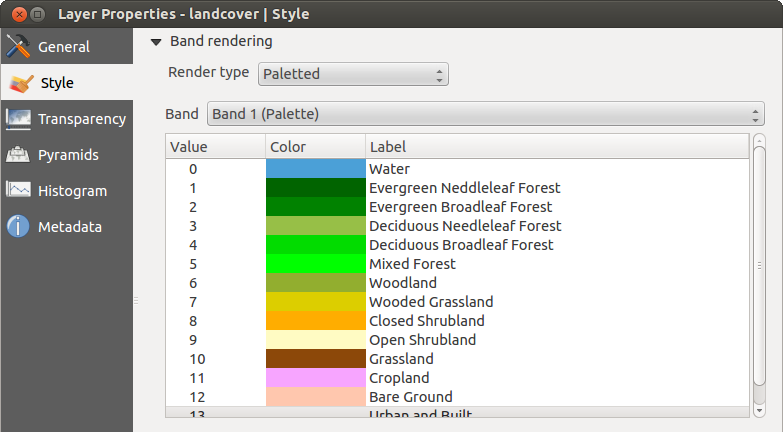

# Fenêtre Propriétés de la couche raster 

Pour voir et définir les propriétés d'une couche raster, double-cliquez sur le nom de la couche dans la légende de la carte ou faites un clic-droit son nom et choisissez *Propriétés* dans le menu qui apparaît. La fenêtre des *Propriétés de la couche* apparaîtra.

Il y a plusieurs onglets dans cette fenêtre:

-   *Général*

-   *Style*
-   *Transparence*

-   *Pyramides*

-   *Histogramme*

-   *Métadonnées*

## Onglet Général 

### Informations sur la couche 

L'onglet *Général* affiche des informations basiques sur le raster sélectionné, dont la source de la couche, le nom affiché dans la légende (qui peut être modifié), le nombre de colonnes, lignes et les valeurs *no-data*.

### Système de coordonnées de référence 

Le système de coordonnées de référence (SCR) est également affiché ici au format PROJ.4. S'il est incorrect, il peut être modifié en cliquant sur le bouton **\[Spécifier\]**.

### Visibilité dépendante de l'échelle 

La visibilité en fonction de l'échelle se définit également dans cet onglet. Vous devez activer la case à cocher et définir une échelle appropriée pour l'affichage de vos données sur la carte.

Tout en bas, sont affichés un aperçu de la couche, son symbole de légende et sa palette.

## Onglet Style 

### Rendu des bandes raster 

KADAS propose quatre *Types de rendu*. Le choix s'effectue en fonction du type de données.

1.  Couleur à Bandes Multiples - Si le fichier raster est multibande et contient plusieurs bandes (par exemple, avec une image satellite)

2.  Palette - Si le fichier ne contient qu'une seule bande indexée (par exemple, pour les cartes topographiques)

3.  Bande Grise Unique - (Une seule bande de gris). Le rendu de l'image sera gris. KADAS choisit ce rendu si ce fichier n'est ni multibande, ni une palette indexée, ni une palette continue (utilisée par exemple pour les cartes avec des reliefs ombrés)

4.  Pseudo-Couleur à Banque Unique - vous pouvez utiliser ce rendu pour les fichiers contenant une palette continue ou des cartes en couleur (par exemple pour une carte des altitudes)

**Couleur à bandes multiples**

Avec ce type de rendu, trois bandes de l'image seront utilisées, chacune correspondant à la composante rouge, verte ou bleue de l'image colorée finale. Vous pouvez choisir parmi différentes méthodes d’*Amélioration du contraste*: *Pas d'amélioration*, *Étirer jusqu'au MinMax*, *Étirer et couper jusqu'au MinMax* ou *Couper jusqu'au MinMax*.

Ces options vous offrent de nombreuses possibilités de modifier l'apparence de votre couche raster. Premièrement vous devez connaître la plage de valeurs de votre image. Vous pouvez utiliser pour cela l’*Emprise* et cliquer sur **\[Charger\]**. Pour les valeurs de *Min* et de *Max* de vos bandes, KADAS vous laisse le choix entre une *Précision*  *Estimée (plus rapide)* ou  *Réelle (plus lente)*.

Maintenant vous pouvez échelonner les couleurs grâce à la partie *Charger les valeurs min/max*. Beaucoup d'images n'ont que très peu de valeurs très faibles ou très élevées. Ces extrêmes peuvent être ignorés en utilisant l'option  *Bornes d'exclusion des valeurs extrêmes*. Par défaut la plage proposée va de 2% à 98% des valeurs de données et peut être ajustée manuellement. Avec ce paramétrage, l'aspect gris de l'image peut disparaitre. Avec l'option  *Min / max*, KADAS crée une table de couleur à partir de toutes les données de l'image originale (par exemple, KADAS crée une table de couleur avec 256 valeurs, si vous avez des bandes codées sur 8 bits). Vous pouvez également calculer votre table de couleur en utilisant l'option *Moyenne +/- écart-type x* . Ainsi, seules les valeurs comprises dans cet intervalle (écart-type ou multiple de l'écart-type) seront considérées. Ceci est utile lorsqu'un ou deux pixels ont des valeurs anormalement élevées et ont un impact négatif sur le rendu du raster.

Tous les calculs peuvent également être réalisés pour l'emprise  *Actuelle*.

**Visualiser une seule bande d'un raster multibande**

Si vous désirez visualiser une seule bande d'une image multibande (par exemple la bande rouge), vous pouvez penser que vous pourriez définir les bandes Verte et Bleue à “Non définie”. Mais ce n'est pas la manière correcte. Pour afficher la bande Rouge, définissez le type d'image à Bande grise unique, puis sélectionnez la bande Rouge comme bande à utiliser pour le gris.

**Palette**

C'est l'option standard pour les fichiers à une seule bande qui incluent déjà une table de couleurs, où à chaque valeur de pixel a été assignée une couleur. Dans ce cas, la palette est utilisée automatiquement. Si vous désirez modifier l'assignement des couleurs pour certaines valeurs, double cliquez simplement sur la couleur et la boîte de dialogue de *Sélection de couleur* apparaîtra. Il est maintenant possible depuis KADAS 2.2 d'assigner un label aux valeurs de couleur. L'étiquette apparaîtra alors dans la légende de la couche raster.

**Amélioration de contraste**

Lors de l'ajout d'une couche raster GRASS, l'option *Amélioration de contraste* sera automatiquement *Étirer jusqu'au MinMax*, quelles que soient les options générales de KADAS définies pour cette option.

**Bande grise unique**

Ce type de rendu vous permet de représenter une bande d'un raster par un *Dégradé de couleur*: *Noir vers blanc* ou *Blanc vers noir*. Vous pouvez choisir un *Min* et un *Max* en choisissant d'abord une *Emprise* puis en cliquant sur **\[Charger\]**. KADAS peut utiliser les valeurs *Min* et *Max*  *Estimée (plus rapide)* ou utiliser les valeurs  *Réelle (plus lent)*.

Grâce à la partie *Charger les valeurs min/max*, vous pouvez échelonner les couleurs. Les valeurs extrêmes peuvent être ignorées en utilisant l'option  *Bornes d'exclusion des valeurs extrêmes*. Par défaut la plage proposée va de 2% à 98% des valeurs de données et peut être ajustée manuellement. Avec ce paramétrage, l'aspect gris de l'image peut disparaitre. D'autres réglages peuvent être effectués via les boutons  *Min / max* and  *Moyenne +/- écart-type x* . Le premier crée une table de couleur à partir de toutes les données de l'image originale alors que le deuxième crée une table de couleur qui ne considère que les valeurs comprises dans l'intervalle constitué par l'écart-type ou un multiple de l'écart-type. Ceci est utile lorsqu'un ou deux pixels ont des valeurs anormalement élevées et ont un impact négatif sur le rendu du raster.

**Pseudo-couleur à bande unique**

C'est une option de rendu pour les fichiers à bande unique, incluant une palette de couleurs continues. Vous pouvez aussi créer des palettes de couleurs pour les fichiers à bande unique

Trois manières de faire une interpolation de couleurs sont disponibles:

1.  Discrète

2.  Linéaire

3.  Exacte

Sur la partie gauche, le bouton  *Ajouter une valeur manuellement*, permet d'ajouter une valeur individuelle à la table de couleurs. Le bouton  *Supprimer la valeur sélectionnée* efface une valeur et  *Trier les éléments de la palette de couleurs* permet de trier la table de couleurs en fonction des valeurs de pixels. En double-cliquant sur une valeur, vous pouvez l'éditer manuellement. Un double-clic sur une couleur ouvre la fenêtre *Modifier la couleur* où vous pouvez la modifier. De plus, vous pouvez ajouter une étiquette de légende pour chaque valeur (mais cette information n'apparaîtra pas lors de l'utilisation de l'outil d'identification). Vous pouvez également  *Charger une palette de couleur depuis la bande*, si une table de couleurs a été définie pour la bande. Enfin vous pouvez utiliser les boutons  *Charger une palette de couleur depuis un fichier* ou  *Exporter une palette de couleur vers un fichier* pour importer ou exporter une table de couleur depuis ou vers une autre session.

Sur la partie droite, il est possible de *Générer une nouvelle palette de couleur*. Pour le *Mode* de classification par  *Intervalles égaux*, vous n'avez qu'à choisir le nombre de *Classes*  et cliquez sur le bouton *Classer*. Vous pouvez inverser l'ordre des couleurs de la palette en cochant la case  *Inverser*. Dans le cas d'une classification par *Mode*  *Continu*, KADAS crée automatiquement les classes en fonction des *Min* et *Max*. La partie située en dessous, *Charger les valeurs min/max*, permet d'ajuster ces valeurs. En effet, beaucoup d'images n'ont que très peu de valeurs très faibles ou très élevées. Ces extrêmes peuvent être ignorés en utilisant l'option  *Bornes d'exclusion des valeurs extrêmes*. Par défaut la plage proposée va de 2% à 98% des valeurs de données et peut être ajustée manuellement. Avec ce paramétrage, l'aspect gris de l'image peut disparaitre. Avec l'option  *Min / max*, KADAS crée une table de couleur à partir de toutes les données de l'image originale (par exemple, KADAS crée une table de couleur avec 256 valeurs, si vous avez des bandes codées sur 8 bits). Vous pouvez également calculer votre table de couleur en utilisant l'option *Moyenne +/- écart-type x* . Ainsi, seules les valeurs comprises dans cet intervalle (écart-type ou multiple de l'écart-type) seront considérées.

### Rendu des couleurs 

Pour chaque type de *Rendu par bande*, des options de *Rendu de la couleur* sont disponibles.

Vous pouvez réaliser des effets spéciaux sur le rendu de vos rasters en utilisant un des modes de fusion.

D'autres paramètres permettent de modifier la *Luminosité*, la *Saturation* et le *Contraste*. Vous pouvez également utiliser un *Dégradé de gris* et le faire *Par clarté*, *Par luminosité*, ou *Par moyenne*. Pour une teinte de couleur, vous pouvez en modifier la *Force*

### Ré-échantillonnage 

Les options de *Ré-échantillonnage* déterminent l'apparence d'un raster quand vous zoomez ou dé-zoomez. Différents modes de ré-échantillonnage permettent d'optimiser l'apparence d'un raster. Ils calculent une nouvelle matrice de valeurs via une transformation géométrique.

En appliquant la méthode *Plus proche voisin*, le raster peut apparaître pixelisé lorsque l'on zoome dessus. Ce rendu peut être amélioré en choisissant les méthodes *Bilinéaire* ou *Cubique* qui adoucissent les angles. L'image est alors lissée. Ces méthodes sont adaptées par exemple aux rasters d'élévation.

## Onglet Transparence 

KADAS permet d'afficher chaque raster à des niveaux de transparence différents. Utilisez le curseur de transparence  pour indiquer dans quelle mesure les couches sous-jacentes (s'il y en a) pourront être visibles à travers cette couche raster. Cela est très utile, si vous désirez superposer plus d'une couche raster (par exemple une carte des reliefs ombrés superposée à une carte raster classifiée). Cela donnera un rendu proche d'un rendu en trois dimensions.

De plus, vous pouvez entrer une valeur raster qui sera traitée comme *NODATA* dans *Valeur nulle supplémentaire*.

Un moyen encore plus flexible de personnaliser la transparence est d'utiliser la section *Options de transparence personnalisée*. La transparence de chaque pixel peut être définie dans cet onglet.

Par exemple, pour donner une transparence de 20% à l'eau sur notre raster d'exemple `landcover.tif`, les étapes suivantes sont nécessaires:

1.  Chargez le raster `landcover.tif`.

2.  Ouvrez la boîte de dialogue *Propriétés de la couche* en double-cliquant sur le nom du raster dans la légende ou avec un clic droit et en choisissant *Propriétés* dans le menu qui apparaît.

3.  Sélectionnez l'onglet *Transparence*.

4.  Dans la liste *Bande de transparence*, choisissez *Aucune*.

5.  Cliquez sur le bouton  *Ajouter des valeurs manuellement*. Une nouvelle ligne apparait dans la liste des pixels.

6.  Entrez la valeur raster dans les colonnes *De* et *Vers* (mettez la valeur 0) puis ajustez la transparence à 20%.

7.  Cliquez sur le bouton **\[Appliquer\]** et regardez la carte.

Vous pouvez répéter les étapes 5 et 6 pour personnaliser la transparence d'autres valeurs.

Comme vous pouvez le voir, il est assez facile de définir une transparence personnalisée, mais cela peut prendre un peu de temps. Par conséquent, vous pouvez utiliser le bouton  *Exporter dans un fichier* pour sauver vos paramètres de transparence dans un fichier. Le bouton  *Importer depuis le fichier* charge vos paramètres de transparence et les applique à la couche raster actuelle.

## Onglet Métadonnées 

L'onglet *Métadonnées* affiche de nombreuses informations sur la couche raster, dont les statistiques sur chaque bande de la couche raster. Les informations sont regroupées par section: *Description*, *Attribution*, *URL Métadonnées* et *Propriétés*. Les statistiques sont recueillies *à la demande*, de sorte qu'il est possible que les statistiques sur une couche n'aient pas encore été collectées.

