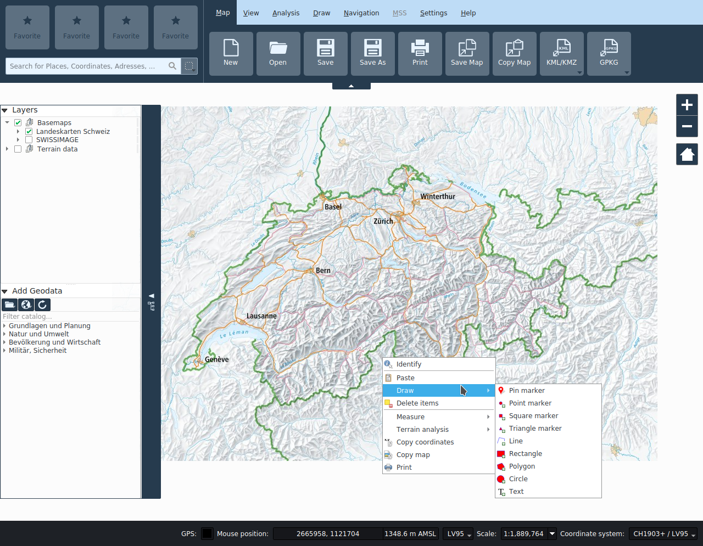

# Interfaccia KADAS

L’interfaccia grafica KADAS è divisa in cinque aree:

+ Menu delle funzionalità
+ Preferiti e ricerca
+ Visualizzazione mappa
+ Layer e catalogo dei geodati
+ Barra di stato

## Menu delle funzionalità

Le funzionalità sono raggruppate in schede, le quali possono essere attivate dalla barra del menu. Le schede contengono pulsanti per le varie funzionalità. Queste sono documentate nei rispettivi capitoli:

+ <a href="/map">Mappa</a>
+ <a href="/view">Vista</a>
+ <a href="/analysis">Analisi</a>
+ <a href="/draw">Disegnare</a>
+ <a href="/gps">Navigazione</a>
+ <a href="/mss">MSS</a>
+ <a href="/settings">Impostazioni</a>

## Preferiti e ricerca

### Preferiti

I quattro segnaposto possono essere utilizzati per posizionare le funzioni preferite dai menu delle funzioni. Questo viene fatto trascinando i pulsanti delle funzioni con il mouse. Il preferito può essere rimosso premendo il tasto destro del mouse. I preferiti vengono salvati come impostazioni utente.

### Ricerca

Il campo di ricerca offre un'interfaccia unitaria per diversi servizi di ricerca:

+ Coordinate (LV03, LV95, DD, DM, DMS, UTM, MGRS)
+ Località e indirizzi in tutta la Svizzera
+ Località in tutto il mondo
+ Attributi nei set di dati locali
+ Attributi nei set di dati remoti (servizi web)
+ Attributi negli spilli

La ricerca viene avviata appena sono stati digitati tre o più caratteri nel campo.

I risultati vengono elencati nelle categorie corrispondenti. L'elenco dei risultati può essere esaminato con il mouse oppure con le frecce della tastiera. Se si seleziona un risultato con i tasti freccia, nel punto corrispondente viene inserita una spillo blu. Attivando un risultato con il mouse, il riquadro della mappa viene centrato nella località corrispondente.

Alla destra del campo di ricerca è possibile definire un filtro per la ricerca locale e remota del set di dati. Questo filtro *non* viene applicato alla ricerca di coordinate, località o spilli.

## Visualizzazione mappa

Quest'area centrale di KADAS visualizza i layer caricati e permette di eseguire varie operazioni sulla mappa.

È possibile navigare nella mappa con il tasto sinistro o centrale del mouse e zoomare con la rotella di scorrimento o con i tasti di zoom nell'angolo superiore destro della finestra della mappa. Il tasto destro del mouse apre il menu di contesto. I movimenti di panoramica e rotazione vengono riconosciuti sui dispositivi touch. Inoltre, è possibile ingrandire in una certa misura tenendo premuto il tasto SHIFT e trascinando un rettangolo. 

Indipendentemente dallo strumento mappa attivo, il tasto centrale del mouse e la rotella di scorrimento sono sempre utilizzati per la navigazione nella mappa. La funzione del tasto sinistro e destro del mouse dipendono dallo strumento attivo.

Il contenuto della mappa è controllato dalla legenda della mappa, descritta nella sezione successiva.

Nella scheda Visualizza è possibile aggiungere ulteriori visualizzazioni della mappa. Queste visualizzazioni aggiuntive sono passive, il che significa che non sono possibili altre interazioni oltre alla panoramica e allo zoom.

## Layer e catalogo dei geodati

Sul bordo sinistro della finestra c'è un'area espandibile che contiene le funzioni per gestire i layer della mappa. Nella parte superiore è disposta la legenda della mappa e nella parte inferiore il catalogo dei geodati.

### Layer

Nell’area della legenda sono elencati tutti i **_layer_** del progetto. La casella di controllo situata accanto ad ogni voce della legenda serve a mostrare o a nascondere il relativo layer.

È possibile selezionare un layer e trascinarlo in modo da modificarne la visibilità (Z-ordering). In base allo Z-ordering, i layer che compaiono più in alto nella legenda sono sovrapposti a quelli sottostanti.

I layer nella finestra della legenda possono essere organizzati in gruppi.

È possibile utilizzare la casella di controllo di un gruppo per mostrare/nascondere tutti i layer del gruppo con un singolo clic.

Tramite click destro su un elemento è possibile eseguire varie operazioni, a dipendenza del tipo di layer selezionato, come ad esempio:

+ Zoom sull'estensione del layer
+ Rimuovere
+ Rinominare
+ Aprire le proprietà del layer

È possibile selezionare più layer o gruppi alla volta tenendo premuto il tasto Ctrl e facendo clic con il tasto sinistro del mouse sui vari layer.

## Catalogo dei geodati

Ulteriori layer di carta possono essere aggiunti alla carta dal catalogo dei geodati. Se l'elenco è vuoto, non è stato possibile connettersi al servizio di catalogo.

All'avvio del programma vengono visualizzati solo i dati pubblici. A seconda dell'utente, dopo aver effettuato correttamente l'autenticazione, posso­no essere disponibili ulteriori dati, vedi *Autenticazione SAML* sotto.

Inserendo i termini di ricerca nel campo di testo, i layer disponibili sono limitati di conseguenza. È possibile aggiungere un layer alla mappa utilizzando il menu contestuale (tasto destro del mouse sulla voce del layer) o tramite "Drag and Drop".

Le seguenti funzioni sono disponibili sopra l'elenco del catalogo:

+ **_Aggiungi layer locale_**: Aggiungere dati locali vettoriali, raster o CSV alla mappa.
+ **_Aggiungi layer da un servizio Web_**: Aggiungere layer WMS, WFS, WCS, MapServer e Vectortile.
+ **_Ricaricare il catalogo_**: Ricarica il catalogo dei geodati.
+ **_Autenticazione SAML_**: Si apre una finestra in cui è possibile effettuare un login basato sul web sul server. Dopo aver effettuato con successo il login, il catalogo dei geodati viene ricaricato e sono disponibili ulteriori layer di carta in base alle autorizzazioni.

## Barra di stato

Nella barra di stato sono disposti i seguenti indicatori e le seguenti funzioni:

+ **_GPS_**: L'uso del pulsante GPS è descritto nel <a href="/gps">capitolo *Navigazione*</a>.
+ _**Posizione del mouse_**: La posizione corrente del mouse sulla mappa può essere visualizzata rispetto a molteplici sistemi di riferimento . Il sistema desiderato può essere selezionato dal menu a sinistra campo di visualizzazione. L'unità di misura dell'altezza può essere modificata nella scheda Impostazioni.
+ **_Scala_**: La scala corrente della visualizzazione della mappa è mostrata accanto al campo delle coordinate. Il selettore di scala consente di scegliere tra scale predefinite tra 1:500 e 1:100000000. L'icona del lucchetto consente di bloccare la scala corrente della mappa; lo zoom influirà quindi solo sul fattore di ingrandimento.
+ **_Sistema di coordinate_**: Il pulsante di selezione del sistema di coordinate permette di scegliere quale proiezione utilizzare per la mappa. Se la proiezione selezionata differisce dalla proiezione nativa di un dataset, quest'ultimo viene riproiettato, il che può comportare una riduzione delle prestazioni a seconda della quantità di dati.

