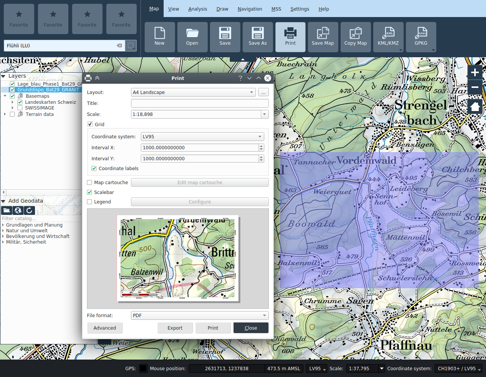
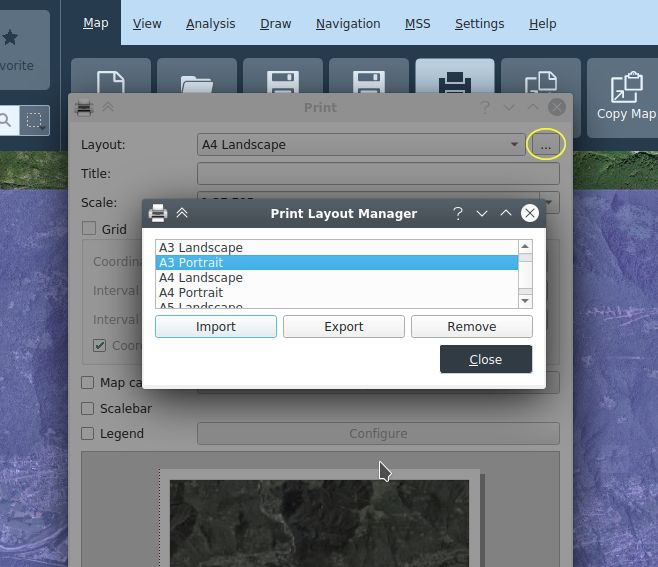

# Mappa

## Progetti

Le mappe possono essere caricate e salvate come progetti. Viene utilizzato il formato dei pro­getti QGIS, con estensione _*.qgz_. I progetti vengono creati sulla base di modelli. All'avvio dell'appli­cazione, viene automaticamente creato un progetto sulla base di un modello online od offline, a seconda che il computer sia collegato alla rete o meno.

## Creazione e salvataggio di mappe

Con le funzioni **_Nuovo_**, **_Apri_**, **_Salva_** e **_Salva con nome_**, è possibile creare dei nuovi progetti (sulla base di un modello), aprire progetti esistenti e salvare i progetti.

## Apri progetti

Le mappe salvate (progetti) possono essere caricate con la funzione **_Apri_**.

## Stampa

La mappa attuale può essere inviata alla stampante tramite la funzione **_Stampa_** o salvata in un file.

La stampa si basa su dei modelli. Come impostazione standard, vengono forniti i modelli A0-A6, in formato sia orizzontale che verticale, e un modello Custom.

Una volta scelto il modello, nella finestra della mappa principale viene visualizzato un rettangolo blu semitrasparente che corrisponde all'riquadro da stampare. Nel caso di modelli con formato di pagina fisso, il rettangolo presente nella mappa principale può essere spostato per adattare l'area di stampa. La dimensione del riquadro viene calcolato dal formato della pagina e dalla scala scelta nel dialogo di stampa. Nel caso del modello _Custom_, il riquadro viene definito numericamente nel dialogo di stampa, e il formato della pagina risultante in base a queste indicazioni.

Durante la stampa, è possibile inserire o rimuovere secondo preferenza degli elementi aggiuntivi come la griglia delle coordinate, il cartiglio della mappa, legenda e il righello della scala. La posi­zione di questi elementi è definita nel modello.

### Finestra di dialogo della stampante

+ **Modello**: scelta del modello di stampa. Viene visualizzata un’anteprima dell’output di stampa.
+ **Titolo**: titolo visualizzato sull’output di stampa.
+ **Scala**: scala di stampa
+ **Reticolo**: se la sezione Griglia è aperta, nello stampato viene posizionato un reticolo.
  + **Sistema di coordinate**: scelta del sistema di coordinate della griglia
  + **Intervallo X**: distanza delle linee del reticolo in direzione X
  + **Intervallo Y**: distanza delle linee del reticolo in direzione Y
  + **Mostra coordinate**: attivazione/disattivazione delle diciture del reticolo
+ **Cartiglio**: attivazione/disattivazione della cartuccia
+ **Modifica Cartiglio**: configurazione della cartuccia
+ **Barra della scala**: attivazione/disattivazione della visualizzazione della scala
+ **Legenda**: attivazione/disattivazione della legenda, tramite il pulsante *Configura* è inoltre possibile scegliere separatamente quali layer appaiono nella legenda
+ **Formato**: scelta del formato per la funzione di esportazione del file

### Modelli di stampa

I modelli contenuti nel progetto possono venir gestiti tramite il *Gestore modelli*, attivabile con il pulsante situato a destra del campo di selezione del modello. Nel gestore i modelli possono venir importati, esportati e rimossi dal progetto.

### Cartuccia mappa

In questa finestra è possibile definire il contenuto della **_cartuccia_**. Nei campi di immissione è depositata la funzione del testo. Se è attivata la casella di controllo checkbox **Esercizio**, vengono visualizzate le indicazioni per l’esercizio nella cartuccia.

Inoltre è possibile esportare e importare il contenuto del cartiglio come file XML a sé stanti dal dialogo di modifica del cartiglio.

### Output di stampa

+ **Esporta**: viene creato un file nel formato scelto.
+ **Stampa**: tramite la schermata di stampa è possibile scegliere una stampante configurata e avviare l’output.
+ **Chiudi**: la finestra di dialogo di stampa viene chiusa.
+ **Avanzato**: richiamo della funzionalità di layout avanzata

## Copia mappa / Salva mappa

Queste funzioni consentono di salvare il riquadro della mappa visibile della mappa negli appunti o in un'immagine. Viene sempre salvato il contenuto identico a quanto è mostrato nella finestra della mappa.

La funzione **_Salva mappa_** apre un dialogo che permette di selezionare il percorso e il tipo di file (PNG, JPG, etc.) di uscita. Un file "world" (con estensione PNGW, JPGW, etc.) salvato nella stessa cartella georeferenzia l’immagine.

## Esportazione e importazione KML/KMZ

Il contenuto della mappa può essere esportato come KML o KMZ. Immagini, layer raster e simboli MSS possono solamente venir esportati nel formato KMZ.

I file KML/KMZ possono anche essere importati in KADAS.

*Nota*: KMZ e KML sono formati di esportazione che possono comportare delle per­dite e, pertanto, non sono adatti allo scambio tra utenti di KADAS. A questo scopo è necessario utiliz­zare il formato nativo _*.qgs_.

## GPKG Esportazione e importazione

Il GeoPackage (GPKG) KADAS è un formato di file basato su SQLite, che raggruppa in un unico file sia i geodati locali contenuti in un progetto che il progetto stesso, offrendo così la possibilità di comodamente scambiare progetti e dati.

Durante l'esportazione del progetto a GPKG, è possibile scegliere quali geodati devono essere scritti nel GeoPackage, il progetto salvato nel GPKG caricherà i dati direttamente dal GPKG. Si può anche decidere se un GPKG esistente debba essere aggiornato o completamente sostituito. Nel primo caso, i dati esistenti rimangono nel GPKG, anche se non sono referenzati dal progetto.

Durante l'importazione, un progetto KADAS viene cercato e aperto nel GPKG, e dati georeferenziati dal GPKG vengono caricati direttamente dallo stesso.

