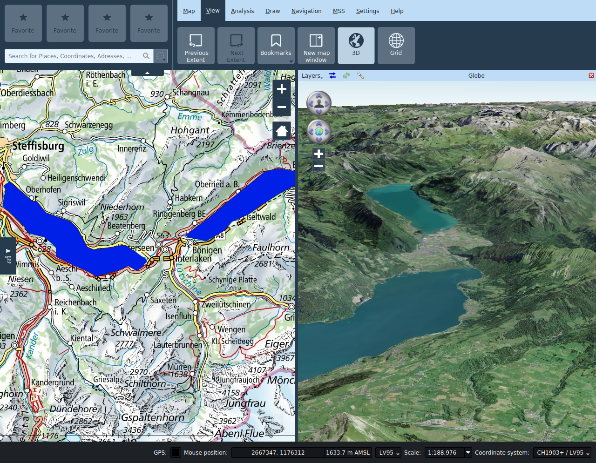

# Vista

## Estensione precedente/successiva

Spostandosi sulla mappa con la funzione **_Estensione precedente_** è possibile tornare all’estensione di mappa mostrato in precedenza. Tramite **_Estensione successivo_** si passa all’estensione di mappa selezionato successivamente.

## Nuova finestra della mappa

La funzione **_Nuova vista_** permette di aprire viste secondarie della mappa. Trascinamento della barra del titolo, queste possono essere posizionate a piacimento, all'interno della finestra principale o disassociata da essa.

Nelle sottofinestre è possibile attivare o disattivare i layer indipendentemente dalla vista principale. Il riquadro può essere comandato indipendentemente dalla vista principale oppure può essere automaticamente sincronizzato attivando l'icona del lucchetto sulla barra del titolo della sottofinestra.

Nelle viste secondarie della mappa è disponibile soltanto lo strumento di navigazione, tutti gli altri strumenti possono essere utilizzati unicamente nella vista principale.

In caso di necessità, è possibile modificare il titolo della sottofinestra.

## 3D

Con la funzione **_3D_** è possibile aprire una finestra in cui viene visualizzato il globo terrestre. La finestra viene disposta automaticamente ma può essere spostata con il mouse all’interno o all’esterno della finestra del programma.

### Impostazioni

Le seguenti funzioni sono disponibili dalla barra titolo della finestra 3D:

+ **Selezione dei layer**: Permette la selezione dei layer della vista 2D da visualizzare sul globo.
+ **Sincronizza estensione**: questo bottone permette di sincronizzare l'estensione della vista del globo con l'estensione della finestra principale.
+ **Ricarica scena**: questo bottone ricarica tutti i layer visualizzati sul globo.
+ **Impostazioni globo**: questo pulsante apre il dialogo di configurazione del globo. In esso è possibile configurare i modelli di elevazione e le immagini di sfondo. I layer della vista 2D da visualizzare sul globo vengono selezionati dal menu situato a sinistra nella barra del titolo. Per motivi di prestazione, come impostazione standard vengono visualizzati solo i layer locali della vista 2D. Se possibile, i layer delle immagini di sfondo dovrebbero essere selezionati direttamente nel dialogo delle impostazioni del globo.

Per impostazione predefinita, i layer della vista 2D sono disegnati come immagini drappeggiate sul terreno del globo. Layer vettoriali (tra cui redlining) possono alternativamente venir visualizzati come modelli estrusi 2.5D oppure come modelli 3D. Lo stile del layer viene applicato ai modelli nel limite del possibile. Per la rappresentazione come modelli 3D, le geometrie devono contenere informazioni di quota (coordinate Z), e queste devono essere espresse relative al layer del suolo oppure al layer del mare. Le impostazioni di visualizzazione si possono modificare nel dialogo delle proprietà del rispettivo layer.

*Nota*: I tooltip dei campi delle impostazioni del Globo del layer descrivono le varie impostazioni in dettaglio.

*Nota*: L'ombreggiatura dei modelli 3D dipende dalla posizione del sole. Questa può venir controllata inserendo la data e ora desiderata nelle impostazioni del globo.

Spilli, immagini e simboli MSS mono-punto vengono visualizzati come billboard.

### Navigazione nella vista 3D

+ **Rotazione della telecamera**: il controllo di navigazione superiore permette di impostare la rotazione della telecamera.
+ **Posizione della telecamera**: Il controllo di navigazione inferiore permette di spostare la posizione della telecamera. Il medesimo risultato si ottiene premendo le freccie della tastiera.
+ **+**: Avvicina la telecamera al globo.
+ **-**: Allontana la telecamera dal globo.

## Griglia

Nella scheda Vista, è possibile attivare la **_griglia_** della mappa.

Nell'area delle proprietà della griglia, è possibile specificare il tipo della griglia, gli intervali e lo stile.

