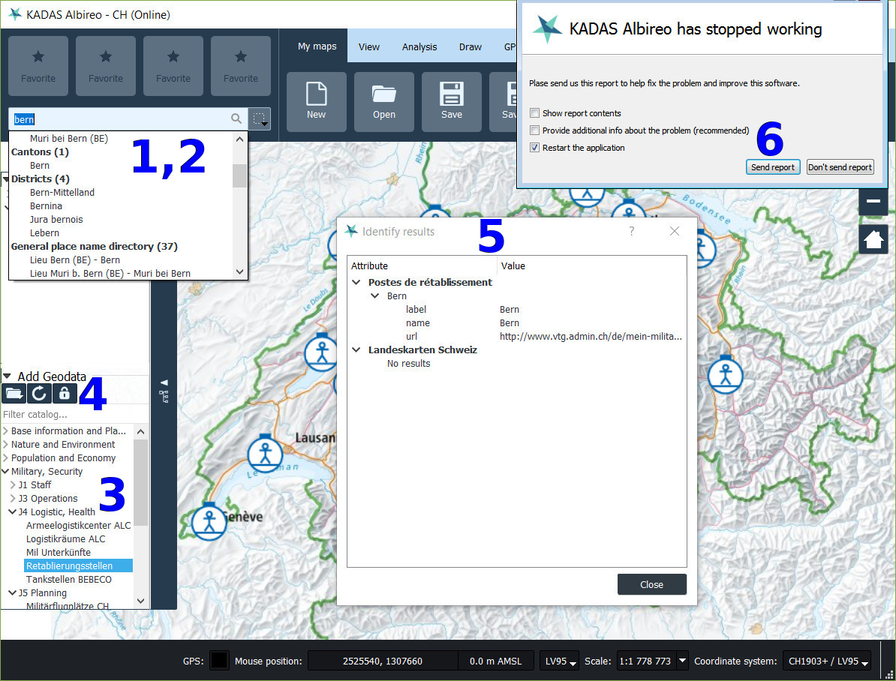

Application layout
==================
- - -

### Important items in application files root

 * `<InstallRoot>\bin\qgis.exe`: Main executable
 * `<InstallRoot>\share\qgis\project_templates`: Project templates
 * `<InstallRoot>\share\qgis\certificates`: Location for extra root certificates
 * `<InstallRoot>\share\qgis\settings_{full,patch}.ini`: Full / incremental settings template
 * `<InstallRoot>\share\qgis\python\plugins`: Location for python plugins
 * `<InstallRoot>\share\kadas\`: Location of geodata

### Per-user configuration:

 * `%APPDATA%\Sourcepole\kadas-albireo\Sourcepole\QGIS Enterprise 15.ini`: Application settings file
 * `%APPDATA%\Sourcepole\kadas-albireo\python\plugins`: Location for user specific python plugins
 * *Note*:

Configuration file
==================
- - -

 * The configuration file is specific to each user and located in

       `%APPDATA%\Sourcepole\kadas-albireo\Sourcepole\QGIS Enterprise 15.ini`

   * Hereafter referred to as `<config.ini>`

 * It is automatically copied from `<InstallRoot>\share\qgis\settings_full.ini` the first time KADAS Albireo is started
 * If KADAS Albireo is launched subsequently and the configuration file already exists, the settings from `<InstallRoot>\share\qgis\settings_patch.ini` are merged into the configuration file if the timestamp `settings_patch.ini -> [General] -> timestamp` is newer

Project templates
=================
- - -

 * Located in `<InstallRoot>\share\qgis\project_templates`
 * Templates for online and offline operation (*.qgs)
 * Print templates (*.qpt), referenced from online/offline templates
 * Use data from the geodata packages (`KadasCoreData.msi`, `KadasDatapack.msi`)
 * Project creation dialog in KADAS lists projects in this folder

Geodata
=======
- - -

 * Installed by `KadasCoreData.msi` to `<InstallRoot>\share\kadas\`
   * CH elevation model for 2D/analysis: `dtm_analysis.tif`
   * CH elevation model for 3D: `dtm_globe.tif`
   * Coarse worldwide elevation model for 3D: `general_dtm_globe.tif`
   * Base imagery for 3D: `aerial_image_globe.tif`
 * Installed by `KadasDatapack.msi` to `<InstallRoot>\share\kadas\`
   * Base imagery for 2D, offline: `CheLandeskarte*.gpkg`, `CheOperativePlanungsKarte.gpkg`, ...
 * Referenced by absolute path in project templates

Online/Offline operation
========================
- - -

 * Connection to test URL attempted on startup to determine whether machine is online
   * `<config.ini> -> [Qgis] -> onlineTestUrl`
 * If online, default online project is loaded on startup
   * `<config.ini> -> [Qgis] -> onlineDefaultProject`
 * If offline, default offline project is loaded on startup
   * `<config.ini> -> [Qgis] -> onlineDefaultProject`
 * *Note*: Paths relative to `<config.ini> -> [Qgis] -> projectTemplateDir`

### Online mode:

 * Web services for background layers
 * Online search (locations, map service features)
 * Geodata catalog
 * Raster identify service

### Offline mode:

 * Local background layers (`KadasDatapack.msi`)
 * Offline search (`KadasLocationSearch.msi`)
 
### Disabling special features:
 
 * If you dont have any EIAM enabled infrastructure, you can turn off the login button by turning libiamauth to false in the config.ini file.
 * If you dont plan to use the MSS/MILX tactical symbol component, you can disable it by turning libqgs_milx to false in the config.ini file.

Services
========
- - -

 - 1: Location search (CH, worldwide)
 - 2: Map service feature search
 - 3: Geodata catalog
 - 4 Geodata login for restricted services
 - 5: Raster identify
 - 6: Crash reporting service

### Location search, CH:

 * Fine-grained search (places, ZIP codes, municipalities, ...)
 * API: [https://api3.geo.admin.ch/services/sdiservices.html#search](https://api3.geo.admin.ch/services/sdiservices.html#search) -> Location search
 * KADAS Albireo groups results by `origin` (i.e. `zipcode`, `district`, ...), see [https://api3.geo.admin.ch/services/sdiservices.html#id26](https://api3.geo.admin.ch/services/sdiservices.html#id26)
 * Online: `<config.ini> -> [search] -> locationsearchurl`
 * Offline: `<config.ini> -> [search] -> locationofflinesearchurl`

### Location search, worldwide:

 * Coarse-grained search (cities)
 * API: [https://api3.geo.admin.ch/services/sdiservices.html#search](https://api3.geo.admin.ch/services/sdiservices.html#search) -> Location search
 * KADAS Albireo groups results by `origin` (currently only `geonames` recognized, which is mapped to `World Places`)
 * Online: `<config.ini> -> [search] -> worldlocationsearchurl`
 * Offline: `<config.ini> -> [search] -> worldlocationofflinesearchurl`

### Map service feature search

 * Searches features inside map service layers loaded in current project
 * API: [https://api3.geo.admin.ch/services/sdiservices.html#search](https://api3.geo.admin.ch/services/sdiservices.html#search) -> Feature search
 * Online only: `<config.ini> -> [search] -> remotedatasearchurl`

### Raster identify

 * Queries attributes of queriable web service layers at selected map position
 * API:
    * Request:

          <serviceUrl>?layers=<layerId1>,<layerId2>,...
              &geometryType=esriGeometryPoint
              &geometry=<x>,<y>  // EPSG:4326
              &mapExtent=<xmin>,<ymin>,<xmax>,<ymax>  // EPSG:4326
              &imageDisplay=<canvas_width>,<canvas_height>,<canvas_dpi>
              &tolerance=<tolerance_px>

    * Response:

          {"results": [
            {
              "layerId": <layerId>,
              "geometry": {
                "x": <x>,
                "y": <y>,
                "spatialReference": {"wkid": <srid, i.e. 21781>},
              },
              "geometryType": <esri geometry type, i.e. esriGeometryPoint>,
              "displayFieldName": <key of field to use as display label>,
              "attributes": {
                <attr1_key>: <attr1_value>,
                <attr2_key>: <attr2_value>,
                ...
              }
            }
          ]}
 * Online only: `<config.ini> -> [vbs] -> identifyurl`

### Geodata catalog

 * Catalog for web map services (WMS, WMTS, ArcGIS MapServer)
 * `<config.ini> -> QGis -> geodatacatalogs = type=<type>&url=<url>;;...`
 * Support for multiple catalog services
 * `type=vbs` catalog service must return a JSON document in the form

       {"results": [
         {
           "category": <category path>,
           "dimension": <optional, WMTS dimension value>,
           "dimensionIdentifier": <optional, WMTS dimension identifier>,
           "layerName": <the layer name used for locating the layer service capabilities or index>,
           "metadataUrl": <optional: url to metadata page, can be opened via context menu of layer tree entry>,
           "position": <result position in the catalog tree>,
           "title": <display label for the result entry>,
           "url": <url to the layer service>,
           "version": <service version>
         }
       }

   For example:

       {"results": [
         {
          "category":"Grundlagen und Planung\/Basiskarten",
          "dimension":"current",
          "dimensionIdentifier":"Time",
          "layerName":"ch.swisstopo.pixelkarte-farbe-pk50.noscale",
          "metadataUrl":"https:\/\/www.arcgis.com\/home\/item.html?id=ef25da96655446489475391d1ffb30e3",
          "position":"1\/1\/14",
          "title":"Landeskarte 1:50'000 | LK50",
          "type":"wmts",
          "url":"https:\/\/wmts20.geo.admin.ch\/EPSG\/2056",
          "version":"1.0.0"
        },{
           "category":"Grundlagen und Planung\/Luft-, Satellitenbilder",
           "dimension":"",
           "dimensionIdentifier":"",
           "layerName":"0",
           "metadataUrl":"https:\/\/www.arcgis.com\/home\/item.html?id=c3e5428a6d9a4a3b80ddbd79c555e101",
           "position":"1\/3\/20",
           "title":"World Imagery",
           "type":"ams",
           "url":"https:\/\/server.arcgisonline.com\/arcgis\/rest\/services\/World_Imagery\/MapServer",
           "version":"10.4"
        },
        {
          "category":"Bevölkerung und Wirtschaft\/Verkehr",
          "dimension":"",
          "dimensionIdentifier":"",
          "layerName":"ch.bazl.luftfahrthindernis",
          "metadataUrl":"https:\/\/www.arcgis.com\/home\/item.html?id=a9e2383c04a24aabb014775de61dab28",
          "position":"3\/4\/17",
          "title":"Luftfahrthindernisse",
          "type":"wms",
          "url":"https:\/\/wms.geo.admin.ch\/",
          "version":"1.0.0"
        },
        ...
       ]}
	
	This JSON file can be delivered via a web service. 
	It can also be served from a local file. In this case use the URL notation in the config file: file:///path/to/catalogfile.json

### Geodata login for restricted services

 * Authentication for accessing restricted map services
 * Opens an authentication webpage in an Internet Explorer instance, reads the authorization cookie upon successful authentication and stores the cookie for a specified list of domains
 * `<config.ini> -> iamauth -> loginurl`
 * `<config.ini> -> iamauth -> cookieurls`
 

### Crash reporting service

 * A crash handler generates a backtrace whenever KADAS Albireo crashes, which the user can submit as an error report to a web service
 * Sample implementation of web service: [https://github.com/manisandro/GdbCrashHandler/blob/master/service/report.php](https://github.com/manisandro/GdbCrashHandler/blob/master/service/report.php)
 * `<config.ini> -> [Qgis] -> crashrpt_url`

Advanced configuration
======================
- - -

### Classic mode

 * KADAS Albireo contains both the optimized ribbon interface as well as the classic QGIS interface
 * Launch the classic interface by passing `--ribbongui false` to `qgis.exe`:

       <InstallRoot>\bin\qgis.exe --ribbongui false

### Extending KADAS Albireo with Python plugins

 * KADAS Albireo can be extended through plugins written in Python.
 * The API documentation is available at [https://sourcepole.github.io/kadas-manuals/apidoc/](https://sourcepole.github.io/kadas-manuals/apidoc/).
 * Most of the QGIS 2.x Plugin development resources available online will also apply to KADAS Albireo.
 * The [QgsInterface::addAction](https://sourcepole.github.io/kadas-manuals/apidoc/classQgisInterface.html) method specific to KADAS Albireo allows generically adding new actions to both the ribbon GUI as well as the classic GUI. A minimal example is as follows:

       from PyQt5.QtCore import *
       from PyQt5.QtGui import *
 
       class KadasExample(QObject):
 
           def __init__(self, iface):
               QObject.__init__(self)
               self.iface = iface
 
           def initGui(self):
               self.exampleAction = QAction(QIcon(":/icon.png"), self.tr("Example"))
               self.exampleAction.triggered.connect(self.__run)
               self.iface.addAction(self.exampleAction, self.iface.PLUGIN_MENU, self.iface.NO_TOOLBAR, self.iface.CUSTOM_TAB, self.tr("&Custom tab"))
 
           def unload(self):
               pass
 
           def __run(self):
               QMessageBox.information(self.iface.mainWindow(), self.tr("Example plugin"), self.tr("Example plugin"))

 * Place custom python plugins in
   * System wide location: `<InstallRoot>\share\qgis\python\plugins`
   * Per-user location: `%APPDATA%\Sourcepole\kadas-albireo\python\plugins`
 * Plugins can be enabled in `<config.ini>`

       [PythonPlugins]
       <plugin_name>=true
 * Plugins can also be managed via classic GUI: `Plugins -> Manage and Install Plugins`
   * If custom plugins are correctly placed in the system wide or per-user location, they appear under the *Installed* section in the plugin manager. They are deselected by default.

Troubleshooting
===============
- - -

### Enabling debug output

 * Set debugging environment variables:

       set QGIS_DEBUG=1
       set QGIS_LOG_FILE=%HOMEPATH%\debug.log

 * Or redirect output streams to files

       qgis.exe 1>%HOMEPATH%\stdout.txt 2>%HOMEPATH%\stderr.txt

 * *Note*: `%HOMEPATH%` is just an example, but you need to make sure that the destination location is writable by the user.

### Troubleshooting networking issues

 * Connectivity issues which are limited to KADAS Albireo might be caused by mis-detected proxy settings:
   * By default, the system proxy is used
   * Proxy configuration can be set explicitly in the classic GUI (`--ribbongui false`) in `Settings -> Options... -> Network`
   * Settings stored in `<config.ini> -> [proxy]`
 * If service requests time out or data from map services appears incomplete (i.e. missing tiles), the network timeout might be too low
   * Default is 15 seconds
   * Can be adjusted in the classic gui in  `Settings -> Options... -> Network`
   * Setting store in `<config.ini> -> [Qgis] -> networkAndProxy\networkTimeout`
 * If secure HTTPS connections result in warnings about untrusted certificates, a missing CA root certificate might be the cause
   * Additional CA root certificates can be placed in `<InstallRoot>\share\qgis\certificates`
