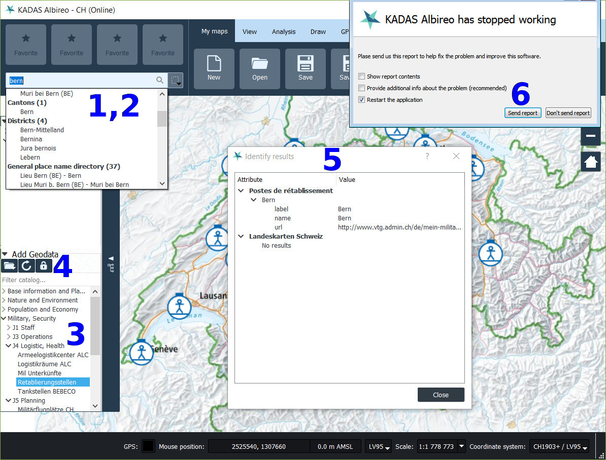

Application layout
==================
- - -

### Important items in application files root

 * `<InstallRoot>\bin\kadas.exe`: Main KADAS executable
 * `<InstallRoot>\bin\qgis.exe`: Main QGIS executable
 * `<InstallRoot>\share\kadas\project_templates`: Project templates
 * `<InstallRoot>\share\kadas\print_templates`: Print templates
 * `<InstallRoot>\share\kadas\certificates`: Location for extra root certificates
 * `<InstallRoot>\share\kadas\python\plugins`: Location for python plugins
 * `<InstallRoot>\share\kadas\geodata`: Location of geodata
 * `<InstallRoot>\share\kadas\settings_{full,patch}.ini`: Full / incremental settings template
 * `<InstallRoot>\share\kadas\datasource_migrations.json`: Datasource migrations
 * `<InstallRoot>\opt\mss`: MSS/MILX server component (not part of public release)

### Per-user configuration

 * `%APPDATA%\Kadas\Kadas\profiles\default\Kadas\Kadas.ini`: Application settings file
 * `%APPDATA%\Kadas\Kadas\profiles\default\python\plugins`: Location for user specific python plugins

Configuration file
==================
- - -

 * The application settings file `Kadas.ini` is automatically copied from `<InstallRoot>\share\kadas\settings_full.ini` the first time KADAS Albireo is started
 * If KADAS Albireo is launched subsequently and the configuration file already exists, the settings from `<InstallRoot>\share\kadas\settings_patch.ini` are merged into the configuration file if the timestamp `settings_patch.ini -> [General] -> timestamp` is newer

Project templates
=================
- - -

 * Located in `<InstallRoot>\share\kadas\project_templates`
 * Templates for online and offline operation (*.qgz)
 * Print templates (*.qpt), loaded when opening any project template
 * Use data from the geodata packages (`KadasCoreData.msi`, `KadasDatapack.msi`)
 * Project creation dialog in KADAS lists projects templates in this folder

Geodata
=======
- - -

 * Installed by `KadasCoreData.msi` to `<InstallRoot>\share\kadas\geodata`
   * CH elevation model for 2D/analysis: `dtm_analysis.tif`
   * CH elevation model for 3D: `dtm_globe.tif`
   * Coarse worldwide elevation model for 3D: `general_dtm_globe.tif`
   * Base imagery for 3D: `aerial_image_globe.tif`
 * Installed by `KadasDatapack.msi` to `<InstallRoot>\share\kadas\geodata`
   * Base imagery for 2D, offline: `CheLandeskarte*.gpkg`, `CheOperativePlanungsKarte.gpkg`, ...
 * Referenced by absolute path in project templates

Datasource migrations
=====================
- - -

* Located in `<InstallRoot>\share\kadas\datasource_migrations.json`
* Defines datasources which are automatically migrated when opening a project, i.e.:

      {
        "files": [ // Migrations for local file datasources
          {
            "old": "c:/program files/kadasalbireo/appdata/grunddatensatz/chelandeskarte100.gpkg",
            "new": "C:/Program Files/KadasAlbireo/share/kadas/geodata/CheLandeskarte100.gpkg"
          },
          ...
        ],
        "ams": [ // Migrations for ArcGIS MapServer datasources
          {
            "old_url": "https://hostname1/servicepath/MapServer",
            "new_params": "url=https://hostname2/servicepath/MapServer&layer=layerid"
          },
          ...
        ],
        "wms": [ // Migrations for WMS and WMTS datasources
          {
            "old_url": "https://hostname1/wms",
            "old_ident": "layerid",
            "new_params": "contextualWMSLegend=0&crs=EPSG:2056&dpiMode=7&featureCount=10&format=image/png&layers=layerid2&styles=default&url=https://hostname2/wms",
            "del_params": "SmoothPixmapTransform,tileMatrixSet,referer,tileDimensions"
          },
          ...
        ]
      }

* Useful to automatically adapt project files created on systems where the base geodata was stored in a different location

Online/Offline operation
========================
- - -

 * Connection to test URL attempted on startup to determine whether machine is online
   * `Kadas.ini -> [kadas] -> onlineTestUrl`
 * If online, default online project is loaded on startup
   * `Kadas.ini -> [kadas] -> onlineDefaultProject`
 * If offline, default offline project is loaded on startup
   * `Kadas.ini -> [kadas] -> onlineDefaultProject`

### Online mode:

 * Web services for background layers
 * Online search (locations, map service features)
 * Geodata catalog
 * Raster identify service

### Offline mode:

 * Local background layers (`KadasDatapack.msi`)
 * Offline search (`KadasLocationSearch.msi`)
 
### Disabling special features:
 
 * If you don't have any EIAM enabled infrastructure, you can turn off the login button by turning libiamauth to false in the `Kadas.ini` file.

Services
========
- - -

 - 1: Location search (CH, worldwide)
 - 2: Map service feature search
 - 3: Geodata catalog
 - 4 Geodata login for restricted services
 - 5: Raster identify
 - 6: Crash reporting service

### Location search, CH:

 * Fine-grained search (places, ZIP codes, municipalities, ...)
 * API: [https://api3.geo.admin.ch/services/sdiservices.html#search](https://api3.geo.admin.ch/services/sdiservices.html#search) -> Location search
 * KADAS Albireo groups results by `origin` (i.e. `zipcode`, `district`, ...), see [https://api3.geo.admin.ch/services/sdiservices.html#id26](https://api3.geo.admin.ch/services/sdiservices.html#id26)
 * Online: `Kadas.ini -> [search] -> locationsearchurl`
 * Offline: `Kadas.ini -> [search] -> locationofflinesearchurl`

### Location search, worldwide:

 * Coarse-grained search (cities)
 * API: [https://api3.geo.admin.ch/services/sdiservices.html#search](https://api3.geo.admin.ch/services/sdiservices.html#search) -> Location search
 * KADAS Albireo groups results by `origin` (currently only `geonames` recognized, which is mapped to `World Places`)
 * Online: `Kadas.ini -> [search] -> worldlocationsearchurl`
 * Offline: `Kadas.ini -> [search] -> worldlocationofflinesearchurl`

### Map service feature search

 * Searches features inside map service layers loaded in current project
 * API: [https://api3.geo.admin.ch/services/sdiservices.html#search](https://api3.geo.admin.ch/services/sdiservices.html#search) -> Feature search
 * Online only: `Kadas.ini -> [search] -> remotedatasearchurl`

### Raster identify

 * Queries attributes of queriable web service layers at selected map position
 * API:
    * Request:

          <serviceUrl>?layers=<layerId1>,<layerId2>,...
              &geometryType=esriGeometryPoint
              &geometry=<x>,<y>  // EPSG:4326
              &mapExtent=<xmin>,<ymin>,<xmax>,<ymax>  // EPSG:4326
              &imageDisplay=<canvas_width>,<canvas_height>,<canvas_dpi>
              &tolerance=<tolerance_px>

    * Response:

          {"results": [
            {
              "layerId": <layerId>,
              "geometry": {
                "x": <x>,
                "y": <y>,
                "spatialReference": {"wkid": <srid, i.e. 21781>},
              },
              "geometryType": <esri geometry type, i.e. esriGeometryPoint>,
              "displayFieldName": <key of field to use as display label>,
              "attributes": {
                <attr1_key>: <attr1_value>,
                <attr2_key>: <attr2_value>,
                ...
              }
            }
          ]}
 * Online only: `Kadas.ini -> [kadas] -> identifyurl`

### Geodata catalog

 * Catalog for web map services (WMS, WMTS, ArcGIS MapServer)
 * `Kadas.ini -> [kadas] -> geodatacatalogs = type=<type>&url=<url>;;...`
 * Currently supported: `type=vbs`:
   - Expects an URL returning a JSON document in the form

         {"results": [
          {
             "category": <category path>,
             "dimension": <optional, WMTS dimension value>,
             "dimensionIdentifier": <optional, WMTS dimension identifier>,
             "layerName": <the layer name used for locating the layer service capabilities or index>,
             "metadataUrl": <optional: url to metadata page, can be opened via context menu of layer tree entry>,
             "position": <result position in the catalog tree>,
             "title": <display label for the result entry>,
             "type": <service type>,
             "url": <url to the layer service>,
             "version": <service version>
           },
           ...
         ]}

   - Supported service types are `wms`, `wmts`, `ams` (ArcGIS Map Service)
   - For example:

         {"results": [
           {
            "category":"Grundlagen und Planung\/Basiskarten",
            "dimension":"current",
            "dimensionIdentifier":"Time",
            "layerName":"ch.swisstopo.pixelkarte-farbe-pk50.noscale",
            "metadataUrl":"https:\/\/www.arcgis.com\/home\/item.html?id=ef25da96655446489475391d1ffb30e3",
            "position":"1\/1\/14",
            "title":"Landeskarte 1:50'000 | LK50",
            "type":"wmts",
            "url":"https:\/\/wmts20.geo.admin.ch\/EPSG\/2056",
            "version":"1.0.0"
          },{
             "category":"Grundlagen und Planung\/Luft-, Satellitenbilder",
             "dimension":"",
             "dimensionIdentifier":"",
             "layerName":"0",
             "metadataUrl":"https:\/\/www.arcgis.com\/home\/item.html?id=c3e5428a6d9a4a3b80ddbd79c555e101",
             "position":"1\/3\/20",
             "title":"World Imagery",
             "type":"ams",
             "url":"https:\/\/server.arcgisonline.com\/arcgis\/rest\/services\/World_Imagery\/MapServer",
             "version":"10.4"
          },{
            "category":"Bevölkerung und Wirtschaft\/Verkehr",
            "dimension":"",
            "dimensionIdentifier":"",
            "layerName":"ch.bazl.luftfahrthindernis",
            "metadataUrl":"https:\/\/www.arcgis.com\/home\/item.html?id=a9e2383c04a24aabb014775de61dab28",
            "position":"3\/4\/17",
            "title":"Luftfahrthindernisse",
            "type":"wms",
            "url":"https:\/\/wms.geo.admin.ch\/",
            "version":"1.0.0"
          },
          ...
         ]}

   - The catalog URL can also refer to a local file, using the notation `file:///path/to/catalogfile.json`

### Geodata login for restricted services

 * Authentication for accessing restricted map services
 * Opens an authentication webpage in an Internet Explorer instance, reads the authorization cookie upon successful authentication and stores the cookie for a specified list of domains
 * `Kadas.ini -> iamauth -> loginurl`
 * `Kadas.ini -> iamauth -> cookieurls`
 

### Crash reporting service

 * A crash handler generates a backtrace whenever KADAS Albireo crashes, which the user can submit as an error report to a web service
 * Sample implementation of web service: [https://github.com/manisandro/GdbCrashHandler/blob/master/service/report.php](https://github.com/manisandro/GdbCrashHandler/blob/master/service/report.php)
 * `Kadas.ini -> [kadas] -> crashrpt_url`

### About dialog

 * Implemented in the `kadas-help-plugin`
 * Freely customizeable
 * Sample implementation: `https://github.com/kadas-albireo/kadas-help-plugin`

Extending KADAS Albireo with Python plugins
===========================================
- - -

 * KADAS Albireo can be extended through plugins written in Python.
 * The API documentation is available at [https://sourcepole.github.io/kadas-manuals/apidoc/](https://sourcepole.github.io/kadas-manuals/apidoc/).
 * Most of the QGIS 3.x Plugin development resources available online will also apply to KADAS Albireo.
 * The `KadasPluginInterface::addAction` method specific to KADAS Albireo allows generically adding new actions to the ribbon GUI as well as to the classic QGIS GUI. A minimal example is as follows:

       from PyQt5.QtCore import *
       from PyQt5.QtGui import *
       from PyQt5.QtWidgets import *

       from kadas.kadasgui import *
 
       class KadasExample(QObject):
 
           def __init__(self, iface):
               QObject.__init__(self)
               self.iface = KadasPluginInterface.cast(iface)
 
           def initGui(self):
               self.exampleAction = QAction(QIcon(":/icon.png"), self.tr("Example"))
               self.exampleAction.triggered.connect(self.__run)
               self.iface.addAction(self.exampleAction, self.iface.PLUGIN_MENU, self.iface.CUSTOM_TAB, self.tr("&Custom tab"))
 
           def unload(self):
               pass
 
           def __run(self):
               QMessageBox.information(self.iface.mainWindow(), self.tr("Example plugin"), self.tr("Example plugin"))

 * Place custom python plugins in
   * System wide location: `<InstallRoot>\share\kadas\python\plugins`
   * Per-user location: `%APPDATA%\Kadas\Kadas\profiles\default\python\plugins`
 * Plugins can be managed from the Plugin Manager in the Settings Tab of the Kadas ribbon GUI
   * When plugins are correctly placed in the system wide or per-user location, they appear under the *Installed* section in the plugin manager. They are deselected by default.
 * Plugins can also be enabled directly in `Kadas.ini`

       [PythonPlugins]
       <plugin_name>=true

Troubleshooting
===============
- - -

### Enabling debug output

 * Set debugging environment variables:

       set QGIS_DEBUG=1
       set QGIS_LOG_FILE=%HOMEPATH%\debug.log

 * Or redirect output streams to files

       qgis.exe 1>%HOMEPATH%\stdout.txt 2>%HOMEPATH%\stderr.txt

 * *Note*: `%HOMEPATH%` is just an example, but you need to make sure that the destination location is writable by the user.

### Troubleshooting networking issues

 * Connectivity issues might be caused by mis-detected proxy settings:
   * By default, the system proxy is used
   * The proxy configuration can be found in `Kadas.ini -> [proxy]`
 * If service requests time out or data from map services appears incomplete (i.e. missing tiles), the network timeout might be too low
   * Default is 15 seconds
   * Can be adjusted in `Kadas.ini -> [Qgis] -> networkAndProxy\networkTimeout`
 * If secure HTTPS connections result in warnings about untrusted certificates, a missing CA root certificate might be the cause
   * Additional CA root certificates can be placed in `<InstallRoot>\share\kadas\certificates`
