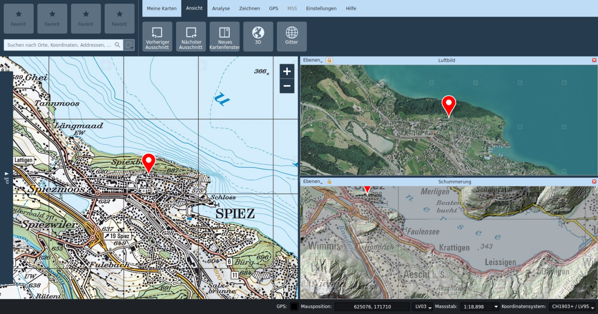
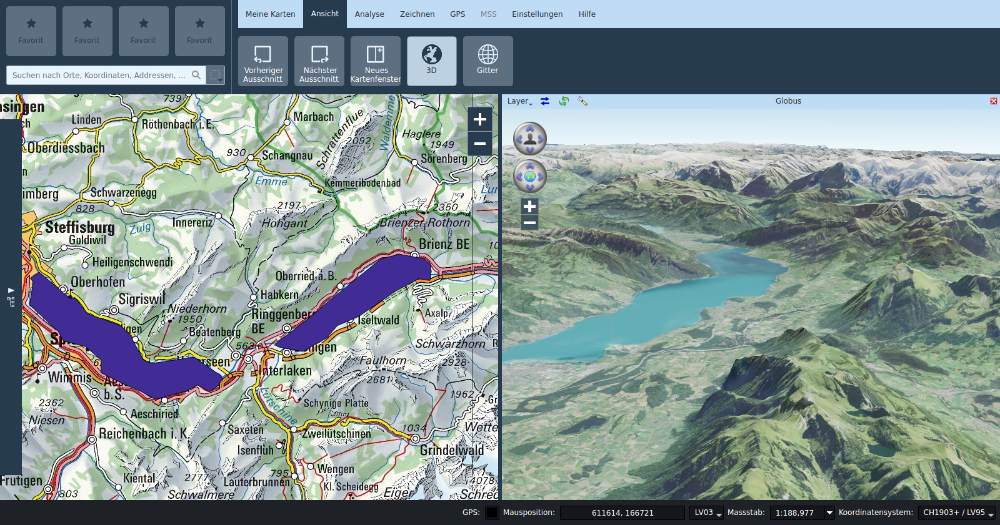
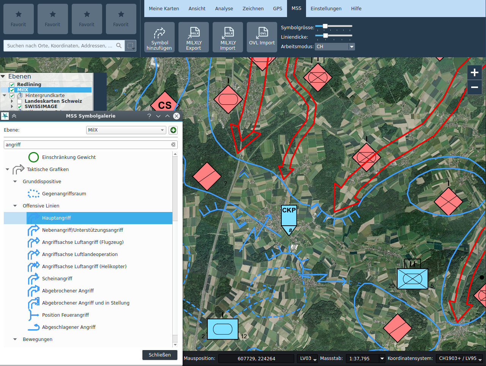

# Mehrere Kartenfenster und 3D Ansicht

## Mehrere Kartenfenster

In der Registerkarte *Ansicht* können neue Kartenunterfenster geöffnet werden. Diese können durch Ziehen an der Titelleiste beliebig innerhalb des Hauptfenster oder entkoppelt davon angeordnet werden.

In den Unterfensteransichten können unabhängig von der Hauptansicht Ebenen aktiviert und deaktiviert werden. Der Ausschnitt lässt sich unabhängig von der Hauptansicht steuern oder mit dieser koppeln indem die Schloss-Ikone in der Titelleiste des Unterfenster aktiviert wird.

In Kartenunterfenster ist nur das Navigationswerkzeug verfügbar, sämtliche weitere Werkzeuge können nur in der Hauptansicht verwendet werden.

Der Titel der Unterfenster lässt sich bei Bedarf ändern.

## 3D Ansicht

Weiterhin in der Registerkarte *Ansicht* kann die 3D Ansicht aktiviert werden. Dieses Unterfenster kann ebenfalls frei angeordnet werden.

In der 3D Ansicht wird ein Globus dargestellt. Die Ansicht kann sowohl durch Maus-Bewegungen als auch durch Bedienen der Kontrollelemente im oberen linken Fensterbereich gesteuert werden. In der Titelleiste kann die Ansicht kann mit dem Hauptkartenfenster synchronisiert werden.

Ebenfalls in der Titelleiste kann der Globus Einstellungsdialog geöffnet werden. Dort werden unter anderem die Geländemodelle für die 3D Ansicht konfiguriert, und es können ebenfalls Bildebenen hinzugefügt werden. Die darzustellende Ebenen der 2D Ansicht werden im Menu links in der Titelleiste ausgewählt. Im Interesse der Performance werden standardmässig nur lokale Ebenen der 2D Ansicht aktiviert - Hintergrundbildebenen sollten nach Möglichkeit direkt als Bildebenen im Globus Einstellungsdialog hinzugefügt werden.

2D Ebenen werden standardmässig als Textur über das Gelände des Globus gezeichnet. Vektorebenen (darunter Redlining) können alternative extrudiert als 3D Modelle gezeichnet werden. Dies kann man im Eigenschaftendialog der respektiven Ebene einstellen.

Stecknadeln, Kamerabilder und einpunkt MSS Symbole werden als Billboards angezeigt.

## Übungen

-   Ein Kartenunterfenster hinzufügen. Im Hauptfenster die Landeskarte anzeigen, im Unterfenster das Luftbild.

-   Der sichtbare Ausschnitt mit dem Hauptfenster koppeln bzw. Kopplung wieder aufheben.

-   Weitere Kartenunterfenster hinzufügen. Die Anordnung ändern. Titel der Unterfenster anpassen.

-   Die 3D Ansicht aktivieren. Mit der Maus navigieren. Ansicht mit dem Hauptfenster synchronisieren.

-   Verstehen, welche Ebenen aus der 2D Ansicht übernommen werden und welche im Globus-Einstellungsdialog konfiguriert werden.

-   Eine Redlining-Ebene erstellen und diese im Globus als extrudierte 3D Modelle darstellen.

## Notizen

