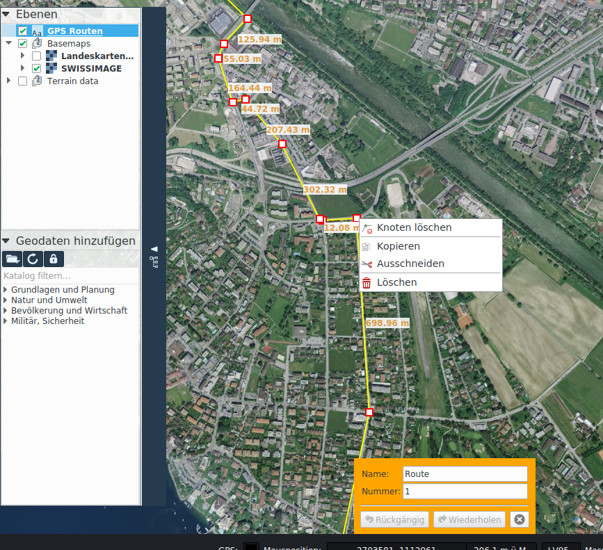

# GPS

Funktionen zur Interaktion mit GPS Geräten sowie zur Routenplanung befinden sich in der Registerkarte *GPS*.

## Interaktion mit GPS Geräten

Es werden GPS Geräte unterstützt, die über eine serielle (COM) Schnittstelle einen NMEA Stream ausgeben. Die Applikation [*Franson GPS-Gate Splitter*](http://gpsgate.com/products/gpsgate_client) kann für viele GPS Geräte eine virtuelle COM Schnittstelle erzeugen, über welche KADAS NMEA Daten empfangen kann.

In KADAS erfolgt die die Verbindung mit einem GPS Gerät über die aktivierbare Ikone in der Statuszeile oder über die entsprechende Schaltfläche in der Registerkarte *GPS*. Die Ikone in der Statuszeile zeigt der Status der Verbindung an. Bei erfolgreicher Verbindung wird eine Positionsmarker in der Karte angezeigt. Ist die Funktion *Mit GPS bewegen* aktiv, so verschiebt sich der Kartenausschnitt automatisch mit der GPS Position.

## GPS Routen

GPX (GPX Exchange Format) ist ein Standard zum Austausch von GPS Daten zwischen Geräte und Applikationen. Es beschreibt Wegpunkte, Routen und Tracks.

KADAS bietet Funkionen zum Erstellen, Bearbeiten Importieren und Exportieren von GPS Routen an.

Importierte oder mittels *Wegpunkte zeichnen* und *Routen zeichnen* neu erstellte GPS Routen werden in der *GPS Routen* Ebene abgelegt. Wegpunkte werden als Punktgeometrien dargestellt, Routen und Tracks als Liniengeometrien. Sie können analog zu Redlining Geometrien bearbeitet werden (siehe Kapitel 5.1), wobei zusätzlich noch die Möglichkeit besteht, GPX Attribute zu spezifizieren, entweder per Kontextmenü oder per Doppelklick.

## Übungen

-   Falls ein GPS Gerät zur Verfügung steht, eine virtuelle COM Schnittstelle mit GPS-Gate einrichten und anschliessend GPS in KADAS aktivieren.

-   Eine GPS Route zeichnen, als GPX exportieren, und falls ein passendes GPS Gerät zur Verfügung steht, die GPX Datei auf das Gerät hochladen.

## Notizen

