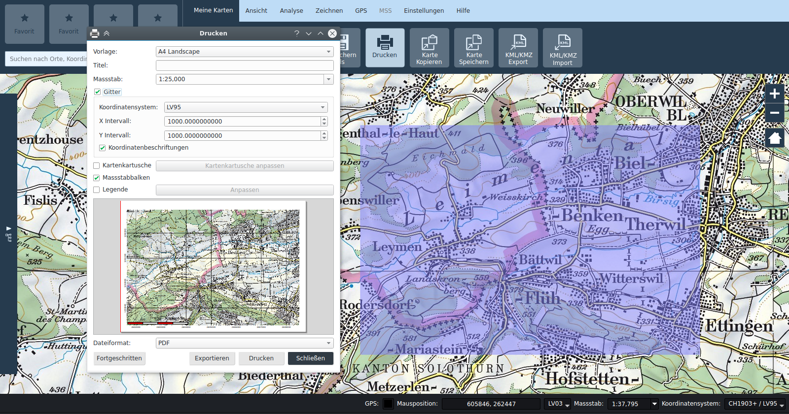

# Drucken und Exportfunktionen

## Drucken

Die Druckfunktion ist von der Registerkarte *Meine Karten* aufrufbar.

Das Drucken basiert auf Vorlagen. Standardmässig werden Vorlagen für A3 und A4 sowohl Quer- als Hochformat angeboten, sowie eine *Custom* Vorlage.

Es soll beachtet werden, dass die Vorlagen Projektspezifisch sind, somit können sich die angebotenen Vorlagen von Projekt zu Projekt unterscheiden.

Bei ausgewählter Vorlage wird im Hauptkartenfenster ein blaues halb-transparentes Rechteck angezeigt, welches dem zu druckenden Ausschnitt entspricht. Bei den Vorlagen mit fixem Papierformat kann dieses Rechteck in der Hauptkarte verschoben werden, um den Druckbereich anzupassen. Die Grösse des Ausschnitts wird vom Papierformat und dem im Druckdialog angegebenen Massstab abgeleitet. Bei der *Custom* Vorlage wird der Ausschnitt zusammen mit dem Massstab im Druckdialog numerisch definiert, und das resultierende Papierformat wird diesen Angaben entsprechend dynamisch berechnet.

Beim Drucken können zusätzliche Elemente, zwar Koordinatengitter, Kartenkartusche, Legende, und Massstabbalken je nach Wunsch ein- oder ausgeblendet werden. Die Position dieser Elemente ist in der Vorlage definiert.

Der fortgeschrittene Modus bietet zusätzliche Konfigurationsmöglichkeiten an, darunter kann auch die Anordnung der Elemente angepasst werden.

Die Druckzusammenstellung kann als Datei exportiert werden oder einem Drucker geschickt werden.

Die Druckvorlagen die im Projekt enthalten sind können im Druckzusammenstellungsdialog verwaltet werden, der durch die Schaltfläche rechts vom der Druckvorlageselektion geöffnet werden kann. Dort können einzelne Vorlagen importiert, exportiert sowie aus dem Projekt entfernt werden.

Des weiteren kann im Kartuschen-Dialog der Kartuscheninhalt als einzelständige XML Datei importiert und exportiert werden.

## Kartenbildschirmfoto

Eine druck-ähnliche Funktion bietet die Kartenbildschirmfoto Funktion an, die als *Karte kopieren* bzw. *Karte speichern* in der Registerkarte *Meine Karten* aufrufbar sind. Diese Funktionen erlauben dem Benutzer den im Hauptfenster sichtbaren Kartenausschnitt in die Zwischenablage oder in eine Datei zu speichern. Es wird jeweils immer genau der Inhalt des Kartenfenster gespeichert.

## KML/KMZ Export

Der Karteninhalt kann zudem als KML oder KMZ exportiert werden. Kamerabilder sowie MilX Ebenen der Lagedarstellung werden im KMZ Format exportiert.

Es soll beachtet werden, dass KMZ und KML verlustbehaftete Export-Formate sind, und daher nicht geeignet für den Austausch zwischen KADAS Anwender ist. Dazu sollte das native \*.qgs Projektformat verwendet werden.

## Übungen

-   Druckdialog öffnen, Vorlage mit fixem Papierformat (z.B. A4 Landscape) auswählen, Massstab und Ausschnitt anpassen. Kartenkartusche aktivieren und anpassen. Exportieren nach PDF.

-   Weitere Elemente nach Wunsch aktivieren. Export nach JPG.

-   Aktuelles Kartenfenster als Kartenbildschirmfoto speichern.

-   Einige MSS Symbole auf der Karte platzieren, Karte als KML und KMZ exportieren. Nach Möglichkeit in Google-Earth importieren und Ergebnis vergleichen.

Expertenübungen:

-   Vorlage *Custom* für grossformatige Plots auswählen, Ausschnitt numerisch eingeben.

-   Eigene Druckvorlage erstellen.

## Notizen

