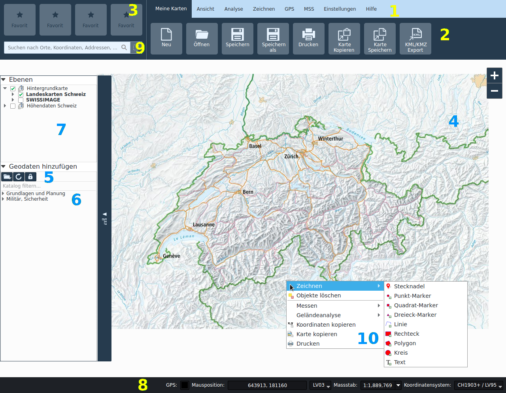

# Programmoberfläche und Projektverwaltung

## Das Applikationsfenster

Das Applikationsfenster ist in folgende Bereiche unterteilt:

1.  **Menubalken:** Hier kann zwischen den Funktionalitäts-Registerkarten gewechselt werden.

2.  **Funktionalitäts-Registerkarte:** Hier befinden sich die Funktionalitäten.

3.  **Favoriten:** Funktionalitäten können hier per Drag-and-Drop platziert werden.

4.  **Kartenfenster:** Hier wird die Karte dargestellt.

5.  **Geodaten-Toolbar:** Hier können lokale Geodaten der Karte hinzugefügt werden, der Geodatenkatalog neu geladen werden, sowie die Authentifizierung für den Zugang an geschützte Geodaten durchgeführt werden.

6.  **Geodatenkatalog:** Hier werden Ebenen aus Web-Services aufgelistet. Ebenen können per Drag-and-Drop oder Doppelklick hinzugefügt werden.

7.  **Ebenen (Karteninhaltsverzeichnis):** Hier können die Ebenen der aktuell geladenen Karte verwaltet werden.

8.  **Statuszeile:** Hier wird die aktuelle Maus-Position über der Karte angezeigt, und kann Massstab, Anzeige sowie Projektions-koordinatenbezugssystem ausgewählt werden, sowie ein angeschlossener GPS Empfänger aktiviert werden.

9.  **Suchfeld:** Hier kann nach Ortschaften, Adressen, Koordinaten und in Ebenen gesucht werden.

10. **Kartenkontextmenü**: Hier werden kontextabhängig Funktionen für das ausgewählte Element angeboten, sowie vereinzelte wichtige Funktionalitäten der Registerkarten.

## Navigation in der Karte und Kartenwerkzeuge

Die Navigation in der Karte erfolgt mit der linken oder mittleren Maustaste, das Zoomen mit dem Scrollrad oder mit den Zoom-Buttons rechts oben im Kartenfenster. Die rechte Maustaste öffnet das Kontextmenü. Bei Touch-fähigen Monitore werden die Pan und Rotationsgesten erkannt. Zusätzlich kann auf ein bestimmter Ausschnitt gezoomt werden, indem mit gedrückter Shift-Taste ein Rechteck aufgezogen wird.

Wenn kein Kartenwerkzeug aktiv ist, befindet man sich automatisch im Navigationsmodus. Ist ein Werkzeug (z.B. Messen oder Zeichnen) aktiv, ist die Schaltfläche in der entsprechenden Registerkarte das Werkzeug farblich hervorgehoben. Ein Werkzeug kann durch erneutes Drücken auf die entsprechende Schaltfläche wieder deaktiviert werden, oder alternativ durch Drücken der ESC Taste.

Unabhängig vom aktiven Kartenwerkzeug dienen die mittlere Maustaste und das Scrollrad immer zur Kartennavigation. Die Funktion der linken Maustaste hängt vom aktiven Werkzeug ab.

Über die Funktionen *Vorheriger Ausschnitt* und *Nächster Ausschnitt* in der Registerkarte *Ansicht* kann auf vorher bzw. danach angezeigte Kartenausschnitte zurückgekehrt werden.

## Gitter

In der Registerkarte *Ansicht* kann das Kartengitter aktiviert werden. Das Gitter basiert auf dem gewähltem Kartenkoordinatensystem.

## Projekte

Karten können als Projekte geladen und gespeichert werden. Es wird das QGIS Projektformat verwendet, mit Endung \*.qgs. Projekte werden aus Vorlagen erstellt. Beim Starten der Applikation wird automatisch ein Projekt aus einer Online- oder Offline-Vorlage erstellt, abhängig davon, ob der Rechner am Netz angeschlossen ist. Mit den Funktionen *Neu, Öffnen, Speichern* und *Speichern als* können neue Projekte (aus einer Vorlage) erstellt werden, existierende Projekte geöffnet werden und Projekte gespeichert werden.

Gewisse Werkzeuge erzeugen Datensätze, die in Ordner *&lt;projektname&gt;\_files* abgelegt werden. Beim austauschen des Projekts sollte dementsprechend dieser Ordner zusammen mit der Projektdatei verteilt werden. Weitere lokale Datensätze die ausgetauscht werden sollten ebenfalls in diesem Verzeichnis abgelegt werden und von dort aus der Karte hinzugefügt werden, ansonsten wird dessen Pfad im Projekt als absoluter Pfad gespeichert, der möglicherweise auf anderen Systemen nicht aufgelöst werden kann.

## Datenquellen

Die Hauptdatenquelle ist der Geodatenkatalog. Beim Programmstart werden nur öffentliche Daten angezeigt. Abhängig vom Benutzer können nach erfolgter Authentifizierung weitere Daten zur Verfügung stehen. Die Authentifizierung erfolgt via Schloss-Ikone in der Geodaten-Toolbar. Nach erfolgreicher Authentifizierung wird der Geodatenkatalog automatisch neu geladen.

Zusätzlich können lokale Vektor sowie Rasterdaten der Karte hinzugefügt werden, entweder via Ikone in der Geodaten-Toolbar oder per Drag and Drop auf die Karte.
