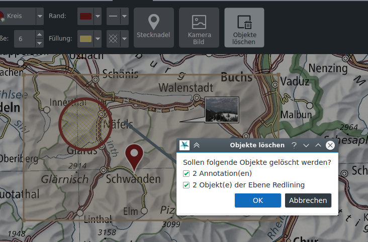

# Drawing

The drawing tools are located in the *Drawing* tab. Different geometries, texts, pins and pictures of the map can be added.

As in the case of measuring, the coordinate can also be entered numerically when drawing, if under the *Settings* tab the *Display numeric input fields while drawing* setting is active.

Also under the *Settings* tab, snapping can be activated while drawing. Snapping honours all nodes of vector geometries in the map.

## Geometries and texts

Drawable geometries include points, lines, polygons, rectangles, and circles. Depending on the geometry type, the color and the pattern can be adjusted for the border and fill, as well as the line width and the size of points.

For texts, the font and size as well as filling color can be adjusted.

Drawn geometries and texts are stored in the *Redlining* layer in the map table of contents.

Already drawn geometries or texts can be subsequently edited by selecting them on the map. Selected objects can be moved and, depending on the geometry type, nodes can be moved individually or created or removed via the context menu.

Existing line and polygon geometries can be continued via context menu on the node.

Editing operations on a redlining drawing can be reversed or repeated via CTRL+Z and CTRL+Y or with the corresponding buttons at the bottom of the map frame.

When creating and editing geometries, relevant measurement values ​​are displayed at the same time.

Redlining drawings can be copied, cut and pasted using the context menu or the usual keyboard shortcuts CTRL+C, CTRL+X and CTRL+V.

Multiple redlining drawings can be selected together with the CTRL key and moved, copied, cut and pasted as a group.

## Raster images

Raster images in the usual formats (JPG, PNG, BMP) can be added as annotations to the map. These are displayed in a speech bubble. If the image is georeferenced (EXIF tags), the balloon is placed in the appropriate location and the location is blocked. The position lock can be toggled via the context menu. Double-clicking on the balloon opens the image with the default image viewer of the operating system. The size of the speech bubble can be changed at its vertices.

Raster images are stored in the *Images* layer.

## Vector graphics

The *Add Image* function can also be used to add SVG graphics to the map. These can be scaled and rotated with the mouse by dragging at the corresponding control points.

Vector graphics are stored in the *SVG graphics* layer.

## SymTaZ symbols

SymTaZ is an external program that can be used to create symbols, tactical signs and civilian signatures in accordance with the Swiss Army's regulation 52.002.03. These symbols can be imported into KADAS, either via *Copy to Clipboard (Text Form)* in SymTaZ followed by *Paste* in KADAS, or by saving as SVG in SymTaZ and then opening via *Add Image* in KADAS.

## Delete objects

Individual objects can be deleted via context menu or DEL key. The *Delete Objects* tool allows you to delete several objects at once  from a selected rectangular region. This function can also be called invoken via CTRL + dragging a rectangle in pan mode.

