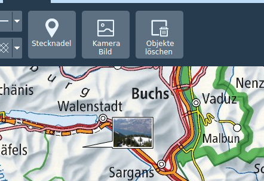

# Représentation de la situation / symboles MSS 

La fonctionnalité de la représentation de la situation se trouve dans l’onglet *MSS*. Cet onglet est inactif si l’interface KADAS MSS-MilX n’est pas installée. La fonctionnalité de représentation de la situation comprend le dessin et l’édition de symboles MSS et la gestion de niveaux MilX.

## Dessiner des symboles MSS

Le bouton *Ajouter un symbole* ouvre une galerie de symboles MSS où l’on peut effectuer des recherches. Après avoir sélectionné un symbole dans la galerie, on peut le placer sur la carte.

Les symboles sont placés au niveau MilX. Ils sont visibles dans le répertoire de la carte. On peut créer de nouveaux niveaux MilX et on peut également choisir à quel niveau les symboles que l’on vient de dessiner doivent être ajoutés.

On peut éditer les symboles déjà dessinés a posteriori en les sélectionnant sur la carte. Les objets sélectionnés peuvent être déplacés et, selon le type de symbole, les nœuds peuvent être déplacés individuellement, créés ou supprimés via le menu contextuel. L’éditeur de symbole MilX peut être ouvert par double clic ou par Editer dans le menu contextuel.

De la même manière que pour les objets redlining, les symboles MSS peuvent être déplacés, copiés, coupés et collés individuellement ou en groupe. En plus des entrées du menu contextuel et des raccourcis clavier habituels, il y a aussi les boutons * Copier vers ... * et * Déplacer vers ... * en bas de la carte. Ces derniers permettent explicitement de spécifier une couche cible, par défaut la couche MilX actuellement sélectionnée est prise comme cible. Si aucune couche MilX n'est sélectionnée, la couche de destination sera demandée.

Les couches MilX peuvent être marquées comme acceptées dans le menu contextuel du répertoire de la carte. Les couches acceptées ne peuvent pas être éditées.

## Echanges de couches MilX

Les couches MilX peuvent être importées et exportées depuis les fichiers MILXLY. MILXLY (et la variante comprimée MILXLYZ) est un format d’échange de représentations de situation. Il comprend uniquement des symboles MSS de représentation de situation, et aucun autre objet tel que les redlinings, punaises ou photos.

Lors de l'exportation vers MILXLY (Z), vous pouvez choisir les couches MilX à exporter et dans quelle version le fichier doit être créé. De plus, vous pouvez choisir d'exporter le cartouche de carte défini dans la boîte de dialogue d'impression.

L'importation d'un fichier MILXLY (Z) parcourt toutes les couches qu'il contient. Si le fichier MSS contient des définitions de symboles conformes à un ancien standard, ceux-ci sont automatiquement convertis. Les pertes de conversion possibles ou les erreurs sont communiquées à l'utilisateur. Si l'une des couches importées contient un cartouche, l'utilisateur sera invité à l'importer dans KADAS.

## Importation OVL

OVL est le format de projet du logiciel PCMAP Swissline. Seul OVL Version 5.0 est supporté. Les fichiers plus anciens doivent être actualisés via le logiciel PCMAP Swissline avant d’être importés dans KADAS.

L’importateur OVL convertit les graphiques tactiques qui y sont inclus en symboles MSS correspondants, tandis que les géométries et les annotations sont transformées en objets redlining. S’il y a des erreurs de conversion, l’utilisateur en est informé. La représentation peut varier par rapport au logiciel PCMAP Swissline même pour les conversions réussies, il est donc recommandé de vérifier les fichiers importés.

## Exercices

-   Sélectionner une représentation de situation : placer des symboles à un ou plusieurs points et les éditer a posteriori.

-   Adapter la taille de symbole et la largeur des lignes des symboles MSS.

-   Marquer le niveau MilX comme accepté.

-   Sélectionner une seconde représentation de situation dans un niveau séparé.

-   Exporter les deux niveaux vers MILXLY.

-   Importer des données OVL.

## Notes

