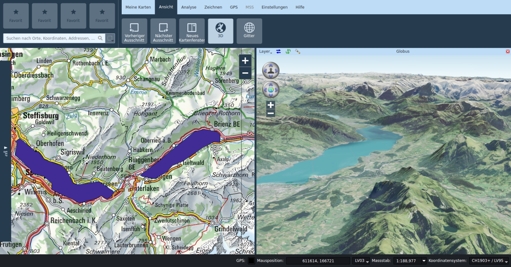
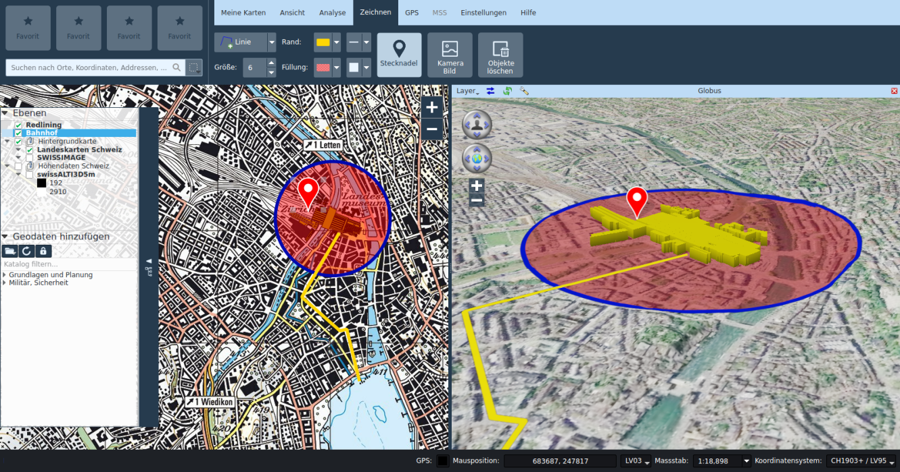

# Finestre di carte multiple e vista 3D

## Finestre di carte multiple

Nella scheda *Vista* è possibile aprire una nuova sottofinestra della carta, che, tramite trascinamento della barra del titolo, potrà poi essere disposta a piacimento all’interno della finestra principale o disassociata da essa.

Nelle viste delle sottofinestre è possibile attivare o disattivare i livelli, indipendentemente dalla vista principale. Il ritaglio può essere comandato indipendentemente dalla vista principale oppure può essere associato a quest’ultimo attivando l’icona del lucchetto sulla barra del titolo della sottofinestra.

Nella sottofinestra della carta è disponibile soltanto lo strumento di navigazione, tutti gli altri strumenti possono essere utilizzati unicamente nella vista principale.

In caso di necessità, è possibile modificare il titolo della sottofinestra.

## Vista 3D

Sempre nella scheda *Vista*, è possibile attivare la vista 3D. Anche questa sottofinestra può essere disposta liberamente.

Nella vista 3D viene visualizzato il globo. La vista può essere comandata sia tramite i movimenti del mouse sia utilizzando gli elementi di controllo nell’area superiore sinistra della finestra. Nella barra del titolo, è possibile sincronizzare la vista con la finestra principale della carta.

Anche nella barra del titolo è possibile aprire la finestra di dialogo delle impostazioni del globo, con cui eseguire, fra le altre, le seguenti azioni: configurare i modelli dei terreni per la vista 3D e inserire i livelli delle immagini. I livelli della vista 2D da rappresentare vengono selezionati dal menu situato a sinistra nella barra del titolo. Per scopi prestazionali, come impostazione standard vengono attivati solo i livelli locali della vista 2D. Se possibile, i livelli delle immagini di sfondo devono essere inseriti direttamente come livelli di immagini nella finestra di dialogo delle impostazioni del globo.

Per impostazione predefinita, i livelli 2D vengono rappresentati come struttura sopra al terreno del globo. In alternativa, i livelli vettoriali (tra cui Redlining) possono essere rappresentati estrusi come modelli 3D. Questa impostazione può essere selezionata nella finestra di dialogo delle proprietà del livello corrispondente.

Puntine, immagini della fotocamera e simboli MSS mono-punto vengono visualizzati sotto forma di billboard.

## Esercizi

-   Inserire una sottofinestra della carta. Visualizzare la carta nazionale nella finestra principale e la veduta aerea nella sottofinestra.

-   Associare il ritaglio visibile alla finestra principale e rimuovere l’accoppiamento.

-   Inserire ulteriori sottofinestre della carta. Modificare la disposizione. Modificare il titolo delle sottofinestre.

-   Attivare la vista 3D. Navigare con il mouse. Sincronizzare la vista con la finestra principale.

-   Capire quali livelli della vista 2D vengono estrapolati e quali vengono configurati nella fines­tra di dialogo delle impostazioni del globo.

-   Creare un livello Redlining e rappresentano nel globo come modello 3D estruso.

## Appunti

