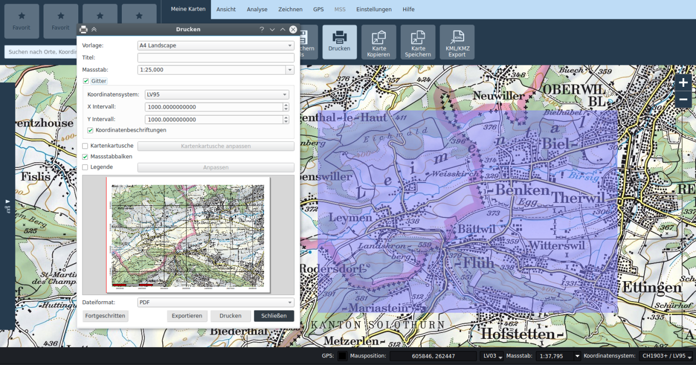

1.  Generalità

    1.  Origine

KADAS Albireo si basa sul software professionale open source GIS «QGIS». In collaborazione con Ergonomen è stata realizzata un’interfaccia utente tagliata su misura per l’applicazione. Da un lato sono state tralasciate numerose funzionalità non necessarie per l’elaborazione dei geodati, dall’altro sono disponibili delle aree, come l’analisi dei terreni, che dispongono di una ricca e ampia scelta di funzioni.

1.  Condizioni d’uso

KADAS Albireo è protetto dalla General Public License 2.0 (GPLv2).

I componenti MSS/MilX sono di proprietà della società gs-soft SA.

Le condizioni d’uso dei dati sono riportate nell’applicazione alla voce Aiuto → Informazioni.

1.  Requisiti di sistema

-   Windows 7 o più recente, 64 bit

-   Carta grafica compatibile con OpenGL

-   10 GB di memoria per l’applicazione e il pacchetto dati di base

1.  Interfaccia del programma e gestione dei progetti

1.  La finestra dell’applicazione

La finestra dell’applicazione è composta dalle seguenti aree:

1.  **Barra dei menu:** consente di scegliere le schede delle funzionalità.

2.  **Scheda delle funzionalità:** mostra le varie funzionalità.

3.  **Preferiti:** qui è possibile posizionare delle funzionalità trascinando la selezione.

4.  **Finestra della carta:** dove viene mostrata la carta.

5.  **Barra dei geodati:** consente di aggiungere i geodati locali alla carta, ricaricare il catalogo dei geodati ed effettuare l’autenticazione per l’accesso ai geodati protetti.

6.  **Catalogo dei geodati:** elenca i livelli dei servizi web. È possibile aggiungere i livelli trasci­nando la selezione oppure facendo doppio clic.

7.  **Livelli (elenco delle carte):** consente di gestire i livelli delle carte caricate.

8.  **Barra di stato:** mostra la posizione attuale del mouse sulla carta e consente di selezionare il righello, la visualizzazione e il sistema di riferimento delle coordinate della proiezione, non­ché attivare il ricevitore GPS.

9.  **Campo di ricerca:** consente di effettuare delle ricerche per località, indirizzo, coordinate e livelli.

10. **Menu contestuale delle carte:** offre le funzionalità contestuali per l’elemento selezionato, oltre ad alcune funzionalità più importanti presenti sulle schede.

    1.  Navigazione nella carta e strumenti

Per navigare sulla carta si utilizza il tasto sinistro o centrale del mouse, mentre per zoomare ci si serve della rotella del mouse o degli appositi pulsanti situati in alto a destra nella finestra della carta. Con il tasto destro del mouse si apre invece il menu contestuale. I monitor touch sono in grado di riconoscere i gesti di spostamento e rotazione. Inoltre, è possibile zoomare un determinato estratto delineando un rettangolo tenendo premuto il tasto shift.

Se non è attivo nessuno strumento della carta, ci si trova in automatico nella modalità di navigazione. Se è attivo uno strumento (ad es. rilevamento o disegno), il pulsante corrispondente sulla scheda viene evidenziato. Uno strumento può essere nuovamente disattivato premendo il pulsante corris­pondente o, in alternativa, premendo il tasto ESC.

Indipendentemente dagli strumenti della carta attivi, il tasto centrale e la rotella del mouse possono sempre essere utilizzati per navigare sulla carta. Le funzioni del tasto sinistro del mouse variano a seconda dello strumento attivo.

Tramite le funzioni *Ritaglio precedente* ed *Ritaglio successivo* nella scheda *Visualizzazione*, è possi­bile passare agli estratti della carta visualizzati in precedenza o in seguito.

1.  Griglia

Nella scheda *Visualizzazione*, è possibile attivare la griglia della carta. La griglia si basa sul sistema di coordinate della carta selezionato.

1.  Progetti

Le carte possono essere caricate e salvate come progetti. Si utilizza a questo scopo il formato pro­getti QGIS, con estensione \*.qgs. I progetti vengono creati sulla base di modelli. All’avvio dell’appli­cazione, viene automaticamente creato un progetto sulla base di un modello online od offline, a seconda che il computer sia collegato alla rete oppure no. Con le funzioni *Nuovo, Apri, Salva* e *Salva con nome*, è possibile creare dei nuovi progetti (sulla base di un modello), aprire progetti esistenti e salvare i progetti.

Certi strumenti creano dei set di dati che vengono archiviati nella cartella &lt;nome progetto&gt;\_files, v. capitolo 4.2. Quando si cambia il progetto, la cartella deve essere allocata di conseguenza insieme al file del progetto. Anche gli altri set di dati locali che vengono sostituiti devono essere archiviati in questa directory e, da lì, essere aggiunti alla carta, altrimenti il loro percorso verrà salvato nel pro­getto come percorso assoluto, che potrebbe non essere interpretato correttamente su altri sistemi.

1.  Fonti dei dati

La fonte principale dei dati è il catalogo dei geodati. All’avvio del programma vengono visualizzati solo i dati pubblici. A seconda dell’utente, dopo aver effettuato correttamente l’autenticazione, posso­no essere disponibili ulteriori dati. L’autenticazione viene eseguita tramite l’icona del lucchetto pre­sente nella barra dei geodati. Una volta effettuata correttamente l’autenticazione, il catalogo dei geodati viene ricaricato in automatico.

Inoltre, possono essere inseriti i dati vettoriali e raster locali della carta, o tramite l’icona della barra dei geodati o tramite trascinamento della selezione sulla carta.

1.  Esercizi

-   Fare pratica con la navigazione sulla carta.

-   Creare un nuovo progetto sulla base del modello Svizzera (online/offline).

-   Funzionamento online: inserire un livello dal catalogo dei geodati della carta.

-   Nell’elenco delle carte, attivare la veduta aerea.

-   Rimuovere un livello dal progetto.

-   Cambiare il sistema di riferimento delle coordinate di visualizzazione su WGS84.

-   Cambiare il sistema di riferimento della proiezione su WGS84. Attenzione alla notifica a proposito di una minore performance quando si attiva la proiezione.

-   Salvare il progetto sul disco fisso.

Esercizi per esperti:

-   Inserire i set di dati vettoriali e raster della carta.

-   Dal menu contestuale della voce corrispondente nell’elenco delle carte, aprire le proprietà dei livelli e adeguare le opzioni di rappresentazione (simbologia).

    1.  Appunti

1.  Ricerca e puntine

    1.  Ricerca

Il campo di ricerca offre un’interfaccia unitaria per diversi servizi di ricerca:

-   Coordinate (LV03, LV95, DD, DM, DMS, UTM, MGRS)

-   Località e indirizzi in tutta la Svizzera

-   Località in tutto il mondo

-   Attributi nei set di dati locali

-   Attributi nei set di dati remoti (servizi web)

-   Attributi nelle puntine

I risultati vengono elencati nelle categorie corrispondenti. L’elenco dei risultati può essere esaminato con il mouse oppure con i tasti freccia della tastiera. Se si seleziona un risultato con i tasti freccia, nel punto corrispondente viene inserita una puntina blu. Attivando un risultato con il mouse, l’estratto della carta viene centrato nella località corrispondente.

Alla destra del campo di ricerca è possibile definire un filtro per la ricerca locale e remota del set di dati. Questo filtro non si applica alla ricerca di coordinate, località o puntine.

1.  Puntine

Lo strumento per la disposizione delle puntine si trova nella scheda *Disegno*. Nel tooltip di una punti­na già collocata, è possibile leggere la posizione e l’altezza. Facendo doppio clic sulla puntina si apre la finestra di dialogo corrispondente con gli attributi. Facendo clic con il pulsante destro sulla puntina, è possibile copiare la sua posizione negli appunti. I collegamenti web possono essere copiati dal browser trascinando la selezione nel campo di testo.

1.  Esercizi

-   Aprire map.geo.admin.ch nel browser e, facendo clic con il pulsante destro del mouse, con­sultare una coordinata e ricercarla in KADAS. Provare diversi formati di coordinate (LV03, LV95, ...).

-   Ricercare indirizzi e località in Svizzera e nel mondo.

-   Funzionamento online: inserire i livelli distributori di benzina BEBECO del catalogo dei geo­dati e cercare Bure. Verificare che compaia il risultato *Bure (bure place d’armes 2915).*

-   Funzionamento online: definire una figura geometrica per il filtro di ricerca che comprenda o non comprenda il distributore di benzina di Bure. Verificare se i risultati di ricerca si modifica­no di conseguenza.

-   Posizionare una puntina sulla carta, compilare l’attributo Nome nella finestra di dialogo degli attributi e inserire questo nome nel campo di ricerca.

Esercizi per esperti:

-   Aprire un set di dati vettoriali locale. Consultare gli attributi facendo clic con il pulsante destro del mouse su una figura geometrica del livello. Inserire il valore di un attributo nel campo di ricercare e verificare che l’oggetto corrispondente compaia tra i risultati della ricerca.

    1.  Appunti

1.  Rilevamenti e analisi dei terreni

Nella scheda *Analisi* sono disponibili gli strumenti per il rilevamento di distanze, superfici, circonfe­renze e angoli, nonché diverse funzionalità di analisi dei terreni.

Disegnando tutte le figure geometriche di rilevamento, è possibile effettuare l’inserimento numerico dei punti delle coordinate se è attivo il pulsante *Mostra i campi di immissione numerica in modalità disegno* nella scheda *Impostazioni*.

1.  Funzioni di rilevamento

Le funzioni di rilevamento operano su un ellissoide WGS84. Durante il rilevamento, vengono visua­lizzati i valori rilevanti accanto alla figura geometrica di rilevamento. Per quanto riguarda distanza, superfici e circonferenza, è possibile disegnare più figure geometriche di rilevamento affiancate. Il rilevamento complessivo viene visualizzato nell'area inferiore della finestra delle carte, dove è possi­bile modificare anche l'unità di misura. Inoltre, con il pulsante Picker-Button è possibile rilevare una figura geometrica esistente.

1.  Funzionalità di analisi dei terreni

Per poter utilizzare le funzionalità di analisi dei terreni è necessario definire un modello altimetrico nel progetto corrente. Nel menu contestuale corrispondente dell’elenco delle carte, è possibile selezio­nare un livello raster come modello altimetrico.

Con lo strumento *Profilo / Vista* è possibile rilevare i profili altimetrici. Qualora la linea di rilevamento sia costituita da un singolo segmento, lungo questa linea è possibile eseguire un’analisi della visibilità (Line of Sight). Le aree visibili o invisibili vengono contrassegnate rispettivamente in verde o in rosso. Muovendo il mouse sulla carta lungo la linea di rilevamento, viene visualizzata la posizione corris­pondente sul grafico con un punto blu. L’analisi della visibilità tiene conto della curvatura terrestre.

Lo strumento di inclinazione e tonalità del rilievo calcola il profilo di inclinazione e l’ombreggiatura del terreno in un estratto quadrato selezionato.

Lo strumento di visibilità calcola l’area del terreno visibile e invisibile in un settore circolare dal centro del cerchio, il luogo di osservazione. L’analisi della visibilità tiene conto della curvatura terrestre.

I risultati delle analisi di inclinazione, tonalità di rilievo e visibilità vengono inseriti come livelli raster della carta e compaiono, di conseguenza, nell’elenco delle carte. Salvando il progetto, questi set di dati vengono archiviati nella cartella &lt;nome progetto&gt;\_files.

1.  Esercizi

-   Rilevare distanze, superfici, circonferenza e angolo azimutale. Cambiare le unità di misura.

-   Creare un profilo altimetrico sia con più segmenti che con un solo segmento. Nell’ultimo caso, effettuare un’analisi della visibilità.

-   Creare i profili di inclinazione e tonalità del rilievo. Salvare il progetto, prestando attenzione alla cartella &lt;nome progetto&gt;\_files.

-   Effettuare un’analisi della visibilità, sia in un settore circolare parziale che in un cerchio completo.

    1.  Appunti

1.  Disegno

Gli strumenti di disegno si trovano nella scheda *Disegno*. È possibile inserire nella carta diverse figure geometriche, testi e puntine (v. capitolo 3.2), nonché immagini della fotocamera georeferen­ziate.

Come per il rilevamento, anche con lo strumento di disegno è possibile effettuare l’inserimento numerico dei punti delle coordinate se è attivo il pulsante *Mostra i campi di immissione numerica in modalità disegno* nella scheda *Impostazioni*.

1.  Figure geometriche e testi

Le figure geometriche disponibili per il disegno sono punti, linee, poligoni, rettangoli e cerchi. A seconda del tipo di figura geometrica, è possibile adeguare colore e modello per bordo e riempi­mento, nonché la larghezza delle linee o la dimensione dei punti.

Per quanto riguarda i testi, è possibile adeguare i font e le dimensioni, nonché il colore di riempi­mento.

Le figure geometriche e i testi così delineati vengono archiviati nel livello *Redlining* nell’elenco delle carte.

Le figure geometriche o i testi già delineati possono essere modificati successivamente selezionan­doli sulla carta. Gli oggetti selezionati possono essere spostati e, a seconda del tipo di figura geo­metrica, è possibile spostare i singoli punti di controllo, nonché crearli o rimuoverli tramite menu contestuale. I testi possono essere modificati tramite doppio clic del mouse o menu contestuale.

Quando si creano o modificano delle figure geometriche, vengono anche visualizzati i relativi valori di rilevamento.

1.  Immagini della fotocamera

Le immagini della fotocamera vengono supportate con la georeferenziazione, disponibile sotto forma di tag EXIF. Queste immagini vengono inserite sulla carta nella posizione corrispondente all’interno di un fumetto. Facendo doppio clic sul fumetto, si apre l’immagine con il programma standard di visualizzazione immagini del sistema operativo.

1.  Cancellazione di oggetti

I singoli oggetti possono essere cancellati tramite menu contestuale o con il tasto CANC. Lo stru­mento *Cancellazione di oggetti* consente di eliminare più oggetti di un estratto selezionato. Questa funzione può essere richiamata anche con Ctrl+Rettangolo nella modalità di spostamento.

1.  Esercizi

-   Disegnare punti, linee, testi, ecc. Adeguare le dimensioni e lo stile di bordi e riempimento.

-   Modificare le figure geometriche disegnate.

-   Adeguare la trasparenza del livello Redlining nel menu contestuale della voce corrispon­dente nell’elenco delle carte.

-   Rilevare la superficie in piedi di una figura geometrica disegnata facendo clic col tasto destro del mouse su Figura geometrica→*Rilevamento* oppure *Analisi*→*Rilevamento*→*Superficie*→ *Rilevamento figura geometrica esistente*.

-   Inserire un’immagine della fotocamera. Modificare la posizione del fumetto.

-   Rimuovere tutto il livello Redlining tramite menu contestuale nell’elenco delle carte.

-   Cancellare degli oggetti, sia singolarmente che più oggetti alla volta.

-   Rimuovere il livello Redlining dalla carta tramite l’elenco delle carte.

    1.  Appunti

1.  GPS

Le funzioni per l’interazione con i dispositivi GPS e per la pianificazione dei percorsi sono disponibili nella scheda *GPS*.

1.  Interazione con i dispositivi GPS

Vengono supportati i dispositivi GPS che emettono il protocollo NMEA tramite un’interfaccia seriale (COM). L’applicazione *Franson GPS-Gate Splitter* può creare per diversi dispositivi GPS un’interfac­cia COM virtuale, tramite la quale è possibile ricevere i dati NMEA KADAS.

In KADAS, il collegamento con il dispositivo GPS viene effettuato tramite l’icona attivabile nella barra di stato oppure tramite il pulsante corrispondente nella scheda *GPS*. L’icona della barra di stato mostra lo stato del collegamento. Se il collegamento viene eseguito con successo, viene visualizzato un marcatore di posizione sulla carta. Se è attiva la funzione *Movimento con GPS*, l’estratto della carta si sposta automaticamente con la posizione GPS.

1.  Percorsi GPS

GPX (GPX Exchange Format) è uno standard per lo scambio dei dati GPDS tra dispositivi e applica­zioni. Descrive waypoint, percorsi e tracciati.

KADAS offre varie funzioni che consentono di creare, modificare, importare ed esportare i percorsi GPS.

I percorsi GPS importati o creati ex novo tramite *Disegna waypoint* e *Disegna percorsi* vengono archiviati nel livello *Percorsi GPS*. I waypoint vengono rappresentati come figure geometriche punti­formi, mentre i percorsi e i tracciati come figure geometriche lineari. Possono essere modificati proprio come le figure geometriche Redlining (v. capitolo 5.1) e, in più, è possibile specificare gli attributi GPX tramite menu contestuale o doppio clic.

1.  Esercizi

-   Qualora sia disponibile un dispositivo GPS, creare un’interfaccia COM virtuale con GPS-Gate e attivare il GPS in KADAS.

-   Disegnare un percorso GPS, esportarlo come GPX e, qualora sia disponibile un dispositivo GPS adeguato, caricare il file GPX sul dispositivo.

    1.  Appunti

1.  Rappresentazione della posizione/Simboli MSS

Nella scheda *MSS* si trova la funzionalità di rappresentazione della posizione. Questa scheda non è attiva se l’interfaccia KADAS MSS-MilX non è stata installata. La funzionalità di rappresentazione della posizione comprende il disegno e la modifica dei simboli MSS e la gestione dei livelli MilX.

1.  Disegnare i simboli MSS

Il pulsante *Aggiungi simbolo* apre una galleria sfogliabile di simboli MSS. Dopo aver scelto un simbolo dalla galleria, è possibile posizionarlo sulla carta.

I simboli vengono archiviati nei livelli MilX, visualizzabili nell’elenco delle carte. Nella galleria dei simboli, è possibile creare nuovi livelli e scegliere a quale livello aggiungere i simboli appena disegnati.

Le figure geometriche già disegnate possono essere modificate successivamente selezionandole sulla carta. Gli oggetti selezionati possono essere spostati e, a seconda del tipo di simbolo, è possi­bile spostare i singoli punti di controllo, nonché crearli o rimuoverli tramite menu contestuale. Effet­tuando le modifiche tramite doppio clic o menu contestuale, è possibile aprire l’editor dei simboli MilX.

Nota: può succedere che l’editor dei simboli MSS/MilX venga coperto dalla finestra del programma di KADAS Albireo. La finestra può essere portata in primo piano tramite la barra delle applicazioni di Windows.

I livelli MilX possono essere contrassegnati come autorizzati nel menu contestuale dell’elenco delle carte. I livelli autorizzati non possono essere modificati.

1.  Sostituire i livelli MilX

I livelli MilX possono essere importati ed esportati come file MILXLY. MILXLY (e la variante compres­sa MILXLYZ) è un formato per lo scambio delle rappresentazioni della posizione. Contiene sola­mente i simboli MSS della rappresentazione della posizione e nessun altro oggetto come Redlining, puntine o immagini della fotocamera.

Nell'esportazione in formato MILXLY(Z) è possibile scegliere quali livelli MilX debbano essere espor­tati e in quale versione il file debba essere creato.

Nell’importazione di un file MILXLY(Z) vengono importati tutti i livelli ivi contenuti. Qualora il file MSS contenga definizioni di simboli basate su un vecchio standard, queste verranno convertite in automa­tico. Eventuali errori o perdite in fase di conversione verranno comunicati all’utente.

1.  Importazione OVL

OVL è il formato dei progetti del software PCMAP Swissline. Viene supportata solamente la versione 5.0 di OVL. I file più vecchi devono essere aggiornati con il software PCMAP Swissline prima di poter essere importati in KADAS.

L'importatore OVL converte i grafici tattici ivi contenuti nei simboli MSS corrispondenti, mentre le figu­re geometriche e le scritte vengono trasformate in oggetti Redlining. Gli eventuali errori in fase di conversione verranno comunicati all’utente. Anche nel caso di oggetti convertiti con successo, la loro rappresentazione può differire rispetto al software PCMAP Swissline. Pertanto è consigliabile control­lare i dati importati.

1.  Esercizi

-   Disegnare una rappresentazione della posizione: posizionare simboli mono-punto e multi-punto e modificarli successivamente.

-   Adattare le dimensioni e l’ampiezza della linea dei simboli MSS.

-   Contrassegnare come autorizzato il livello MilX.

-   Disegnare una seconda rappresentazione della posizione in un livello separato.

-   Esportare in MILXLY entrambi i livelli.

-   Importare un file OVL.

    1.  Appunti

1.  Stampa e funzioni di esportazione

    1.  Stampa

La funzione di stampa può essere richiamata dalla scheda *Le mie carte.*

La stampa si basa su dei modelli. Come impostazione standard, vengono forniti modelli per A3 e A4, in formato sia orizzontale che verticale, e un modello *custom\_extent*.

È opportuno notare che i modelli sono specifici per i progetti e, pertanto, i modelli offerti possono variare da progetto a progetto.

Una volta scelto il modello, nella finestra della carta principale viene visualizzato un rettangolo blu semitrasparente che corrisponde all’estratto da stampare. Nel caso di modelli con formato di pagina fisso, il rettangolo presente nella carta principale può essere spostato per adattare l’area di stampa. La dimensione del ritaglio viene ottenuta dal formato della pagina e dal righello indicato nella finestra di dialogo della stampa. Nel caso del modello *custom\_extent*, il ritaglio viene definito numericamente con il righello nella finestra di dialogo della stampa, e il formato della pagina risultante viene calcolato in maniera dinamica in base a queste indicazioni.

Durante la stampa, è possibile inserire o rimuovere, in base alle proprie preferenze, degli elementi aggiuntivi come griglia delle coordinate, cartuccia della carta, legenda e barra del righello. La posi­zione di questi elementi è definita nel modello. La modalità avanzata offre ulteriori possibilità di configurazione, come l’adattamento della disposizione degli elementi.

La composizione di stampa può essere esportata come file oppure inviata alla stampante.

1.  Fotografia dello schermo della carta

La funzione fotografia dello schermo della carta offre una funzionalità simile a quella di stampa, richiamabile dalla scheda *Le mie carte*, alle voci *Copia carta* e *Salva carta*. Queste funzioni consentono all’utente di salvare il ritaglio della carta visibile sulla finestra principale negli appunti o su file. In ogni caso, viene sempre salvato il contenuto esatto della finestra della carta.

1.  Esportazione in KML/KMZ

Il contenuto della carta può inoltre essere esportato come KML o KMZ. Le immagini della fotocamera e i livelli MilX della rappresentazione della posizione vengono esportati in formato KMZ.

È opportuno notare che KMZ e KML sono formati di esportazione che possono comportare delle per­dite e, pertanto, non sono adatti allo scambio tra utenti di KADAS. A questo scopo è necessario utiliz­zare il formato di progetto nativo \*.qgs.

1.  Esercizi

-   Aprire la finestra di dialogo della stampa, selezionare il modello con formato di pagina fisso (ad es. A4 orizzontale), adeguare righello ed estratto. Attivare e adattare la cartuccia della carta. Esportare in PDF.

-   Attivare, in base alle proprie preferenze, altri elementi. Esportare in JPG.

-   Salvare la finestra corrente della carta come fotografia dello schermo della carta.

-   Posizionare alcuni simboli MSS sulla carta, esportare poi quest’ultima come KML e KMZ. Se possibile, importare in Google Earth e confrontare il risultato.

Esercizi per esperti:

-   Selezionare il modello *custom\_extent* per tracciati di grandi dimensioni e immettere numericamente l’estratto.

-   Creare un modello di stampa personalizzato.

    1.  Appunti

1.  Finestre di carte multiple e vista 3D

    1.  Finestre di carte multiple

Nella scheda *Vista* è possibile aprire una nuova sottofinestra della carta, che, tramite trascinamento della barra del titolo, potrà poi essere disposta a piacimento all’interno della finestra principale o disassociata da essa.

Nelle viste delle sottofinestre è possibile attivare o disattivare i livelli, indipendentemente dalla vista principale. Il ritaglio può essere comandato indipendentemente dalla vista principale oppure può essere associato a quest’ultimo attivando l’icona del lucchetto sulla barra del titolo della sottofinestra.

Nella sottofinestra della carta è disponibile soltanto lo strumento di navigazione, tutti gli altri strumenti possono essere utilizzati unicamente nella vista principale.

In caso di necessità, è possibile modificare il titolo della sottofinestra.

1.  Vista 3D

Sempre nella scheda *Vista*, è possibile attivare la vista 3D. Anche questa sottofinestra può essere disposta liberamente.

Nella vista 3D viene visualizzato il globo. La vista può essere comandata sia tramite i movimenti del mouse sia utilizzando gli elementi di controllo nell’area superiore sinistra della finestra. Nella barra del titolo, è possibile sincronizzare la vista con la finestra principale della carta.

Anche nella barra del titolo è possibile aprire la finestra di dialogo delle impostazioni del globo, con cui eseguire, fra le altre, le seguenti azioni: configurare i modelli dei terreni per la vista 3D e inserire i livelli delle immagini. I livelli della vista 2D da rappresentare vengono selezionati dal menu situato a sinistra nella barra del titolo. Per scopi prestazionali, come impostazione standard vengono attivati solo i livelli locali della vista 2D. Se possibile, i livelli delle immagini di sfondo devono essere inseriti direttamente come livelli di immagini nella finestra di dialogo delle impostazioni del globo.

Per impostazione predefinita, i livelli 2D vengono rappresentati come struttura sopra al terreno del globo. In alternativa, i livelli vettoriali (tra cui Redlining) possono essere rappresentati estrusi come modelli 3D. Questa impostazione può essere selezionata nella finestra di dialogo delle proprietà del livello corrispondente.

Puntine, immagini della fotocamera e simboli MSS mono-punto vengono visualizzati sotto forma di billboard.

1.  Esercizi

-   Inserire una sottofinestra della carta. Visualizzare la carta nazionale nella finestra principale e la veduta aerea nella sottofinestra.

-   Associare il ritaglio visibile alla finestra principale e rimuovere l’accoppiamento.

-   Inserire ulteriori sottofinestre della carta. Modificare la disposizione. Modificare il titolo delle sottofinestre.

-   Attivare la vista 3D. Navigare con il mouse. Sincronizzare la vista con la finestra principale.

-   Capire quali livelli della vista 2D vengono estrapolati e quali vengono configurati nella fines­tra di dialogo delle impostazioni del globo.

-   Creare un livello Redlining e rappresentano nel globo come modello 3D estruso.

    1.  Appunti

